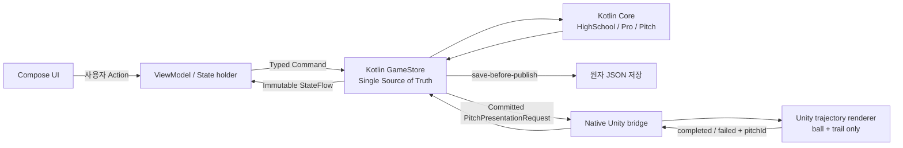
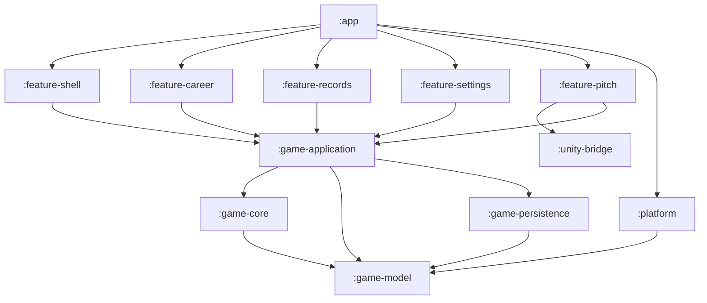
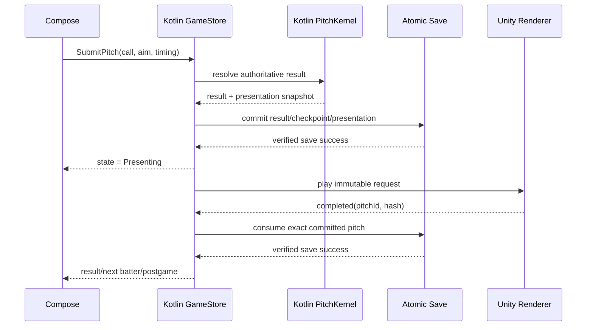

# Android Compose 네이티브 셸 + Unity 투구 전용 전면 전환 계획

| 항목 | 값 |
|---|---|
| 문서 ID | `DOC-ANDROID-COMPOSE-SHELL-UNITY-PITCH-MIGRATION-2026-08-13` |
| 상태 | **구현 준비 완료(Ready for implementation)** |
| 기준일 | 2026-08-13 |
| 최종 제품 구조 | Kotlin/Jetpack Compose가 앱·게임 상태·저장·화면·플랫폼 기능을 소유하고, Unity는 투구 후 공·궤적 연출만 재생한다. |
| 현재 출발점 | `apps/android-unity`의 Unity 6000.3.19f1 + C# Core/Application/Platform/Presentation |
| 신규 주 앱 | `apps/android` |
| 신규 Unity 모듈 | `apps/android-pitch-unity`에서 생성한 `unityLibrary` |
| application ID | `com.solkim.baseball.android` 유지 |
| Android | min API 26, target/compile API 36 유지 |
| 언어/화면 | Kotlin + Jetpack Compose + 단방향 상태 흐름 |
| Unity 범위 | 공, trail, 판정 지점까지의 궤적, 최소 시각 효과와 재생 완료 신호 |
| 범위 밖 | 게임 규칙 재설계, 네트워크 계정·클라우드 저장, 실존 야구 IP, Unity UI Toolkit 셸의 추가 고도화 |

이 문서는 AI 구현 에이전트가 위에서 아래로 실행할 수 있는 전환 명세다. 단순한 UI 교체안이 아니다. 최종 상태에서는 Kotlin이 게임의 단일 권위이며 Unity는 저장이나 경기 결과를 결정할 수 없는 일회성 렌더러다.

현재 `apps/android-unity`에는 이미 저장 복구, C# 결정론 코어, 고교·프로 커리어, 분석 영수증, 알림, 공유, 리뷰, Crashlytics, 16KB page-size 빌드 게이트가 구현되어 있다. 이 자산을 무시하고 다시 만들지 않는다. 반대로, Compose 화면이 C# 상태를 장기간 원격 조작하는 이중 구조도 만들지 않는다. **기존 구현을 기준 fixture와 마이그레이션 oracle로 사용해 Kotlin으로 검증 이식한 뒤 한 번에 상태 권위를 넘긴다.**

이 문서는 다음 문서의 Android UI·런타임 구조 부분을 대체한다.

- `docs/ANDROID_UNITY_IMPLEMENTATION_PLAN_2026-08-11.md`의 Unity UI Toolkit 셸, Unity lifecycle, Unity platform SDK 소유 구조
- `docs/android-unity/DECISIONS.md`의 `UI = UI Toolkit`, `AppRoot`가 전체 앱 상태를 소유한다는 결정
- `apps/android-unity/README.md`의 Unity Player가 애플리케이션 진입점이라는 구조

다음 내용은 대체하지 않고 그대로 기준으로 사용한다.

- `docs/android-unity/PARITY_MATRIX.md`의 P-001~P-030 사용자 흐름
- `docs/android-unity/ANALYTICS_EVENT_MATRIX.md`의 이벤트 이름·속성·영수증·발화 의미
- `docs/android-unity/PARITY_EXCEPTIONS.md`의 승인된 플랫폼 차이
- `docs/android-unity/DATA_SAFETY.md`, Play 선언, 가격, 패키지, 서명 키, Firebase/Amplitude 프로젝트
- 현재 C# Core/Application의 결정론·분포·저장 fault 테스트
- iOS SwiftUI 화면의 콘텐츠 계층과 실제 caller 의미

---

## 0. 최종 결론

### 0.1 채택 구조

1. 일반 앱 화면은 `MainActivity`의 Compose 셸이다.
2. Kotlin `GameStore`가 유일한 저장형 상태 권위다.
3. 고교·프로·투구 판정 코어를 순수 Kotlin 모듈로 이식한다.
4. 투구 선택, 구종·코스·강도·타이밍 입력, 경기 상황 HUD, 결과·투구 로그는 Compose가 소유한다.
5. Kotlin 코어가 결과를 확정하고 저장한 뒤에만 Unity에 불변 `PitchPresentationRequest`를 보낸다.
6. Unity는 공과 궤적을 재생하고 동일 `pitchId`의 완료/실패 신호만 돌려준다.
7. Unity 완료 신호가 저장된 요청과 일치하면 Kotlin이 해당 투구를 소비하고 다음 상태를 저장한다.
8. 분석, Crashlytics, 알림, 공유, 리뷰, 오디오, 진동, 접근성은 모두 네이티브 Android 구현이다.



### 0.2 Unity를 Compose 일부 영역에 직접 끼워 넣지 않는 이유

Unity 6의 공식 Unity as a Library 문서는 Android에서 `unityLibrary`를 네이티브 앱에 포함할 수 있지만 **전체 화면 렌더링만 지원하고, 하나의 런타임 인스턴스만 허용**한다고 명시한다. 따라서 일반 Compose 화면의 작은 카드 안에 `AndroidView(UnityPlayer)`를 반복 생성하는 구조를 제품 설계로 삼지 않는다.

고정 구조는 다음과 같다.

- 일반 화면: Compose-only `MainActivity`.
- 투구 세션: 별도 전체 화면 `PitchUnityActivity`.
- `PitchUnityActivity`의 Unity surface는 화면 전체를 채운다.
- Compose `ComposeView`는 Unity surface 위에 native overlay로 한 번만 배치한다.
- Unity runtime은 한 투구가 아니라 **한 투구 세션 동안 한 번만** 생성·유지한다.
- 공을 던질 때마다 Activity나 Unity runtime을 재생성하지 않는다.
- Unity가 native overlay 뒤를 투명하게 합성하는 방식은 Phase 1 기기 spike를 통과했을 때만 사용한다.
- 투명 합성이 불안정하면 Unity는 불투명한 중립 투구 캔버스를 사용하고 Compose overlay가 모든 텍스트·조작을 담당한다. 타자·포수·메뉴·결과 UI는 Unity에 다시 넣지 않는다.
- Unity runtime을 Play Feature Delivery dynamic feature로 분리하지 않는다. 공식 Unity as a Library 제한과 현재 AAB/16KB 검증 경계를 유지하며 base app의 단일 `unityLibrary`로 포함한다.

### 0.3 절대 금지 구조

- Compose와 Unity가 각각 커리어 상태 사본을 변경한다.
- Compose가 Unity `ProductionBaseballShellRuntime`을 원격 UI 서버처럼 장기간 사용한다.
- Unity가 투구 결과, 점수, 성장, 보상, 분석 영수증을 다시 계산한다.
- 한 투구마다 `UnityPlayer`를 생성·종료한다.
- Unity `quit()`를 일반 뒤로가기나 세션 종료에 호출한다. Android 프로세스를 종료할 수 있다.
- 저장 성공 전 Unity 연출을 시작한다.
- Intent extras에 전체 save JSON이나 사용자 이름을 넣는다.
- 마이그레이션 완료 전 기존 `save.json`과 백업을 삭제한다.
- Kotlin port 중 게임 규칙, 밸런스, 카피, 이벤트 스키마를 동시에 개선한다.
- 실제 기기 증거 없이 Unity overlay, save migration, 패리티를 완료로 표시한다.

---

## 1. 구현 에이전트 운영 규칙

### 1.1 시작 전 반드시 읽을 파일

다음 순서로 읽는다.

1. 루트 `AGENTS.md`
2. 이 문서 전체
3. `docs/android-unity/DECISIONS.md`
4. `docs/android-unity/PARITY_MATRIX.md`
5. `docs/android-unity/ANALYTICS_EVENT_MATRIX.md`
6. `docs/android-unity/PARITY_EXCEPTIONS.md`
7. `docs/android-unity/DATA_SAFETY.md`
8. `apps/android-unity/README.md`
9. 작업 대상 C# Core/Application/Platform/Presentation 파일
10. 대응하는 iOS Swift/SwiftUI 파일과 테스트

### 1.2 작업 원칙

- 이 문서의 phase 순서를 건너뛰지 않는다.
- 현재 dirty worktree의 사용자 변경을 되돌리지 않는다.
- 대규모 자동 변환보다 작은 도메인 단위 port + fixture 비교를 우선한다.
- 새 Kotlin 구현이 green이어도 기존 C# 기준 fixture와 교차 검증 전에는 권위를 넘기지 않는다.
- Kotlin과 C#이 같은 production save를 동시에 쓰는 기간을 만들지 않는다.
- 각 phase는 자체 테스트와 rollback 지점을 갖는다.
- 파일 삭제는 최종 cutover와 한 차례 안정 릴리스 뒤에만 한다.
- 새 UI 문구에 실존 구단명·약칭·리그명·선수명·로고·슬로건을 넣지 않는다.
- 기존 이벤트를 route 진입만으로 합성하지 말고 실제 화면 노출·저장 성공 caller에 연결한다.

### 1.3 각 작업 종료 보고 형식

```text
작업 패키지:
변경 파일:
이식한 권위 소스:
보존한 wire/schema:
추가/수정 테스트:
실행 명령과 결과:
C#/Swift fixture 비교 결과:
에뮬레이터/기기 증거:
남은 위험 또는 blocker:
다음 작업:
```

### 1.4 완료 상태 어휘

| 상태 | 의미 |
|---|---|
| `SCAFFOLD` | 모듈과 API만 있고 실제 제품 caller 없음 |
| `PORT` | Kotlin 구현과 단위 fixture 통과 |
| `COMPAT` | C# save/fixture 양방향 호환 통과 |
| `COMPOSE` | 실제 Compose 화면과 typed command 연결 |
| `EMULATOR` | API 29/35 16KB/36 emulator 수직 흐름 통과 |
| `DEVICE` | 지원 Low/Mid/High 물리 스마트폰 통과 |
| `PLAY` | 서명 AAB, Play track 설치·업데이트·정책 증거 통과 |
| `ACCEPTED` | 사람 승인과 캡처까지 완료 |

정적 문자열 검사는 `COMPOSE` 이상을 증명하지 않는다.

---

## 2. 현재 기준선과 보존할 자산

### 2.1 현재 코드 권위

| 영역 | 현재 위치 | 전환 때 역할 |
|---|---|---|
| 고교 규칙 | `apps/android-unity/Assets/Game/Core/HighSchool` | Kotlin port oracle |
| 프로 규칙 | `apps/android-unity/Assets/Game/Core/Pro` | Kotlin port oracle |
| 투구 판정 | `apps/android-unity/Assets/Game/Core/Pitching` | Kotlin exact fixture oracle |
| 상태/명령 | `apps/android-unity/Assets/Game/Application` | Kotlin `GameStore` 계약 oracle |
| 저장 | `Application/Persistence`, `Application/Stores` | wire·fault·revision oracle |
| Android 서비스 | `Assets/Game/Platform` | native Kotlin 대체 대상 |
| Unity 셸 | `Assets/Game/Presentation/Shell` | 화면 콘텐츠 inventory, 최종 비포함 |
| 투구 연출 | `Assets/Game/Presentation/Pitch` | 최소 trajectory renderer 추출 원본 |
| iOS UI | `apps/ios/Sources` | 화면 계층·카피·실제 이벤트 caller 기준 |
| 패리티/분석 | `docs/android-unity` | 완료 조건 기준 |

### 2.2 현재 저장 사실

현 에뮬레이터에서 package `com.solkim.baseball.android`의 Unity `Application.persistentDataPath`는 다음 실제 경로에 대응한다.

```text
/sdcard/Android/data/com.solkim.baseball.android/files/save/save.json
/sdcard/Android/data/com.solkim.baseball.android/files/save/save.bak.1
/sdcard/Android/data/com.solkim.baseball.android/files/save/save.bak.2
/sdcard/Android/data/com.solkim.baseball.android/files/save/save.bak.3
```

익명 install ID는 다음 위치에 있다.

```text
/data/user/0/com.solkim.baseball.android/no_backup/anonymous-install-id-v1
```

Compose cutover 첫 안정 릴리스는 package, upload signing identity, save 위치, install ID를 유지한다. 앱 업데이트가 기존 데이터를 지우지 않아야 한다.

### 2.3 현재 save wire

초기 native cutover는 다음을 그대로 유지한다.

```json
{
  "schema": "android-unity-save-v1",
  "schemaVersion": 1,
  "revision": "decimal ulong string",
  "writtenAtUtc": "yyyy-MM-dd'T'HH:mm:ss.fff'Z'",
  "payloadSha256": "lowercase sha256 of recursively key-sorted payload JSON",
  "payload": {
    "aggregateVersion": 4
  }
}
```

Kotlin이 새 필드를 즉시 추가하지 않는다. 기존 C# Newtonsoft 설정은 알 수 없는 필드에 fail-closed하므로, aggregate field 추가가 필요하면 먼저 C# v5 reader에 optional field/default를 넣고 양방향 fixture를 배포한 뒤 Kotlin writer를 올린다.

### 2.4 현재 콘텐츠 자산

`asset-manifest.json` 기준으로 149개 entry가 있다.

- 이미지 118개
- Android platform icon source 7개
- 오디오 24개

키 아트, 선수/감독/포수/라이벌 portrait, 학교, 기억, 관계, 대회, Bloom, LifeCard 자산은 Compose 리소스로 옮긴다. Unity 최종 player에는 공·trail·trajectory shader와 꼭 필요한 pitch visual asset만 둔다.

---

## 3. 최종 저장소 구조

```text
apps/
  android/                              # 신규 production Android Gradle project
    settings.gradle.kts
    build.gradle.kts
    gradle.properties
    gradle/libs.versions.toml
    app/                                # manifest, MainActivity, composition root
    design-system/                      # Compose tokens/components/semantics
    game-model/                         # wire DTO, enum, immutable model
    game-core/                          # RNG, pitch, HS, Pro pure Kotlin
    game-application/                   # commands, reducers, GameStore, projections
    game-persistence/                   # atomic save, migration, identity, receipts
    platform/                           # analytics/crash/notification/share/review/audio/haptic
    feature-shell/                      # Navigation 3, opening, bottom nav, common screens
    feature-career/                     # setup, HS, Pro, recap/rebirth
    feature-records/                    # records, league, achievements, archive, LifeCard
    feature-settings/                   # settings/reset/share-code
    feature-pitch/                      # Compose HUD/input/postgame + Unity activity
    unity-bridge/                       # versioned Kotlin<->C# presentation bridge
    src/testFixtures/                   # C#/Swift golden fixtures

  android-pitch-unity/                  # 신규 최소 Unity 6000.3.19f1 project
    Assets/PitchRuntime/
    Assets/PitchRuntime/Bridge/
    Assets/PitchRuntime/Rendering/
    Assets/PitchRuntime/Tests/
    Assets/Scenes/00_PitchLibrary.unity
    Packages/
    ProjectSettings/

  android-unity/                        # migration oracle; 안정화 후 archive 후보

tools/
  export-android-pitch-unity.sh
  android-compose-test.sh
  android-compose-build.sh
  android-compose-smoke/
  generate-kotlin-golden-fixtures.*
  check-android-compose-release.*

docs/android-compose/
  DECISIONS.md
  DEPENDENCY_LOCK.md
  MIGRATION_STATUS.md
  SAVE_COMPATIBILITY.md
  PARITY_MATRIX.md
  ANALYTICS_EVENT_MATRIX.md
  RELEASE_EVIDENCE.md
  DEVICE_MATRIX.md
```

### 3.1 모듈 의존 방향



금지 의존은 다음과 같다.

- `game-core` → Android SDK, Compose, Firebase, Unity
- `game-application` → Compose, Activity, Unity
- `game-persistence` → UI
- `unity-bridge` → career/store 내부 구현
- Unity C# → Kotlin 게임 코어
- feature → 다른 feature의 ViewModel 내부

### 3.2 기술 선택

| 영역 | 결정 |
|---|---|
| 빌드 | Kotlin DSL + version catalog + dependency locking |
| JVM/JDK | Unity와 동일한 JDK 17 경계부터 시작 |
| Android plugin | Unity 6000.3.19f1 export와 함께 빌드되는 exact AGP/Gradle 조합을 Phase 1에서 고정 |
| 초기 build 기준 | 설치된 Unity template의 AGP `9.0.0`, bundled Gradle library `9.1.0`, JDK `17.0.18`; 실제 native+unityLibrary clean build 전 임의 최신화 금지 |
| Kotlin | Phase 1에서 AGP/Compose compiler와 실제 조합을 검증한 stable exact version |
| Compose | stable Compose BOM exact version, dynamic version 금지 |
| Navigation | stable Navigation 3, explicit serializable route key/back stack |
| 비동기 | Kotlin coroutines + `StateFlow` |
| 직렬화 | `kotlinx.serialization` + 별도 strict JSON/canonicalizer |
| DI | 첫 cutover는 명시적 composition root/manual DI; Hilt 도입은 별도 결정 |
| 이미지 | packaged local resource/asset, 원격 loader 없음 |
| 오디오 | Android `SoundPool`/audio focus 기반 효과음·루프 |
| 테스트 | JUnit, kotlinx-coroutines-test, Compose UI test, Android instrumentation, Macrobenchmark, Unity Test Framework |

의존성 버전 예시는 문서 작성 시점 공식 stable을 참고할 수 있으나, 구현 에이전트는 버전을 추측하지 않는다. Unity export와 native host를 실제 clean build한 뒤 `docs/android-compose/DEPENDENCY_LOCK.md`에 artifact, version, checksum, 근거를 기록한다.

---

## 4. 단일 상태 권위와 명령 계약

### 4.1 `GameStore`

최종 `GameStore`는 다음 계약을 지킨다.

```kotlin
interface GameStore {
    val state: StateFlow<GameSaveAggregate>
    val busy: StateFlow<Boolean>

    suspend fun dispatch(
        envelope: CommandEnvelope<GameCommand>
    ): DispatchResult

    suspend fun reconcilePersistedRevision(): ReconcileResult
}
```

필수 불변식:

1. 모든 command는 stable `commandId`와 `expectedRevision`을 갖는다.
2. 한 번에 하나의 command만 실행한다.
3. command ID receipt가 있으면 같은 결과를 중복 적용하지 않는다.
4. 성공 revision은 정확히 `before + 1`이다.
5. payload semantic validation과 serialize/deserialize round trip을 저장 전 수행한다.
6. temp flush → valid canonical backup rotation → atomic replace → read-back verify 순서를 지킨다.
7. 저장 실패 시 StateFlow를 publish하지 않는다.
8. 저장 성공 뒤 observer/analytics 오류가 command를 실패로 되돌리지 않는다.
9. UI는 aggregate 객체를 직접 mutate하지 않는다.
10. Activity/ViewModel/SavedStateHandle은 커리어 권위가 아니다.

`GameStore`는 Android `Application` 범위에서 정확히 하나만 생성한다. `MainActivity`와
`PitchUnityActivity`는 같은 instance를 받으며 각각 repository를 다시 열지 않는다. 프로세스가
죽었다가 `PitchUnityActivity`로 복구되는 경우에도 application composition이 store open/recovery를
끝낸 뒤 session route를 렌더한다. 두 개의 store나 두 개의 file lock으로 같은 canonical save를
경쟁시키는 구현은 금지한다.

### 4.2 화면 상태

각 screen state는 저장 aggregate에서 순수 projection한다.

```text
GameSaveAggregate
  -> RoutePolicy
  -> FeatureProjection
  -> immutable UiState
  -> Compose
```

사용자 입력은 반대 방향으로 이동한다.

```text
Compose callback
  -> UiAction
  -> ViewModel validation
  -> typed GameCommand
  -> GameStore dispatch
  -> persisted aggregate
```

선택 중인 구종, 훈련 옵션, 프로 계획처럼 아직 확정되지 않은 draft는 ViewModel의 `SavedStateHandle`에 둘 수 있다. 다음 career/phase key가 바뀌면 명시적으로 비우고 권위 state에서 기본값을 다시 seed한다. draft를 aggregate 결과로 오인하지 않는다.

### 4.3 내비게이션

- `MainActivity`는 Compose 중심 단일 Activity다.
- Unity 전체 화면 제약 때문에 `PitchUnityActivity`만 명시적 두 번째 Activity다.
- route key는 enum ordinal이 아니라 stable string/serializable object를 사용한다.
- 저장 state가 허용하지 않는 route는 `PreferredRoutePolicy`로 즉시 정규화한다.
- 저장 후 되돌릴 수 없는 phase 전환은 back stack을 replace/prune한다.
- root에서 2초 내 두 번째 Back만 앱 종료를 요청한다.
- notification/deep link는 allowlist destination만 받고, route가 실제 렌더된 뒤 navigation receipt를 저장한다.
- retired Daily route는 현재 커리어/Records fallback으로만 정규화한다.

---

## 5. C# → Kotlin 게임 코어 이식 전략

### 5.1 권위 순서

규칙 충돌 시 다음 순서를 따른다.

1. 현재 승인된 제품 문서와 패리티 예외
2. 현재 Swift oracle fixture와 iOS 실제 제품 caller
3. 현재 C# exact fixture 및 분포 test
4. 현재 C# 구현
5. UI에 보이는 우연한 문자열이나 오래된 test 이름

이미 C#이 Swift exact fixture를 통과한 영역은 C# 결과를 Kotlin port oracle로 쓴다. Kotlin port 중 규칙을 더 자연스럽게 고치지 않는다. 발견한 규칙 결함은 별도 issue/계획으로 분리한다.

### 5.2 이식 순서

1. wire enum과 immutable model
2. stable hash, canonical text, `SplitMix64`, seed composition
3. 공통 domain value object와 validator
4. PitchKernel과 trajectory snapshot 생성
5. HighSchool career engine
6. Pro career engine
7. Meta, achievements, weekly, return-plan, legacy/rebirth rules
8. Game commands와 aggregate reducer
9. save/migration/recovery
10. platform receipt projection

### 5.3 숫자와 결정론

- `ulong`은 Kotlin `ULong`을 사용하되 JSON에는 기존 decimal string wire를 보존한다.
- signed/unsigned 변환은 helper 한 곳에서만 한다.
- locale에 의존하는 parse/format을 금지한다.
- 부동소수 입력은 `Double`을 유지하고 NaN/Infinity를 거부한다.
- dictionary/map iteration order에 결과를 의존하지 않는다.
- 모든 후보 정렬에 명시적 comparator와 tie-breaker를 둔다.
- RNG draw 수와 순서를 바꾸지 않는다.
- string enum wire는 기존 camelCase를 명시적 `@SerialName`으로 고정한다.

### 5.4 golden fixture 생성

현재 C#과 Swift에서 다음 fixture를 JSON으로 내보내고 소스 commit과 hash를 기록한다.

- Pitch seed 1...128 exact result
- Pitch seed 1...10,000 outcome/location/velocity distribution
- 고교 8 chapter 전체 vertical 최소 20 seeds
- 훈련 focus×intensity×target×block 1/2/3
- 관계/대회/각성/드래프트/legacy/rebirth
- Pro direct/linked start, weekly plan, important game, season decision, offseason, retirement
- save v1 envelope canonical/backup/corrupt/future/migration cases
- pause/resume/return-plan/notification receipt
- pending pitch: reserved, checkpointed, committed, consumed, awaiting completion
- reset journal의 모든 crash point

fixture 파일은 결과 JSON뿐 아니라 다음 metadata를 포함한다.

```json
{
  "fixtureSchema": "baseball-cross-runtime-fixture-v1",
  "sourceRuntime": "csharp|swift",
  "sourceCommit": "git sha",
  "inputSha256": "...",
  "outputSha256": "...",
  "input": {},
  "expected": {}
}
```

### 5.5 port 완료 게이트

각 모듈은 다음을 모두 만족해야 한다.

- Kotlin unit fixture 100% pass
- 기존 C#/Swift fixture와 exact 또는 문서화된 분포 일치
- invalid wire/future version/unknown enum fail-closed
- same-seed repeat 100% 동일
- save failure에서 state publish 0
- duplicate command/pitch callback에서 결과 중복 0
- JVM timezone/locale을 바꿔도 결과 동일
- Android instrumented runtime에서도 JVM unit result와 동일

### 5.6 파일별 이식 지도

| 기존 C# 기준 | 신규 Kotlin 대상 | 비고 |
|---|---|---|
| `Core/Domain`, `Core/Random` | `game-model`, `game-core/common` | enum wire와 unsigned RNG 우선 |
| `Core/Pitching` | `game-core/pitch` | 결과 권위; Unity에 포함하지 않음 |
| `Core/HighSchool` | `game-core/highschool` | engine/rules/catalog 분리 유지 |
| `Core/Pro` | `game-core/pro` | team seed, season ledger 포함 |
| `Application/Persistence/GameSaveAggregate.cs` | `game-model/save/GameSaveAggregate.kt` | field/null/default exact |
| `Application/Commands/GameCommands.cs` | `game-application/command/GameCommand.kt` | stable command ID 포함 |
| `Application/Stores/GameCommandTransition.cs` | `game-application/reducer/GameCommandReducer.kt` | 한 command 단위로 port |
| `Application/Stores/GameApplicationStore.cs` | `game-application/store/DefaultGameStore.kt` | save-before-publish |
| `Application/Persistence/AtomicSaveRepository.cs` | `game-persistence/AtomicSaveRepository.kt` | fault injection exact |
| `Platform/Identity` | `game-persistence/identity` | no-backup ID/reset journal |
| `Platform/Analytics` | `platform/analytics` | event schema 유지, native SDK |
| `Platform/Notifications` | `platform/notifications` | native Android API |
| `Platform/Review`, `Platform/Share` | `platform/review`, `platform/share` | native Play/Intent API |
| `Presentation/Shell/StoreBaseballCareerReadModel.cs` | feature별 `*Projection.kt` | giant switch를 feature로 분할 |
| `Presentation/Pitch/Model` | `feature-pitch/model`, `unity-bridge/model` | gameplay와 visual DTO 분리 |
| `Presentation/Pitch/Runtime/PitchStageController.cs` | `android-pitch-unity/PitchTrajectoryRenderer.cs` | 공·trail 코드만 추출 |

Kotlin save DTO를 손으로 추측하지 않는다. Phase 2에서 현재 v4 `GameSaveAggregate`와 중첩
constructor/property를 inventory하는 도구를 만들고, 실제 save samples의 모든 JSON path·nullability·enum
wire를 표로 고정한다. C# field가 Kotlin 모델에 없거나 Kotlin field가 기존 C# reader에 알려지지 않은
상태에서는 compatibility gate를 통과시키지 않는다.

---

## 6. 저장 호환과 production cutover

### 6.1 핵심 결정

첫 Compose production cutover는 **새 DB를 만들지 않고 기존 원자 JSON wire와 위치를 계속 사용한다.** 이 결정은 rollback 가능성을 위해 필요하다.

```kotlin
val legacyAndCutoverSaveDirectory =
    requireNotNull(context.getExternalFilesDir(null)).resolve("save")
```

`filesDir` 또는 Room으로 옮기는 일은 Compose 안정 릴리스 두 차례와 별도 migration 계획 뒤에만 한다.

### 6.2 Kotlin strict reader

Kotlin reader는 다음을 구현한다.

- UTF-8 strict decode
- top-level object만 허용
- duplicate JSON property 거부
- trailing non-comment content 거부
- max depth 128
- exact schema/schemaVersion
- decimal `ULong` revision
- exact UTC millisecond timestamp
- 64 hex SHA-256
- recursive object-key ordinal sort 후 canonical compact JSON hash
- payload semantic validation
- canonical 우선, backup 3개 중 최고 valid revision 복구
- future/older unknown schema 보존 및 overwrite 금지
- corrupt canonical quarantine

기존 Newtonsoft가 JSON object의 알 수 없는 member를 거부하므로 Kotlin DTO도 초기에는 `ignoreUnknownKeys = false`를 사용한다.

### 6.3 양방향 호환 테스트

반드시 두 방향을 검증한다.

1. C# writer → Kotlin reader → Kotlin writer → C# reader
2. Kotlin writer → C# reader → C# writer → Kotlin reader

byte equality가 아니라 semantic aggregate equality, revision, checksum, enum wire, null/default가 기준이다. 단, 동일 payload canonical hash는 두 runtime에서 exact해야 한다.

### 6.4 production 전환 조건

- Kotlin 전체 command reducer가 완료되기 전에는 Compose production build가 기존 save를 write하지 않는다.
- 개발 중 Compose 앱은 `applicationIdSuffix = ".compose.dev"`와 fixture directory를 사용한다.
- production ID로 처음 빌드하는 날에만 suffix를 제거한다.
- 동일 기기의 현재 Unity build에서 다양한 phase save를 만든 뒤 Compose update-install로 모두 연다.
- Compose에서 한 command를 저장한 뒤 C# rollback verification build가 같은 save를 읽는다.
- rollback verification이 실패하면 production track에 올리지 않는다.

writer ownership은 build variant와 runtime assertion으로 명시한다.

| 모드 | package | reader | writer | 용도 |
|---|---|---|---|---|
| `legacyOracle` | 기존 package 또는 test fixture | C# | C# | 기준 fixture/AAB |
| `nativeShadowReadOnly` | `.compose.dev` | Kotlin | fixture directory만 | port/UI 개발 |
| `nativeAuthoritative` | production package | Kotlin | Kotlin 단독 | 최종 cutover |

`nativeShadowReadOnly`가 production package save를 쓰는 숨은 flag를 만들지 않는다.
`nativeAuthoritative` build에는 C# `GameApplicationStore`와 Unity shell assembly가 포함되면 안 된다.

### 6.5 aggregate version 변경

Compose UI만을 위한 state를 aggregate에 추가하지 않는다. 저장형 제품 state가 정말 필요하면 다음 순서를 따른다.

1. C# reader/validator/migration에 optional v5 field 추가
2. C# v4→v5 migration fixture와 old-missing default
3. Kotlin reader/writer에 같은 field 추가
4. 양방향 cross-runtime test
5. C# compatibility build 배포 가능 상태 확인
6. Kotlin writer가 v5를 쓰도록 전환

### 6.6 reset-all

현재 reset journal의 불변식을 Kotlin으로 그대로 이식한다.

1. previous/candidate install ID를 no-backup journal에 fsync
2. intent는 이후 취소 불가
3. repository reset receipt 전 부팅만 save 삭제
4. candidate identity 원자 publish
5. analytics/review/reminder/scoped epoch/share cache를 각각 receipt로 정리
6. 각 단계 process death 후 다음 부팅에서 재개
7. repository 삭제 뒤 실패한 old store는 write-poison
8. lifecycle pause/resume은 poisoned store에 쓰지 않음

### 6.7 백업/복원 정책

- `android:allowBackup=false` 유지
- save와 install ID를 클라우드/기기 백업 대상으로 만들지 않음
- 외부 앱 전용 save directory는 앱 제거 시 삭제되는 현재 동작 유지
- 사용자 reset 전 확인 dialog에 삭제 범위를 정확히 표시

---

## 7. Unity as a Library 경계

### 7.1 최소 Unity 프로젝트

`apps/android-pitch-unity`에는 다음만 포함한다.

- `PitchLibraryBootstrap`
- `PitchBridgeReceiver`
- 공 mesh/material
- trajectory line/trail renderer
- 최소 contact/plate particle
- 고정 camera
- `Baseball/PitchStageUnlit` shader와 variant 보존
- quality tier/high-low 정책
- request parser/validator
- playback state machine
- Unity EditMode/PlayMode tests

최종 Unity player에서 제거할 것:

- UI Toolkit 셸/UXML/USS
- C# HighSchool/Pro/Application store
- Firebase/Amplitude/Crashlytics Unity SDK
- Mobile Notifications
- Play Review Unity package
- Share/FileProvider 구현
- Addressables shell art catalog
- batter/catcher/stadium character rendering
- 입력 처리, 포수 사인, 구종 선택, 결과 카드
- 사용자 이름·커리어 정보
- save file access
- analytics event naming

### 7.2 Activity 구조

```text
PitchUnityActivity
  FrameLayout
    UnityPlayer                    # full-screen renderer
    ComposeView                    # transparent native HUD/input overlay
      PitchSessionScreen
```

- `PitchUnityActivity`는 Unity lifecycle event를 구현한다.
- Activity에는 `sessionId`, `expectedRevision`만 전달한다.
- 실제 request는 Kotlin repository에서 다시 읽는다.
- Activity recreation은 저장형 pitch resume에서 복구한다.
- 화면 회전은 portrait 고정이지만 configuration 재생성 test를 유지한다.
- `onPause/onResume/onLowMemory`를 Unity와 Kotlin store 모두에 전달한다.
- 세션 종료 때 `unload()`/pause 정책을 사용하고 `quit()`는 사용하지 않는다.
- 두 번째 Unity runtime instance 생성은 fail-closed한다.

### 7.3 브리지 wire

브리지는 versioned, bounded, privacy-safe JSON이다. locale 영향을 피하기 위해 좌표는 정수 단위를 사용한다.

```json
{
  "schema": "baseball-pitch-presentation-v1",
  "requestId": "presentation receipt id",
  "pitchId": "stable non-PII id",
  "sequence": 12,
  "pitchType": "slider",
  "flightDurationMs": 612,
  "plateXMm": -84,
  "plateYMm": 731,
  "velocityDeciKph": 1374,
  "trajectory": [
    { "timePermille": 0, "xMm": 0, "yMm": 1810, "zMm": -16800 },
    { "timePermille": 1000, "xMm": -84, "yMm": 731, "zMm": 0 }
  ],
  "presentationSeed": "unsigned decimal string",
  "visual": {
    "trailKind": "breaking",
    "impactKind": "glove",
    "reducedMotion": false,
    "qualityTier": "high"
  },
  "requestSha256": "canonical request sha256"
}
```

`requestSha256`는 자기 자신을 포함하지 않는다. 먼저 `requestSha256` property가 없는 body를 key
ordinal canonical JSON으로 직렬화해 SHA-256을 계산하고, lowercase hex 값을 마지막 field로 붙인다.
receiver는 hash field를 제거한 같은 canonical body로 다시 계산한다. body에 hash를 넣은 채 재귀적으로
해시하거나 서로 다른 property order를 허용하지 않는다.

필수 제한:

- JSON UTF-8 ≤ 64 KiB
- trajectory 2...64 points
- time 0...1000 strict 증가
- 모든 좌표 bounded integer
- duration 150...3000 ms
- enum allowlist
- unknown field/schema 거부
- 한 번에 active request 1개
- 같은 `pitchId + requestSha256` replay는 허용
- 같은 `pitchId`의 다른 hash는 fatal mismatch

### 7.4 호출/콜백

Native → Unity:

```text
initializeBridge(sessionToken, protocolVersion)
playPresentation(base64UrlCanonicalJson)
pausePresentation(pitchId)
resumePresentation(pitchId)
cancelPresentation(pitchId, reason)
setQualityTier(high|low)
```

Unity → Native:

```text
onUnityReady(engineVersion, protocolVersion)
onPresentationStarted(pitchId, requestSha256)
onPresentationMarker(pitchId, release|plate|impact)
onPresentationCompleted(pitchId, requestSha256)
onPresentationFailed(pitchId, requestSha256, allowlistedErrorCode)
onUnityUnloaded()
```

콜백은 main thread로 serialize한다. raw exception, file path, player name, save JSON을 넘기지 않는다.

### 7.5 투구 원자 순서



연출 실패 시 결과를 되돌리지 않는다. Compose는 다음을 보여 준다.

- `다시 재생`
- `연출 건너뛰고 결과 보기`
- 저장된 투구 결과의 접근성 요약

`연출 건너뛰기`도 동일 `pitchId`를 consume하며 별도 시각 failure code만 진단한다.

### 7.6 입력과 피드백

Compose가 담당한다.

- 포수 1안/2안과 이유
- 구종, 코스, strike/edge/chase, 강도
- aim drag와 release timing
- hold call
- 점수·주자·카운트·피로·스카우팅·라이벌 정보
- 뒤로가기 suspend와 명시적 이닝 포기
- 결과 텍스트, 전체 투구 로그, postgame summary
- TalkBack
- 오디오/진동 설정과 reduced-motion/system-haptic gate

Unity는 입력을 받지 않는다. Unity view의 touch/focus를 비활성화하고 Compose overlay만 터치를 소비한다.

### 7.7 투명 합성 spike와 fallback

Phase 1에서 다음 두 모드를 실제 기기에서 비교한다.

**Mode A — native background + transparent Unity rendering**

- Compose/native가 배경과 HUD를 그림
- Unity는 alpha가 있는 공·trail만 overlay
- z-order, HDR/URP, screenshot, rotation, resume, low-memory 검증

**Mode B — opaque Unity canvas + Compose HUD overlay**

- Unity는 단색/중립 pitch canvas를 clear
- 동적 object는 여전히 공·trail뿐
- 모든 의미 콘텐츠와 조작은 Compose

Mode A가 Low/Mid/High 세 기기 중 하나라도 white/black frame, input hole, banding, screenshot 누락을 만들면 Mode B를 채택한다. **fallback으로 Unity UI를 복구하지 않는다.**

---

## 8. Compose 화면·콘텐츠 이식

### 8.1 디자인 시스템

`design-system`은 iOS `DesignSystem.swift`, 현재 Midnight Dugout 토큰, 실제 emulator 가독성 개선을 기준으로 한다.

필수 토큰:

- background/surface/elevated/outline
- primary/positive/warning/destructive
- content primary/secondary/tertiary
- 4dp 기반 spacing
- corner 8/12/16/24
- body/label/title/display 숫자 체계
- 고대비 palette
- reduced motion duration 0 또는 최소 fade
- touch target 최소 48dp
- edge-to-edge safe inset

Material 3 component를 사용해도 색·간격·타이포의 제품 토큰을 우회하지 않는다.

### 8.2 공통 Compose component

- `BaseballScaffold`
- `BaseballTopBar`
- `BaseballBottomNavigation`
- `CareerHero`
- `KeyArtHeader`
- `SectionCard`
- `ChoiceCard`
- `StatRow`
- `AbilityGauge`
- `PitchMixRow`
- `StatusChip`
- `PrimaryActionBar`
- `ConfirmationSheet`
- `InlineError`
- `LoadingState`
- `RecoverableErrorState`
- `EmptyState`
- `PlayerPortrait`
- `RelationshipSceneCard`
- `TournamentBanner`
- `GrowthCelebration`
- `LifeCardShareLayout`

컴포넌트는 의미상 필요한 label/value/detail을 Semantics에 제공한다. 시각상 숨긴 설명도 TalkBack에서는 읽을 수 있어야 한다.

### 8.3 화면별 이식 표

| 기존 ID | Compose route/feature | 반드시 보존할 콘텐츠 | 구현 게이트 |
|---|---|---|---|
| P-001 | `Opening` | 시작/복귀 카드, 실제 preferred route | cold/warm/restart |
| P-002 | `Setup` | 이름·지역·프리셋 art/4능력·난이도·seed·계승 | invalid CTA disabled |
| P-003 | `Prologue` | 이전 선수 편지 조건, 튜토리얼/skip | challenge 분리 |
| P-004 | `PitchTutorial` | Compose HUD/input + Unity 궤적 | 2타자/8구/restart |
| P-005 | `SchoolSelection` | 19지역·4후보·coach/catcher portraits | payload exact |
| P-006 | `Training` | 6×3 전망, target pitch, 1~3 block, bloom/jackpot | 글자 200%, animation |
| P-007 | `Relationship` | category art/role portrait/quote/짧은 choices | viewport analytics |
| P-008 | `ImportantGame` | 경기 상황·rival·scouting·pitch log/postgame | suspend/abandon 구분 |
| P-009 | `Awakening` | tree/goal/wind, art-backed bloom | reduced motion |
| P-010~12 | `Chapter/Tournament/League` | 목표·장 결산·chapter별 banner·ranking | chapter exact |
| P-013 | `Draft` | forecast, reveal, 지명/미지명, reveal 완료 CTA | review caller exact |
| P-014~15 | `RunRecap/Rebirth` | frozen current life, legacy evidence, soul, quick/custom | atomic start |
| P-016 | `ProContract` | linked/direct setup와 team 결과 | decline confirm |
| P-017 | `ProWeek` | 6 plans, target pitch, 1주/구간 진행 | stale draft clear |
| P-018 | `ProImportantGame` | 같은 Compose/Unity pitch boundary | Pro result once |
| P-019~22 | `ProSeason/Offseason/Retirement` | 개인·팀·성장·결정·수상·legacy | direct-Pro 예외 |
| P-023 | 없음 | retired Daily 진입 0, legacy link fallback | caller 0 |
| P-024 | `Weekly` | Records 진입, tasks/stamps/claim | claim idempotent |
| P-025~26 | `Records/League/Achievements` | active/archive records, advanced stats, standings | archive-only |
| P-027 | `Settings` | audio/haptic/motion/font/notification/progress/seed/reset | rollback |
| P-028 | `LifeCard` | 선택 회차 full PNG+text share | 200% full content |
| P-029 | `ReturnPlan` | guided/holdout, actual exposure | next-day |
| P-030 | native Review | third-life/good-recap/draft reveal reason | 24h/reason receipt |

### 8.4 iOS 유사성 기준

공 애니메이션을 제외하면 다음을 iOS와 최대한 맞춘다.

- 정보 순서
- 카드의 제목·본문·보조 설명
- 선택지 수와 enabled/disabled 조건
- phase별 CTA와 destructive confirmation
- key art/portrait/tournament/bloom asset 의미
- 성장 전후/다음 등급/희귀 순간
- recap/legacy/archive의 실제 frozen record
- pitch HUD 정보와 postgame log
- 실제 component 노출 시점의 analytics

Android system bar, Back, Sharesheet, notification permission, Play Review처럼 플랫폼 고유 영역은 승인된 예외를 따른다.

### 8.5 자산 이동

새 스크립트가 `asset-manifest.json`을 읽어 다음을 생성한다.

```text
apps/android/app/src/main/res/drawable-nodpi/
apps/android/app/src/main/res/mipmap-*/
apps/android/app/src/main/assets/game-audio/
apps/android/app/src/main/res/raw/
apps/android/app/src/main/res/values/game_art_keys.xml
```

요구 사항:

- source SHA-256 보존
- 동일 logical key의 정확한 Android resource mapping
- 원격 URL 0
- 실존 IP 검사
- unused imported asset 보고
- Compose production caller coverage
- missing image는 의미가 같은 텍스트 fallback
- portrait는 player identity seed 기반 결정론 선택
- Pitch Unity project에는 shell art를 복사하지 않음

---

## 9. 네이티브 Android 플랫폼 기능

### 9.1 익명 ID

- `noBackupFilesDir/anonymous-install-id-v1` 유지
- 32 hex 정책 유지
- durable write 실패는 startup failed + retry
- process-only random ID 금지
- install-scoped path/key는 raw ID 대신 hash epoch 사용

### 9.2 Analytics

- Firebase Android Analytics native SDK
- Amplitude Android SDK
- event/property는 기존 matrix exact
- aggregate analytics receipt 저장 성공 뒤 SDK enqueue
- startup FIFO 128
- bool 의미는 두 destination에서 동일; Firebase edge 인코딩 정책 문서화
- 사용자 이름·career ID·학교/구단 자유 문자열 전송 금지
- Compose component의 실제 viewport 노출 callback 사용
- route render만으로 아래 fold event를 보내지 않음

### 9.3 Crashlytics

- Firebase Crashlytics Android + Unity IL2CPP native symbols
- common keys: distribution, app schema, phase, life, quality tier, Unity loaded/stage ready
- Unity init 전 native crash에도 context 존재
- Unity C# exception은 allowlisted context로 native Crashlytics에 전달
- 실존 사용자 입력/전체 save/intent raw URL 기록 금지

### 9.4 알림

- Android 13 권한 흐름과 system setting 이동
- OS denied/blocked에서 반복 opt-in prompt 금지
- 설정 외부 철회는 resume에 재검사
- notification open token은 비식별 stable hash
- analytics receipt와 navigation-completed receipt 분리
- reset journal과 install epoch cleanup 유지
- retired Daily fallback 생성 금지

### 9.5 공유

- `ACTION_SEND` + non-exported `FileProvider`
- LifeCard full-content PNG와 한국어 text 동시 제공
- 기기 texture 제한은 native bitmap tile/downscale로 처리
- 실제 전달 완료를 추측하지 않고 chooser-open event만 발화(EX-009)
- reset에서 share cache 정리 receipt

### 9.6 리뷰

- Google Play In-App Review native API
- reason별 lifetime: third-life, good-recap, drafted-reveal-confirmed
- 요청 간 24시간
- API 실패는 게임 진행에 영향 0
- draft resolve 직후가 아니라 결과 확인 CTA 뒤 caller

### 9.7 오디오·진동

- 효과음과 음악 설정 분리
- pitch audio variation은 presentation seed 기반
- music은 native menu/pad, crowd는 effect/ambience 범주
- audio focus loss/pause/resume
- reduced motion 또는 system haptics off면 진동 0
- Unity는 audio/haptic API를 호출하지 않고 timeline marker만 보냄

---

## 10. Gradle, manifest, Unity export

### 10.1 Unity export 파이프라인

`unityLibrary` 생성물은 수동 수정하거나 장기 source로 관리하지 않는다.

```text
tools/export-android-pitch-unity.sh
  1. clean source/meta gate
  2. Unity 6000.3.19f1 batch export
  3. generated unityLibrary 위치 검증
  4. AGP/Gradle/min/target/ABI/IL2CPP manifest 기록
  5. generated output hash 작성
  6. native Gradle build가 해당 manifest와 hash 확인
```

generated output 예시:

```text
artifacts/android-compose/unity-export/<git-sha>/unityLibrary
artifacts/android-compose/unity-export/<git-sha>/export-manifest.json
```

`settings.gradle.kts`는 export manifest가 없거나 commit/Unity version이 다르면 즉시 실패한다. settings 평가 중 Unity export를 실행하지 않는다. wrapper가 먼저 export하고 그다음 Gradle을 실행한다.

### 10.2 manifest 소유권

최종 app manifest는 `apps/android/app`이 소유한다.

- launcher `MainActivity`
- non-exported `PitchUnityActivity`
- package `com.solkim.baseball.android`
- portrait/non-resizable
- INTERNET, ACCESS_NETWORK_STATE, POST_NOTIFICATIONS, VIBRATE만 허용
- AD_ID/위치 권한 제거
- allowBackup false, cleartext false
- FileProvider non-exported
- touchscreen required
- small/normal 12 density pair exact
- Unity library manifest에는 launcher intent-filter 없음

Firebase/Amplitude/Play dependency를 Unity library와 app 양쪽에 중복 넣지 않는다. 최종 SDK는 app 모듈 한 곳만 소유한다.

### 10.3 버전/서명

- versionName/versionCode는 app Gradle의 단일 source
- Unity export version은 product authority가 아님
- 같은 upload key와 certificate pin 유지
- versionCode 단조 증가
- current Play app update로 설치 가능해야 함
- package/signing 변경 금지

### 10.4 16KB와 native library

- ARM64 only 정책 유지
- Unity IL2CPP Release
- AAB `PAGE_ALIGNMENT_16K`
- universal/device APKS `zipalign -P 16`
- 모든 ARM64 ELF LOAD 최소 `0x4000`
- API 35 16KB emulator에서 Compose launch + 실제 Unity pitch completion
- crash/ANR/missing shader/pink material/StrictMode/Firebase/Amplitude bridge error 0

---

## 11. 단계별 실행 계획

이 전환은 화면 재작성보다 상태·저장·브리지 검증이 큰 작업이다. 단일 에이전트 기준의 순수 구현
추정치는 약 12~18주이며, 기존 규칙 변경이나 물리기기/Play 승인 대기 시간은 포함하지 않는다.
기간보다 phase 완료 조건을 우선한다.

| 구간 | 대략적 순수 작업량 | 선행 조건 | 병렬 가능 |
|---|---:|---|---|
| Phase 0~1 | 1~2주 | 없음 | 기준선 수집과 Unity spike 일부 |
| Phase 2~3 | 2~3주 | Phase 1 build viability | fixture tooling과 최소 Unity renderer |
| Phase 4~6 | 4~6주 | RNG/wire/save foundation | HighSchool/Pro는 모델 계약 동결 뒤 제한적 병렬 |
| Phase 7~9 | 3~5주 | 전체 Kotlin reducer + save compat | feature UI와 native platform은 모듈별 병렬 |
| Phase 10~11 | 2~3주 | production-complete candidate | 기기 matrix와 외부 서비스 증거 병렬 |
| Phase 12 | 별도 안정 기간 | 두 차례 Compose production | 삭제만 수행 |

Critical path는 다음과 같다.

```text
Unity integration spike
→ cross-runtime wire/RNG
→ Kotlin Pitch/HS/Pro
→ Kotlin GameStore/Save
→ one Compose vertical slice
→ full Compose/platform
→ production update migration
→ RC/Play
```

안전한 병렬화 규칙:

- Phase 0~2 전에는 production 화면 대량 구현을 시작하지 않는다.
- `game-model`과 save wire를 한 작업자만 소유한다.
- `game-core/highschool`과 `game-core/pro`는 공통 RNG/model API가 frozen된 뒤 분리 가능하다.
- feature UI는 immutable projection/API가 frozen된 뒤 화면별로 분리 가능하다.
- Unity bridge protocol은 한 작업자만 수정하고, 다른 작업은 fixture로 소비한다.
- shared schema 변경은 관련 모든 runtime fixture가 같은 commit에서 green이 되기 전 merge하지 않는다.
- 병렬 작업은 같은 파일을 나눠 고치지 말고 모듈 단위로 소유한다.

### Phase 0 — 기준선 동결과 inventory

목표: 현재 동작을 잃지 않을 oracle을 만든다.

작업:

- 현재 dirty worktree 안정화/별도 기준 commit 기록
- C# static/reference/Unity test 결과 저장
- API 29/35 16KB/36 emulator current AAB smoke
- 주요 screen iOS/Android screenshots와 four pitch videos 보존
- current save phase별 samples 생성
- current package, cert, version, manifest, permissions, AAB hashes 기록
- Kotlin migration status 문서 생성

완료 조건:

- fixture source commit이 고정됨
- 새 개발이 current evidence를 덮어쓰지 않음
- package data를 보존한 update-install baseline 존재

### Phase 1 — Gradle + Unity as a Library 기술 spike

목표: 도메인 이식 전에 가장 위험한 integration을 증명한다.

작업:

- `apps/android` 최소 Compose app 생성, debug suffix 사용
- `apps/android-pitch-unity` 최소 공 trajectory scene 생성
- Unity export → `unityLibrary` → native app build 자동화
- `PitchUnityActivity`와 Compose overlay 구성
- 4개 pitch dummy request 재생
- Activity enter/leave 20회, background/resume 20회
- transparent Mode A와 opaque Mode B 비교
- Unity `unload()` 이후 재진입 검증
- duplicate runtime 방지
- native Crashlytics 없이 local logs만 사용

필수 증거:

- 4구종 screenshot/video
- Compose overlay touch/TalkBack
- Back/rotate/pause/resume
- no Unity initialization on Opening screen
- cold/warm Unity load time와 PSS
- Low/Mid/High device compositor 결과

중단 조건:

- Unity가 Compose overlay touch를 안정적으로 보장하지 않음
- `quit()` 없이 재진입 불가
- 16KB build 실패
- generated Gradle graph가 exact lock 불가

이 경우 작은 부분 embed를 시도하지 않고 `Compose selection → full-screen Unity playback → Compose result` fallback spike를 수행한다.

### Phase 2 — cross-runtime fixture와 Kotlin foundation

목표: UI 없이 Kotlin 결과를 C#/Swift와 비교한다.

작업:

- module scaffold와 dependency direction test
- wire enum/model
- strict canonical JSON
- stable hash/SplitMix64/seed helpers
- golden fixture generator
- Kotlin test runner와 C# comparison report

완료 조건:

- RNG/hash/canonical JSON exact
- fixture metadata/hash reproducible
- locale/timezone matrix green

### Phase 3 — Kotlin PitchKernel

목표: Unity와 분리된 authoritative pitch result를 Kotlin이 소유한다.

작업:

- prepare/submit/domain/context/scouting/rival/game situation
- pitch delivery/ability moments
- result/fielding/trajectory presentation snapshot
- 128 exact/10,000 distribution
- committed replay serialization

완료 조건:

- C#/Swift pitch fixtures exact
- four pitch trajectory가 시각적으로 구별됨
- Unity는 Kotlin request 없이 결과를 생성할 API가 없음

### Phase 4 — Kotlin HighSchool/Core Meta

목표: Opening부터 rebirth까지 pure Kotlin vertical을 만든다.

작업 순서:

1. setup/catalog/inheritance
2. prologue/tutorial contract
3. school selection
4. training/block/bloom
5. relationship/tournament/ranking
6. important game reservation/completion
7. awakening/chapter/draft
8. legacy/archive/rebirth
9. achievements/weekly/return-plan

완료 조건:

- 8 chapter vertical multi-seed
- save/restart at every phase
- challenge run isolation
- completed-game monotonic counter exact

### Phase 5 — Kotlin Pro

목표: linked/direct Pro부터 retirement까지 Kotlin vertical을 만든다.

작업:

- direct/linked start and team seed
- weekly six plans/development pitch
- segment progression
- important-game integration
- season stats/standings/decisions
- offseason/retirement/3 legacy candidates
- direct-Pro no fake life archive

완료 조건:

- maximum career vertical
- season record ledger validation
- restart at phase/decision/pitch boundaries
- C# fixture exact/distribution green

### Phase 6 — Kotlin Application/Save cutover engine

목표: Kotlin이 전체 aggregate를 안전하게 쓰되 아직 production UI를 전환하지 않는다.

작업:

- typed command reducer
- persistent store/revision/receipt
- atomic JSON repository
- backup recovery/quarantine/future schema
- reset journal/write poison
- analytics receipt projection
- C#↔Kotlin bidirectional save tests

완료 조건:

- 모든 fault injection green
- current emulator save clone을 읽고 semantic equality
- Kotlin write 후 C# reader green
- production ID write는 아직 disabled

### Phase 7 — Compose vertical slice

목표: 실제 사용자 루프 하나를 Compose + Unity로 완주한다.

범위:

```text
Opening
→ Setup
→ Prologue/Tutorial
→ School
→ Training
→ Relationship
→ Important Game
→ Compose pitch input
→ Unity trajectory
→ Postgame
→ Awakening/Chapter
```

완료 조건:

- process kill을 reserved/committed/playing/completed 각 지점에서 수행
- same result replay
- Back suspend와 destructive abandon 분리
- 200% font/TalkBack
- no Unity shell/UI Toolkit visible

### Phase 8 — 전체 Compose 화면

목표: P-001~P-030에서 P-023 deferred를 제외한 모든 화면을 옮긴다.

이식 순서:

1. career core screens
2. recap/rebirth
3. Pro screens
4. records/league/achievements/archive/LifeCard
5. settings/platform surfaces
6. return-plan/reminder/review

각 화면은 unit projection, Compose semantics, screenshot, actual command payload test를 함께 추가한다.

### Phase 9 — native platform SDK 전환

목표: Unity platform SDK를 모두 제거한다.

작업:

- Firebase native Analytics/Crashlytics
- Amplitude native
- Android notification/review/share/audio/haptic
- install-scoped local state
- data safety/copy/source contract
- old Unity plugin dependency 제거

완료 조건:

- AAB dependency graph에 Firebase/Amplitude Unity wrapper 0
- same events/properties 실제 production test project 수신
- notification/deep link process-death tests
- native + IL2CPP symbolication

### Phase 10 — production package cutover rehearsal

목표: 실제 package update를 Play 없이 반복 검증한다.

작업:

- current Unity signed/internal build 설치
- 여러 phase save 생성
- 같은 cert, 높은 versionCode Compose AAB update-install
- 저장/identity/receipts/settings/notification 유지 확인
- Compose 진행 저장
- higher-version rollback-verification Unity build로 다시 읽기
- reset, corruption, backup recovery

완료 조건:

- uninstall/clear 없이 update 성공
- 진행·설정·익명 ID 유실 0
- Kotlin save를 C#이 다시 읽음
- failure 시 production release 중단

#### Phase 10 실행 ledger — 2026-08-14

- [x] `VERIFIED / internal`: 전용 `emulator-5554` (API 35, 16KB, arm64-v8a)에서 production
  package `com.solkim.baseball.android` Unity v32 → Compose v33 → Unity v34 → Compose v35/v36
  를 `adb install -r`로 반복 설치했다. uninstall와 `pm clear`는 하지 않았다.
- [x] `VERIFIED / internal`: opening/setup/prologue/school selection/training/relationship
  deterministic save를 만들고 Compose가 다섯 canonical SHA를 그대로 열었다. settings 명령은
  Kotlin atomic writer를 통해 revision 6→7, command receipt 6→7을 read-back했다.
- [x] `VERIFIED / internal`: rollback Unity가 Kotlin save의 revision, checksum/commitment,
  enum wire, null/default shape, settings를 읽었다. reset journal, corrupt canonical quarantine,
  backup recovery, no-publish save fault, install mismatch fail-closed를 JVM/Unity QA로
  실행했다.
- [x] `VERIFIED / internal`: final Compose v36 probe에서 anonymous identity hash, analytics
  once/outbox, review, reminder, notification receipt counts와 OS notification truth를 raw ID
  없이 기록했다. final emulator state는 Compose `MainActivity`다.
- [ ] `NOT production RC`: 실제 v5 upload certificate의 private key를 이 작업에서 사용할 수
  없었다. 따라서 같은 cert의 local internal rehearsal만 증거로 남기고 Play/RC 제출은 중단했다.
- [ ] `NOT full authority transfer`: native-authoritative legacy adapter는 Phase 10 rehearsal의
  settings command만 write하고 나머지 unported command는 fail-closed한다. 전체 Kotlin command
  reducer와 Play/CI/device 증거는 Phase 11 이후 범위이며 이 작업에서는 시작하지 않았다.

상세 로그·SHA·manifest·cert·save·UI XML·fixture 비교는
`docs/android-compose/PHASE10_CUTOVER_EVIDENCE.md`에 고정한다. 이 ledger 이후 Phase 11은
시작하지 않는다.

### Phase 11 — CI/RC/Play

목표: 기존 Unity RC 수준보다 약하지 않은 hybrid RC를 만든다.

필수 lane:

1. Kotlin/JVM unit + lint + dependency lock
2. C# oracle/reference tests
3. Unity pitch EditMode/PlayMode
4. Compose UI/instrumentation
5. cross-runtime save/fixture
6. API 29 emulator
7. API 35 16KB ARM64 emulator
8. API 36 emulator
9. signed production AAB + cert pin
10. physical Low/Mid/High smoke
11. Firebase/Amplitude/Crashlytics receipt
12. Play internal → closed staged rollout

Play production rollout은 internal/closed의 update migration과 14일 기준을 통과한 뒤에만 한다.

### Phase 12 — legacy 제거

첫 Compose 안정 릴리스 직후 삭제하지 않는다.

제거 조건:

- Compose production 두 차례 이상
- rollback verification 불필요 승인
- Kotlin save migration telemetry/지원 문의 이상 없음
- 모든 P 행 DEVICE 이상
- old Unity full shell build가 release pipeline에서 제외됨

그 뒤:

- `apps/android-unity`를 historical oracle로 tag/archive하거나 삭제 계획 분리
- Kotlin fixture로 대체된 C# test는 source evidence를 보존
- Unity pitch project에 불필요한 assembly/package/art 제거
- old UI Toolkit docs/status를 archived 표시

---

## 12. 테스트 전략

### 12.1 JVM unit

- every Core rule
- reducers/commands/receipts
- save codec/canonicalizer
- migration/default/null/unknown
- route policy
- UI projection
- bridge codec/policy

### 12.2 differential/property

- C# vs Kotlin exact fixtures
- Swift vs Kotlin selected fixtures
- RNG 1...10,000 distribution
- save roundtrip both directions
- randomized command sequence invariant
- duplicate/reorder callback
- crash-point state machine

### 12.3 Compose UI

- semantics labels/roles/actions
- 100/130/150/200% font
- narrow small/normal phones
- high contrast/reduced motion
- Korean wrapping/no clipping
- choice enabled/disabled
- viewport exposure event
- screenshot golden against iOS content hierarchy

### 12.4 Unity pitch

- request parser bounds
- one active request
- replay same hash
- reject mismatch hash
- four pitch visual distinction
- reduced-motion trajectory
- shader/resource supported
- started/marker/completed ordering
- fail and retry without state mutation

### 12.5 instrumentation/device

- fresh install and update install
- cold/warm start
- process kill at every pitch persistence state
- background/resume/low memory
- notification denied/allowed/external revoke/open/reset
- share PNG/text/fallback
- review fail-open
- offline whole loop
- 16KB page-size real Unity pitch marker
- logcat crash/ANR/StrictMode/shader/SDK error scan

### 12.6 성능 초기 예산

초기 예산은 evidence 없이 완화하지 않는다.

| 항목 | 초기 목표 |
|---|---|
| Compose shell cold first interactive | Low 기기 p95 ≤ 1.8초 |
| Compose shell warm | p95 ≤ 0.6초 |
| 첫 Unity pitch ready | Low 기기 p95 ≤ 4.0초 |
| 같은 process 다음 pitch session ready | p95 ≤ 1.5초 |
| pitch frame | High 60fps, Low 30fps; p95 budget 내 |
| non-pitch shell memory | 기존 Unity shell 대비 최소 30% 감소 |
| Unity unload 후 residual | 측정한 Compose baseline + 150MiB 이하를 목표로 시작 |
| ANR/crash | 0 |
| 저장 command main-thread blocking | 0 |

실제 기기 자료가 목표를 넘으면 profiler evidence와 사용자 영향, 수정안을 문서화한다. 숫자를 조용히 바꾸지 않는다.

---

## 13. CI와 릴리스 산출물

### 13.1 npm entry points

최종적으로 다음을 추가한다.

```json
{
  "scripts": {
    "test:android:compose": "bash tools/android-compose-test.sh",
    "test:android:compose:unit": "apps/android/gradlew test",
    "test:android:compose:instrumentation": "bash tools/android-compose-instrumentation.sh",
    "export:android:pitch-unity": "bash tools/export-android-pitch-unity.sh",
    "build:android:compose:verify": "bash tools/android-compose-build.sh verification",
    "build:android:compose:rc": "bash tools/android-compose-build.sh rc",
    "smoke:android:compose": "bash tools/android-compose-smoke/run.sh",
    "check:android:compose": "node tools/check-android-compose-release.mjs"
  }
}
```

### 13.2 build manifest

RC manifest는 최소 다음을 기록한다.

- schema
- git commit/dirty false
- versionName/versionCode
- package/application label
- distribution/environment
- AGP/Gradle/Kotlin/Compose/Navigation versions
- Unity version/export hash
- unity protocol version
- IL2CPP configuration
- min/target/compile API
- ABI
- AAB/symbol/mapping SHA-256
- upload cert SHA-256
- save schema/aggregate version
- content manifest SHA-256
- 16KB alignment evidence

### 13.3 Play update 증거

- 기존 Unity production/internal version에서 Compose version으로 update 가능
- tester country/track 유지
- 유료 가격·무료 체험 설정 유지
- Data Safety 변화 검토
- native SDK dependency 변화 검토
- pre-launch report
- supported device CSV
- staged rollout halt/rollback 절차

---

## 14. 위험 등록부와 fallback

| 위험 | 등급 | 탐지 | 예방/대응 |
|---|---|---|---|
| Unity full-screen과 Compose overlay z-order/input 충돌 | P0 | Phase 1 Low/Mid/High spike | Mode B 또는 playback-only Activity fallback |
| 한 투구마다 Unity cold start | P0 | load-time trace | session 단위 runtime 1회 유지 |
| C#/Kotlin save wire 불일치 | P0 | 양방향 reader/writer test | field 추가 금지, exact schema 유지 |
| 두 runtime이 save를 동시에 씀 | P0 | writer ownership assertion | production authority cutover 전 Compose write 금지 |
| Unity `quit()`가 앱 process 종료 | P0 | Activity loop test | quit 금지, unload/pause only |
| AGP/Gradle/Unity export 불일치 | P0 | clean generated build | Unity export exact version lock |
| Firebase/Amplitude 중복 초기화 | P0 | dependency graph/log | native app만 SDK 소유 |
| pitch completion callback 유실 | P0 | kill after playback | committed request replay, skip-to-result |
| Kotlin port RNG draw 변화 | P0 | exact/distribution fixture | 작은 모듈 port, draw audit |
| old save가 Compose update에서 사라짐 | P0 | real update-install | package/cert/path 유지, uninstall 금지 |
| Unity library AAB 용량 증가 | P1 | size report | 최소 Unity project/package stripping |
| accessibility가 Unity surface에 막힘 | P1 | TalkBack test | 모든 semantic UI Compose overlay, Unity not importantForAccessibility |
| transparent compositor 기기 편차 | P1 | screenshot/video matrix | opaque neutral canvas fallback |
| old Unity shell 코드가 다시 제품에 포함 | P1 | assembly/dependency checker | player assembly allowlist |
| 사용자-visible 패리티 누락 | P1 | P-001~P-030 matrix | iOS/Compose screenshot + caller tests |

### 14.1 fallback 사다리

1. 투명 Unity + Compose overlay
2. 불투명 중립 Unity canvas + Compose overlay
3. Compose pitch input → 짧은 full-screen Unity playback → Compose result
4. 향후 별도 승인 시 native Canvas/OpenGL trajectory renderer

어느 단계에서도 Unity 전체 셸이나 Unity UI Toolkit을 fallback으로 재도입하지 않는다.

### 14.2 release rollback

- 첫 Compose release 동안 save wire를 C# 호환으로 유지한다.
- rollback은 낮은 versionCode downgrade가 아니라 더 높은 versionCode의 verified Unity-shell emergency build로 수행한다.
- emergency build가 Kotlin-written save를 읽는 pre-release test를 통과해야 한다.
- Compose 전용 새 aggregate field가 필요하면 emergency reader가 먼저 지원한다.

---

## 15. 최종 완료 정의

### 15.1 아키텍처

- [ ] launcher는 Compose `MainActivity`다.
- [ ] Unity는 `PitchUnityActivity`에서만 초기화된다.
- [ ] non-pitch 화면에서 `libunity`가 로드되지 않는다.
- [ ] Kotlin `GameStore`만 aggregate를 쓴다.
- [ ] Unity player build에 C# career store/shell이 없다.
- [ ] Unity가 save, network, analytics, notification, review, share를 호출하지 않는다.
- [ ] one runtime/one active presentation 제한이 강제된다.

### 15.2 제품

- [ ] P-001~P-030(P-023 deferred) Compose matrix가 모두 `DEVICE` 이상이다.
- [ ] iOS와 화면 정보 계층·선택지·CTA·콘텐츠가 승인된 예외 외에 같다.
- [ ] 타자/포수 Unity character가 없다.
- [ ] 공·trail·trajectory 외 의미 콘텐츠는 Compose다.
- [ ] 네 구종 궤적이 구분된다.
- [ ] 글자 200%에서 잘림·겹침·촘촘한 오류 문구가 없다.
- [ ] TalkBack으로 전체 흐름을 완료한다.

### 15.3 저장/복구

- [ ] 기존 Unity save를 update-install 뒤 그대로 읽는다.
- [ ] Kotlin write를 C# emergency reader가 읽는다.
- [ ] reserved/checkpointed/committed/playing/completed pitch kill test가 모두 green이다.
- [ ] corruption/backup/future/migration/reset journal이 green이다.
- [ ] save-before-publish와 duplicate receipt가 유지된다.

### 15.4 플랫폼

- [ ] notification/share/review/audio/haptic/analytics/crash가 native다.
- [ ] 이벤트 matrix의 실제 caller와 property가 유지된다.
- [ ] Data Safety/권한에 새 미공개 항목이 없다.
- [ ] Firebase/Amplitude 실제 수신과 Crashlytics native+IL2CPP symbolication이 있다.

### 15.5 빌드/기기/Play

- [ ] clean generated Unity library + Compose AAB reproducible build
- [ ] upload cert pin과 checksum
- [ ] ARM64 IL2CPP Release와 16KB ELF/APK alignment
- [ ] API 29/35 16KB/36 emulator full loop
- [ ] Low/Mid/High physical smartphone full loop
- [ ] Play internal/closed update migration
- [ ] pre-launch report와 supported device 검토
- [ ] 사람 승인 screenshot/video/evidence

---

## 16. 첫 구현 티켓 순서

AI 에이전트는 다음 티켓을 순서대로 처리한다.

### T-001 기준선 manifest

- current commit/test/AAB/save/screenshot/video inventory
- 산출물: `docs/android-compose/MIGRATION_STATUS.md`

### T-002 Compose Gradle scaffold

- debug suffix app, version catalog, module direction test
- 제품 save 접근 금지

### T-003 최소 Unity pitch project

- ball/trail-only scene, dummy four-pitch request
- Firebase/UI Toolkit/Application assemblies 없음

### T-004 Unity export wrapper

- exact export manifest/hash, native Gradle include

### T-005 PitchUnityActivity spike

- full-screen Unity, Compose overlay, lifecycle, unload/re-entry

### T-006 bridge v1

- strict request/callback codec, hash/replay/mismatch tests

### T-007 cross-runtime fixture exporter

- C#/Swift source commit과 golden fixture

### T-008 Kotlin model/RNG/canonical JSON

- exact tests

### T-009 Kotlin PitchKernel

- 128 exact/10,000 distribution

### T-010 Kotlin atomic save reader/writer

- current emulator save clone, C# bidirectional read

T-010까지 완료하기 전 Compose production screen migration을 시작하지 않는다.

---

## 17. 공식 근거와 저장소 기준 링크

공식 기술 근거:

- Unity 6, Unity as a Library for Android: <https://docs.unity3d.com/6000.0/Documentation/Manual/UnityasaLibrary-Android.html>
- Android app architecture/SSOT/UDF: <https://developer.android.com/topic/architecture>
- Compose와 Android View 상호운용: <https://developer.android.com/develop/ui/compose/migrate/interoperability-apis/views-in-compose>
- Navigation 3 releases: <https://developer.android.com/jetpack/androidx/releases/navigation3>
- Compose BOM: <https://developer.android.com/develop/ui/compose/bom>
- Android Gradle Plugin: <https://developer.android.com/build/releases/about-agp>

저장소 기준:

- `docs/ANDROID_UNITY_IMPLEMENTATION_PLAN_2026-08-11.md`
- `docs/android-unity/DECISIONS.md`
- `docs/android-unity/PARITY_MATRIX.md`
- `docs/android-unity/PARITY_EXCEPTIONS.md`
- `docs/android-unity/ANALYTICS_EVENT_MATRIX.md`
- `docs/android-unity/RELEASE_EVIDENCE.md`
- `apps/android-unity/README.md`
- `apps/android-unity/Assets/Game/Core`
- `apps/android-unity/Assets/Game/Application`
- `apps/android-unity/Assets/Game/Presentation/Pitch`
- `apps/ios/Sources`

---

## 18. 구현 승인 결론

이 전환은 승인한다. 단, 승인 대상은 **Compose가 화면만 담당하고 Unity/C#이 계속 전체 게임 상태를 소유하는 영구 혼합 구조가 아니다.** 승인 대상은 다음 최종 상태다.

> Kotlin/Compose가 Android 제품의 상태·저장·화면·플랫폼 기능을 단독 소유한다. Kotlin이 투구 결과를 원자 저장한 뒤 Unity에 공·궤적의 불변 연출 요청만 전달한다. Unity는 동일 요청의 재생 완료 여부만 반환한다.

가장 먼저 구현할 것은 예쁜 Compose 화면이 아니라 다음 세 가지다.

1. Unity as a Library 전체 화면 + Compose overlay의 실제 기기 수명주기 spike
2. C#/Swift → Kotlin cross-runtime golden fixture
3. 기존 save의 Kotlin 양방향 호환 reader/writer

이 세 경계가 green이 되기 전에는 production package의 상태 권위를 바꾸지 않는다.
