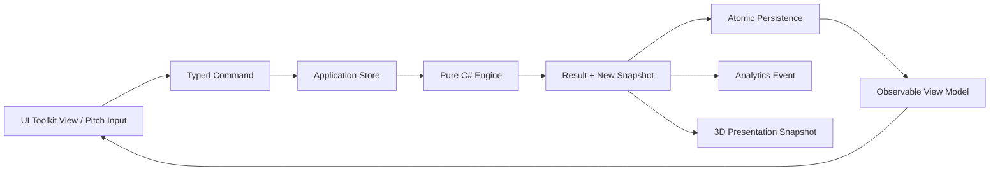

# Android Unity 프로덕션 출시 후보 구현 계획

> 대상 제품: **야구 못하면 또 환생함** Android판
> 문서 상태: 구현 기준선(Execution Spec)
> 작성일: 2026-08-11 (Asia/Seoul)
> 목표일: 2026-08-18까지 Google Play 프로덕션 출시 후보(RC) 완성
> 기준 소스 커밋: `fe7b585c32f5819dc4cd61dd16b92af46ee22b87`
> 기준 앱: `apps/ios`의 iPhone 세로형 iOS 앱 1.0.3(46)
> 새 프로젝트 위치: `apps/android-unity`
> 새 Android 애플리케이션 ID 기본값: `com.solkim.baseball.android`

이 문서는 구현 에이전트가 추가 제품 기획 없이 바로 작업할 수 있는 실행 명세다. 문서의 `MUST`, `SHOULD`, `MAY`는 각각 필수, 강한 권고, 선택을 뜻한다. 구현 중 판단이 충돌하면 다음 우선순위를 따른다.

1. 이 문서의 고정 결정과 출시 게이트
2. 현재 iOS 앱의 사용자 행동·화면 문구·콘텐츠
3. `packages/simulation-core/Sources/SimulationCore`의 게임 규칙과 불변식
4. Android 플랫폼 관례
5. 구현 편의

---

## 0. 구현 에이전트 시작 규칙

### 0.1 첫 30분에 반드시 할 일

- `git status --short --branch`로 기존 사용자 변경을 확인하고 보존한다.
- 현재 `HEAD`가 위 기준 커밋과 다르면 `git diff fe7b585c..HEAD -- apps/ios packages/simulation-core`를 확인하고, 새 iOS 동작을 먼저 이 문서의 패리티 매트릭스에 반영한다.
- 루트 `AGENTS.md`의 콘텐츠 불변 규칙을 읽는다.
- Unity 버전과 Android 모듈을 확인한다.
  - 이 문서 작성 시 설치된 에디터는 `/Applications/Unity/Hub/Editor/6000.3.19f1`이다.
  - 이 문서 작성 시 `PlaybackEngines/AndroidPlayer`가 **없다**. Android Build Support, Android SDK & NDK Tools, OpenJDK 설치가 Day 0 차단 작업이다.
- Google Play Console에서 `com.solkim.baseball.android`가 비어 있는지 확인한다. 이미 다른 애플리케이션 ID가 만들어졌다면 **프로젝트 생성 전에** 그 ID를 이 문서와 빌드 설정에 반영한다. Play에 생성한 뒤 ID를 바꾸지 않는다.
- 구현 시작 전 `docs/android-unity/DECISIONS.md`를 만들고 아래 외부값만 기록한다.
  - 최종 application ID
  - Play Console 앱 이름과 기본 언어
  - Firebase Android App ID
  - Amplitude 프로젝트/환경 이름
  - 업로드 키 alias와 보관 책임자(비밀값 자체는 기록 금지)
  - 실제 RC 버전명·버전 코드

### 0.2 작업 방식

- iOS를 눈으로 흉내 내며 새 규칙을 만들지 않는다. 먼저 소스와 테스트에서 상태 전이를 확인하고 C# 계약 테스트를 작성한다.
- 한 기능은 `Core → Application store → Presentation → Android device test` 순으로 세로 완성한다.
- 화면만 먼저 대량 생성하거나, 모든 Swift를 기계 번역한 뒤 한꺼번에 빌드하지 않는다.
- 각 작업 묶음은 아래 네 증거를 남긴다.
  1. 구현 파일
  2. EditMode 또는 PlayMode 테스트
  3. 패리티 매트릭스 상태
  4. 실제 Android 캡처 또는 로그
- 시뮬레이션 결과를 연출 코드가 다시 계산해서는 안 된다. 결과는 코어에서 한 번 확정하고, 연출은 확정된 스냅숏만 재생한다.
- 실존 프로 구단·리그·선수·로고·유니폼 문양·슬로건을 새 기본 콘텐츠에 넣지 않는다. 기존 검사기를 Unity C#·UXML·USS·JSON까지 확장한다.
- 작업 중 생성되는 `Library`, `Temp`, `Logs`, `obj`, `Builds`, Gradle 캐시, 키스토어, 서비스 계정 파일은 커밋하지 않는다.

### 0.3 보고 형식

매 작업 종료 보고는 다음 형식으로 짧게 남긴다.

```text
완료: [패리티 ID 또는 작업 ID]
변경: [주요 파일]
검증: [명령과 결과]
실기기: [기종/OS/결과]
남은 위험: [없음 또는 구체적 위험]
```

---

## 1. 고정된 제품 결정

| 항목 | 결정 | 구현 의미 |
|---|---|---|
| 제품 관계 | iOS 앱의 Android 포팅 | 새 게임을 기획하지 않고 화면·콘텐츠·루프를 보존한다. |
| 엔진 | Unity + C# | Swift 코어를 Unity용 순수 C# 코어로 다시 구현한다. Swift 런타임/사이드카를 Android에 포함하지 않는다. |
| 결과 패리티 | 미세한 결과 차이 허용 | iOS와 난수 결과가 바이트 단위로 같을 필요는 없지만, 규칙·분포·상태 전이·사용자 선택의 의미는 같아야 한다. |
| 투구 조작 | 현재 방식 유지 | 포수 뒤 시점에서 구종·코스·릴리스 타이밍을 정하고 공 궤적을 본다. |
| 투구 비주얼 | 제한적 3D 강화 | 공, 궤적, 카메라, 타격 반응만 입체화한다. 선수와 구장 전체를 풀 3D로 만들지 않는다. |
| UI/콘텐츠 | iOS와 동일 | Korean copy와 콘텐츠 카탈로그, 화면 순서, 메타 루프를 보존한다. 플랫폼 서비스만 Android에 맞춘다. |
| 네트워크 | 오프라인 우선 | 로그인, 서버 계정, 클라우드 세이브, 온라인 대전이 없다. 인터넷이 끊겨도 전체 커리어를 진행·저장할 수 있어야 한다. |
| 분석 | 익명 품질 분석 허용 | Firebase Analytics, Amplitude, Firebase Crashlytics를 사용한다. 광고 ID·연락처·위치·로그인 ID는 쓰지 않는다. |
| 언어/지역 | 한국어·대한민국 한정 | 앱/스토어 기본 언어 `ko-KR`, 판매 국가는 대한민국만 연다. |
| 폼 팩터 | 스마트폰 세로 전용 | 태블릿·ChromeOS·TV·XR은 Play 기기 카탈로그에서 제외한다. 가로 모드는 지원하지 않는다. |
| 과금 | 유료 다운로드 4,400원 | 광고·구독·인앱 상품 없음. Google Play의 유료 게임 60분 무료 체험을 켠다. 앱 내부 Billing SDK는 넣지 않는다. |
| 일정 | 7일 | 인원은 제약하지 않되 통합 게이트는 생략하지 않는다. |
| 목표 | Google Play 프로덕션 RC | “에디터에서 실행됨”이 아니라 서명 AAB, 심볼, 스토어 메타데이터, 데이터 보안 선언, 실기기 증거가 준비된 상태다. |

### 1.1 RC의 정확한 정의

2026-08-18 종료 시 아래가 모두 충족되어야 RC다.

- iOS의 새 인생 시작부터 고교 3년, 드래프트, 프로 커리어, 은퇴/유산, 다음 인생까지 한 번 이상 Android에서 완주된다.
- 직접 투구 경기와 자동 진행, 주간 프로그램, 기록, 업적, 설정이 동작한다.
- 앱 강제 종료 후 마지막 안전 체크포인트에서 복구된다.
- 오프라인 모드에서 네트워크 오류 UI 없이 전체 핵심 루프를 완료한다.
- Release IL2CPP ARM64 AAB가 생성되고 Play Console 내부 테스트 트랙에 업로드된다.
- 내부 테스트 설치본에서 신규 설치, 업데이트 설치, 60분 무료 체험 진입/만료 후 구매벽 전환을 확인한다.
- Crashlytics 테스트 크래시가 심볼 처리된 C# 스택으로 콘솔에 도착한다.
- 프로덕션용 분석 이벤트가 개발 이벤트와 구분되고, PII가 없음을 페이로드 로그로 확인한다.
- Play 사전 출시 보고서와 물리 Samsung 기기 매트릭스의 P0/P1 문제가 0건이다.
- 스토어 등록정보, 개인정보처리방침, 데이터 보안, 콘텐츠 등급, 가격, 국가, 기기 제외, 앱 액세스 답변이 작성되어 있다.

스토어 심사 완료 시점은 외부 변수이므로 “7일 내 출시 후보”에는 포함하지만 “7일 내 심사 승인”은 보장하지 않는다.

### 1.2 명시적 비범위

다음은 v1 RC에 넣지 않는다.

- 계정, 로그인, 소셜 로그인
- Play Games Services, 리더보드, Play 업적, 클라우드 세이브
- iOS 세이브 가져오기 또는 기기 간 세이브 이동
- 광고, 구독, 인앱 결제, 별도 데모 앱
- 온라인 대전, 서버 권위 시뮬레이션, 원격 설정
- 태블릿 전용 레이아웃, 가로 모드, 멀티윈도우 최적화
- 풀 3D 투수·타자·포수 리깅, 모션 캡처, 3D 관중석/구장
- 결과를 바꾸는 실시간 물리 충돌
- 영어/일본어 등 추가 현지화
- iOS와 난수 시퀀스/세이브 파일의 바이트 호환
- 현재 제품에서 임시 제거된 오늘의 이닝 재설계·재도입

---

## 2. 기준 소스와 감사 결과

### 2.1 코드 규모

감사 시점의 대략적인 규모다. 구현 전 다시 계측하되, 이 수치를 일정 축소의 근거로 쓰지 않는다.

- iOS 화면·스토어·플랫폼 코드: `apps/ios/Sources` 약 22,874 Swift LOC
- iOS 테스트: `apps/ios/Tests`, `apps/ios/UITests` 약 10,292 LOC
- 공유 시뮬레이션 코어: `packages/simulation-core/Sources/SimulationCore` 약 15,847 Swift LOC
- iOS 이미지: `Assets.xcassets` 안 JPG 106개, PNG 17개, 카탈로그 `Contents.json` 121개
- iOS 오디오: 약 4.1MB, 효과음 변형과 관중 루프, `apps/ios/Audio/CREDITS.md`에 출처 기록

### 2.2 원본 역할별 기준 파일

| 역할 | 원본 |
|---|---|
| 앱 시작/탭/복귀 | `apps/ios/Sources/BaseballApp.swift`, `AppShell.swift`, `CareerBootstrap.swift` |
| 선수 생성 | `HighSchoolSetupView.swift`, `CareerSetupView.swift` |
| 고교 상태/화면 | `HighSchoolCareerStore.swift`, `HighSchoolCareerView.swift`, `HighSchoolPresentation.swift` |
| 프로 상태/화면 | `MobileCareerStore.swift`, `CareerFlowView.swift` |
| 투구 세션/조작/연출 | `PitchSession.swift`, `PitchView.swift`, `DeliveryControl.swift`, `PitchDramaView.swift` |
| 기록/리그/메타 | `RecordView.swift`, `LeagueView.swift`, `WeeklyProgram*.swift`, `DailyStreak.swift`의 레거시 저장 호환 |
| 유산/공유 | `LifeArchiveView.swift`, `LifeCardView.swift`, `RunRecapView.swift`, `ShareSheet.swift` |
| 업적/설정 | `Achievements*.swift`, `AchievementStore.swift`, `SettingsView.swift` |
| 저장 | `SaveSync.swift`, `HighSchoolCareerStore.swift`, `MobileCareerStore.swift`, `WeeklyProgramStore.swift` |
| 분석 | `GameAnalytics.swift` |
| 오디오/진동 | `GameAudio.swift`, `GameAudioCueMapping.swift`, `SoundBank.swift`, `Haptics.swift` |
| 디자인 토큰 | `DesignSystem.swift`, `apps/windows/src/design-system.css` |
| 시뮬레이션 | `packages/simulation-core/Sources/SimulationCore/*.swift` |

### 2.3 소스 권위 규칙

- 화면 문구와 화면 노출 조건은 iOS가 권위다.
- 수치 계산, 능력치 규칙, 드래프트/프로 결과, 투구 판정은 `SimulationCore`가 권위다.
- iOS Store에서만 존재하는 저장·복귀·주간·분석 규칙은 iOS Store가 권위다.
- Windows UI에서 더 최근에 수정된 공통 디자인 토큰이 있으면 iOS `DesignSystem.swift`와 함께 대조한다.
- Swift `SimulationProtocol`, `SimulationPersistence`, sidecar/CLI는 Android 런타임에 이식하지 않는다. 필요한 것은 순수 `SimulationCore`와 앱 상태 계약이다.

---

## 3. 산출물과 저장소 구조

다음 구조를 기본으로 생성한다. 기능을 다른 위치에 두어야 한다면 `docs/android-unity/DECISIONS.md`에 이유와 대체 경로를 남긴다.

```text
apps/android-unity/
├── Assets/
│   ├── Game/
│   │   ├── Bootstrap/
│   │   ├── Core/
│   │   │   ├── Domain/
│   │   │   ├── Random/
│   │   │   ├── Pitching/
│   │   │   ├── HighSchool/
│   │   │   ├── Pro/
│   │   │   ├── Meta/
│   │   │   └── Catalogs/
│   │   ├── Application/
│   │   │   ├── Commands/
│   │   │   ├── Stores/
│   │   │   ├── Navigation/
│   │   │   ├── Persistence/
│   │   │   └── Analytics/
│   │   ├── Presentation/
│   │   │   ├── Common/
│   │   │   ├── Opening/
│   │   │   ├── Setup/
│   │   │   ├── HighSchool/
│   │   │   ├── Pro/
│   │   │   ├── Pitch/
│   │   │   ├── Records/
│   │   │   ├── Meta/
│   │   │   └── Settings/
│   │   ├── Platform/
│   │   │   ├── Android/
│   │   │   ├── Analytics/
│   │   │   ├── Audio/
│   │   │   └── Haptics/
│   │   ├── Content/
│   │   │   ├── ko-KR/
│   │   │   └── Manifests/
│   │   ├── Art/
│   │   ├── Audio/
│   │   ├── Prefabs/
│   │   ├── Scenes/
│   │   ├── Shaders/
│   │   └── Editor/
│   ├── Plugins/Android/
│   ├── StreamingAssets/
│   └── Tests/
│       ├── EditMode/
│       └── PlayMode/
├── Packages/
│   ├── manifest.json
│   └── packages-lock.json
├── ProjectSettings/
├── UserSettings/                 # gitignore
└── README.md

docs/android-unity/
├── DECISIONS.md
├── PARITY_MATRIX.md
├── PARITY_EXCEPTIONS.md
├── DEVICE_MATRIX.md
├── RELEASE_EVIDENCE.md
├── DATA_SAFETY.md
└── STORE_LISTING_KO.md

tools/
├── export-unity-fixtures.*
├── import-ios-assets-to-unity.*
├── check-unity-assets.*
├── check-unity-copy.*
└── unity-android-*.sh
```

### 3.1 Assembly Definition 계약

| Assembly | 참조 가능 | 참조 금지 |
|---|---|---|
| `Baseball.Core` | BCL, Newtonsoft 계약 인터페이스는 가능하면 분리 | `UnityEngine`, Firebase, Android JNI, UI |
| `Baseball.Application` | Core, 최소 Unity lifecycle adapter | UI Toolkit 구체 View, SDK 직접 호출 |
| `Baseball.Presentation` | Application, Core, UnityEngine, UI Toolkit, URP | Firebase/Amplitude 직접 호출 |
| `Baseball.Platform` | Application interfaces, Unity/Android SDK | 도메인 상태 직접 변경 |
| `Baseball.Editor` | 위 모듈, UnityEditor | Player 빌드 포함 금지 |
| 각 Tests assembly | 대상 assembly | 프로덕션 SDK 네트워크 송신 |

`Baseball.Core`가 `UnityEngine.dll`을 참조하지 않는지 자동 테스트한다. 코어에서는 `Time`, `Random`, `PlayerPrefs`, `Application`, `Mathf`, `Vector3`를 사용할 수 없다.

### 3.2 Unity 씬

- `00_Bootstrap`: 유일한 시작 씬. DI 구성, 저장 복구, 설정, SDK 초기화, 전역 UI Document를 만든다.
- `10_Shell`: UI Toolkit 기반 앱 셸. Opening부터 기록/설정까지 같은 문서/패널 스택으로 처리한다.
- `20_PitchStage`: URP 3D 투구 무대. 필요할 때 additive load하고 종료 후 unload한다.
- 테스트용 `90_PresentationSandbox`: 에디터 전용. 모든 카드/텍스트 크기/투구 결과를 고정 스냅숏으로 미리 본다. Player 빌드의 scene list에는 넣지 않는다.

씬 전환 때 코어 상태를 씬 오브젝트에 두지 않는다. `AppRoot`의 Store가 상태를 소유하고 씬은 View만 소유한다.

---

## 4. 패리티 매트릭스

구현 시작 시 아래 표를 `docs/android-unity/PARITY_MATRIX.md`로 복사하고 `Not started / Core / UI / Device / Accepted` 상태 열을 추가한다. `Accepted`는 Android Release 빌드 증거가 있을 때만 쓴다.

### 4.1 전체 사용자 흐름

| ID | 사용자 흐름 | iOS 기준 | Android 완료 조건 |
|---|---|---|---|
| P-001 | 최초 실행/오프닝 | `OpeningView`, `CareerBootstrap` | 네트워크 없이 오프닝이 뜨고 새 게임/복구를 올바르게 분기한다. |
| P-002 | 선수 생성 | `HighSchoolSetupView` | 이름, 프리셋, 지역, 성향/초기 선택, 유산 선택의 유효성·문구·결과가 같다. |
| P-003 | 프롤로그 | `HighSchoolCareerView` | 대사와 첫 불펜 진입 조건이 같다. |
| P-004 | 튜토리얼 투구 | `PitchView`, `DeliveryControl` | 구종·코스·타이밍을 직접 입력하고 결과가 저장된다. |
| P-005 | 학교 선택 | `HighSchoolCareerView` | 지역 학교 후보, 비교 정보, 선택 확정과 취소 규칙이 같다. |
| P-006 | 훈련 | `HighSchoolCareerStore`, `HighSchoolCareerView` | 전망 표시, 자원 소비, 능력치 반영, 성장 연출이 같다. |
| P-007 | 관계 이벤트 | 같은 파일 | 감독/포수/라이벌 등 선택과 효과, 대사가 같다. |
| P-008 | 중요 경기 | `PitchSession`, `PitchScenario` | 경기 상황, 사인, 투구, 판정, 기록, 중단/복구가 같다. |
| P-009 | 각성 | `AwakeningTree`, `ClimaxViews` | 후보, 조건, 선택, 능력 반영이 같다. |
| P-010 | 챕터 결산 | `ChapterGoal`, `HighSchoolCareerView` | 목표·결과·다음 학기 전이가 같다. |
| P-011 | 고교 3년 진행 | `HighSchoolCareer` | 총 8개 챕터의 순서와 종료 조건이 같다. |
| P-012 | 대회/랭킹/리그 | `TournamentBracket`, `ProspectRanking`, `LeagueTable` | 화면과 계산, 순위 안정 정렬이 같다. |
| P-013 | 드래프트 | `draftForecast`, `resolveDraft` | 예상, 결과, 지명/미지명 분기와 문구가 같다. |
| P-014 | 회차 결산/유산 | `RunRecapView`, `LifeArchiveView`, `CareerSignatureLegacy` | 기억, 야구혼, 대표 유산 후보/선택/장착이 원자적으로 반영된다. |
| P-015 | 환생 | `HighSchoolCareerStore` | 다음 선수에게 상속값이 적용되고 중복 지급되지 않는다. |
| P-016 | 프로 계약 | `CareerFlowView`, `ProCareer` | 계약 선택, 팀/역할/연봉/상태가 같다. |
| P-017 | 프로 주간 계획 | 같은 파일 | 주간 계획, 3주 진행, 자원/상태 반영이 같다. |
| P-018 | 프로 중요 경기 | `PitchSession`, `ProCareer` | 직접 경기와 자동 진행 결과가 시즌 기록에 한 번만 반영된다. |
| P-019 | 시즌 결산 | `reviewSeason` | 개인 기록, 팀 결과, 성장, 다음 선택이 같다. |
| P-020 | 비시즌 | `chooseOffseason` | 잔류, 특수 경로, FA, 은퇴 등 현재 iOS에 노출되는 선택만 보인다. |
| P-021 | 프로 최대 커리어 | `ProCareer` | 최대 12시즌/37세 규칙과 강제 은퇴가 같다. |
| P-022 | 프로 유산→다음 인생 | `MobileCareerStore`, `HighSchoolCareerStore` | 프로 기록이 고교 메타 저장에 한 번만 접힌다. |
| P-023 | 오늘의 이닝 | `DAILY_INNING_RETIREMENT_PLAN_2026-08-11.md` | 현행 iOS와 같이 제품 진입·알림·주간 목표·신규 보상·분석 발화를 제공하지 않는다. 옛 enum·저장 필드·링크만 안전하게 읽어 현재 커리어로 복귀시킨다. |
| P-024 | 주간 야구 노트 | `WeeklyProgram*` | 주간 키, 스탬프, 2/3 보상, 누적 상태가 같다. |
| P-025 | 기록/리그 | `RecordView`, `LeagueView` | 경기 로그, 최근 등판, 누적 기록, 리그 순위가 같다. |
| P-026 | 로컬 업적 | `Achievements*` | 해금 조건·표시·저장이 같다. Play 로그인은 요구하지 않는다. |
| P-027 | 설정 | `SettingsView` | 자동 릴리스, 효과음, 음악, 진동, 알림, 접근성, 초기화가 동작한다. |
| P-028 | 공유 | `LifeCardView`, `ShareSheet` | 한국어 텍스트/이미지를 Android Sharesheet로 공유한다. |
| P-029 | 복귀 카드/세션 | `AppShell`, `GameAnalytics` | 저장된 다음 행동 카드와 다음 서울 날짜 계측이 같다. |
| P-030 | 리뷰 요청 | `ReviewPrompt` | Google Play In-App Review를 조건 충족 시 한 번 요청하고 실패해도 진행을 막지 않는다. |

### 4.2 허용되는 플랫폼 차이

아래 차이만 기본 허용한다. 다른 차이는 `PARITY_EXCEPTIONS.md`에 원인, 사용자 영향, 승인자를 기록해야 한다.

- Game Center UI/로그인/리더보드 → Android v1에서는 숨기고 로컬 업적만 유지
- iCloud 세이브 → Android 로컬 원자 저장만 사용
- iOS Share Sheet → Android `ACTION_SEND` Sharesheet
- iOS Review API → Google Play In-App Review
- iOS Notification API → Android 알림 채널 + `POST_NOTIFICATIONS`
- iOS Dynamic Type → Android 시스템 글자 배율과 Unity 접근성 설정 반영
- SwiftUI 내비게이션 → Android 시스템 Back과 UI Toolkit 패널 스택
- 시뮬레이션의 개별 난수 결과 → C# 내부 결정론과 분포 허용 오차를 만족하면 다를 수 있음

---

## 5. C# 시뮬레이션 코어 이식

### 5.1 핵심 원칙

- 코어는 순수 C#이다. 같은 `seed + state + command`는 Editor, Mono 테스트, Android IL2CPP에서 같은 결과를 내야 한다.
- 코어 안에서 `System.Random`, 현재 시간, 현재 로캘, 부동소수점 기반 무작위 정렬, `Dictionary` 열거 순서를 결과에 사용하지 않는다.
- 정수 오버플로는 Swift의 `&+`, `&*`, `&-`와 대응하도록 `unchecked` 블록을 명시한다.
- 돈, 점수, 능력치, revision, seed는 가능한 한 정수형을 쓴다. 표시할 때만 한국어 포맷터를 거친다.
- 컬렉션에서 동률이 생기면 `score → stable ID` 같은 명시적 2차 정렬을 둔다.
- 명령은 성공 결과 또는 도메인 오류를 반환한다. UI가 규칙을 중복 구현하지 않는다.
- 결과를 저장한 다음 UI 관찰 상태를 바꾼다. 저장 실패 시 성공 화면을 노출하지 않는다.

### 5.2 기초 타입 매핑

| Swift | C# | 주의점 |
|---|---|---|
| `UInt64` | `ulong` | `unchecked` 산술, JSON은 문자열 또는 lossless converter 사용 |
| `Int` | 명시적 `int`/`long` | 플랫폼 크기에 기대지 말고 범위 테스트 |
| `Double` | `double` | 비교 허용 오차 명시, 직렬화 왕복 테스트 |
| `enum: String, Codable` | string-valued enum converter | 저장 키는 Swift raw value와 가능한 한 동일 |
| `struct Codable` | immutable DTO/record + JSON converter | IL2CPP reflection 보존 필요 |
| `Result`/throw | `DomainResult<T>` 또는 명시 예외 | 사용자 입력 오류에 예외 남발 금지 |
| `Date` | `DateTimeOffset` | 메타 기능만, 서울 날짜 서비스 주입 |
| `UUID` | `Guid` 또는 string | 기존 문자열 포맷을 유지할 곳은 string |

JSON은 `com.unity.nuget.newtonsoft-json`의 Unity 6000.3 호환 고정 버전을 사용한다. `Packages/manifest.json`과 `packages-lock.json`에 정확한 버전을 커밋하고, enum/`ulong`/다형 타입 converter와 `link.xml`을 함께 둔다. `JsonUtility`는 중첩 dictionary·버전 마이그레이션에 부적합하므로 세이브에 쓰지 않는다.

### 5.3 결정론 유틸리티

다음 순서로 먼저 이식한다.

1. `SplitMix64.cs`
   - Swift 상수와 비트 연산을 그대로 사용한다.
   - seed `0`, `1`, `ulong.MaxValue`, 고정 회차 seed의 첫 1,000개 값을 Swift fixture와 일치시킨다.
2. `StableHash.cs`
   - UTF-8 byte에 대한 FNV-1a 64-bit를 그대로 구현한다.
   - 대/소문자, 한글, emoji, 빈 문자열 fixture를 둔다.
3. 안정 정렬/가중 선택 helper
4. `SeoulGameClock`
   - 코어가 아닌 Application interface로 둔다.
   - 테스트에서는 고정 시간을 주입한다.

시뮬레이션 결과 차이가 허용되어도 RNG와 해시는 번역 오류를 잡는 기준이므로 **초기 fixture는 정확히 일치**해야 한다.

### 5.4 모듈 이식 순서

아래 순서에서 앞 모듈 테스트가 green이 되기 전에 다음 상위 엔진을 연결하지 않는다.

1. 기반 도메인
   - `Domain.swift`
   - `Personality.swift`, `PersonalityTrait.swift`, `Nickname.swift`
   - `Talent.swift`, `PitchingMetrics.swift`, `PitchAbilityRules.swift`
   - `DifficultyScale.swift`, `LeagueBaseline.swift`, `ScoutingEstimate.swift`
2. 투수/구종/상황
   - `PitcherPresetCatalog.swift`, `PitcherLab.swift`
   - `PitchDelivery.swift`, `PitchKernelDomain.swift`
   - `GameSituation.swift`, `SignSituation.swift`
   - `RivalMemory.swift`, `PitchSequenceEvaluator.swift`
   - `PitchKernelEngine.swift`, `AutoOutingSimulator.swift`
3. 고교 커리어
   - `HighSchoolContentCatalog.swift`, `RelationshipVoiceCatalog.swift`
   - `ChapterGoal.swift`, `AwakeningTree.swift`, `CareerWind.swift`
   - `CareerGameGrowth.swift`, `CommunityBuzz.swift`
   - `ProspectRanking.swift`, `TournamentBracket.swift`, `LeagueTable.swift`
   - `CareerSignatureLegacy.swift`, `HighSchoolCareer.swift`
4. 프로 커리어
   - `ProCareer.swift`와 공유 리그/성장 타입
5. 앱 메타 규칙
   - iOS Store에만 있는 레거시 daily 저장 호환, Weekly, achievement, pledge, return-plan 규칙

각 Swift 파일에 대응하는 C# 파일을 우선 1:1로 둔다. 검증이 끝난 뒤에만 합치거나 재구성한다. 이식 중 대규모 “더 좋은 구조” 리팩터링을 하지 않는다.

### 5.5 엔진 API 계약

최소한 다음 public 동작을 C# 서비스에 제공한다. 이름은 C# 관례로 바꿔도 호출 의미와 입력/출력은 보존한다.

#### `HighSchoolCareerEngine`

- `Start`
- `CompletePrologue`
- `NormalizeRegionalSchools`
- `ChooseSchool`
- `TrainingOutlook`
- `CommitTraining`
- `ResolveRelationship`
- `RecordImportantGame`
- `ChooseAwakening`
- `AdvanceChapter`
- `DraftForecast`
- `ResolveDraft`
- `OpenLegacy`
- `SelectLegacy`
- 다음 회차 상속/대표 유산 helper

#### `ProCareerEngine`

- `Start`
- `NormalizeBalance`
- `SignContract`
- `PlanWeek`
- `ApplySeasonDecision`
- `ResolveImportantGame`
- `ReviewSeason`
- `ChooseOffseason`
- 강제 은퇴/유산 계산

#### `PitchKernelEngine`

- `PreparePitch`
- `SubmitPitch`

`PreparePitch`가 만든 식별자와 상대 기억을 `SubmitPitch`가 검증해야 한다. UI가 이전 준비 결과를 중복 제출하거나 앱 복귀 후 stale command를 제출하면 도메인 오류로 거부한다.

### 5.6 고교 상태 기계

상태는 문자열 화면명이 아니라 typed phase로 저장한다.

```text
새 선수
  → 프롤로그
  → 학교 선택
  → [훈련 → 관계 → 중요 경기 → 각성/결산] × 챕터 계약
  → 드래프트
  → 유산 선택/인생 결산
  → 프로 또는 다음 인생
```

- 실제 8개 챕터의 순서와 분기는 Swift `HighSchoolCareer`에서 추출한다.
- phase 진입 시 부수효과를 View `OnEnable`에서 실행하지 않는다. 명시적 command 처리에서 한 번만 실행한다.
- `revision`은 성공한 영속 상태 전이마다 단조 증가한다.
- 화면을 다시 그리거나 앱을 재개해도 보상·분석·유산이 중복 적용되지 않도록 receipt/set을 저장한다.

### 5.7 프로 상태 기계

```text
계약 제안
  → 주간 계획
  → 시즌 결정/자동 진행
  → 중요 경기
  → 시즌 결산
  → 비시즌 선택
  → 다음 시즌 또는 은퇴
  → 고교 메타 저장에 유산 반영
```

- iOS의 최대 12시즌/37세 종료 조건을 보존한다.
- 프로 커리어가 시작된 고교 `careerID`를 끝까지 보존한다.
- 프로 결과를 고교 메타에 접는 작업은 idempotency receipt를 포함한 단일 저장 트랜잭션으로 처리한다.
- “프로 저장 삭제 성공, 고교 유산 저장 실패” 같은 반쪽 상태가 생기지 않도록 먼저 통합 save candidate를 쓰고 성공 후 관찰 상태를 갱신한다.

### 5.8 투구 세션 상태

`PitchSessionStore`가 아래를 소유한다.

- 현재 경기/이닝/아웃/주자/점수
- 현재 타자, plate appearance, 볼카운트
- 준비된 사인과 pitch token
- 라이벌/벤치 기억
- 투수 경기 기록과 성장 누적
- 다음 투구 준비 상태
- 빠른 진행 가능 여부
- 타자 경계 resume checkpoint
- 확정됐지만 아직 화면에서 소비하지 않은 presentation result

투구 처리 순서:

1. 코어 `PreparePitch`
2. UI에 사인·목표·상황 표시
3. 사용자의 구종/코스/타이밍을 `PitchDelivery`로 정규화
4. 코어 `SubmitPitch`
5. 결과와 다음 안전 체크포인트를 **먼저 저장**
6. `PitchPresentationSnapshot` 생성
7. 3D 연출 재생
8. 연출 종료/건너뛰기 후 결과 확인 receipt 저장
9. 다음 투구 또는 경기 종료

연출 도중 프로세스가 죽으면 5번 저장을 읽어 같은 확정 결과를 즉시 요약하거나 짧게 다시 재생한다. 절대 재투구하지 않는다.

### 5.9 Swift 기준 fixture 생성

`packages/simulation-core`에 테스트 전용 fixture exporter를 추가하거나 기존 CLI를 확장해 `apps/android-unity/Assets/Tests/Fixtures`에 JSON을 생성한다. 생성기는 게임 런타임에 포함하지 않는다.

필수 fixture:

- SplitMix64/StableHash 벡터
- 모든 투수 프리셋과 구종 카탈로그 snapshot
- 대표 seed 100개 이상의 `PreparePitch → SubmitPitch`
- 헛스윙, 루킹, 파울, 약한/강한 인플레이, 장타, 아웃 등 각 판정 최소 10개
- 새 선수→드래프트 지명→프로→은퇴→다음 선수 전체 명령 스크립트
- 미지명→바로 다음 인생 스크립트
- 프로 12시즌 자동 완주 스크립트
- 각 phase의 저장 스냅숏
- 투구 전, 투구 결과 확정 직후, 타자 종료 후 체크포인트
- 유산 적용 전/후와 중복 command
- 손상/구버전/미래버전 세이브

테스트를 두 층으로 나눈다.

1. **Translation oracle**: 초기 포트가 Swift와 같은 값을 내는지 검사한다. 의도적 차이는 `PARITY_EXCEPTIONS.md`에 기록한 뒤 fixture를 Android 기준으로 전환할 수 있다.
2. **Product invariant**: 수치가 달라도 반드시 지켜야 하는 범위, 전이, 분포, 단조성, 중복 방지를 검사한다.

### 5.10 밸런스 분포 게이트

대표 프리셋/난이도별 고정 seed 10,000회 Monte Carlo를 Swift와 C#에 돌려 다음을 비교한다.

- 볼/스트라이크/인플레이/삼진/볼넷 비율: 절대 차이 2%p 이내
- 장타/홈런/실점 비율: 절대 차이 1.5%p 이내
- 평균 구속/제구 오차/타구 속도: Swift 평균 대비 5% 이내
- 드래프트 성공률과 라운드 분포: 절대 차이 3%p 이내
- 대표 경로의 프로 진입/은퇴 분포: 절대 차이 3%p 이내
- 능력치·자원은 정의된 min/max 밖으로 나가지 않음
- 같은 C# seed의 Editor/IL2CPP 결과 hash 100% 일치

한 항목을 의도적으로 조정하면 근거와 전/후 결과 CSV를 커밋한다. “미세한 차이 허용”을 밸런스 미검증의 면허로 사용하지 않는다.

---

## 6. 앱 상태, 명령, 내비게이션

### 6.1 단방향 흐름



- View는 command만 보낸다.
- Store는 현재 snapshot과 진행 중 operation을 소유한다.
- Core는 새 snapshot/result를 반환하며 외부 저장을 모른다.
- Persistence 성공 뒤 Store가 새 snapshot을 publish한다.
- Analytics와 연출은 저장된 결과를 관찰하는 downstream consumer다.

### 6.2 비동기/중복 입력

- 모든 주요 CTA는 command 처리 중 disabled 상태와 진행 표시를 갖는다.
- Android 터치의 double tap, Activity resume, UI 재바인딩이 command를 두 번 실행하지 못하도록 `CommandId`와 revision precondition을 둔다.
- 저장/SDK 초기화가 오래 걸려도 메인 스레드에서 파일 I/O나 네트워크를 기다리지 않는다.
- Firebase/Amplitude 실패는 게임 command를 실패시키지 않는다.

### 6.3 Back 계약

Android 시스템 Back은 아래 순서로 한 단계만 처리한다.

1. 열린 modal/dialog 닫기
2. 하위 상세 화면 닫기
3. 비파괴 탭/화면이면 이전 패널로 이동
4. 확정되지 않은 선택이 있으면 한국어 확인 dialog
5. 직접 투구 경기 중이면 “경기를 나가면 현재 타자 시작 지점에서 이어집니다” 확인
6. 루트에서는 한 번 더 누르면 종료 안내 후 Activity 종료

보상 확정 화면, 드래프트/유산 선택처럼 되돌릴 수 없는 phase에서는 Back으로 이전 상태를 복원하지 않는다.

---

## 7. UI/콘텐츠 이식

### 7.1 기술 선택

- 런타임 UI는 UI Toolkit(UXML/USS)으로 구현한다.
- 화면마다 하나의 `UIDocument`를 새로 만들지 말고 Shell의 문서와 패널 스택을 재사용한다.
- 목록은 `ListView`/가상화를 사용하고, 카드 수가 적은 화면만 일반 VisualElement를 쓴다.
- Presenter는 view model을 bind하고 command callback만 연결한다. UXML code-behind에 게임 규칙을 넣지 않는다.
- 모든 한국어 문구는 `Assets/Game/Content/ko-KR`의 중앙 카탈로그 또는 typed formatter에 둔다. controller에 긴 문장을 하드코딩하지 않는다.
- 한국어 전용 v1이어도 키 기반 문구 구조를 사용해 조사/숫자 포맷을 한 곳에서 관리한다.

### 7.2 디자인 방향: Midnight Dugout

다크 모드만 제공한다. 시스템이 라이트 모드여도 팔레트를 바꾸지 않는다.

#### 기본/고대비 색 토큰

| Token | 기본 | 고대비 |
|---|---:|---:|
| canvas | `#080D0B` | `#020503` |
| surface | `#101815` | `#070B09` |
| surfaceRaised | `#17231E` | `#0B120E` |
| surfaceSoft | `#1E2B25` | `#111A15` |
| border | `#3F554B` | `#C1CEC7` |
| borderStrong | `#5F736A` | `#E2E8E4` |
| textPrimary | `#F1F4EE` | `#FFFFFF` |
| textSecondary | `#B4C1BB` | `#E2E8E4` |
| textTertiary | `#84968E` | `#C8D2CC` |
| action | `#B7F36B` | `#D3FF82` |
| actionStrong | `#96DC4E` | `#B7F36B` |
| actionSoft | `#243A20` | `#16240F` |
| actionInk | `#10200D` | `#000000` |
| selection | `#86C96A` | `#B9ED8D` |
| selectionSoft | `#1B2F20` | `#0E1C11` |
| milestone | `#D8B565` | `#FFE08A` |
| milestoneSoft | `#211D14` | `#14110A` |
| positive | `#55C58A` | `#78E6AB` |
| positiveSoft | `#14271D` | `#0A1710` |
| warning | `#F0A94A` | `#FFC66D` |
| warningSoft | `#251D12` | `#17110A` |
| negative | `#EF746A` | `#FF9A91` |
| negativeSoft | `#261816` | `#180D0C` |
| information | `#67B6C1` | `#8ED9E2` |
| informationSoft | `#163036` | `#0B1E22` |
| fieldNight | `#050A15` | `#000000` |
| fieldDirt | `#6B5236` | `#C7A87E` |
| fieldChalk | `#DCE5DE` | `#FFFFFF` |

팀 장식색과 초상 팔레트도 `DesignSystem.swift`에서 그대로 이식하되 UI 상태 의미색과 섞지 않는다. Unity의 모든 원시 색상은 `BaseballTheme.cs`와 `theme.uss`에서만 정의한다. 검사기가 다른 C#/USS/UXML의 hex 리터럴을 차단하게 한다.

#### 레이아웃 토큰

- gutter: `16dp`
- 일반 stack spacing: `14dp`
- tight spacing: `8dp`
- card radius: `14dp`
- control radius: `10dp`
- 최소 터치 영역: Android에서는 `48dp`로 상향(iOS 원본은 44pt)
- portrait key art 기준 높이: `190dp`, 작은 화면에서는 가용 높이의 28%를 넘지 않음
- floating bottom navigation clearance: safe inset 포함 최소 `96dp`

중립 정보는 흰 카드 상자를 반복하지 않는다. `eyebrow + content + 1px hairline`을 쓴다. milestone/positive/warning/negative처럼 상태가 바뀐 순간만 soft surface를 가진다. 좌측 강조 레일을 일반 카드 패턴으로 만들지 않는다.

#### 타이포

- 한국어 본문은 Android에서 가독성이 검증된 시스템 sans 또는 번들 Noto Sans KR subset을 사용한다.
- 숫자/스코어보드는 tabular numeral이 보장되는 별도 font asset을 사용한다.
- 역할: eyebrow, section title, display, hero numeral, stat numeral, scoreboard, scoreboard label, strikeout mark.
- 고정 pixel 글자 크기 대신 역할 크기 × 시스템 font scale을 쓴다.
- 100%, 130%, 160%, 200% font scale에서 중요한 CTA와 수치가 잘리지 않아야 한다.
- 자간을 준 대문자 eyebrow는 한국어 본문에 기계적으로 적용하지 않고 영문/숫자 라벨에만 쓴다.

### 7.3 화면 크기와 Safe Area

지원 검증 폭은 320–480dp portrait다.

- 기준 디자인 폭: 390dp
- 좁은 화면: 320/360dp
- 일반: 390/412dp
- 큰 스마트폰/접힌 폴더블: 480dp 이하
- 위/아래 display cutout, gesture navigation inset, 카메라 홀을 `Screen.safeArea`로 반영한다.
- `Screen.width/height`를 직접 박아 배치하지 않는다. panel scaling과 resolved style을 사용한다.
- 키보드가 이름 입력 CTA를 가리지 않게 content를 scroll/resize하고, IME Done으로 유효성 검사를 실행한다.
- 상태바/내비게이션 바 색은 canvas와 맞춘다. API 36 edge-to-edge에서 콘텐츠가 system bar 아래로 들어가도 safe inset을 적용한다.

### 7.4 공통 컴포넌트

다음을 먼저 만들고 화면별 임의 복제품을 금지한다.

- `PrimaryPill`: action 배경 + actionInk 글자, 화면당 기본 주행동 하나
- `SecondaryButton`, `DestructiveButton`, `IconButton`
- `BaseballSection`, `BaseballCallout`
- `StatTile`, `AbilityGauge`, `ScoreboardRow`
- `ChoiceCard`, `CharacterProfile`, `KeyArtHeader`
- `ModalSheet`, `ConfirmationDialog`, `Toast`, `InlineError`
- `LoadingOverlay`는 초기 저장 복구/SDK가 아니라 실제 차단 작업에만 사용
- `BottomNavigation`, `TopAppBar`, `BackButton`
- `AccessibleToggle`, `AccessibleSlider`, `SegmentedChoice`

모든 조작 컴포넌트는 name/role/state/value를 TalkBack에 제공한다.

### 7.5 화면별 구현 지침

#### Opening/Bootstrap

- 런치 스크린 다음 첫 프레임에서 빈 흰 화면이 보이지 않게 한다.
- 저장 복구는 로고/키아트 위에서 2초 이내 끝나야 한다.
- 새 게임과 이어하기 분기는 저장 상태로 결정한다. Debug/Release 조건 분기를 두지 않는다.

#### 선수 생성

- 이름 입력은 iOS와 같은 길이·공백·금칙 처리를 쓴다.
- 프리셋/지역/초기 선택은 이미지, 설명, 결과 미리보기와 함께 표시한다.
- 선택하지 않은 필수 항목이 있으면 CTA disabled와 인라인 설명을 제공한다.
- 입력한 이름은 분석/Crashlytics custom key로 보내지 않는다.

#### 고교/프로 선택 화면

- 선택 전 전망과 선택 후 결과를 구분한다.
- CTA를 눌러 command가 저장되기 전에는 결과 연출을 시작하지 않는다.
- 비교 수치는 tabular numeral로 정렬한다.
- 하단 CTA는 제스처 영역과 겹치지 않는다.

#### 기록/아카이브

- 긴 기록은 가상화 목록을 쓴다.
- 정렬/필터는 deterministic하고 현재 iOS 기본값과 같다.
- 데이터가 없을 때 기술적 용어 대신 다음 행동을 알려 주는 빈 상태를 쓴다.

#### 설정

- 효과음, 음악, 진동, 자동 릴리스, 고대비, 모션 감소, 복귀 알림을 제공한다.
- “모든 진행 초기화”는 2단계 확인 후 로컬 save/backup/익명 ID/one-shot receipt를 모두 지운다.
- 초기화 직후 새 게임 화면으로 돌아가고 앱 재시작 후에도 복구되지 않아야 한다.
- 품질 분석은 iOS와 동일하게 기본 동작한다. 별도 광고 추적 항목은 만들지 않는다.

---

## 8. 3D 투구 장면

### 8.1 범위 경계

3D로 만드는 것:

- 야구공 mesh와 회전
- 홈플레이트/스트라이크 존 기준 좌표
- 목표점/포수 미트의 깊이감
- 공의 비행 trail과 속도감
- 포수 뒤 카메라의 작은 추적, lens 변화, impact impulse
- 배트/접촉 순간의 제한적 3D 또는 billboard 반응
- 인플레이 타구의 짧은 비행/필요 시 위에서 보는 필드 전환

2D로 유지하는 것:

- 배경 구장/key art
- 투수·타자·포수 캐릭터 일러스트 또는 billboard silhouette
- 스코어, 사인, 구종, 볼카운트, 결과 UI
- 전체 경기장/수비수 표현

금지:

- PhysX 충돌 결과로 스트라이크/타구 결과 결정
- full humanoid rig 또는 새 3D stadium 제작
- 연출 중 frame rate에 따라 궤적/결과가 달라지는 로직
- 확정 결과와 다른 위치에 공을 보여 주는 과장

### 8.2 좌표계

`PitchSpace`를 하나 정의한다.

- 홈플레이트 중심: `(0, 0, 0)`
- X: 포수 시점 좌우, 우측 양수
- Y: 지면 위 높이
- Z: 홈에서 마운드 방향 양수
- strike zone actual X/Y는 규격화 좌표 `[-1, 1]`에서 world meter로 변환
- 카메라, trail, mitt, contact point는 모두 이 adapter를 사용

코어에는 Unity `Vector3`를 넣지 않는다. 코어 출력은 `double x/y`, 속도, break, duration 같은 데이터다. Presentation adapter만 `Vector3`로 바꾼다.

### 8.3 `PitchPresentationSnapshot`

코어 결과 직후 immutable snapshot을 만든다.

```csharp
public sealed record PitchPresentationSnapshot(
    string PitchId,
    PitchType PitchType,
    double ActualPlateX,
    double ActualPlateY,
    double VelocityKph,
    IReadOnlyList<TrajectoryPoint> Trajectory,
    PitchCall Call,
    SwingDecision Swing,
    ContactPresentation? Contact,
    FieldingPresentation? Fielding,
    ScoreDelta ScoreDelta,
    PitchAudioCue AudioCue,
    PitchHapticCue HapticCue,
    ulong PresentationSeed
);
```

- `TrajectoryPoint`는 normalized time과 x/y/z를 가진다.
- trajectory가 코어에 이미 있으면 그대로 사용한다.
- 코어가 sparse한 값만 주면 deterministic Hermite/Bezier 보간을 Presentation에서 하되 실제 plate crossing 좌표와 flight duration은 고정한다.
- `PresentationSeed`는 먼지/섬광의 미세한 변형에만 사용한다. 판정에 영향을 주지 않는다.

### 8.4 입력

현재 게임 감각을 유지한다.

1. 사인/상황 확인
2. 구종 선택
3. strike zone에서 목표 course 선택 또는 drag
4. windup 시작
5. release meter의 timing에 맞춰 터치 해제
6. aim/release accuracy를 `PitchDelivery`로 정규화
7. 결과 제출

- aim hit area는 시각 크기보다 최소 48dp 크게 한다.
- multi-touch는 첫 유효 pointer만 받는다.
- focus loss, 전화/알림, 손가락이 화면 밖으로 나간 경우 neutral/cancel 규칙을 명시한다.
- 자동 릴리스 접근성 옵션은 iOS와 같은 neutral delivery를 생성한다.
- 터치 sampling rate나 화면 주사율이 accuracy를 바꾸지 않도록 normalized time을 사용한다.

### 8.5 카메라

#### 기본 카메라

- 포수 뒤, strike zone과 투수 release point가 보이는 세로 구도
- perspective 45–55° 범위에서 기기별 vertical FOV 고정
- release 전에는 안정, release 후 공을 약하게 추적
- contact/catch에서 80–140ms의 짧은 impulse
- 강한 타구에서만 2–4° roll/pitch와 미세 FOV punch
- UI 가독성을 해치는 지속 흔들림 금지

#### 인플레이 전환

- 파울/땅볼/뜬공/장타를 snapshot 필드로 분기한다.
- 타구 비행이 사용자 판단에 중요한 경우 0.15초 blend 후 기존 iOS의 top-down field shot을 2.5D로 재현한다.
- 3D 수비수 추적은 하지 않고 `FieldingResolutionSnapshot`의 위치/결과를 billboard와 path로 보여 준다.

### 8.6 권장 타임라인

일반 투구는 4.5–5.0초 안에 결과를 읽게 한다.

| 시간 | 연출 |
|---:|---|
| 0.00–0.25s | release, 카메라 lock, 공 등장 |
| 0.25–0.85s | 공 비행, trail, 회전, 코스 추적 |
| 0.75–1.05s | 스윙/포구/접촉 반응 |
| 1.00–1.45s | 스트라이크·볼·파울 판정 표시 |
| 1.00–3.40s | 인플레이면 타구와 field shot |
| 3.40–4.20s | 수비/주자/점수 결과 |
| 4.20–5.00s | 다음 투구 CTA 또는 자동 전환 |

- 사용자는 판정이 확정된 뒤 탭으로 후반 연출을 건너뛸 수 있다.
- 모션 감소가 켜지면 카메라 impulse/FOV punch를 제거하고 0.8–1.2초 요약 연출로 바꾼다.
- 앱 복귀 시 미소비 결과는 전체 연출 대신 0.5초 결과 요약을 기본으로 한다.

### 8.7 타격 반응

코어의 `BattedBall` 값이 있을 때 다음만 사용한다.

- exit velocity → contact flash 강도, SFX variant, 초기 타구 속도
- launch angle → 궤적 높이
- direction → 좌/중/우 field path
- distance/flight time → camera blend와 trail duration
- fielding resolution → 최종 아웃/안타와 landing marker

강한 타구라도 결과가 아웃이면 “성공” 색/진동을 먼저 주지 않는다. 접촉 감각과 경기 결과의 의미 피드백을 분리한다.

### 8.8 오디오와 진동

- `apps/ios/Audio`의 실제 음원과 `CREDITS.md`를 그대로 이식한다.
- 접촉 hard/weak/foul, glove catch, swing miss, 심판 콜, crowd cheer/groan의 변형 선택은 `PresentationSeed`로 deterministic하게 한다.
- crowd loop는 seamless loop와 audio focus ducking을 검증한다.
- 다른 앱의 음악이 재생 중일 때 Android audio focus 정책을 명시하고, 기본은 게임 음악/효과음 설정을 존중한다.
- 진동은 Android `VibrationEffect` 또는 Unity Handheld wrapper로 짧게 쓴다.
  - release: 매우 약함
  - 포구/파울: 약함
  - 강한 contact: 중간
  - 삼진/중요 결과: 별도 pattern, 250ms 이내
- 시스템 진동 비활성/앱 진동 설정 off/모션 감소에서는 호출하지 않는다.

### 8.9 품질 단계

| 항목 | High 60 | Low 30/60 |
|---|---|---|
| render scale | 1.0 | 0.85 |
| MSAA | 2x | off |
| trail samples | 32–48 | 16–24 |
| particles | 100% | 35% |
| camera effects | 전체 제한 연출 | FOV punch/blur 제거 |
| shadows | 공/plate만 또는 baked | off |
| post-processing | color/vignette 최소 | off |

모바일에서 motion blur, depth of field, SSAO, bloom 남용을 금지한다. 2D 일러스트 색을 바꾸지 않는 범위에서만 color grading을 사용한다.

---

## 9. 에셋 이관

### 9.1 자동 추출

손으로 121개 카탈로그를 복사하지 않는다. `tools/import-ios-assets-to-unity.*`가 다음을 수행한다.

1. `apps/ios/Sources/Assets.xcassets/**/Contents.json` 탐색
2. `images[].filename` 읽기
3. imageset logical name을 보존해 `Assets/Game/Art/<category>/<logical-name>.<ext>`로 복사
4. 원본 SHA-256, 대상 경로, 용도, import preset을 `asset-manifest.json`에 기록
5. 누락 파일, 중복 logical key, 대소문자 충돌 시 실패
6. iOS AppIcon/Launch 전용 항목은 Android 아이콘 파이프라인으로 별도 분류

Editor importer는 manifest에 따라 TextureImporter 설정을 고정한다.

- UI/key art/portrait: Sprite (2D and UI), mipmap off, alpha 적절히 설정
- 3D stage에 확대되는 billboard만 mipmap on을 검토
- 최대 크기는 실제 표시 해상도의 2배 이내
- Android 기본 압축 ETC2, alpha 품질 확인
- 작은 아이콘은 압축 artifact가 보이면 RGBA32 허용
- 같은 bitmap을 Resources와 Addressables에 중복 넣지 않는다

콘텐츠가 약 16MB이므로 v1은 **Local Addressables로 고정**한다. 원격 catalog/CDN/download dependency는 두지 않는다.

- label: `bootstrap`, `setup`, `highschool`, `pro`, `pitch`, `meta`, `audio`
- Bootstrap은 로고와 첫 화면만 먼저 읽는다.
- 화면 진입 시 feature label을 비동기로 읽고 화면 종료 시 handle을 해제한다.
- 같은 bitmap을 UXML direct reference, Resources, Addressables에 중복 포함하지 않는다.
- airplane mode 첫 실행에서도 local catalog가 정상 열려야 한다.
- Release AAB의 catalog/asset bundle 누락과 대소문자 경로 오류를 자동 테스트한다.

### 9.2 오디오

- WAV 효과음: Decompress on Load 또는 ADPCM을 짧은 파일별로 프로파일링
- crowd loop: Streaming, Android에서 loop seam 검증
- 원본 파일명과 `CREDITS.md` 보존
- 모든 cue key와 실제 clip이 매핑되는지 자동 검사
- 라이선스가 확인되지 않은 새 음원을 넣지 않는다

### 9.3 Android 아이콘/스토어 그래픽

- 기존 LaunchLogo/KeyArt를 기반으로 adaptive icon foreground/background를 만든다.
- 원형/둥근 사각 mask에서 글자나 공이 잘리지 않게 safe zone을 지킨다.
- monochrome icon을 제공한다.
- 스토어 아이콘 512×512, feature graphic 1024×500, 세로 스마트폰 스크린샷을 준비한다.
- 화면 캡처는 실제 Release Android 빌드에서 하고 개발 overlay/가상 버튼/개인 이름을 포함하지 않는다.

---

## 10. 로컬 저장과 복구

### 10.1 저장 범위

단일 top-level save에 다음을 포함한다.

- 고교 커리어 snapshot과 source seed
- 프로 커리어 snapshot과 원본 고교 career ID
- 다음 회차 상속, 기억, 대표 유산, 야구혼
- 로컬 업적과 해금 receipt
- 주간 프로그램, 일일 보상, streak, return plan
- 설정(오디오/진동/자동 릴리스/접근성/알림)
- 현재 투구 경기의 타자 경계 checkpoint
- 확정됐지만 아직 소비하지 않은 pitch/game result
- 분석 one-shot receipt와 세션에 필요한 저카디널리티 카운터
- 단조 증가 `revision`

분석 익명 ID는 save 초기화와 함께 삭제하되 별도 no-backup 파일에 둔다. 사용자 이름이나 전체 save를 Crashlytics에 첨부하지 않는다.

### 10.2 파일 형식

```json
{
  "schema": "android-unity-save-v1",
  "schemaVersion": 1,
  "revision": "184",
  "writtenAtUtc": "2026-08-11T12:34:56.789Z",
  "payloadSha256": "...",
  "payload": { "...": "typed state" }
}
```

- `ulong` revision/seed는 JSON number precision 문제를 피하려고 decimal string으로 저장한다.
- `writtenAtUtc`는 진단/backup 선택 보조값일 뿐 충돌의 권위가 아니다.
- checksum은 canonicalized payload byte 기준이다. canonicalization이 불안정하면 payload를 별도 UTF-8 JSON bytes/base64로 envelope에 넣는다.
- save schema는 Android 전용이다. iOS JSON을 자동으로 읽는다고 약속하지 않는다.

### 10.3 파일 위치와 백업

- canonical: `Application.persistentDataPath/save/save.json`
- temp: 같은 디렉터리의 `save.tmp`
- backups: `save.bak.1`–`save.bak.3`
- corrupt quarantine: `save.corrupt.<UTC timestamp>.json`
- install analytics ID: Android no-backup files directory의 별도 작은 파일

Unity의 persistent path가 일반 backup 대상이 될 수 있으므로 Android manifest/data extraction rules에서 save와 익명 ID를 Auto Backup/기기 이전 대상에서 제외한다. v1의 제품 약속이 로컬 오프라인 세이브이므로, 검증하지 않은 OS cloud restore가 이전 버전 save를 되살리지 않게 한다. 기본 `android:allowBackup="false"`를 우선 사용하고 Play 정책/SDK 충돌을 manifest merge 결과에서 확인한다.

### 10.4 원자 저장 알고리즘

1. 현재 state로 candidate payload를 만든다.
2. serialize 후 즉시 deserialize해 schema/invariant를 검증한다.
3. checksum을 계산한다.
4. `save.tmp`에 쓰고 flush/fsync 가능한 범위까지 수행한다.
5. 현재 canonical이 valid하면 backup을 3→2, 2→1로 회전하고 canonical을 bak.1로 보존한다.
6. temp를 canonical로 같은 filesystem 안에서 atomic replace/rename한다.
7. canonical을 다시 읽어 checksum과 revision을 확인한다.
8. 성공한 뒤에만 Store가 새 state를 publish하고 분석 event를 보낸다.

실패하면 이전 canonical을 유지하고 사용자에게 “저장하지 못했습니다. 공간을 확인한 뒤 다시 시도해 주세요.” 같은 복구 가능한 한국어 오류를 보여 준다. 성공한 것처럼 다음 phase로 넘어가지 않는다.

### 10.5 로드 알고리즘

1. canonical 검증
2. 실패 시 bak.1→bak.3 순서로 가장 높은 valid revision 선택
3. valid backup이 있으면 canonical 복구 후 사용자에게 한 번 알림
4. 모두 실패하면 corrupt 파일을 quarantine하고 “새로 시작”과 “다시 시도” 제공
5. 미래 schema version이면 덮어쓰지 않고 업데이트 필요 오류 표시

파일 timestamp만 보고 최신이라고 판단하지 않는다. revision과 semantic priority를 쓴다. 결과 없는 tombstone/between-life 상태처럼 같은 revision에서 우선해야 하는 의미는 명시 priority로 비교한다.

### 10.6 저장 시점

필수 저장 시점:

- 선수 생성 완료
- 각 선택/훈련/관계 결과 확정
- 중요 경기 시작
- **각 타자 종료 경계**
- 투구 결과 확정 후 연출 시작 전
- 경기 완료/성장 반영
- 챕터 전진/드래프트/유산/환생
- 프로 주간/중요 경기/시즌/비시즌 결과
- 일일/주간 보상 지급
- 업적/설정/알림 변경
- 앱 pause/background 직전의 안전 snapshot

`OnApplicationPause`에만 의존하지 않는다. Android는 callback 없이 process를 죽일 수 있다.

### 10.7 저장 테스트

- 쓰기 각 단계에 fault injection
- 0 byte, truncated JSON, checksum mismatch, 잘못된 enum, 범위 밖 능력치
- canonical 손상 + valid backup 복구
- backup도 손상된 경우 quarantine
- 저장 중 process kill을 adb로 반복
- mid-pitch kill, result-before-animation kill, between-life kill
- version 1 round-trip을 Android IL2CPP에서 검증
- 100회 연속 command/save/reload state hash 동일
- 앱 삭제/재설치 후 이전 save가 OS backup으로 돌아오지 않음

---

## 11. Android 프로젝트 설정

### 11.1 툴체인 고정

- Unity: **6000.3.19f1**
- 프로젝트의 `ProjectSettings/ProjectVersion.txt`를 커밋한다.
- Android Build Support + Unity 번들 Android SDK/NDK + OpenJDK를 사용한다.
- 스프린트 도중 Unity patch나 Gradle/AGP를 임의 업그레이드하지 않는다.
- 모든 Unity package는 `packages-lock.json`에 고정한다. Git dependency는 branch가 아니라 tag 또는 commit SHA로 고정한다.
- URP는 Unity 6000.3 Mobile 3D template의 검증된 호환 버전을 사용한다.
- Unity 번들 SDK 안에 `platforms/android-36/android.jar`와 대응 build-tools가 실제로 있는지 확인한다. 없으면 같은 Unity SDK root에 공식 `sdkmanager`로 API 36 platform/build-tools를 설치하고 설치 버전을 `DECISIONS.md`에 기록한다.

Day 0 검증:

```text
/Applications/Unity/Hub/Editor/6000.3.19f1/
  Unity.app/Contents/MacOS/Unity
  PlaybackEngines/AndroidPlayer/
    SDK/
    NDK/
    OpenJDK/
```

#### 의존성 잠금표

Day 0에 `docs/android-unity/THIRD_PARTY_LOCK.md`를 만들고 실제 version/tag/commit, 다운로드 URL, SHA-256, 라이선스, Android native dependency를 기록한다.

| 의존성 | 공급 방식 | 사용 범위 | 잠금 규칙 |
|---|---|---|---|
| URP | Unity Registry | pitch 3D renderer | 6000.3.19f1 template 호환 exact version |
| Input System | Unity Registry | touch/back/input | exact version |
| Addressables | Unity Registry | local feature assets | exact version, remote profile 금지 |
| Mobile Notifications | Unity Registry | 복귀 알림 | exact version |
| Unity Test Framework | Unity Registry | Edit/Play tests | exact version |
| Newtonsoft Json | Unity Registry | save/fixture JSON | exact version |
| Firebase Analytics/Crashlytics | Firebase 공식 Unity SDK | 품질 분석/크래시 | 공식 release archive version + SHA-256, 필요한 두 package만 import |
| Amplitude Unity SDK | Amplitude 공식 저장소 | iOS event parity | release tag 또는 commit SHA |
| Google Play In-App Review | Google 공식 Play Games Plugins for Unity | 리뷰 요청 | release tag/archive + SHA-256, Review 모듈만 |
| External Dependency Manager for Unity | Google 공식 배포 | Android Maven resolve | 한 사본만 유지, exact version |

- Unity Ads, Unity Analytics, Unity IAP, Authentication, Play Games Services는 설치하지 않는다.
- Firebase/Amplitude/Review가 가져온 Maven artifact와 version은 `Assets/GeneratedLocalRepo` 또는 resolver lock 결과로 기록한다.
- 동일한 OkHttp, Kotlin, Play Core, Firebase artifact가 중복되면 높은 버전을 즉흥 선택하지 않는다. 각 SDK 공식 호환표를 확인하고 clean Gradle resolve test를 한다.
- `.unitypackage`를 import했다면 재현 가능하도록 원본 archive checksum과 최종 imported file 목록을 남긴다. 라이선스/NOTICE도 함께 커밋한다.
- dependency resolve 후 merged manifest와 Gradle dependency tree를 release evidence artifact로 저장한다.

### 11.2 Player Settings

| 설정 | 값 |
|---|---|
| Company Name | 기존 프로젝트 표기와 동일 |
| Product Name | `야구 못하면 또 환생함` |
| application ID | `com.solkim.baseball.android` 기본, Day 0 확정 |
| versionName | `1.0.0` |
| versionCode | `1`, 업로드마다 증가 |
| Minimum API | Android 8.0 / API 26 |
| Target API | Android 16 / API 36 |
| Scripting Backend | IL2CPP |
| API Compatibility | .NET Standard 2.1 호환 설정 |
| Architecture | ARM64만 |
| Build | Android App Bundle |
| Orientation | Portrait 고정, autorotation 전부 off |
| Graphics API | OpenGLES3만, Vulkan off(v1 파편화 축소) |
| Color Space | Linear, 저사양 실기기 검증 후 문제 시 Gamma를 전역 결정 |
| Rendering | URP mobile renderer |
| Target frame rate | 60, 저품질 fallback 30 |
| Managed stripping | Medium부터 시작, link.xml과 Release smoke 후 상향 금지 |
| Internet access | Require (분석/Crashlytics만; 게임은 오프라인) |
| Incremental GC | on, 프레임 allocation 검증 |
| Optimize mesh data | on, 3D asset 검증 |
| Split application binary | off |

현재 날짜에는 Play 제출에 API 35가 아직 가능할 수 있지만 2026-08-31부터 신규 앱/업데이트는 API 36을 요구한다. 출시 직후 막히는 빌드를 만들지 않기 위해 처음부터 API 36을 목표로 한다.

### 11.3 Manifest/권한

필요 권한만 둔다.

- `INTERNET`: Analytics/Crashlytics
- `ACCESS_NETWORK_STATE`: SDK 전송 상태
- `POST_NOTIFICATIONS`: API 33+에서 사용자가 복귀 알림을 켤 때만 요청
- `VIBRATE`: 게임 진동

금지/불필요:

- 광고 ID 권한
- 위치, 연락처, 전화, 사진 전체 접근, 마이크, 카메라
- 외부 저장소 광범위 접근
- 계정/인증 권한
- Billing SDK가 요구하는 수동 구매 권한/서비스

SDK manifest가 광고 ID 권한을 합쳐 넣지 못하도록 최종 manifest에 아래 정책을 강제한다.

```xml
<uses-permission
    android:name="com.google.android.gms.permission.AD_ID"
    tools:node="remove" />

<application ...>
    <meta-data
        android:name="google_analytics_adid_collection_enabled"
        android:value="false" />
    <meta-data
        android:name="google_analytics_default_allow_ad_personalization_signals"
        android:value="false" />
</application>
```

- `tools` namespace와 manifest merge report를 확인한다.
- 최종 merged manifest와 `apkanalyzer manifest permissions` 결과에 `AD_ID`, 위치, 사진, 마이크, 카메라, 계정, 광범위 package visibility가 0인지 CI에서 검사한다.
- Amplitude도 `useAdvertisingIdForDeviceId`와 `useAppSetIdForDeviceId`를 호출하지 않고, tracking options에서 location/city/IP/carrier 등 불필요한 자동 속성을 끈다.

공유 이미지는 app cache에 만들고 `FileProvider` content URI로 Sharesheet에 전달한다. 외부 저장소 권한을 요청하지 않는다.

### 11.4 폼 팩터

- Activity portrait 고정, resizable/multi-window 동작을 manifest merge 결과에서 확인한다.
- 터치스크린 필수, TV Leanback launcher 없음.
- 스마트폰 화면 의도는 `<supports-screens>`의 `small/normal=true`, `large/xlarge=false`,
  `anyDensity=true`로 표현한다. `<compatible-screens>`는 선언하지 않은 중간 밀도를 Play가
  비호환으로 판정해 실제 스마트폰 설치를 막으므로 금지한다.
- 첫 AAB 업로드 뒤 지원 기기 CSV를 내보내 대한민국 주요 스마트폰이 빠지지 않았는지
  자동/수동 검토한다. 화면 밀도는 설치 필터로 제한하지 않는다.
- Play Console Device Catalog에서도 남아 있는 태블릿, ChromeOS, Android XR, TV 모델을
  필터링·수동 제외한다. manifest는 휴대폰 밀도를 과도하게 차단하지 않는다.
- 접이식은 접힌 스마트폰 폭만 지원 대상으로 삼는다. 펼친 상태는 portrait letterbox/safe layout으로 망가지지 않게 하되 공식 지원 기기에서는 제외할 수 있다.
- Play Console의 “지원 기기” CSV를 `RELEASE_EVIDENCE.md`에 링크하고, 태블릿이 남지 않았는지 검토한다.

Android 16/API 36은 `smallestWidth >= 600dp`에서 orientation/resizable 제한을 무시할 수 있다.
큰 화면으로 실행돼도 crash하지 않고 중앙의 최대 480dp portrait content column으로 안전하게
표시한다. 지원 기기 판정의 최종 권위는 AAB 업로드 뒤 Play가 내보낸 targeted-device CSV다.

### 11.5 Android lifecycle

- `OnApplicationPause(true)`에서 안전 snapshot 저장 요청, audio pause, session event flush
- resume에서 저장 revision 재확인, notification source 처리, 미소비 결과 복원
- `OnApplicationFocus`만으로 pause를 대체하지 않음
- low-memory callback에서 pitch stage/addressable cache를 해제하되 현재 UI와 save는 유지
- 화면 꺼짐/전화/알림 shade/홈 이동/최근 앱 복귀를 실기기로 테스트
- system dark/light, 배터리 절약, 60/120Hz, 글자 크기, gesture/3-button navigation을 테스트

### 11.6 로컬 알림

- 사용자가 설정 화면 또는 맥락 있는 복귀 카드에서 켤 때만 권한을 요청한다.
- 기본 제안 시간은 iOS와 같은 서울 시간 19:30.
- exact alarm 권한을 요구하지 않는다. Android가 허용하는 local notification 스케줄을 쓴다.
- 알림 channel 이름/설명은 한국어로 작성한다.
- 알림 탭 source를 intent extra로 받고 `reminder_opened`를 한 번 기록한다.
- 알림을 껐거나 OS 권한이 거부되면 반복 prompt를 하지 않고 설정으로 이동하는 안내를 제공한다.

### 11.7 공유와 리뷰

- 텍스트 공유: `ACTION_SEND`, `text/plain`
- 회차 카드 이미지 공유: cache PNG + `FileProvider`, `image/png`, 읽기 임시 권한
- 특정 SNS 앱을 직접 호출하지 않고 시스템 Sharesheet 사용
- 공유 완료는 Android chooser callback이 확실한 범위만 계측하고, 단순 탭과 완료를 구분한다.
- 리뷰: 공식 Google Play In-App Review API. 조건 충족 후 한 번 요청하고 API가 UI를 표시하지 않아도 성공으로 간주해 게임을 막지 않는다.

---

## 12. 익명 분석, 크래시, 개인정보

### 12.1 SDK 구성

- Firebase Analytics
- Firebase Crashlytics
- 공식 Amplitude Unity SDK

Firebase는 기존 Firebase 프로젝트에 별도 Android app을 등록한다. `google-services.json`의 package name이 최종 application ID와 정확히 같아야 한다. 파일의 식별자는 비밀키는 아니지만 환경 혼동을 막기 위해 production/dev 앱을 명확히 분리한다.

Amplitude Unity package는 floating Git branch가 아니라 검증한 release tag/commit SHA로 고정한다. 공식 SDK의 기본 tracking option 중 광고 ID, app set ID, GPS/location, carrier, city, IP 기반 위치 등 제품에 불필요한 항목을 끈다. 앱이 만든 random UUID만 명시 user ID로 사용한다.

### 12.2 익명 ID

- 최초 실행 시 UUID v4 생성
- Android no-backup 내부 저장소에 보관
- 광고 ID, Android ID, serial, 전화번호, 이메일, 계정과 결합하지 않음
- 앱 삭제 또는 “모든 진행 초기화” 시 삭제
- 재설치 후 새 ID가 생기는 Android 차이는 허용하고 분석 문서에 기록
- Firebase와 Amplitude에 같은 install-scoped ID를 설정
- Crashlytics user identifier에도 같은 ID를 쓸지는 개인정보처리방침과 삭제 정책 검토 후 결정한다. 기본안은 사용하지 않고 build/revision 같은 비식별 custom key만 보낸다.

### 12.3 공통 이벤트 문맥

모든 이벤트:

```text
app_version
build
distribution = editor | development | internal | closed | production
environment = development | production
platform = android
event_schema_version = 2
ingestion_origin = android_unity_direct   # Amplitude에만
```

내부/테스트 빌드는 production 대시보드에 섞지 않는다. `DEVELOPMENT_BUILD`만 보지 말고 build-time distribution config를 사용한다. UI/automation 테스트에서는 실제 SDK 송신을 끄고 fake sink를 주입한다.

### 12.4 이벤트 목록

`GameAnalytics.swift`의 event raw value를 바꾸지 않고 다음을 모두 이식한다.

- `onboarding_started`, `onboarding_completed`
- `first_pitch`, `activation_first_game`, `game_finished`
- `chapter_advanced`, `draft_resolved`, `rebirth_started`
- `life_card_shared`, `life_card_share_tapped`, `life_card_share_completed`
- `run_pledge_selected`, `run_pledge_resolved`
- `career_wind_seen`, `next_run_intent_saved`, `next_run_intent_applied`
- `weekly_program_opened`, `weekly_program_completed`
- `pro_season_decision_selected`, `pro_legacy_recorded`
- `player_legacy_seen`, `player_heartline_seen`, `recap_continue_tapped`
- `signature_legacy_options_seen`, `signature_legacy_selected`, `signature_legacy_equipped`
- `life_completed`, `career_training_completed`, `game_growth_applied`
- `phase_entered`, `game_abandoned`
- retired schema only: `daily_inning_opened`, `daily_inning_rewarded` (제품 caller 0개)
- `pro_career_started`
- `reminder_changed`, `reminder_offer_shown`, `reminder_opened`
- `return_plan_shown`, `return_plan_tapped`, `return_plan_dismissed`
- `return_plan_eligible`, `return_plan_cold_start`, `return_plan_next_day_open`
- `session_ended`

각 property key, enum value, once-only 조건도 Swift 구현/테스트에서 추출한다. 새 property를 넣기 전에 cardinality와 개인정보를 검토한다.

절대 보내지 않는 값:

- 선수 이름
- raw seed, career ID, save JSON
- 자유 입력 텍스트
- 구체적인 기기 식별자
- 정확한 위치
- 공유 카드 이미지/파일명
- 사용자에게 노출된 전체 대사

### 12.5 오프라인 동작

- SDK가 초기화되지 않거나 Google Play Services가 낡아도 게임은 정상 시작한다.
- Analytics adapter는 no-op/fail-open이다.
- 네트워크 queue 때문에 메인 스레드나 종료를 막지 않는다.
- 비행기 모드에서 30분 플레이 후 네트워크 복귀 시 이벤트가 중복 없이 전송되는지 확인한다.
- queue 크기와 보존기간은 SDK 기본/설정값을 문서화한다.

### 12.6 Crashlytics

- handled domain validation 오류를 모두 non-fatal로 보내지 않는다. 예상 밖 저장/직렬화/SDK/렌더 예외만 분류한다.
- custom keys는 `distribution`, `save_schema`, `save_revision`, `app_phase`, `pitch_stage_loaded`, `quality_tier`처럼 저카디널리티 값만 사용한다.
- 사용자 이름/seed/save payload는 log/key에 금지한다.
- Release IL2CPP의 native symbols를 보존한다.
- AAB마다 Firebase CLI로 symbols를 업로드하고 성공 로그를 release evidence에 첨부한다.
- 내부 테스트에서 의도적 test crash를 한 번 발생시키고, 앱 재실행 후 콘솔에서 심볼화된 stack을 확인한다. test crash 코드는 production UI에서 도달 불가능해야 한다.

### 12.7 Data Safety 초안

최종 제출 전 실제 SDK/manifest/네트워크를 기준으로 다시 답한다.

| 데이터 범주 | 목적 | 연결성 | 필수 여부 | 비고 |
|---|---|---|---|---|
| 앱 상호작용 | 분석 | install ID에만 연결 | 앱 품질용 | 화면/퍼널 이벤트 |
| 앱 정보 및 성능 | 분석/진단 | install ID 또는 crash session | 앱 품질용 | 빌드, phase, 성능 |
| 크래시 로그 | 진단 | 기본은 계정 비연결 | 앱 품질용 | Crashlytics |
| 기기 또는 기타 ID | 분석 | 앱 생성 random ID | 앱 품질용 | 광고 ID 아님 |

- 전송 중 암호화: SDK 공식 동작 확인
- 데이터 판매: 없음
- 광고 목적: 없음
- 계정 생성: 없음
- 삭제 요청: 계정이 없으므로 앱 데이터 초기화/앱 삭제의 범위와 원격 분석 보존 정책을 개인정보처리방침에 명시
- 대한민국 개인정보 관련 문구는 출시 전 법률/정책 책임자가 검토한다.

---

## 13. Google Play 상품/출시 설정

### 13.1 상품

- 앱 유형: 게임
- 기본 언어: 한국어(대한민국)
- 판매 국가: 대한민국만
- 가격: 4,400원
- 광고 포함: 아니요
- 인앱 구매: 아니요
- 로그인/앱 액세스 제한: 없음

유료 앱을 한 번 일반 무료로 제공하면 같은 package name으로 다시 유료 전환할 수 없다. 무료 체험을 위해 앱 가격을 무료로 바꾸지 않는다.

### 13.2 60분 무료 체험

Google Play의 **유료 게임 무료 체험**을 켠다.

- Play가 AAB에 체험/구매벽을 추가하므로 앱에 별도 timer, demo flag, Billing SDK를 구현하지 않는다.
- 60분 동안 전체 기능을 제공한다.
- 앱 종료 중에도 elapsed time이 흐를 수 있음을 스토어 체험 UI가 설명한다.
- 구매 후 동일 설치의 로컬 진행이 그대로 이어져야 한다.
- 필수 전제: AAB, Play App Signing, min API 21 이상. 본 계획은 min API 26이다.
- 내부/비공개 트랙에서도 체험 시작, 재실행, 만료 paywall, 구매 후 복귀, save 보존을 테스트한다.
- automatic protection/anti-tamper가 startup과 IL2CPP에 미치는 영향을 실측한다.

### 13.3 Play Console 작업

1. 새 앱 생성 전 유료·게임·한국어를 확정
2. application ID 확정
3. Play App Signing 등록
4. 업로드 키 생성·안전 보관
5. 내부 테스트 track 생성과 tester 등록
6. 가격 대한민국 4,400원, 타 국가 비활성
7. 유료 게임 무료 체험 on
8. 앱 무결성/automatic protection 확인
9. 기기 카탈로그에서 비스마트폰 제외
10. 앱 콘텐츠
    - 개인정보처리방침 URL
    - 광고 없음
    - 앱 액세스: 제한 없음
    - 콘텐츠 등급 설문
    - 타겟층/아동 대상 여부를 실제 콘텐츠에 맞게 답변
    - 뉴스 앱 아님, 건강 기능 없음 등 해당 설문
11. 데이터 보안 설문
12. 스토어 등록정보/스크린샷/아이콘/feature graphic
13. 내부 테스트 AAB 업로드
14. 사전 출시 보고서 검토
15. RC 승인 후 프로덕션 release 생성, 자동 rollout은 누르지 않음

### 13.4 스토어 문구 원칙

- 현재 iOS 앱의 약속과 실제 Android 기능만 말한다.
- “공식”, “실제 리그”, 실존 팀/선수와의 제휴를 암시하지 않는다.
- 가상 야구 세계관임을 자연스럽게 드러낸다.
- 오프라인 플레이, 세로 스마트폰, 유료 완전판, 광고/인앱 구매 없음은 정확히 표기한다.
- “세계 최고” 같은 검증 불가능한 최상급을 스토어 설명에 넣지 않는다.

---

## 14. 접근성

Unity 모바일 screen reader 지원 때문에 min API를 26으로 정한다.

### 14.1 필수 기능

- TalkBack 읽기 순서가 시각 순서와 같다.
- 버튼/토글/슬라이더/선택 카드가 role, label, value, selected/disabled state를 제공한다.
- 점수 변화와 투구 판정은 필요한 경우 live announcement하되 공 비행 중 중복 낭독하지 않는다.
- 색만으로 성공/경고/선택을 전달하지 않고 텍스트/아이콘을 함께 쓴다.
- 48dp 터치 목표와 충분한 간격을 보장한다.
- font scale과 bold text 설정을 반영한다.
- 고대비 토큰을 제공한다.
- 모션 감소에서 카메라 흔들림, FOV punch, 반복 particle을 제거한다.
- 자동 릴리스로 정밀 timing 조작을 건너뛸 수 있다.
- 자막이 필요한 음성 정보는 이미 화면 텍스트로 제공한다.

### 14.2 TalkBack 포커스 규칙

- 화면 전환 시 제목에 포커스
- modal 열림 시 modal 안에 포커스 trap, 닫힌 뒤 원래 조작으로 복귀
- pitch scene의 매 프레임 공 위치를 접근성 트리에 노출하지 않음
- 투구 전 “구종, 목표 코스, 현재 볼카운트”, 결과 후 “판정, 카운트/점수 변화”를 요약
- 장식 이미지와 background는 접근성 트리에서 숨김
- 스탯 타일은 “제구 35에서 42로 상승”처럼 하나의 의미 단위로 읽음

### 14.3 접근성 QA

- TalkBack on 전체 onboarding과 한 경기
- font 200%에서 320dp 폭
- bold text/high contrast/reduced motion 조합
- Switch Access 또는 키보드 focus 이동 기본 검증
- 색각 시뮬레이션으로 action/positive/negative 의미 중복 확인

---

## 15. 성능, 안정성, 용량 목표

### 15.1 기준 목표

| 지표 | 목표 | 출시 차단선 |
|---|---:|---:|
| cold start→조작 가능 | 3.0초 이내(중앙 기기) | 5.0초 초과 |
| 2D UI frame | 60fps | 지속 45fps 미만 |
| Pitch High | 60fps, p95 frame 20ms 이내 | p95 28ms 초과 |
| Pitch Low | 안정 30fps 이상 | p95 40ms 초과 |
| 메모리 peak | 350MB 이하 | 500MB 초과/LMK |
| pitch 중 managed alloc | steady state 1KB/frame 미만 | 반복 GC hitch |
| AAB download 추정 | 150MB 이하 | 200MB 초과 |
| save 시간 | p95 100ms 이하, background thread | main thread hitch 50ms+ |
| user-perceived crash | 내부 테스트 0 | 재현 P0/P1 1건 이상 |
| ANR | 내부/사전 출시 0 | 1건 이상 |

Android vitals의 공개 bad-behavior threshold보다 훨씬 낮게 운영한다. 작은 초기 사용자 수에서는 1건도 비율을 크게 왜곡하므로 RC는 known crash/ANR 0건을 요구한다.

### 15.2 기준 기기

정확한 보유 기기를 Day 0에 `DEVICE_MATRIX.md`에 기록한다. 최소 역할은 다음과 같다.

- Low: API 26–29, 4GB RAM, 중급/구형 Samsung
- Mid: Galaxy A34급, Android 13–15
- High: Galaxy S20 FE 이상 또는 최신 Galaxy, 120Hz 포함
- API edge: Android 16/API 36 기기 또는 공식 emulator
- Play 사전 출시: Google 제공 다양한 기기

물리 Samsung 기기 없이 “대한민국 스마트폰 출시 후보”를 승인하지 않는다. 무제한 인력 가정이므로 같은 날 기기를 확보하거나 디바이스 팜을 사용한다.

### 15.3 품질 자동 선택

- 첫 pitch stage 준비 시 기기 등급/짧은 비차단 frame sample로 High 또는 Low 선택
- thermal/battery saver에서 Low로 내려갈 수 있음
- 품질 변경은 연출만 바꾸며 결과/입력 판정은 바꾸지 않음
- 설정에 품질 선택을 노출할 경우 `자동/60 우선/배터리 우선`처럼 이해 가능한 문구 사용
- frame pacing을 켜고 60/120Hz에서 중복 렌더/떨림을 확인

---

## 16. 테스트 전략

### 16.1 EditMode 테스트

#### Core

- RNG/hash exact vectors
- 모든 domain min/max와 enum serialization
- pitch prepare/submit state token
- game situation, sign, rival memory, sequence evaluation
- 고교 각 phase의 legal/illegal command
- 드래프트 forecast/resolve invariant
- 프로 계약→은퇴 state machine
- league/ranking stable order
- inheritance/legacy idempotency
- weekly Seoul date boundary와 레거시 daily 데이터 검증

#### Application

- save-before-publish
- command double-submit
- pause/resume with pending result
- corrupt save recovery
- reset all
- analytics once-only and PII denylist
- distribution context
- navigation/back state

#### Presentation

- `PitchPresentationSnapshot` mapping
- trajectory plate crossing and duration
- audio/haptic cue matrix
- Korean formatter and copy keys
- design raw-color lint
- every screen UXML has required accessibility label hooks

### 16.2 PlayMode 테스트

- Bootstrap no-save→setup
- save→resume exact phase
- opening→tutorial pitch vertical slice
- one high-school chapter
- drafted/undrafted branch
- pro season and retirement fixture playback
- pitch result skip/replay/resume
- orientation remains portrait
- safe-area mock sizes
- font scale snapshots
- modal and Back
- asset/addressable completeness
- offline SDK no-op

### 16.3 Android instrumentation/smoke

Unity Test Framework 외에 adb 기반 smoke script를 둔다.

- install clean AAB split/APK from bundletool
- launch and wait for first interactive marker
- tap scripted debug accessibility IDs in internal build
- background/foreground
- force-stop/relaunch
- airplane mode
- low storage/save failure simulation 가능한 범위
- logcat에서 fatal, ANR, strict mode, missing shader, Firebase/Amplitude 오류 검색
- screenshot과 device metadata 저장

Internal build에만 deterministic QA menu를 둔다.

- seed 입력
- 원하는 phase fixture 로드
- pitch outcome presentation 샘플
- crash/non-fatal test
- save corruption/fault injection
- quality tier 강제
- analytics fake/log view

`production` distribution에서는 컴파일/strip되어 접근할 수 없어야 한다.

### 16.4 시각 회귀

다음 조합의 golden screenshot을 만든다.

- 360×800, 390×844, 412×915 portrait
- 기본/고대비
- 글자 100%/130%/200%
- opening, setup, training, relationship, pitch pre/result, draft, pro week, record, settings, modal
- camera cutout/safe area mock

픽셀 exact만 보지 말고 clipping, overlap, offscreen CTA, 대비, 잘못된 이미지 key를 semantic 검사한다.

### 16.5 기존 회귀 검사 확장

루트 검사기를 다음까지 확장한다.

- `tools/check-copy.mjs`: Unity `.cs`, `.uxml`, `.uss`, `.json` 사용자 문구와 세계관 금칙어
- `tools/check-design-system.mjs`: Unity raw color, 고정 글자 크기, 임의 primary CTA, 좌측 rail 회귀
- `tools/check-unity-assets.*`: manifest 대비 파일/참조 누락, 라이선스 credits
- `tools/check-unity-save-schema.*`: schema/version/converter/link.xml 계약
- `package.json`: `test:unity`, `check:unity`, `build:android:rc` wrapper

문서/테스트 설명에서 규칙을 논하기 위한 단어와 실제 배포 콘텐츠를 구분하되, Unity 런타임에 들어가는 JSON/ScriptableObject는 반드시 검사한다.

### 16.6 명령 예시

경로는 설치 에디터를 고정한다.

```bash
UNITY_BIN=/Applications/Unity/Hub/Editor/6000.3.19f1/Unity.app/Contents/MacOS/Unity

"$UNITY_BIN" -batchmode -nographics -quit \
  -projectPath apps/android-unity \
  -runTests -testPlatform EditMode \
  -testResults artifacts/unity/editmode.xml \
  -logFile artifacts/unity/editmode.log

"$UNITY_BIN" -batchmode -nographics -quit \
  -projectPath apps/android-unity \
  -runTests -testPlatform PlayMode \
  -testResults artifacts/unity/playmode.xml \
  -logFile artifacts/unity/playmode.log

"$UNITY_BIN" -batchmode -nographics -quit \
  -projectPath apps/android-unity \
  -executeMethod Baseball.Editor.AndroidBuild.BuildReleaseCandidate \
  -logFile artifacts/unity/android-build.log
```

실제 wrapper에서는 경로에 공백을 안전하게 처리하고 exit code, Unity log의 compilation error, 결과 파일 존재를 모두 검사한다.

---

## 17. CI와 릴리스 빌드

### 17.1 CI

`.github/workflows/unity-android.yml`을 추가한다.

- path filter: `apps/android-unity/**`, 관련 `tools/**`, simulation fixture 변경
- Unity 6000.3.19f1 고정
- EditMode tests
- PlayMode headless 가능한 항목
- copy/design/asset/schema lint
- Release AAB build는 보호된 branch/manual dispatch 또는 self-hosted macOS runner
- Unity license는 GitHub secret/공식 activation 방식으로만 주입, 저장소/로그에 출력 금지
- test result, logs, screenshots, AAB, mapping/symbol zip을 artifact로 보존
- SDK API key가 없는 PR에서는 fake/no-op adapter로 테스트

Unity CI license 구성이 Day 1까지 되지 않더라도 로컬 batchmode 검증은 생략할 수 없다. RC 전에 동일 commit의 CI 또는 독립 빌드 머신 결과가 필요하다.

### 17.2 서명

- Play App Signing 사용
- upload keystore는 저장소 밖 암호화 보관
- keystore path/password/key alias/password는 환경 변수/secret로만 주입
- Debug keystore로 RC를 만들지 않는다
- `versionCode`는 업로드 시마다 증가, 재사용 금지
- 서명 AAB의 certificate fingerprint를 Firebase/Play 설정과 대조

### 17.3 빌드 산출물

```text
artifacts/android/<version>-<code>/
├── baseball-android-<version>-<code>.aab
├── baseball-android-<version>-<code>-symbols.zip
├── mapping.txt / symbols metadata
├── build-manifest.json
├── unity-editor.log
├── tests/
├── device-smoke/
└── checksums.sha256
```

`build-manifest.json`:

- git commit/dirty 여부
- Unity version
- package lock hash
- application ID/version/versionCode
- min/target API, architecture, graphics API
- distribution/environment
- save schema/event schema
- build UTC timestamp
- AAB/symbol SHA-256

dirty worktree production build는 실패시킨다. 단, 사용자 작업을 자동 삭제하거나 reset하지 말고 중단 사유만 알린다.

### 17.4 Crashlytics 심볼

AAB와 동일한 build의 IL2CPP symbols만 업로드한다.

```bash
firebase crashlytics:symbols:upload \
  --app="$FIREBASE_ANDROID_APP_ID" \
  artifacts/android/<version>-<code>/<symbols-path>
```

비밀값은 명령 로그에서 masking한다. 업로드 성공 receipt를 `RELEASE_EVIDENCE.md`에 기록한다.

---

## 18. 7일 실행 일정

인원은 무제한이어도 상태 모델, save schema, UI contract, release branch는 한 명/한 agent가 최종 소유한다. 병렬 작업은 독점 경로와 contract fixture를 전제로 한다.

### Day 0 — 2026-08-11: 환경·계약·빈 AAB

**목표: 기능 개발 전에 Android 배포 경로와 이식 계약을 증명한다.**

- [ ] Android Build Support/SDK/NDK/OpenJDK 설치 및 검증
- [ ] application ID, Play 앱, 유료 4,400원, 한국어, 대한민국 확정
- [ ] `apps/android-unity`를 Unity 6000.3.19f1 URP mobile 프로젝트로 생성
- [ ] asmdef/디렉터리/Bootstrap/Shell/PitchStage 생성
- [ ] portrait, min 26, target 36, IL2CPP ARM64, GLES3, AAB 설정
- [ ] 빈 Release AAB 빌드 및 내부 트랙 업로드
- [ ] 실제 Play 설치 성공
- [ ] iOS 기준 커밋과 화면/코어 inventory 생성
- [ ] `PARITY_MATRIX.md`, `DECISIONS.md`, `DEVICE_MATRIX.md` 생성
- [ ] Swift golden fixture exporter 시작
- [ ] save/event/design 계약 확정
- [ ] 에셋 자동 이관 script 작성/manifest 생성

**18:00 Gate D0**

- AndroidPlayer 모듈 존재
- 서명 전이라도 Release IL2CPP ARM64 AAB 생성
- Play application ID가 확정
- 빈 앱이 실제 스마트폰에 Play 또는 bundletool로 설치/실행
- gate 실패 시 모든 UI 대량 작업을 멈추고 빌드 파이프라인부터 해결

### Day 1 — 2026-08-12: 기반 코어·저장·디자인 시스템

- [ ] SplitMix64, StableHash exact tests
- [ ] Domain/Talent/Personality/Pitcher catalogs
- [ ] Core/Application/Presentation/Platform assembly 경계
- [ ] JSON converter/link.xml/round-trip
- [ ] atomic save + 3 backups + corrupt recovery + fault tests
- [ ] AppRoot/command/store/navigation skeleton
- [ ] theme tokens, common UI components, safe area, font scaling
- [ ] 이미지/오디오 자동 import 완료
- [ ] copy/design/IP 검사 Unity 범위 확장
- [ ] CI EditMode job 또는 독립 batchmode 실행

**Gate D1**

- RNG/hash fixture green
- save fault tests green
- raw color/copy/IP lint green
- Opening→Setup 화면이 360/390/412dp에서 표시
- asset manifest 누락 0

### Day 2 — 2026-08-13: 투구 수직 슬라이스

- [ ] GameSituation/Sign/PitchDelivery/RivalMemory/Sequence
- [ ] PitchKernel prepare/submit
- [ ] PitchSessionStore와 타자 checkpoint
- [ ] 구종/코스/release input
- [ ] `PitchPresentationSnapshot`
- [ ] 3D ball/trail/catcher camera/contact/catch/field shot
- [ ] audio/haptic cue mapping
- [ ] Opening→Setup→Prologue→첫 투구→저장→재실행 수직 완성
- [ ] 대표 pitch fixtures/분포 비교
- [ ] mid-pitch kill/recovery 실기기 검증

**Gate D2 18:00**

- 최초 1투구가 Release 기기에서 끝나고 결과가 재실행 후 유지
- 코어 결과와 3D 연출 결과가 불일치하지 않음
- Mid 기기 pitch p95 24ms 이하, Low fallback 30fps
- Gate 실패 시 fallback §20.2에 따라 효과를 줄이지, 2D 결과 카드로 되돌리지 않음

### Day 3 — 2026-08-14: 고교 3년 전체

- [ ] HighSchool catalogs/engine 전체
- [ ] 프롤로그, 학교, 훈련, 관계, 중요 경기, 각성, 결산
- [ ] 8챕터 전이
- [ ] 대회/랭킹/드래프트
- [ ] 회차 결산/대표 유산/환생
- [ ] 해당 iOS 화면/문구/에셋 이식
- [ ] 직접/자동 경기와 성장 반영
- [ ] 지명/미지명 E2E fixture
- [ ] phase별 save/resume tests

**Gate D3**

- 새 설치에서 지명/미지명 두 경로가 각각 다음 상태까지 완주
- 모든 고교 phase Device 상태가 `Accepted` 또는 명시 exception
- 보상/유산 중복 0

### Day 4 — 2026-08-15: 프로·메타 전체

- [ ] ProCareer 계약/주간/시즌/중요 경기/결산/비시즌/은퇴
- [ ] 최대 시즌/나이 종료
- [ ] 프로 유산→고교 메타 원자 반영
- [ ] 주간 프로그램, streak, pledge/return plan과 종료된 일일 모드의 저장·링크 호환
- [ ] 기록/리그/아카이브/로컬 업적
- [ ] 설정/초기화
- [ ] 전체 인생 fast deterministic E2E

**Gate D4**

- 드래프트→프로 1시즌→은퇴 fixture와 12시즌 자동 fixture green
- 은퇴 후 다음 선수에 유산이 정확히 한 번 적용
- 핵심 메타 화면 parity 100%

### Day 5 — 2026-08-16: Android 통합·분석·접근성

- [ ] local notification + API 33 permission flow
- [ ] Android Sharesheet/FileProvider
- [ ] Play In-App Review
- [ ] Firebase Analytics/Crashlytics, Amplitude
- [ ] event schema/once-only/distribution/PII tests
- [ ] offline and stale Play Services fallback
- [ ] Crashlytics test crash + IL2CPP symbols
- [ ] TalkBack hierarchy, high contrast, reduced motion, 200% font
- [ ] Back/lifecycle/audio focus/low memory
- [ ] 개인정보처리방침/Data Safety 초안 검증

**Gate D5**

- 오프라인 전체 루프 차단 없음
- prod/dev analytics 분리, 금지 property 0
- 심볼화 test crash 확인
- TalkBack으로 onboarding + 한 경기 완료

### Day 6 — 2026-08-17: 기기 QA·성능·스토어

- [ ] Low/Mid/High Samsung + API 36 matrix
- [ ] clean/update/install, force stop, reboot, low storage, airplane mode
- [ ] 60/120Hz, battery saver, 3-button/gesture nav, cutout
- [ ] profiler: CPU/GPU/memory/GC/startup/save
- [ ] pitch quality fallback 조정
- [ ] 시각 회귀 전체
- [ ] Monte Carlo balance gate
- [ ] 세계관/IP/copy/design/asset/license 검사
- [ ] 스토어 한국어 문구, icon, feature graphic, screenshots
- [ ] Data Safety/content rating/device exclusions
- [ ] 내부 트랙 무료 체험 흐름 테스트
- [ ] Play 사전 출시 보고서 실행

**Gate D6**

- P0/P1 0
- 전체 parity matrix에서 비허용 미완료 0
- 성능 차단선 통과
- Play 경고/manifest permission surprise 0

### Day 7 — 2026-08-18: 동결·RC

- [ ] 오전 code/content freeze
- [ ] 남은 P2 중 출시 영향 항목만 수정
- [ ] 전체 EditMode/PlayMode/adb smoke 재실행
- [ ] clean machine 또는 독립 runner에서 signed AAB 재현
- [ ] AAB/symbol/checksum/build manifest 생성
- [ ] Crashlytics symbols 업로드
- [ ] 내부 테스트 최종 설치 및 30분 soak
- [ ] save upgrade/clean install 확인
- [ ] 무료 체험 만료/구매 후 진행 보존 증거
- [ ] Release evidence, known issues, rollback 기록
- [ ] 프로덕션 release draft 생성

**최종 Gate RC**

§1.1과 §19 체크리스트가 모두 충족되지 않으면 versionCode를 올려 새 candidate를 만든다. 일정이 끝났다는 이유로 RC라 부르지 않는다.

---

## 19. 병렬 작업 분할

무제한 인원/에이전트를 투입할 경우 아래처럼 경로를 독점한다. 공통 계약 변경은 Integration Owner 승인과 fixture 갱신이 필요하다.

| Workstream | 독점 경로 | 산출물 | 선행 계약 |
|---|---|---|---|
| Integration/Release | Bootstrap, ProjectSettings, Packages, CI/build | 재현 AAB, merge, gates | application ID/Unity version |
| Core Foundation | Core/Domain, Random, Catalogs | deterministic primitives | Swift fixtures |
| Pitch Core | Core/Pitching, PitchSession tests | prepare/submit/session | domain/RNG |
| High School Core | Core/HighSchool | 8 chapter engine | catalogs/pitch result contract |
| Pro/Meta Core | Core/Pro, Meta | pro/weekly/legacy daily data/legacy | domain/save contract |
| Persistence | Application/Persistence | atomic save/recovery | DTO/schema freeze |
| UI System | Presentation/Common, theme | common components | design tokens |
| High School UI | Presentation/Setup, HighSchool | all high school screens | view models |
| Pro/Meta UI | Presentation/Pro, Records, Meta, Settings | pro/meta screens | view models |
| Pitch Presentation | Presentation/Pitch, Prefabs, Shaders | 3D stage | presentation snapshot |
| Android Platform | Platform/Android | share/review/notification/lifecycle | interfaces |
| Analytics/Privacy | Platform/Analytics, docs | SDK/events/data safety | event schema |
| Assets/Audio | Art, Audio, import tools | manifests/import/cues | logical keys |
| QA | Tests, DEVICE/RELEASE docs | fixtures, device evidence | stable debug IDs |

### 19.1 충돌 방지

- Core DTO와 save schema는 Day 1 12:00에 freeze한다.
- `PitchPresentationSnapshot`은 Day 2 10:00에 freeze한다.
- UXML component API와 theme token은 Day 1 15:00에 freeze한다.
- event name/property schema는 iOS raw value를 그대로 쓰며 임의 변경 금지다.
- 한 작업자가 다른 workstream 파일을 고쳐야 하면 작은 별도 commit으로 요청한다.
- 거대한 자동 포맷 commit과 기능 변경을 섞지 않는다.

### 19.2 통합 순서

1. Foundation + fixtures
2. Persistence + Application shell
3. Pitch core + pitch presentation 수직 슬라이스
4. High school core/UI
5. Pro/meta core/UI
6. Android platform/analytics
7. performance/accessibility/store

각 단계는 main integration branch에서 green인 상태로 다음을 받는다. 여러 미완성 branch를 마지막 날 한꺼번에 합치지 않는다.

---

## 20. 위험과 fallback

### 20.1 위험 등록부

| 위험 | 조기 신호 | 대응 | 오너 |
|---|---|---|---|
| Android 모듈/SDK 미설치 | Day 0 AAB 불가 | 기능 작업 중단, Hub 모듈/라이선스 해결 | Release |
| 39K LOC 급 이식 | Day 2 core fixture 미완료 | 모듈별 1:1 포트, fixture 기반 병렬화, 리팩터링 연기 | Core |
| IL2CPP reflection stripping | Editor만 통과, Release save 실패 | Newtonsoft converters/link.xml, AOT round-trip smoke | Persistence |
| Android SDK dependency 충돌 | Gradle duplicate class/manifest | EDM4U 의존성 lock/audit, SDK 최소화 | Platform |
| 3D frame drop | Mid p95 28ms+ | §20.2 연출 단계 축소 | Pitch |
| save 손상/중복 보상 | kill test에서 불일치 | save-before-publish, receipt, fault injection | Persistence |
| UI 글자 잘림 | 130%/작은 화면 실패 | 공통 component와 scroll, 고정 높이 제거 | UI |
| 태블릿 노출 | Device Catalog에 large screen 잔존 | catalog exclusions 재검토 | Release |
| 분석 PII/환경 혼합 | prod에 test event/이름 | typed schema, denylist, fake sink, distribution | Analytics |
| Crashlytics 비심볼화 | 주소만 보임 | 동일 AAB symbols 재업로드 | Release |
| 체험 paywall로 진행 유실 | 구매 후 새 게임 | local save 위치/automatic protection 실트랙 테스트 | Release |
| Play 검토 지연 | RC 준비 후 대기 | 7일 목표를 upload-ready RC로 정의 | Product |

### 20.2 3D 연출 fallback 사다리

성능/일정 문제가 생기면 아래 순서로만 줄인다.

1. particle 수, shadow, post effect 제거
2. trail sample과 camera impulse 단순화
3. fair-ball 3D field camera를 2.5D top-down path로 고정
4. batter/bat 3D 요소를 2D billboard/contact flash로 대체
5. 공 mesh + 3D trajectory + catcher camera + contact reaction은 끝까지 유지

즉, 사용자가 명시한 “공 궤적·카메라·타격 반응의 입체화”는 fallback에서도 삭제하지 않는다.

### 20.3 기능 fallback

- Analytics SDK 실패 → no-op 가능, 단 RC 전 SDK 정상 수신 증거는 필요
- local notification 문제 → 알림 toggle을 숨길 수 있으나 iOS 패리티 예외 승인 필요
- Play review 실패 → no-op 허용
- Play Games/cloud → 애초 비범위
- 공유 완료 callback 제약 → tapped와 chooser opened까지만 정확히 기록, 완료를 추정하지 않음
- 전체 core 결과 exact parity 실패 → 분포/invariant가 green이고 차이를 문서화하면 허용
- 핵심 커리어 phase 미완료 → RC 불가, 메타 부가 기능보다 우선

---

## 21. 최종 출시 체크리스트

### 21.1 제품

- [ ] Opening→다음 인생 전체 완주
- [ ] 지명/미지명 두 경로
- [ ] 프로 은퇴/유산 원자 반영
- [ ] 오늘/주간/기록/업적/설정/공유
- [ ] 한국어 누락/임시 문구/TODO 0
- [ ] 네트워크 없이 전체 핵심 루프

### 21.2 투구

- [ ] 포수 뒤 시점
- [ ] 구종/코스/릴리스 timing
- [ ] 공 3D 궤적
- [ ] 카메라 반응
- [ ] 접촉/포구/타구 반응
- [ ] 확정 결과와 연출 일치
- [ ] skip/reduced motion/auto release
- [ ] mid-pitch kill 복구

### 21.3 저장

- [ ] schema v1/round-trip
- [ ] atomic write/3 backups/checksum
- [ ] corrupt recovery/quarantine
- [ ] save-before-publish
- [ ] 중복 보상/유산 0
- [ ] reset all
- [ ] OS Auto Backup으로 복원되지 않음

### 21.4 Android

- [ ] Unity 6000.3.19f1
- [ ] min 26/target 36
- [ ] IL2CPP/ARM64/AAB/GLES3
- [ ] portrait/safe area/back/lifecycle
- [ ] API 33 알림 권한 맥락 요청
- [ ] Sharesheet/FileProvider
- [ ] Play review fail-open
- [ ] 불필요 권한 0
- [ ] 태블릿/ChromeOS/TV/XR 제외 확인

### 21.5 품질

- [ ] Core/EditMode/PlayMode green
- [ ] Swift fixture/분포 gate green
- [ ] Low/Mid/High/API36 기기 green
- [ ] P0/P1 0
- [ ] crash/ANR 0
- [ ] 성능/메모리/용량 차단선 통과
- [ ] TalkBack/font 200%/고대비/모션 감소
- [ ] copy/design/IP/assets/license 검사 green

### 21.6 분석/개인정보

- [ ] Firebase/Amplitude production 수신
- [ ] event name/property parity
- [ ] dev/internal/production 분리
- [ ] PII/광고 ID/위치 0
- [ ] Crashlytics test crash 심볼화
- [ ] AAB symbols 업로드
- [ ] Privacy Policy/Data Safety 실제 SDK와 일치

### 21.7 Play

- [ ] application ID 최종 확인
- [ ] 업로드 키/Play App Signing
- [ ] 대한민국 4,400원
- [ ] 유료 게임 60분 무료 체험 on/test
- [ ] 한국어 listing/assets
- [ ] content rating/app access/data safety
- [ ] device catalog exclusions
- [ ] pre-launch report P0/P1 0
- [ ] signed AAB/checksum/build manifest/release evidence
- [ ] production release draft, rollout 전 최종 사람 승인

---

## 22. 완료 후 남겨야 할 문서

### `PARITY_MATRIX.md`

- 모든 P-ID 상태
- iOS source symbol
- Unity file/test
- Android capture/log
- 승인자/날짜

### `PARITY_EXCEPTIONS.md`

각 차이:

```text
ID:
iOS 동작:
Android 동작:
이유:
사용자 영향:
테스트/수치:
승인:
```

### `RELEASE_EVIDENCE.md`

- git commit, Unity version, versionCode
- test 결과 링크
- 기기/OS/build fingerprint
- profiler 요약
- AAB/symbol SHA-256
- Play upload/사전 출시/무료 체험 증거
- Crashlytics symbol/test crash 증거
- known issues와 rollback 기준

### `DATA_SAFETY.md`

- 실제 SDK 버전
- manifest permission 최종 목록
- 수집 event/property 목록
- 각 SDK tracking option
- Play Data Safety 답변과 개인정보처리방침 대응 문단

### `STORE_LISTING_KO.md`

- 앱 이름, 짧은/자세한 설명
- 스크린샷 순서와 캡션
- 개인정보처리방침/지원 URL
- release note
- 가격/국가/체험/폼 팩터 결정

---

## 23. 외부 전제와 사람 승인 지점

에이전트가 코드로 해결할 수 없는 항목이다. Day 0에 확인하고 막히면 즉시 보고한다.

- Unity license와 Android Build Support 설치 권한
- Google Play Console 앱 생성/결제 프로필/프로덕션 접근
- 최종 application ID
- Play upload keystore 생성·보관
- Firebase Console Android app 등록과 production config
- Amplitude production API key/project 접근
- 개인정보처리방침을 게시할 HTTPS URL
- 실제 Samsung 테스트 기기 또는 디바이스 팜
- 가격을 유료로 확정하는 사람 승인
- 프로덕션 rollout 버튼의 최종 사람 승인

API key/config가 늦어져도 adapter/fake로 개발을 계속하되, D5 gate와 RC는 실제 수신 없이 통과시키지 않는다.

---

## 24. 공식 근거 링크

정책과 SDK 동작은 바뀔 수 있으므로 실제 제출 직전에 다시 확인한다.

- [Unity 6 릴리스 지원 — Unity 6.3 LTS는 2027년 12월까지 지원](https://unity.com/releases/unity-6/support)
- [Unity 6000.3.19f1 릴리스 페이지](https://unity.com/releases/editor/whats-new/6000.3.19f1)
- [Google Play target API 요구사항 — 2026-08-31부터 Android 16/API 36](https://support.google.com/googleplay/android-developer/answer/11926878?hl=en-GB_ALL)
- [Google Play 유료 게임 60분 무료 체험](https://support.google.com/googleplay/android-developer/answer/16923846?hl=en)
- [Google Play 앱 가격 — 무료 전환 후 같은 앱을 다시 유료로 전환할 수 없음](https://support.google.com/googleplay/android-developer/answer/6334373?hl=en-EN)
- [Firebase Unity 프로젝트 설정](https://firebase.google.com/docs/unity/setup)
- [Firebase Crashlytics Unity/IL2CPP 심볼 업로드](https://firebase.google.com/docs/crashlytics/unity/get-started)
- [Firebase Analytics 광고 ID 수집·광고 개인화 비활성 설정](https://firebase.google.com/docs/analytics/android/configure-data-collection)
- [Amplitude 공식 Unity SDK](https://amplitude.com/docs/sdks/analytics/unity/unity-sdk)
- [Unity 모바일 접근성](https://docs.unity3d.com/6000.0/Documentation/Manual/mobile-accessibility.html)
- [Android `<compatible-screens>` Play 배포 필터](https://developer.android.com/guide/topics/manifest/compatible-screens-element)
- [Android 16의 큰 화면 orientation/resizable 변경](https://developer.android.com/develop/ui/compose/layouts/adaptive/support-different-display-sizes)
- [Google Play 지원/제외 기기 카탈로그](https://support.google.com/googleplay/android-developer/answer/7353455?hl=en)
- [Android vitals 품질 지표](https://developer.android.com/games/optimize/vitals)

---

## 25. 최종 구현 명령

구현 에이전트는 아래 순서로 일을 끝낸다.

1. Day 0 gate를 통과시킨다.
2. 패리티 매트릭스와 Swift fixture를 만든다.
3. 순수 Core와 atomic save를 테스트 우선으로 만든다.
4. 첫 투구 수직 슬라이스를 실제 Android Release에서 완성한다.
5. 고교 전체를 완주한다.
6. 프로/메타 전체를 완주한다.
7. Android 서비스, 분석, 접근성을 붙인다.
8. 분포/기기/성능/저장 kill 테스트를 통과한다.
9. 스토어/개인정보/서명 산출물을 완성한다.
10. §21의 모든 체크가 증거로 닫힌 commit만 RC로 지정한다.

구현 편의를 이유로 핵심 커리어를 삭제하거나, 3D 연출이 결과를 결정하게 만들거나, 임시 메모리 저장으로 RC를 만들거나, 태블릿/가로를 “나중에 확인” 상태로 배포하지 않는다.
