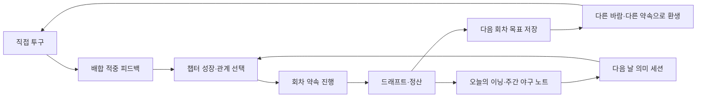

# 재미·장기 플레이 개선 구현 계획

| 항목 | 값 |
|---|---|
| 문서 ID | DOC-GAMEPLAY-RETENTION-2026-08 |
| 상태 | **구현 가능(Ready for implementation)** |
| 기준일 | 2026-08-09 |
| 대상 | iOS 17+ / `apps/ios` + `packages/simulation-core` |
| 목표 | 첫 재미를 해치지 않고 회차별 전략 다양성, 다음 회차 동기, 다음 날 복귀 이유를 강화한다. |
| 분석 근거 | `artifacts/analysis/amplitude-2026-08-09/amplitude_growth_analysis.ipynb` |
| 선행 문서 | `docs/IOS_GAMEPLAY_DEPTH_PLAN.md`, `docs/IMPROVEMENT_TRACKER.md` |

이 문서는 AI 에이전트가 위에서 아래로 구현할 수 있는 작업 명세다. 한 번에 전부 구현하지 않는다. **웨이브 하나를 구현하고 테스트·계측 확인을 마친 뒤 다음 웨이브로 넘어간다.**

---

## 0. AI 에이전트 실행 규칙

### 0.1 반드시 지킬 것

1. 작업 시작 시 `git status --short`를 읽는다. 현재 워킹트리의 기존 변경은 사용자 작업이므로 되돌리거나 덮어쓰지 않는다.
2. 현재 코드를 사실의 원본으로 삼는다. 오래된 계획 문서의 미완료 체크박스를 코드 확인 없이 구현하지 않는다.
3. 게임 결과를 만드는 규칙은 가능하면 `packages/simulation-core`에 둔다. SwiftUI 뷰에서 결과·보상·확률을 임의 계산하지 않는다.
4. 같은 시드와 같은 입력은 같은 결과를 내야 한다. 신규 무작위 선택은 `SplitMix64`와 안정 해시를 사용하고 시스템 시간·`random()`에 의존하지 않는다.
5. 새 저장 필드는 옵셔널 또는 명시적 기본값으로 추가한다. 기존 배포 저장본이 디코드되지 않는 변경은 금지한다.
6. `HighSchoolCareerSnapshot`·`ProCareerSnapshot`에 필드를 추가하면 생성자, 수기 `==`, `replacing(...)`, 디코딩, 저장 왕복 테스트를 함께 수정한다.
7. 기존 상태 커밋 해시에 새 필드를 즉시 넣지 않는다. 해시 포함이 필요하면 구버전 저장본 마이그레이션과 버전 분기를 먼저 만든다.
8. 실제 구단·리그·선수·로고·슬로건을 직접 사용하지 않는다. 새 학교·구단·대회·인물은 독자적인 가상 명칭만 쓴다.
9. 플레이 시간을 늘리기 위해 진행을 느리게 만들지 않는다. 에너지, 강제 대기, 출석 보상 압박, 연속 기록 소멸, 광고, 확률형 구매는 추가하지 않는다.
10. 숫자 보정은 화면에 이유가 보여야 한다. 숨은 보너스보다 선택 → 결과 → 설명의 연결을 우선한다.
11. 새 파일을 추가했다면 `apps/ios/project.yml`을 원본으로 Xcode 프로젝트를 갱신하고 생성 결과 diff를 확인한다.
12. 각 웨이브 완료 후 아래 공통 검증을 수행한다.

```sh
npm run check:copy
npm run check:design-system
npm run check:balance
swift test --package-path packages/simulation-core
cd apps/ios
xcodegen generate
xcodebuild test \
  -project Baseball.xcodeproj \
  -scheme BaseballIOS \
  -destination 'platform=iOS Simulator,name=iPhone 17 Pro' \
  -only-testing:BaseballIOSTests
```

시뮬레이터 이름이 로컬에 없으면 `xcrun simctl list devices available`로 현재 사용 가능한 iPhone을 골라 명령만 바꾼다.

### 0.2 중단하고 원인을 먼저 해결할 조건

- 기존 골든 시드 결과가 의도 설명 없이 바뀐다.
- 구저장본 디코딩 또는 재개 테스트가 실패한다.
- 첫 중요 경기까지 필요한 탭 수가 늘어난다.
- 신규 시스템이 같은 선택을 반복시키기만 하고 전략을 만들지 못한다.
- 신규 보상이 기존 야구혼 경제를 무의미하게 만든다.
- `check:copy`, 결정론 테스트, 밸런스 밴드 중 하나라도 실패한다.

---

## 1. 문제 정의와 성공 기준

### 1.1 관측된 행동

| 구간/지표 | 관측값 | 해석 | 신뢰도 |
|---|---:|---|---|
| 온보딩 시작 → 첫 투구 | 57 → 53, **93.0%** | 첫 손맛까지의 진입은 강하다. | 중간 |
| 첫 투구 → 첫 중요 경기 완료 | 53 → 43, **81.1%** | 코어 투구 루프도 충분히 작동한다. | 중간 |
| 드래프트 → 다음 회차 시작 | 42 → 27, **64.3%** | 첫 회차 결말 뒤 다음 목표가 약하다. | 중간 |
| 사용자당 경기 완료 | 약 **10.6회** | 첫날 콘텐츠 소비 깊이는 높다. | 낮음~중간 |
| 오늘의 이닝 진입 | 약 **7%** | 재방문 모드가 아직 주 루프와 연결되지 않았다. | 낮음 |
| 회차 카드 공유 이벤트 | 약 **5%** | 바이럴 소재 사용이 낮고 완료 측정도 부정확하다. | 낮음 |
| D2 | **0% 관측** | 방향은 나쁘지만 표본·식별자 오염 때문에 절대값으로 쓰지 않는다. | 낮음 |

Amplitude 활성 사용자와 App Store 정식 판매 수가 맞지 않고 이벤트 중복도 있다. 따라서 위 수치는 **개선 방향을 고르는 근거**로만 쓰며, 성공 판정은 웨이브 0 이후의 정식 배포 코호트로 다시 한다.

### 1.2 제품 가설

현재 문제는 “게임이 재미없어서 첫 경기를 못 끝낸다”가 아니다. 사용자는 첫날 한 회차를 빠르게 소비하지만 다음 세션에 해결할 질문이 남지 않는다.

개선 방향은 세 가지다.

1. **한 구의 재미:** 추천을 따르는 것에서 끝나지 않고, 내가 만든 배합이 왜 통했는지 알게 한다.
2. **한 회차의 다양성:** 회차마다 다른 규칙과 약속 때문에 같은 3년이 다른 전략으로 흐르게 한다.
3. **다음 세션의 약속:** 회차가 끝나는 순간 다음 목표를 남기고, 일일·주간 목표가 본편과 연결되게 한다.

### 1.3 잠정 KPI

웨이브 0 이후 `distribution = app_store`, `environment = production`, `app_version >= 1.0.2` 코호트만 사용한다.

| 지표 | 정의 | 잠정 목표 | 가드레일 |
|---|---|---:|---:|
| 첫 경기 활성화 | `activation_first_game / first_pitch` 고유 사용자 | **≥ 75%** | 현재보다 5%p 이상 하락하면 출시 중단 |
| 다음 회차 전환 | `rebirth_started / draft_resolved` 순서형 고유 사용자 | **≥ 75%** | 프로 진입자는 이탈에서 제외 |
| D1 의미 세션 | 첫 중요 경기 완료 다음 날 `game_finished` 재발생(일일 모드는 `mode = daily`) | **≥ 20%** | 단순 앱 열기는 성공으로 세지 않음 |
| D7 의미 세션 | 첫 중요 경기 완료 7일 뒤 의미 행동 | **≥ 8%** | 표본 100명 미만이면 방향만 판단 |
| 일일 모드 진입 | `daily_inning_opened / DAU` | **≥ 20%** | 본편 완료율 하락 금지 |
| 약속 선택률 | `run_pledge_selected / phase_entered(phase = school_selection)` | **≥ 55%** | 건너뛰기 선택도 정상 선택으로 유지 |
| 약속 재도전률 | 약속 실패 후 다음 회차에서 추천 약속 선택 | **≥ 25%** | 실패 벌점으로 강제하지 않음 |
| 공유 완료율 | `life_card_share_completed / draft_resolved` | **≥ 8%** | 시트 열기와 완료를 분리 |

목표치는 초기 학습값이다. 표본이 200명 이상 쌓이면 실제 분포로 다시 정한다.

---

## 2. 현재 구현된 기준선 — 다시 만들지 말 것

다음 기능은 현재 워킹트리에 존재한다. 새 작업은 이 기능을 확장해야 하며 별도 대체 시스템을 만들지 않는다.

- 오늘의 이닝: 날짜 시드, 하루 3회, 개인 최고 기록, Game Center 일일 순위.
- `DailyStreak`: 연속 기록과 “오늘 아직” 상태.
- `DailyReminder`: 첫 중요 경기 이후 옵트인, 3일치 비반복 예약, 딥 링크 복귀.
- 정산 화면과 설정 화면의 같은 설정 빠른 환생.
- 회차 약속 4종과 성공 시 야구혼 보너스.
- `CareerWind`: 회차별 세계 조건 4종과 평온한 회차 가중치.
- 회차 아카이브, 통산 기록, 별명 도감, 연대기, 기억 카드, 야구혼 상점.
- 프로 시즌 구간, 시즌 긴장 3종, 중요 경기 트리거, 가상 라이벌.
- 업적과 Game Center 리더보드.
- 안정 익명 사용자 ID와 기본 퍼널 이벤트.
- 긍정적 순간에 제한적으로 요청하는 평점 흐름.

특히 빠른 환생과 일일 이닝 노출을 또 구현하지 않는다. 이번 계획은 그 입구를 **더 선택할 이유가 있는 콘텐츠**와 연결한다.

---

## 3. 목표 플레이 루프



핵심은 플레이 시간을 강제로 늘리는 것이 아니라 **다음에 시험할 전략과 아직 끝나지 않은 목표를 남기는 것**이다.

---

## 4. 구현 순서

| 순서 | 웨이브 | 목적 | 예상 규모 | 다음 단계 진입 조건 |
|---:|---|---|---:|---|
| 0 | 계측 정리 | 정식 사용자와 실제 행동을 구분한다. | 1~2일 | 이벤트 중복·환경 혼입 검사 통과 |
| 1 | 회차 약속 2.0 | 회차마다 분명한 목표와 다음 회차 재도전 이유를 만든다. | 3~4일 | 기존 4개 약속 호환·12개 목표 테스트 통과 |
| 2 | 회차의 바람 2.0 | 같은 성장 경로가 매번 다른 판단을 요구하게 한다. | 4~6일 | 구저장본 결과 불변·신규 바람 밸런스 통과 |
| 3 | 배합 숙련 피드백 | 투구 선택에 이해 가능한 기술 표현을 추가한다. | 4~6일 | 투구 확률 무변경·복구 전후 결과 동일 |
| 4 | 주간 야구 노트 | 일일 모드와 본편을 주간 목표로 연결한다. | 4~5일 | 보상 중복 방지·시간대 테스트 통과 |
| 5 | 프로 주간 결정 | 프로 반복 구간에 3주 단위 갈림길을 만든다. | 5~7일 | 프로 진입·3주차 도달 데이터가 충분할 때만 착수 |

웨이브 1~3은 재미 개선의 본체다. 웨이브 4는 재방문 장치이며, 웨이브 5는 실제 프로 진입 데이터가 확인된 뒤 진행한다.

---

## 5. 웨이브 0 — 계측 정리

### 목표

신규 기능이 재미와 복귀를 실제로 개선했는지 정식 배포 코호트에서 판단할 수 있게 한다.

### 5.1 공통 이벤트 속성

`apps/ios/Sources/GameAnalytics.swift`에 모든 이벤트가 자동으로 합치는 `AnalyticsContext`를 추가한다.

필수 속성:

| 속성 | 예시 | 규칙 |
|---|---|---|
| `app_version` | `1.0.2` | `CFBundleShortVersionString` |
| `build` | `42` | `CFBundleVersion` |
| `distribution` | `debug`, `testflight`, `app_store` | 디버그 빌드와 샌드박스 영수증을 분리 |
| `environment` | `development`, `production` | Release라고 무조건 production으로 보지 않음 |
| `platform` | `ios` | 상수 |

이름, 자유 입력 텍스트, 시드 원문, 고카디널리티 `careerID`는 분석 속성으로 보내지 않는다.

`GameAnalytics.log`는 호출자가 넘긴 속성보다 공통 속성을 우선하지 않는다. 키 충돌 시 assertion을 발생시키거나 공통 속성으로 덮어써 환경 위조를 막는다.

### 5.2 이벤트 의미 수정

| 이벤트 | 구현 |
|---|---|
| `game_finished` | 고교·프로·일일 모두 `mode`, `life_number`, `result`를 같은 키로 전송한다. 없는 값은 생략한다. 웨이브 3에서 `sequence_mastery_count`를 추가한다. |
| `life_card_share_tapped` | 공유 UI를 연 시점. 기존 `life_card_shared`의 실제 의미를 이 이벤트로 옮긴다. |
| `life_card_share_completed` | 시스템 공유 완료 콜백이 성공이고 취소가 아닐 때만 전송한다. |
| `run_pledge_selected` | `pledge_id`, `tier`, `life_number`, `recommended`를 전송한다. |
| `run_pledge_resolved` | `pledge_id`, `achieved`, `progress_ratio`, `reward_permille`을 전송한다. |
| `career_wind_seen` | 회차 시작 카드가 실제 노출된 최초 1회. `wind_id`, `rules_version`. |
| `next_run_intent_saved` | 다음 회차 목표 저장. `pledge_id`, `source_life_number`. |
| `next_run_intent_applied` | 저장 목표를 다음 회차에서 선택. |
| `weekly_program_opened` | `week_key`, `source`. |
| `weekly_program_completed` | 2개 이상 목표 완료 및 보상 확정. |

`ShareLink`는 완료 여부를 제공하지 않으므로 `LifeCardShareButton`과 `LifeShareButton`은 공통 `UIActivityViewController` 래퍼를 사용한다. `completionWithItemsHandler`의 `completed == true`일 때만 완료 이벤트를 기록한다. 기존 공유 미리보기와 접근성 라벨은 유지한다.

### 5.3 파일

- 수정: `apps/ios/Sources/GameAnalytics.swift`
- 수정: `apps/ios/Sources/LifeCardView.swift`
- 수정: `apps/ios/Sources/LifeArchiveView.swift`
- 신규 권장: `apps/ios/Sources/ShareSheet.swift`
- 신규: `apps/ios/Tests/AnalyticsContextTests.swift`
- 신규: `apps/ios/Tests/ShareCompletionTests.swift`
- 문서: `docs/ANALYTICS_TRACKING_PLAN.md`에 이벤트 정의·소유자·필수 속성 추가

### 5.4 수용 기준

- Debug, TestFlight, App Store 판별을 순수 함수 테스트로 검증한다.
- UI 테스트 실행 시 분석 SDK가 켜지지 않는다.
- 모든 `game_finished` 호출에 `mode`가 있다.
- 공유 취소는 완료 이벤트를 만들지 않는다.
- 기존 `life_card_shared`는 대시보드 호환을 위해 한 버전 동안 탭 이벤트와 함께 전송할 수 있으나, 문서에 폐기 예정으로 표시한다.
- Amplitude에서 정식 배포 전용 코호트를 만들 수 있다.

---

## 6. 웨이브 1 — 회차 약속 2.0과 다음 회차 목표

### 목표

한 회차가 “또 같은 3년”이 아니라 스스로 고른 도전이 되게 하고, 실패한 목표가 다음 회차의 즉시 재도전 이유가 되게 한다.

### 6.1 데이터 모델

현재 `RunPledge`의 단일 `bonusPermille`을 약속별 보상으로 바꾼다.

```swift
enum RunPledgeTier: String, Codable {
    case safe, bold, legendary
}

struct RunPledgeProgress: Equatable {
    let current: Int
    let target: Int
    let achieved: Bool
    let line: String
}

struct RunPledgeContext {
    let state: HighSchoolCareerSnapshot
    let rivalLedger: HighSchoolCareerStore.RivalLedger
}

struct RunPledge {
    let id: String
    let tier: RunPledgeTier
    let title: String
    let detail: String
    let rewardPermille: Int
    let eligibility: (HighSchoolCareerSnapshot) -> Bool
    let progress: (RunPledgeContext) -> RunPledgeProgress
}
```

클로저를 포함한 `RunPledge` 자체를 저장하지 않는다. 기존처럼 안정적인 `id`만 저장한다.

보상 기준:

- `safe`: +10%
- `bold`: +20%
- `legendary`: +35%

실패해도 이미 번 야구혼을 빼앗지 않는다. 실패의 비용은 추가 보상을 놓치는 것과 미완 기록이 남는 것뿐이다.

### 6.2 초기 약속 풀

기존 네 ID는 삭제하거나 의미를 바꾸지 않는다. 기존 진행 중 저장본이 같은 약속으로 정산돼야 한다.

| ID | 표시명 | 등급 | 완료 조건 |
|---|---|---|---|
| `get_drafted` | 이름이 불린다 | safe | 드래프트 지명 |
| `strikeout_master` | 시즌 40탈삼진 | bold | 직접 등판 통산 40K 이상 |
| `clean_games` | 무실점 등판 2회 | bold | 직접 등판 무실점 2회 이상 |
| `iron_control` | 볼넷 8개 이하 | bold | 직접 등판 4경기 이상, 볼넷 8개 이하 |
| `healthy_finish` | 팔을 지켜 완주 | safe | 중요 경기 4회 이상, 마지막 팔 위험이 경고 미만, 재활 중 아님 |
| `awakening_three` | 세 번의 각성 | bold | 각성 3개 선택 |
| `fan_sixty` | 관중의 이름이 된다 | bold | 팬 관심 60 이상 |
| `evaluation_sixty_five` | 평가 65점 | bold | 드래프트 평가 65 이상 |
| `evaluation_seventy_five` | 평가 75점 | legendary | 드래프트 평가 75 이상 |
| `iron_control_five` | 볼넷 5개 이하 | legendary | 직접 등판 4경기 이상, 볼넷 5개 이하 |
| `rival_three_strikeouts` | 숙적에게 세 번 앞선다 | bold | 회차 내 숙적 상대 삼진 3개 이상 |
| `relationship_sixty_five` | 한 사람의 전적인 믿음 | safe | 감독·포수·숙적 중 한 관계 65 이상 |

조건 숫자는 최초값이다. `check-balance` 1,000회차 배치에서 각 약속의 자연 달성률을 측정하고 아래 범위로 조정한다.

- safe: 45~70%
- bold: 20~45%
- legendary: 5~20%

달성률을 맞추기 위해 보상을 올리기보다 조건을 조정한다.

### 6.3 제안 규칙

`RunPledge.options(careerID:state:intent:)`는 정확히 세 개를 반환한다.

1. 저장된 `NextRunIntent`가 있고 현재 회차에서 유효하면 첫 칸에 고정한다.
2. 나머지는 safe 1개, build-aligned 1개, stretch 1개가 되게 구성한다.
3. 1회차에는 legendary를 제안하지 않는다.
4. 현재 프리셋의 강점과 전혀 무관한 목표만 세 개 나오지 않게 한다.
5. 같은 `careerID`·상태·intent는 항상 같은 순서를 반환한다.

`build-aligned` 예시:

- 제구가 가장 높으면 볼넷 목표의 가중치를 높인다.
- 구위·변화구가 높으면 탈삼진 목표의 가중치를 높인다.
- 관계 수치가 높으면 관계 목표를 제안한다.
- 팔 위험이 이미 높으면 건강 목표를 제안하되 legendary 목표와 함께 강요하지 않는다.

### 6.4 다음 회차 목표

`HighSchoolCareerStore.SaveRecord`에 아래 옵셔널 필드를 추가한다.

```swift
struct NextRunIntent: Codable, Equatable {
    let pledgeID: String
    let sourceLifeNumber: Int
    let reason: String
}
```

동작:

1. 회차 정산에서 실패 또는 아슬아슬하게 놓친 약속이 있으면 “다음 회차에서 다시” 카드를 보여 준다.
2. 약속이 없었거나 이미 달성했다면 아카이브의 미달성 목표에서 하나를 추천한다.
3. 사용자가 `다음 회차 목표로 저장`을 누르면 `NextRunIntent`를 저장한다.
4. 다음 회차의 `PledgeCard`에서 이 목표를 첫 칸에 `지난 회차에서 이어짐`으로 표시한다.
5. 사용자가 해당 목표를 선택하면 intent를 소비한다. 다른 목표를 고르거나 `약속 없이 간다`를 택하면 intent를 명시적으로 폐기한다.
6. 빠른 환생 흐름 자체는 바꾸지 않는다.

추천은 선택을 대신하지 않는다. 자동 선택 금지.

### 6.5 UI

- `PledgeCard`: 등급, 보상, 현재 빌드와 맞는 이유를 한 줄로 보여 준다.
- 커리어 상단 약속 행: `현재/목표`와 퍼센트 진행을 함께 표시한다.
- `RunRecapView`: 달성, 미달, 아슬아슬함을 구분하고 숫자를 남긴다.
- `LifeRecord`: `pledgeID`, `pledgeAchieved`, `pledgeProgressCurrent`, `pledgeProgressTarget`을 모두 옵셔널로 추가해 아카이브에서 지난 약속을 볼 수 있게 한다.
- 접근성 문장은 “전설 약속, 평가 75점, 현재 68점, 보상 야구혼 35퍼센트 추가”처럼 한 번에 읽힌다.

### 6.6 파일

- 수정: `apps/ios/Sources/RunPledge.swift`
- 수정: `apps/ios/Sources/HighSchoolCareerStore.swift`
- 수정: `apps/ios/Sources/HighSchoolCareerView.swift`
- 수정: `apps/ios/Sources/RunRecapView.swift`
- 수정: `apps/ios/Sources/LifeArchiveView.swift`
- 신규: `apps/ios/Tests/RunPledgeTests.swift`
- 수정: `apps/ios/Tests/RetentionHookTests.swift`

### 6.7 수용 기준

- 기존 네 약속 ID로 저장된 진행을 정상 복원·정산한다.
- 1,000개 `careerID`에서 옵션이 정확히 3개이고 중복이 없다.
- 1회차에는 legendary가 나오지 않는다.
- 같은 입력의 옵션·진행·보상이 항상 같다.
- 실패 시 야구혼 잔액이 줄지 않는다.
- 다음 회차 목표는 선택 전까지 유지되고 선택·폐기 후에는 다시 나타나지 않는다.
- 약속을 건너뛰어도 첫 중요 경기까지의 탭 수는 기존과 같다.

---

## 7. 웨이브 2 — 회차의 바람 2.0

### 목표

능력치 숫자만 달라지는 환생이 아니라, 회차마다 어떤 판단이 좋은지 달라지는 판을 만든다.

### 7.1 호환 버전

현재 `CareerWind.wind(careerID:)`는 배열 인덱스로 바람을 고른다. 배열에 항목을 추가하면 기존 `careerID`의 바람이 바뀐다. 이를 그대로 확장하면 진행 중 회차의 규칙이 업데이트 후 달라진다.

먼저 버전을 분리한다.

```swift
enum CareerRulesVersion: Int, Codable {
    case v1 = 1
    case v2 = 2
}
```

- `HighSchoolCareerSnapshot`에 `worldRulesVersion: Int?`를 추가한다.
- nil인 구저장본은 v1로 읽고 현재 5개 배열 선택을 그대로 사용한다.
- 신규 회차만 v2를 기록한다.
- 바람 선택은 해시 버킷 범위를 명시해 콘텐츠 배열 순서 변경에 영향받지 않게 한다.
- 기존 v1 시드 골든 결과는 한 글자도 바뀌면 안 된다.

### 7.2 규칙 모델

바람 하나는 최대 한 개의 이점과 한 개의 부담만 가진다.

```swift
public struct CareerWindRules: Codable, Equatable, Sendable {
    public let favoredTraining: TrainingFocus?
    public let favoredTrainingBonus: Int
    public let trainingFatigueDelta: Int
    public let extraFatigueFocus: TrainingFocus?
    public let extraFatigueDelta: Int
    public let recoveryBonus: Int
    public let favoredRelationship: RelationshipTarget?
    public let favoredRelationshipBonus: Int
    public let relationshipLossPenalty: Int
    public let fanInterestGainBonus: Int
    public let draftEvaluationDelta: Int
}
```

기존 `rivalBonus`, `startingFanInterest`, `rewardBonusPermille`은 유지한다. 모든 효과는 `CareerWindRules` 또는 `CareerRules` 한 곳에서 계산하고 엔진 여러 함수에 문자열 ID switch를 흩뿌리지 않는다.

### 7.3 v2 초기 바람 풀

최초 배포는 평온한 회차를 포함해 10종으로 제한한다. 아래 수치는 시작값이며 배치 결과로 조정한다.

| ID | 이름 | 이점 | 부담 | 야구혼 보정 |
|---|---|---|---|---:|
| `calm` | 바람 없는 해 | 없음 | 없음 | 0% |
| `monster_generation` | 괴물 세대 | 팬 관심 +5 | 숙적 능력 +5 | +15% |
| `scout_frenzy` | 스카우트 풍년 | 시작 팬 관심 20, 평가 +2 | 없음 | 0% |
| `quiet_season` | 무명의 해 | 숙적 능력 -3 | 시작 팬 관심 0 | +8% |
| `heatwave` | 긴 여름 | 회복 효과 +4 | 훈련 피로 +2 | +12% |
| `command_year` | 코스의 해 | 제구 훈련 성장 +1 | 구위 훈련 피로 +1 | +5% |
| `power_year` | 강한 공의 해 | 구위 훈련 성장 +1 | 숙적 능력 +3 | +10% |
| `battery_year` | 배터리의 해 | 포수 관계 신뢰 변화 +2 | 시작 팬 관심 -3 | +5% |
| `spotlight_year` | 조명의 해 | 팬 관심 변화 +3 | 관계 실패 시 신뢰 손실 -2 추가 | +8% |
| `underdog_year` | 언더독의 해 | 드래프트 평가 +2 | 시작 팬 관심 0, 숙적 능력 +2 | +12% |

바람 이름과 설명은 특정 실존 시즌·제도·구단을 연상시키는 고유 표현을 쓰지 않는다.

### 7.4 UI 규칙

- 프롤로그에서 바람 카드를 한 번 크게 보여 준다.
- 이후 헤더에는 이름만 작은 칩으로 남기고 탭하면 효과 설명을 펼친다.
- 선택 화면에는 보정된 결과만 보여 주지 말고 “긴 여름: 이 훈련은 평소보다 피로 +2”처럼 원인을 붙인다.
- 드래프트 정산에 바람의 평가 보정과 야구혼 보정을 별도 항목으로 표시한다.
- 회차 카드와 아카이브에 `windID`, `windTitle`을 옵셔널로 남긴다.

### 7.5 파일

- 수정: `packages/simulation-core/Sources/SimulationCore/CareerWind.swift`
- 수정: `packages/simulation-core/Sources/SimulationCore/HighSchoolCareer.swift`
- 수정: `apps/ios/Sources/HighSchoolCareerView.swift`
- 수정: `apps/ios/Sources/HighSchoolCareerStore.swift`
- 수정: `apps/ios/Sources/LifeCardView.swift`
- 수정: `apps/ios/Sources/LifeArchiveView.swift`
- 신규: `packages/simulation-core/Tests/SimulationCoreTests/CareerWindTests.swift`

### 7.6 수용 기준

- 구저장본과 v1 골든 시드는 업데이트 전과 같은 바람·결과를 낸다.
- v2 같은 `careerID`는 항상 같은 바람을 낸다.
- 10,000개 신규 회차에서 `calm`은 25~35%, 나머지 각 바람은 5% 이상 나온다.
- 바람 설명과 실제 숫자 변화가 일치한다.
- 어떤 바람도 평균 드래프트 성공률을 전체 기준선 대비 ±12%p 이상 움직이지 않는다.
- 어떤 바람도 첫 회차에 사실상 실패가 확정되는 조합을 만들지 않는다.
- `check-balance`를 통과한다.

---

## 8. 웨이브 3 — 배합 숙련 피드백

### 목표

플레이어가 포수 추천을 그대로 누르는 것보다 타자·카운트·이전 공을 읽고 선택했을 때 더 재미있는 설명과 커리어 반응을 얻는다.

첫 버전에서는 투구 성공 확률을 바꾸지 않는다. 기존 커널 결과 위에 **전략을 인식하고 이름 붙이는 계층**을 추가한다. 이 방식으로 밸런스와 결정론을 보존하면서 기술 표현을 먼저 검증한다.

### 8.1 인식할 배합

`PitchSequenceEvaluator`는 최근 최대 3구, 현재 카운트, 실제 결과, 상대 벤치 적응 상태를 입력으로 받는다.

| 태그 | 조건의 방향 | 표시 예시 |
|---|---|---|
| `speed_ladder` | 직전 공과 예상 구속 차가 충분하고 타이밍을 무너뜨림 | `속도차 적중 · 14km/h` |
| `eye_level_change` | 높은 존과 낮은 존을 연속 사용하고 헛스윙·약한 타구 유도 | `눈높이를 바꿨다` |
| `inside_outside` | 몸쪽과 바깥쪽을 연속으로 갈라 결과 획득 | `가로 폭을 썼다` |
| `expand_after_two_strikes` | 2스트라이크 이후 존 밖 유인구로 헛스윙 삼진 | `결정구 유인 성공` |
| `steal_strike` | 타자 우세 카운트에서 스트라이크 의도 공으로 카운트 회복 | `카운트를 되찾았다` |
| `counter_read` | 반복 경고가 나온 뒤 구종·코스를 바꿔 좋은 결과 | `읽힘을 역이용했다` |

태그 조건은 결과가 좋은 경우에만 축하한다. 나쁜 선택을 조롱하거나 정답을 강제하지 않는다.

### 8.2 모델

신규 코어 파일:

```swift
enum PitchSequenceTag: String, Codable, CaseIterable { ... }

struct PitchSequencePitch: Codable, Equatable {
    let pitchType: PitchType
    let zone: PitchZone
    let intent: ZoneIntent
    let expectedVelocityKPH: Int
    let outcome: PitchOutcome
}

struct PitchSequenceMoment: Codable, Equatable {
    let pitchNumber: Int
    let tag: PitchSequenceTag
    let headline: String
    let detail: String
}

enum PitchSequenceEvaluator {
    static func evaluate(
        recent: [PitchSequencePitch],
        context: PlateAppearanceContext,
        current: PitchSequencePitch,
        rivalMemory: RivalMemorySnapshot?
    ) -> PitchSequenceMoment?
}
```

평가 함수는 순수 함수로 만들고 RNG를 사용하지 않는다.

`PitchSession`에 다음 상태를 추가한다.

- `private(set) var sequenceMoments: [PitchSequenceMoment]`
- `private(set) var lastSequenceMoment: PitchSequenceMoment?`
- `var sequenceMasteryCount: Int`

복구 스냅샷에는 `sequenceMoments`를 옵셔널로 추가한다. 구스냅샷은 빈 목록으로 읽는다.

`ImportantInningReport`에 `sequenceMasteryCount: Int?`를 추가한다. 고교·프로 정산은 최대 3점까지만 감독/포수 신뢰에 반영한다. 투구 결과 확률에는 반영하지 않는다.

### 8.3 UI

- 투구 결과가 나타난 뒤 최대 1개의 숙련 배지를 보여 준다.
- 배지는 결과 문구를 가리지 않으며 모션 감소 시 페이드만 사용한다.
- 이닝 정산에 `배합 적중 N회`와 태그 목록을 한 줄로 보여 준다.
- 투구 기록에서 해당 공에 작은 태그를 붙인다.
- 첫 발동 때만 짧은 설명을 제공하고 이후에는 축약한다.
- VoiceOver는 결과 → 배합 이유 순서로 읽는다.

### 8.4 계측

투구마다 분석 이벤트를 보내지 않는다. `game_finished`에 아래 집계 속성만 추가한다.

- `sequence_mastery_count`
- `sequence_tags` — 정렬된 고유 ID를 쉼표로 연결, 최대 6개
- `recommendation_acceptance_rate`

### 8.5 파일

- 신규: `packages/simulation-core/Sources/SimulationCore/PitchSequenceEvaluator.swift`
- 수정: `apps/ios/Sources/PitchSession.swift`
- 수정: `apps/ios/Sources/PitchView.swift`
- 수정: `apps/ios/Sources/PitchDramaView.swift`
- 수정: `packages/simulation-core/Sources/SimulationCore/ProCareer.swift`
- 수정: `packages/simulation-core/Sources/SimulationCore/PitcherLab.swift` (`ImportantInningReport`)
- 신규: `packages/simulation-core/Tests/SimulationCoreTests/PitchSequenceEvaluatorTests.swift`
- 수정: `apps/ios/Tests/PitchSessionTests.swift`
- 수정: `apps/ios/Tests/PitchDramaRenderTests.swift`

### 8.6 수용 기준

- 같은 입력은 같은 태그를 만든다.
- 같은 구종·같은 코스 반복은 속도차·가로 폭 태그를 만들지 않는다.
- 결과 확률과 기존 골든 이벤트 해시는 바뀌지 않는다.
- 한 투구에 배지는 최대 하나다.
- 중단 후 복구해도 발동 수와 정산이 같다.
- 자동 추천만 계속 따른 세션보다 의도적으로 배합을 바꾼 테스트 세션의 숙련 발동이 많다.
- 숙련 보상은 경기당 신뢰 +3을 넘지 않는다.

---

## 9. 웨이브 4 — 주간 야구 노트

### 목표

오늘의 이닝을 고립된 미니게임이 아니라 본편·환생·기록 수집으로 이어지는 일주일짜리 목표판으로 만든다.

연속 접속을 강제하지 않는다. 한 주에 3개 목표 중 2개만 달성하면 완료다.

### 9.1 데이터 모델

```swift
struct WeeklyProgram: Codable, Equatable {
    let weekKey: String          // ISO week, 예: 2026-W32
    let tasks: [WeeklyTask]
    var completedTaskIDs: Set<String>
    var claimed: Bool
}

struct WeeklyTask: Codable, Equatable, Identifiable {
    let id: String
    let kind: WeeklyTaskKind
    let target: Int
    var progress: Int
}
```

`WeeklyProgramStore`는 KST가 아니라 사용자의 현재 Calendar로 ISO 주 키를 만든다. 날짜 변경 테스트에서는 타임존과 일광절약시간 경계를 주입 가능한 `Calendar`와 `Date`로 검증한다.

기기 시계·타임존 변경으로 지난 주 보상을 다시 받지 못하게 `lastObservedWeekStart`를 함께 저장한다. 새로 계산한 주 시작이 저장값보다 과거면 기존 프로그램을 유지한다. 서버 권위 시간은 도입하지 않되, 로컬에서 가능한 보상 되감기는 막는다.

목표 후보:

- 오늘의 이닝 1회 완료
- 본편 중요 경기 2회 완료
- 챕터 2개 전진
- 다음 회차 1회 시작
- 회차 약속 하나 선택
- 지난 회차와 다른 학교 선택
- 배합 숙련 3회 발동
- 프로 주간 진행 3회 — 프로 커리어가 있는 사용자에게만

불가능한 목표는 제안하지 않는다. 프로 잠금 사용자에게 프로 목표를 주지 않고, 첫 중요 경기 전 사용자에게 환생 목표를 주지 않는다.

### 9.2 보상

- 3개 중 2개 달성 시 `주간 기록 도장` 1개와 야구혼 25를 한 번 지급한다.
- 3개 전부 달성은 별도 경제 보상 없이 도장에 `완주` 테두리만 붙인다.
- 보상 ID는 `weekly-<weekKey>`로 고정하고 `HighSchoolCareerStore`가 이미 지급한 외부 보상 ID를 옵셔널 Set으로 저장해 이중 지급을 막는다.
- 주가 바뀌어도 완료한 도장은 아카이브에 남는다.
- 미완료 주는 벌점 없이 조용히 끝난다.

야구혼 25는 최초값이다. 4주 경제 시뮬레이션에서 주간 보상이 전체 획득 야구혼의 20%를 넘으면 15로 낮춘다.

### 9.3 UI

- 새 탭을 만들지 않는다.
- `DailyInningEntryRow` 아래에 `이번 주 야구 노트 · 1/3` 한 줄을 추가한다.
- 기록 탭에 주간 노트 상세와 과거 도장 목록을 둔다.
- 완료 가능한 항목이 하나 남았으면 어떤 행동인지 직접 말한다.
- 자정·주간 갱신 팝업으로 플레이를 끊지 않는다. 다음 화면 진입 때 조용히 갱신한다.

### 9.4 파일

- 신규: `apps/ios/Sources/WeeklyProgram.swift`
- 신규: `apps/ios/Sources/WeeklyProgramStore.swift`
- 신규: `apps/ios/Sources/WeeklyProgramView.swift`
- 수정: `apps/ios/Sources/DailyInningView.swift`
- 수정: `apps/ios/Sources/HighSchoolCareerStore.swift`
- 수정: `apps/ios/Sources/HighSchoolCareerView.swift`
- 수정: `apps/ios/Sources/RecordView.swift`
- 수정: `apps/ios/Sources/AppShell.swift`
- 신규: `apps/ios/Tests/WeeklyProgramTests.swift`

### 9.5 수용 기준

- 같은 사용자·같은 주·같은 자격 상태는 같은 목표를 받는다.
- 앱 재시작·기기 동기화 후 진행과 수령 상태가 유지된다.
- 주간 보상은 정확히 한 번만 지급된다.
- 기기 시계를 과거로 돌리거나 타임존을 왕복해도 두 번째 보상을 만들지 않는다.
- 3개 중 2개만 완료해도 보상을 받는다.
- 미완료 또는 일주일 미접속에 손실이 없다.
- 첫 사용자에게 잠긴 모드 목표를 주지 않는다.
- 주 경계와 타임존 변경 테스트를 통과한다.

---

## 10. 웨이브 5 — 프로 3주 단위 결정

### 착수 조건

다음 조건을 모두 만족할 때만 구현한다.

- 정식 코호트에서 `pro_career_started / draft_resolved >= 40%`.
- 프로 진입자의 3주차 도달률을 측정할 수 있다.
- 3주차 도달 사용자의 이탈이 주간 계획 반복 구간에 집중된다.

조건을 만족하지 않으면 프로 콘텐츠보다 웨이브 1~4의 고교·환생 루프를 먼저 개선한다.

### 목표

24주의 `계획 선택 → 1주 진행` 반복에 세 주마다 결과가 남는 선택을 넣는다.

### 10.1 상태

- `ProCareerPhase`에 `seasonDecision`을 추가한다.
- `ProCareerSnapshot`에 `pendingDecision: ProSeasonDecision?`과 `decisionHistory: [ProDecisionRecord]?`를 옵셔널로 추가한다.
- 3, 6, 9, 12, 15, 18, 21주차에 중요 경기·부상·시즌 전환과 겹치지 않을 때만 결정 국면을 연다.
- 같은 시즌·주차·`proCareerID`는 같은 결정을 제안한다.

### 10.2 초기 결정 6종

각 결정은 세 선택지로 구성한다. 결과는 모두 즉시 숫자로 공개한다.

1. 추가 불펜: 구위/변화구 성장 기회 vs 피로 증가 vs 휴식.
2. 포수와 경기 계획: 포수 신뢰 증가 vs 감독 신뢰 중심 vs 독자 배합.
3. 역할 면담: 현재 역할 유지 vs 선발 도전 vs 구원 집중.
4. 기록 추격: 탈삼진 중심 훈련 vs 실점 억제 중심 vs 몸 관리.
5. 라이벌 분석: 약점 집중 vs 내 장점 유지 vs 다음 맞대결까지 보류.
6. 시즌 막바지: 무리해서 순위 경쟁 vs 회복 우선 vs 젊은 선수 지원.

첫 버전에서 계약·구단 이동·새 화폐를 추가하지 않는다. 기존 `managerTrust`, `catcherTrust`, `fatigue`, 성장, 역할 트리거만 사용한다.

### 10.3 UI와 수용 기준

- 한 화면에 선택지 3개, 효과와 비용을 모두 표시한다.
- 되돌릴 수 없는 선택이므로 확인 후 적용한다.
- `advanceSegment`는 결정 국면에서 반드시 멈춘다.
- 저장 후 재개하면 같은 결정 화면이 열린다.
- 자동 진행으로 결정을 건너뛸 수 없다.
- 시즌당 결정은 최대 7회다.
- 20개 완주 시드 회귀와 구저장본 왕복 테스트를 통과한다.

주요 파일:

- `packages/simulation-core/Sources/SimulationCore/ProCareer.swift`
- `apps/ios/Sources/MobileCareerStore.swift`
- `apps/ios/Sources/CareerFlowView.swift`
- `apps/ios/Sources/AppShell.swift`
- `packages/simulation-core/Tests/SimulationCoreTests/ProCareerEngineTests.swift`
- 신규 권장: `apps/ios/Tests/ProSeasonDecisionTests.swift`

---

## 11. 웨이브별 실험과 출시 판단

한 빌드에 웨이브 여러 개를 섞지 않는다. 어떤 변화가 지표를 움직였는지 알 수 없게 된다.

| 웨이브 | 1차 지표 | 2차 지표 | 출시 후 관찰 | 성공 판단 |
|---|---|---|---|---|
| 0 | 정식 코호트 식별률 | 이벤트 스키마 오류율 | 2일 | 정식 이벤트 100%, 필수 키 누락 0 |
| 1 | 약속 선택률 | 다음 회차 전환 | 7일 또는 200명 | 선택률 ≥55%, 다음 회차 +8%p |
| 2 | 2회차 시작률 | 3회차 시작률·바람별 완주율 | 14일 | 특정 바람 실패 쏠림 없이 3회차 증가 |
| 3 | 숙련 발동 사용자 비율 | 경기 완료·중단율 | 7일 | 발동 경험자 완료율 상승, 첫 경기 가드레일 유지 |
| 4 | 주간 노트 2/3 완료율 | D1·D7 의미 세션 | 14일 | 완료율 ≥25%, D1 +5%p |
| 5 | 프로 6주차 도달률 | 프로 의미 선택 수 | 14일 | 6주차 도달 +10%p, 자동 진행 사용률 급감 없음 |

표본이 부족하면 통계적 유의성을 가장하지 않는다. 최소한 노출 수, 사용자 수, 절대 전환, 변화폭을 함께 기록한다.

롤백 조건:

- 첫 경기 활성화가 5%p 이상 하락.
- 저장 실패·복구 실패가 1건이라도 재현됨.
- 특정 바람의 완주율이 전체보다 20%p 이상 낮음.
- 신규 목표 때문에 세션 중단율이 10%p 이상 상승.
- VoiceOver 또는 큰 글자에서 주요 선택이 불가능함.

---

## 12. 테스트 매트릭스

### 12.1 순수 로직

- 약속 12종의 경계값 바로 아래/이상.
- 약속 옵션 중복·자격·결정론.
- 다음 회차 목표 저장·소비·폐기.
- v1/v2 바람 선택과 효과 적용.
- 배합 태그별 양성·음성 케이스.
- 주간 키, 목표 생성, 보상 멱등성.
- 프로 결정 주차와 충돌 우선순위.

### 12.2 저장 호환

- 신규 필드가 하나도 없는 1.0.x fixture 디코딩.
- 신규 저장 → 인코딩 → 디코딩 값 동등성.
- 중요 경기 타석 경계 복구 후 배합 숙련 수 보존.
- 회차 사이 `result == nil` 상태에서 다음 목표·주간 보상 보존.
- 프로 결정 화면에서 종료 후 동일 화면 복원.

### 12.3 시뮬레이션

- 고교 1,000회차에서 약속 등급별 달성률.
- 신규 바람별 드래프트율, 평균 평가, 부상률, 야구혼 획득량.
- 기존 `check-balance` 전 밴드.
- 20개 프로 완주 시드에서 상태 막힘 없음.

### 12.4 UI

- 첫 회차: 오프닝 → 첫 투구 → 첫 중요 경기까지 기존 경로 유지.
- 약속 건너뛰기 가능.
- 다음 회차 목표가 추천으로만 동작하고 자동 선택되지 않음.
- 배합 배지가 결과·투구 버튼을 가리지 않음.
- 주간 노트가 새 탭을 만들지 않음.
- Dynamic Type 최대 크기와 VoiceOver로 모든 주요 선택 가능.
- Reduce Motion에서 전체 기능 사용 가능.

---

## 13. 완료 정의

각 웨이브는 다음을 모두 만족해야 완료다.

- [ ] 사용자에게 보이는 변화와 기대 효과가 한 문장으로 설명된다.
- [ ] 코어 로직과 UI 표현이 분리돼 있다.
- [ ] 결정론·저장 호환 테스트가 있다.
- [ ] 이벤트 이름과 속성이 `docs/ANALYTICS_TRACKING_PLAN.md`에 등록돼 있다.
- [ ] 접근성 식별자와 VoiceOver 문장이 있다.
- [ ] `npm run check:copy`로 실존 야구 IP와 금지 문구 미노출을 확인했다.
- [ ] `npm run check:design-system`과 `npm run check:balance`를 통과했다.
- [ ] Swift 코어 테스트와 iOS 단위 테스트를 통과했다.
- [ ] 기존 변경을 되돌리거나 무관한 파일을 포맷하지 않았다.
- [ ] 출시 노트에 기능, 계측, 롤백 기준을 기록했다.

---

## 14. 구현 시작 지점

첫 구현 세션은 웨이브 0만 수행한다.

1. `GameAnalytics.swift`에 공통 환경 속성을 추가한다.
2. `game_finished`의 모든 호출을 찾아 `mode` 스키마를 통일한다.
3. 공유 탭과 공유 완료를 분리한다.
4. 이벤트 정의 문서를 갱신한다.
5. 단위 테스트와 공통 검증을 통과시킨다.
6. 변경 파일·테스트 결과·남은 위험을 보고하고 멈춘다.

그 다음 구현 세션에서 웨이브 1을 시작한다. 데이터가 깨끗하지 않은 상태에서 웨이브 1~5를 한꺼번에 넣는 것은 금지한다.
