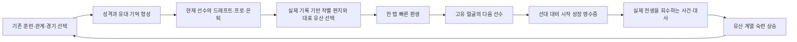

# 선수 애착·계보·환생 성장 최종 구현 계획

| 항목 | 값 |
|---|---|
| 문서 ID | `DOC-LINEAGE-ATTACHMENT-REBIRTH-FINAL-2026-08-13` |
| 상태 | **구현 준비 완료(Ready for implementation)** |
| 기준일 | 2026-08-13 |
| 대상 | `packages/simulation-core` + `apps/ios` |
| 제품 목표 | 사용자가 매 회차의 선수를 한 명의 사람처럼 기억하고, 그 선수가 남긴 구체적인 흔적으로 더 강한 다음 선수를 키우고 싶게 한다. |
| 구현 원칙 | 현재 선수의 삶 → 실제 기록에 근거한 작별 → 고유한 다음 선수 → 설명 가능한 계승 → 제한된 장기 숙련 |
| 범위 밖 | Android/Unity 동시 구현, 실시간 대기 보상, 애정도·배고픔 미터, 무한 능력치 누적, 실존 야구 IP |

이 문서는 AI 에이전트가 위에서 아래로 구현할 수 있는 최종 명세다. 과거 문서의 아이디어를 단순 합산하지 않는다. 충돌할 때는 이 문서와 현재 코드를 우선한다.

특히 다음 문서의 환생·애착 관련 제안을 부분적으로 대체한다.

- `docs/reviews/review-retention.md`의 실시간 다음 날 보상, 실패 페널티, 기억 카드 대체 제안
- `docs/GAMEPLAY_RETENTION_IMPLEMENTATION_PLAN_2026-08.md`의 빠른 환생 흐름 불변 전제
- `docs/RETENTION_BALANCE_REPORT_2026-08.md`의 대표 유산 1단계 고정 효과 이후 장기 목표 부재

과거 리뷰와 밸런스 근거는 삭제하지 않는다. 구현 완료 뒤 이 문서와 실제 결과가 다르면 코드에 맞춰 문서를 조용히 고치지 말고, 차이와 이유를 구현 근거 문서에 기록한다.

---

## 1. 최종 결론

현재 게임에는 애착 시스템의 재료가 이미 상당히 있다.

- 관계 선택이 성격을 만들고 성격 특성이 실제 투구에 발동한다.
- 선수는 부상·피로·드래프트·은퇴 국면에서 자기 목소리로 말한다.
- 한 생의 작별 편지, 대표 순간, 대표 유산, 이전 선수의 편지가 있다.
- 얼굴과 이름이 나열되는 회차 아카이브와 환생 전용 사건 12종이 있다.
- 실제 성장·경기·관계·프로 기록이 대표 유산 후보를 만든다.

따라서 새 `육아 게임`이나 거대한 가족 시뮬레이션을 얹는 것은 최선이 아니다. 현재 문제는 기능의 부재보다 **기존 기능 사이의 인과 연결이 끊겨 있다는 것**이다.

1. 빠른 환생은 같은 이름을 재사용하고 초상은 이름만으로 결정되어 세대가 복제처럼 보인다.
2. 감독·포수·숙적 이름과 성격은 저장되지만 다음 삶과 아카이브에서 충분히 회수되지 않는다.
3. 환생 사건은 직전 선수가 실제로 다쳤는지, 별명이 있었는지와 무관하게 고정 풀에서 나온다.
4. 신규 대표 유산 규칙은 기억 카드를 계승하지 않는데 상점은 여전히 `기억 확장`을 판매한다.
5. 자동 계승은 누적 100혼에서 +20 상한에 닿고, 대표 유산은 6종·고정 +4라 4~5회차 뒤 장기 성장 목표가 약하다.
6. 성장 영수증은 누적 보상보다 적용 제한을 먼저 말해, 강해진 사실이 손실처럼 읽힐 수 있다.
7. 계보 리본은 최신→과거 순서로 오른쪽 화살표를 그려 시간 방향이 뒤집혀 있다.

최종안은 새 입력을 많이 강제하지 않고 다음 세 층을 순서대로 고친다.

### 릴리스 A — 신뢰와 개체성

- 무효인 상점 효과를 바로잡는다.
- 같은 이름을 유지해도 회차마다 고유하고 안정적인 얼굴을 가진다.
- 전생 대비 실제 시작 능력 차이를 한눈에 보여 준다.
- 계보의 시간 방향과 유산 전달 관계를 바로잡는다.

### 릴리스 B — 실제 기록에 근거한 애착과 연속성

- 기존 관계 선택 중 중요한 장면만 `유대 기억`으로 남긴다.
- 선수의 이후 대사·작별 편지·다음 삶 사건이 그 기억을 회수한다.
- 부상·별명·미지명·강한 관계 등 실제 기록과 맞는 환생 사건만 등장한다.
- 최근 회차에서 본 사건을 후순위로 보내 반복 피로를 낮춘다.

### 릴리스 C — 제한된 장기 성장

- 같은 대표 유산 계열을 여러 선수가 남기면 1·3·6회 기여에서 숙련 등급이 오른다.
- 장착한 대표 유산 하나만 숙련 효과를 적용한다.
- 무한 스탯 누적이나 유산 다중 장착 없이, 잠재력 압력과 최대 +2 추가 능력으로 강해진다.
- 10회차까지의 성공률·빌드 다양성·기존 난이도를 시뮬레이션으로 검증한 뒤 출시한다.

릴리스 A의 저장·정합성 검증을 통과하기 전에는 릴리스 B를 시작하지 않는다. 릴리스 B의 실제 플레이테스트에서 캐릭터 회상과 전생 흔적 인지가 개선되지 않으면 릴리스 C를 추가하지 않는다. 감정 연결이 실패한 상태에서 보상만 늘리면 현재 선수를 다음 세대 재료로 보는 문제가 더 심해진다.

---

## 2. 앞선 제안을 비판적으로 검토한 결과

| 앞선 제안 또는 가능한 대안 | 최종 판정 | 이유 | 채택한 대안 |
|---|---|---|---|
| 빠른 환생 때 이름과 얼굴을 모두 자동 변경한다. | **기각** | 사용자가 정한 이름을 몰래 바꾸고 `같은 설정으로 다시`라는 약속을 어긴다. | 이름·설정은 유지하되 `appearanceSeed`만 새 회차에 맞게 생성한다. |
| 빠른 환생을 없애고 후계자 생성 화면을 강제한다. | **기각** | 로그라이트의 재시작 마찰이 다시 커진다. | 정산 후 한 탭 재시작을 유지하고 새 프롤로그에서 고유 얼굴과 계승 영수증을 보여 준다. |
| 애정도·행복·배고픔 같은 양육 게이지를 추가한다. | **기각** | 선수를 관리 자원으로 만들고 죄책감·접속 압박을 유발한다. 야구 선택과도 분리된다. | 기존 관계 선택과 건강 결정을 유대 기억으로 회수한다. |
| 관계 대화를 매주 더 추가한다. | **기각** | 한 회차의 탭 수와 반복 읽기만 늘어난다. | 기존 선택 중 최대 3개의 중요한 장면만 보존하고 뒤에서 다시 언급한다. |
| 작별 시 대표 순간·유산·유언을 각각 새로 고르게 한다. | **기각** | 결말 선택이 3중으로 늘고 빠른 환생의 박자가 끊긴다. 대표 유산 선택이 이미 한 생을 요약한다. | 대표 순간은 실제 기록에서 자동 결정하되, 유대 기억과 프로 기록을 반영해 정확도를 높인다. |
| 선대 유산을 여러 개 동시에 장착한다. | **기각** | 오래 할수록 정답 조합이 고정되고 신규 선수의 개성이 사라진다. | 직접 적용은 대표 유산 하나만 유지하고 해당 계열 숙련만 덧붙인다. |
| 환생마다 능력치를 계속 누적한다. | **기각** | 난이도 인플레이션, 자동 지명, 훈련의 무의미화를 만든다. | 자동 +20 상한 유지, 숙련의 추가 직접 능력은 최대 +2로 제한한다. |
| 조건부 투구 특성을 여섯 계열에 즉시 추가한다. | **보류** | 기존 성격 특성과 발동 UI가 겹치고 PitchKernel·프로·일일 이닝까지 범위가 급격히 커진다. | 첫 버전은 시작 능력·만개 압력·관계 시작값만 바꾼다. 전술 특성은 별도 실험으로 남긴다. |
| 일부 야구혼을 다음 날 지급한다. | **기각** | 애착이 아니라 접속 시간을 조작하며 오프라인·시간대·기기 시계 문제를 만든다. | 작별 직후 전액 정산하고 다음 목표를 이야기와 숙련으로 남긴다. |
| 연속 접속이나 실패에 계승 손실을 준다. | **기각** | 자녀 같은 애착이 아니라 상실 공포와 최적화 압박을 만든다. | 실패한 생도 기록·유대 기억·숙련 기여를 남기며 이미 번 자원은 잃지 않는다. |
| 생물학적 부모·자식 가문으로 명시한다. | **기각** | 현재 세계관의 `설명하기 어려운 감각`과 충돌하고 사용자 이름·성별·관계를 불필요하게 규정한다. | UI 용어는 `선수 계보`, `선대`, `다음 선수`, `이어진 감각`을 쓴다. |
| 환생 사건과 대사를 대량 추가한다. | **기각** | 기록과 무관한 텍스트는 몇 회차 뒤 다시 넘길 콘텐츠가 된다. | 먼저 기존 12종을 실제 전생 데이터로 필터링·개인화하고 중복을 낮춘다. |
| 기존 기억 카드 시스템을 그대로 부활한다. | **기각** | 대표 유산과 역할이 겹치고 시작 효과가 과적재된다. | 안정 ID는 호환용으로 남기고 신규 규칙에서 `추가 유산 후보`로 의미를 바꾼다. |

---

## 3. 목표와 비목표

### 3.1 목표

1. 같은 이름으로 빠르게 환생해도 아카이브에서 각 회차의 얼굴과 삶을 구분할 수 있다.
2. 선수의 대사와 작별 편지가 사용자가 실제로 했던 관계·건강·목표 선택을 한 번 이상 회수한다.
3. 환생 전용 사건은 직전 삶의 사실과 모순되는 내용을 만들지 않는다.
4. 다음 선수 시작 시 `누가 무엇을 남겨 얼마나 강해졌는지` 5초 안에 이해할 수 있다.
5. 6회 이상 환생해도 다음 숙련 목표나 아직 키우지 않은 유산 계열이 남는다.
6. 현재 선수를 중도 폐기하거나 프로 커리어를 빨리 접는 것이 장기 성장의 최적 전략이 되지 않는다.
7. 첫 선수와 기존 저장의 결과·난이도·얼굴은 의도하지 않게 바뀌지 않는다.

### 3.2 비목표

- 반려동물식 돌봄 루틴, 선물, 배고픔, 기분 게이지를 만들지 않는다.
- 유저가 하루를 건너뛰었다고 보상·유대·연속 기록을 잃게 하지 않는다.
- 환생을 위해 현재 커리어를 조기 종료하는 기능을 추가하지 않는다.
- 대표 유산을 두 개 이상 직접 적용하지 않는다.
- 자동 계승 +20 상한을 올리지 않는다.
- 선수별 자유 서술형 AI 대화나 네트워크 생성 콘텐츠를 넣지 않는다.
- 전체 학교·감독·포수의 세대 교체 시뮬레이션을 만들지 않는다.
- Android/Unity의 현재 수정 파일을 건드리지 않는다. 공유 코어가 안정된 뒤 별도 패리티 계획으로 넘긴다.
- 기본 배포 콘텐츠에 실존 구단명·약칭·리그명·선수명·로고·슬로건을 넣지 않는다.

---

## 4. 절대 불변 제품 계약

### 4.1 한 생의 존엄 계약

- 숙련 기여는 정상적인 고교 결말 정산에서 회차당 정확히 한 번만 생긴다.
- 프로 진출 선수는 프로 은퇴 기록이 접힌 뒤 최종 대표 유산을 선택하므로 긴 프로 생활이 손해가 되지 않는다.
- 조기 종료, 저장 삭제, 실패 반복으로 숙련을 더 빨리 얻는 경로를 만들지 않는다.
- 미지명·부상·약속 실패 회차도 유대 기억과 실제 기록은 남는다.
- 정산 전에는 다음 세대 보상보다 현재 선수의 이름·얼굴·기록·관계를 먼저 보여 준다.

### 4.2 고유 정체성 계약

- 한 선수는 고교→프로→은퇴→아카이브 전체에서 같은 `appearanceSeed`를 사용한다.
- 서로 다른 정규 회차는 이름이 같아도 다른 `appearanceSeed`를 가진다.
- 같은 명시 시드·같은 회차를 재현하는 도전 모드는 같은 얼굴을 만든다.
- 구저장처럼 `appearanceSeed == nil`이면 기존처럼 이름을 시드로 사용해 얼굴을 바꾸지 않는다.
- 빠른 환생은 사용자가 입력한 이름·지역·유형·난이도·카르마를 그대로 유지한다.

### 4.3 실제 기억 계약

- `지난 삶의 별명` 사건은 직전 기록에 별명이 있을 때만 나온다.
- `기억의 통증`은 직전 기록에 팔 경고 또는 재활이 있을 때만 나온다.
- `그 방의 기시감`은 직전 선수가 미지명일 때만 나온다.
- 특정 포수·감독·숙적을 언급하면 저장된 실제 이름과 관계를 쓴다.
- 추적하지 않은 홈런·동료 은퇴·약속을 전생의 사실처럼 새로 만들지 않는다.
- 필요한 데이터가 없으면 일반적인 기시감 문구로 안전하게 대체한다.

### 4.4 빠른 반복 계약

- 정산 완료 뒤 같은 설정으로 다음 회차를 시작하는 데 필요한 추가 필수 탭은 현재보다 늘지 않는다.
- 새 정보는 정산 화면과 새 프롤로그 안에 넣는다. 별도 모달을 연속으로 강제하지 않는다.
- 계승 비교·유대 기억·선대 편지는 접근성 글자 크기에서도 주 행동을 화면 밖으로 과도하게 밀지 않는다.

### 4.5 설명 가능한 성장 계약

다음 선수 시작 영수증은 아래 등식을 만족해야 한다.

```text
이번 선수의 시작 능력
  = 프리셋·생성 배분
  + 야구혼 자동 스며듦
  + 장착 대표 유산 기본 효과
  + 대표 유산 숙련의 추가 효과
  + 카르마 효과
  + 회차 소비 부스트
```

- 각 항목은 같은 순서와 같은 수치로 UI에 표시한다.
- 능력 상한에 막힌 값은 적용된 것처럼 표시하지 않는다.
- 만개 압력·시작 관계처럼 능력치가 아닌 효과는 별도 줄로 표시한다.
- `24혼 중 +1`보다 `직전 선수보다 총합 +5`를 먼저 보여 주고, 다음 야구혼 계단은 보조 정보로 둔다.

### 4.6 제한된 성장 계약

- 자동 스며듦 상한은 +20을 유지한다.
- 대표 유산 기본 효과는 총합 +4를 유지한다.
- 숙련 3등급의 추가 직접 능력은 총합 최대 +2다.
- 한 회차에 대표 유산 기본·숙련은 장착한 한 계열만 적용한다.
- 1회차는 숙련의 영향을 받지 않는다.
- 계보 도전 모드는 기존처럼 계승·숙련 없이 같은 판을 비교한다.

### 4.7 저장·결정론 계약

- 같은 상태·명령·명시 시드는 같은 얼굴·사건·능력·후보를 만든다.
- 시스템 시간과 Swift의 불안정한 `random()`을 결정론 경로에 쓰지 않는다.
- 신규 무작위는 기존 커리어 시드와 `StableHash`/`SplitMix64`에서 파생한다.
- 새 필드는 옵셔널이며 구저장에 없을 때 기존 의미로 읽힌다.
- 새 규칙은 버전 필드로 동결한다. 콘텐츠·숙련 공식 업데이트가 진행 중 선수의 효과를 바꾸지 않는다.
- 정산·숙련 기여·프로 보상은 하나의 durable save가 성공한 뒤에만 분석과 외부 보상을 발생시킨다.

---

## 5. 목표 사용자 경험



### 5.1 한 생 안의 애착

- 사용자는 기존 관계 사건의 `듣는다/설명한다/맞선다`를 그대로 고른다.
- 게임은 모든 선택을 저장하지 않고 다음 세 종류의 최초 장면만 `유대 기억`으로 보존한다.
  1. 성격이 처음 굳은 선택
  2. 팔 경고·부상·회복에서 한 건강 선택
  3. 감독·포수·숙적 중 신뢰 70을 처음 넘긴 관계 선택
- 이후 챕터 리뷰나 드래프트 전에 선수의 말이 이 중 하나를 구체적으로 되짚는다.
- 같은 기억은 한 생에서 한 번만 크게 회수한다. 반복 노출로 문장이 값싸지지 않게 한다.

### 5.2 작별

- 대표 유산 선택 화면의 주어는 보상 이름이 아니라 현재 선수다.
- 세 후보 각각에 `왜 이 선수에게서 나왔는지` 실제 성장·경기·관계·프로 근거를 표시한다.
- 별도 유언 선택은 만들지 않는다. 고른 대표 유산과 가장 중요한 유대 기억이 작별 편지를 자동 완성한다.
- 정산 순서는 `얼굴·이름 → 결말 → 함께한 사람 → 대표 순간 → 남긴 유산 → 야구혼 → 다음 선수`다.

### 5.3 새 선수

- 빠른 환생은 이름과 설정을 유지하되 새 회차용 얼굴을 만든다.
- 프롤로그 최상단에 `N번째 선수`와 새 얼굴을 보여 준다.
- 직전 선수의 편지는 한 개의 실제 유대 기억, 선택한 대표 유산, 이어진 미완 목표가 있을 때 그 목표를 말한다.
- 사용자가 setup에서 다른 해금 유산을 장착했다면 편지의 `직전 선수가 남긴 것`과 성장 영수증의 `이번 선수가 실제로 장착한 것`을 별도 줄로 보여 주며 둘을 같은 것으로 표현하지 않는다.
- 시작 성장 카드에는 직전 선수의 시작 능력과 현재 선수의 시작 능력을 나란히 보여 준다.

### 5.4 여러 생의 계보

- 아카이브 행은 최신순을 유지한다.
- 계보 리본만 시간축을 과거→현재 순으로 바꾼다.
- 얼굴 사이 연결에는 도착한 선수가 실제로 장착해 시작한 대표 유산 아이콘과, 출처를 확인할 수 있을 때 그 유산을 남긴 선수를 표시한다.
- 같은 유산 계열의 `1/3/6명` 기여와 다음 등급까지 남은 수를 보여 준다.
- 단순 누적 탈삼진보다 `어떤 선수들이 어떤 계열을 키웠는지`를 먼저 읽을 수 있어야 한다.

---

## 6. 목표 상태 모델

새 모델의 안정 ID와 밸런스 규칙은 `SimulationCore`에 두고, 사용자에게 보여 줄 조합과 로컬 저장은 iOS 스토어가 맡는다.

### 6.1 선수 외형 시드

`PlayerIdentitySnapshot`에 옵셔널 필드를 추가한다.

```swift
public struct PlayerIdentitySnapshot: Codable, Equatable, Sendable {
    // existing fields...
    public let appearanceSeed: String?

    public var resolvedAppearanceSeed: String {
        appearanceSeed ?? name
    }
}
```

생성 규칙은 다음과 같다.

```text
appearanceSeed = stableHash("player|<career seed>|life|<lifeNumber>")
```

- `startCareer`에서 실제 커리어 시드를 먼저 한 번 확정한 뒤 identity와 engine params에 함께 쓴다.
- 프로 진입 시 동일 identity를 그대로 전달한다.
- `LifeRecord`에는 `appearanceSeed: String?`를 동결한다.
- 플레이어 초상을 그리는 모든 위치는 이름 대신 `resolvedAppearanceSeed`를 사용한다.
- 감독·포수·숙적 초상 규칙은 이번 작업에서 바꾸지 않는다.

### 6.2 유대 기억

새 타입은 안정 ID만 저장한다.

```swift
public enum PlayerBondMemoryKind: String, Codable, Sendable {
    case personalityFormed
    case healthDecision
    case relationshipMilestone
}

public struct PlayerBondMemory: Codable, Equatable, Sendable, Identifiable {
    public let id: String
    public let kind: PlayerBondMemoryKind
    public let eventID: String
    public let response: RelationshipResponse
    public let relationshipTarget: RelationshipTarget?
    public let chapterNumber: Int
    public let outcomeID: String?
}
```

저장 위치는 다음과 같다.

- 진행 중 회차: `HighSchoolCareerStore`의 `bondMemories`, 최대 3개
- 현재 저장: `SaveRecord.bondMemories: [PlayerBondMemory]?`
- 완료 회차: `LifeRecord.bondMemories: [PlayerBondMemory]?`

규칙:

- 같은 `kind`는 최초 한 개만 저장한다.
- 이벤트 문구 전체를 저장하지 않는다.
- 구저장·알 수 없는 이벤트 ID는 해당 기억 카드를 숨기고 작별 편지는 기존 결정론 fallback을 쓴다.
- 관계 결과가 durable save에 실패하면 기억도 추가하지 않는다.

### 6.3 완료 관계 스냅숏

현재 저장만 하고 활용하지 못하는 이름에 최종 신뢰도를 함께 묶는다.

```swift
struct PlayerRelationshipLegacy: Codable, Equatable {
    struct Person: Codable, Equatable {
        let name: String
        let trust: Int
    }

    let coach: Person?
    let catcher: Person?
    let rival: Person?
    let strongestTarget: RelationshipTarget?
}
```

`LifeRecord.relationshipLegacy: PlayerRelationshipLegacy?`를 추가한다. 동률 우선순위는 포수→감독→숙적으로 고정한다. 이름은 이미 가상 세계관에서 생성된 기록이므로 그대로 동결한다. 분석에는 이름을 보내지 않는다.

### 6.4 전생 사실 태그

엔진은 앱 전용 `LifeRecord`를 직접 받지 않는다. 다음 시작 때 직전 기록을 안정 태그로 투영한다.

```swift
public enum LineageEchoTag: String, Codable, CaseIterable, Sendable {
    case drafted
    case undrafted
    case hadArmWarning
    case hadInjuryRecovery
    case earnedNickname
    case keptPledge
    case missedPledge
    case strongCoachBond
    case strongCatcherBond
    case strongRivalBond
}

public struct LineageEchoSnapshot: Codable, Equatable, Sendable {
    public let sourceLifeNumber: Int
    public let tags: [LineageEchoTag]
    public let signatureLegacyID: CareerSignatureLegacyID?
    /// 이전 회차들에서 본 최신 24개. 이번 회차 동안에는 바뀌지 않는다.
    public let priorRecentEventIDs: [String]
    /// 이번 회차에서 이미 해결한 사건. 관계 명령이 성공할 때 코어 snapshot과 함께 갱신한다.
    public let experiencedEventIDs: [String]
}
```

- `StartHighSchoolCareerParams.lineageEcho`와 `HighSchoolCareerSnapshot.lineageEcho`를 옵셔널로 추가한다.
- 태그 배열과 최근 ID는 raw value 오름차순/발생 순서로 정규화한다.
- UI는 `sourceLifeNumber`로 로컬 archive를 찾아 실제 이름·별명·관계를 채운다.
- archive가 없거나 동기화가 덜 됐으면 일반 문구를 사용한다.
- 사건 선택은 `priorRecentEventIDs ∪ experiencedEventIDs`를 후순위 집합으로 사용한다.
- 관계 명령 저장이 실패하면 `experiencedEventIDs` 추가도 함께 롤백한다.

### 6.5 콘텐츠 중복 링 버퍼

`Inheritance`에 다음 옵셔널 필드를 추가한다.

```swift
var lineageRulesVersion: Int? = nil
var recentRelationshipEventIDs: [String]? = nil
```

- 현재 회차에서는 성공적으로 해결한 사건 ID를 `LineageEchoSnapshot.experiencedEventIDs`에 발생 순서대로 추가한다.
- 회차 완료 때 `priorRecentEventIDs + experiencedEventIDs`를 합쳐 `Inheritance.recentRelationshipEventIDs`의 최신 24개로 저장한다.
- 핵심 감독·포수·숙적 카테고리를 보장하는 기존 규칙은 유지한다.
- 후보 중 최근 ID가 아닌 사건을 먼저 고르고, 전부 최근이면 기존 결정론 순위를 사용한다.
- 완전 금지보다 후순위화를 사용해 작은 카테고리 풀이 고갈되지 않게 한다.

### 6.6 대표 유산 숙련

중복 원장을 새로 저장하지 않는다. 숙련 기여는 완료 archive의 `signatureLegacy.id` 목록에서 순수 함수로 재계산한다.

```swift
public struct CareerLineageMastery: Equatable, Sendable {
    public let family: CareerSignatureLegacyFamily
    public let contributions: Int
    public let rank: Int
    public let nextThreshold: Int?
}
```

규칙 버전은 신규 회차 시작 시 동결한다.

```swift
public enum CareerLineageRulesVersion: Int, Codable, Sendable {
    case v1 = 1
}
```

등급:

| 기여 수 | 등급 | 적용 |
|---:|---:|---|
| 1~2 | 1 | 현재 대표 유산 기본 효과 총합 +4 |
| 3~5 | 2 | 기본 +4, 계열별 만개 압력 또는 시작 관계 +2~5 |
| 6 이상 | 3 | 2등급 효과, 주 능력 방향으로 직접 능력 총합 +2 추가 |

계열별 2등급 효과:

| 계열 | 2등급 효과 | 3등급 추가 능력 |
|---|---|---|
| power | 구위 만개 압력 +2 | 구위 +1, 체력 +1 |
| command | 제구 만개 압력 +2 | 제구 +1, 변화 +1 |
| breaking | 변화 만개 압력 +2 | 제구 +1, 변화 +1 |
| endurance | 체력 만개 압력 +2 | 구위 +1, 체력 +1 |
| gamecraft | 제구·변화 중 낮은 쪽 만개 압력 +2 | 제구 +1, 체력 +1 |
| battery | 시작 포수 신뢰 +5 | 제구 +1, 체력 +1 |

적용 계약:

- 숙련은 현재 장착한 대표 유산의 family만 읽는다.
- 3등급 +2는 재능 상한 80을 넘지 않는다. 막힌 값은 다른 능력으로 자동 이전하지 않는다.
- 만개 압력은 임계치 직전까지만 올리고 시작 즉시 만개를 발생시키지 않는다.
- `battery`의 포수 신뢰는 포수를 만나기 전 snapshot의 시작값에 반영하되 상한 100을 지킨다.
- 기존 대표 유산 정의와 +4 효과는 바꾸지 않는다.
- 규칙 v1 출시에서는 조건부 투구 보너스를 만들지 않는다.

### 6.7 현재 선수의 계보 로드아웃

시작과 프로 전환에서 효과 근거를 잃지 않도록 코어 snapshot에 옵셔널 aggregate 하나를 둔다.

```swift
public struct CareerLineageLoadout: Codable, Equatable, Sendable {
    public let rulesVersion: Int
    public let legacyID: CareerSignatureLegacyID
    public let masteryRank: Int
    public let contributions: Int
    public let sourceLifeNumber: Int?
}
```

- `HighSchoolCareerSnapshot.lineageLoadout`와 `ProCareerSnapshot.lineageLoadout`에 추가한다.
- `LifeRecord.inheritedLineageLoadout: CareerLineageLoadout?`에 이 선수가 실제로 시작할 때 장착한 값을 동결한다.
- 구저장은 nil이다.
- 고교→프로 전환은 같은 값을 전달한다.
- `sourceLifeNumber`는 해당 legacy를 실제로 선택해 남긴 archive record 중 가장 최근 회차다. 해금 후보에만 있었거나 출처를 확정할 수 없으면 nil로 둔다.
- snapshot 서명·수기 equality·`replacing(...)`·RPC round trip을 모두 갱신한다.
- 사용자 이름은 aggregate에 넣지 않는다.

---

## 7. 릴리스 A — 신뢰와 개체성

### A-0. 저장 안전선과 규칙 버전

1. 신규 옵셔널 필드가 없는 v1/v2 fixture를 먼저 만든다.
2. 구저장 decode→encode 결과에서 신규 nil 필드가 불필요하게 생기지 않는지 확인한다.
3. `CareerLineageRulesVersion.v1`과 `Inheritance.lineageRulesVersion`을 추가한다.
4. 새로 시작한 정규 회차만 v1을 명시한다. 진행 중 회차는 기존 규칙으로 끝낸다.
5. 전체 save schema 증가는 decode 정책상 필요할 때만 한다. 옵셔널 추가만으로 관성적으로 올리지 않는다.

### A-1. `extraMemory` 의미 복구

`SoulBoostID.extraMemory` raw value는 저장 호환 때문에 삭제하거나 변경하지 않는다.

- 대표 유산 규칙 이전 회차: 기존처럼 기억 슬롯 +1.
- 대표 유산/계보 규칙 회차: 대표 유산 후보 3개→4개.
- iOS 제목은 신규 규칙에서 `넓어진 유산의 시야`로 표시한다.
- 설명은 `이번 선수가 은퇴할 때 대표 유산 후보를 하나 더 발견합니다.`로 명확히 쓴다.
- 구매 시점과 효과 시점이 멀기 때문에 설정 요약과 은퇴 후보 화면 양쪽에 구매 배지를 보여 준다.
- 부스트가 없으면 후보는 정확히 3개, 있으면 정확히 4개다.
- 프로 은퇴 후보 생성 경로도 같은 규칙을 쓴다.
- 기존 후보 3개 golden 결과의 순서와 ID는 부스트가 없을 때 바뀌지 않는다.

### A-2. 회차별 고유 얼굴

1. `startCareer`에서 커리어 시드를 먼저 확정한다.
2. 정규·빠른 환생의 `appearanceSeed`를 career seed와 life number에서 파생한다.
3. challenge seed 재현은 같은 `appearanceSeed`를 만든다.
4. 고교 홈, 투구 화면, 드래프트, 프로 홈, 은퇴, 생애 카드, 공유 카드, 아카이브가 모두 같은 resolved seed를 사용한다.
5. 구저장 nil identity는 기존 이름 기반 얼굴을 그대로 쓴다.
6. 빠른 환생의 이름과 `LastSetup` 의미는 바꾸지 않는다.

### A-3. 시작 성장 비교 영수증

새 프롤로그의 이전 선수 편지 아래에 `이어받은 시작` 카드를 추가한다.

표시 순서:

1. `N-1번째 선수 시작 총합` → `N번째 선수 시작 총합`
2. 구위·제구·변화·체력 before/after
3. 대표 유산 기본 효과
4. 숙련 효과가 있으면 별도 줄
5. 야구혼 자동 적용과 다음 계단
6. 카르마·소비 부스트

첫 선수, challenge, 직전 시작 능력이 없는 구기록에서는 비교 행을 숨기고 현재 시작 구성만 표시한다. 직전 `abilityStart`가 없다고 최종 능력과 비교해 성장으로 위장하지 않는다.

### A-4. 계보 방향과 전달 표시

- archive 행 정렬은 최신순을 유지한다.
- `PlayerLineageRibbon`만 `lifeNumber` 오름차순으로 렌더한다.
- 화살표 사이에는 도착하는 선수의 `inheritedLineageLoadout`을 사용해 **실제로 장착해 시작한** 유산 seal을 표시한다. 이전 선수가 남긴 유산과 다음 선수가 장착한 유산이 다를 수 있으므로 `record.signatureLegacy`를 전달 사실로 추정하지 않는다.
- 같은 이름의 두 선수도 appearance seed로 다른 얼굴이어야 한다.
- 출처가 확인되면 VoiceOver는 `1번째 선수 A가 남긴 마운드에 남은 불꽃을 2번째 선수 B가 이어받음` 순서로 읽는다. 출처가 없으면 `2번째 선수 B가 마운드에 남은 불꽃을 장착해 시작함`으로 말한다.

### 릴리스 A 완료 조건

- 신규 규칙에서 야구혼을 지불하고 효과가 없는 상점 상품이 없다.
- 같은 이름으로 5회 빠른 환생한 fixture에서 얼굴 seed 다섯 개가 모두 다르다.
- 고교→프로→은퇴→아카이브 한 선수의 얼굴 seed는 하나다.
- 정산→빠른 환생의 필수 탭 수가 늘지 않는다.
- 기존 저장 fixture와 기존 대표 유산 3후보 golden 결과가 통과한다.

---

## 8. 릴리스 B — 실제 기록에 근거한 애착과 연속성

### B-1. 유대 기억 캡처

`resolveRelationship`의 기존 원자 저장 경로 안에서 기억 후보를 계산한다.

- 성격이 nil→값으로 처음 바뀌면 `personalityFormed`를 저장한다.
- health/rebirth-health 사건에서의 응답 또는 실제 팔 경고 대응을 `healthDecision`으로 저장한다.
- 응답 결과로 특정 관계 신뢰가 처음 70 이상이 되면 `relationshipMilestone`을 저장한다.
- 한 종류당 하나, 총 세 개를 넘기지 않는다.
- response tally와 엔진 상태 저장이 실패하면 기억도 롤백한다.

### B-2. 진행 중 회수

`PlayerHeartContext`에 전체 저장 객체를 넘기지 말고 필요한 기억 요약만 추가한다.

- 챕터 리뷰: 성격 형성 기억을 한 번 회수한다.
- 팔 경고·재활 이후: 건강 선택을 한 번 회수한다.
- 드래프트 전: 가장 강한 관계 기억을 한 번 회수한다.
- `GameAnalytics.logOnce` scope에 memory ID를 포함해 같은 장면의 반복 노출을 막는다.
- 기존 일반 heartline은 기억이 없을 때 fallback으로 유지한다.

예시 방향이며 문자열을 상태에 저장하지 않는다.

```text
“1학년 봄에 포수의 말을 끝까지 들었던 뒤부터, 나는 혼자 던지는 투수가 아니게 됐어요.”
```

### B-3. 작별·편지 회수

- `PlayerBondStory.legacy(for:)`는 대표 유산 근거 다음으로 strongest relationship과 bond memory를 우선한다.
- 작별 편지는 최대 두 개의 사실만 언급한다. 모든 기록을 나열하지 않는다.
- 다음 선수 편지는 직전 선수의 실제 이름, 가장 중요한 유대 기억, 장착 대표 유산을 보여 준다.
- 이전과 현재 이름이 같아도 `같은 이름을 이어받은 새 선수`라는 기존 의미를 유지한다.
- 프로를 완주한 선수는 프로 통산 근거를 첫 문장에 우선하고 고교 유대 기억을 두 번째 문장에 넣는다.

### B-4. 환생 사건 eligibility

기존 12종을 다음처럼 분류한다.

| 사건 | 조건 |
|---|---|
| `evt-deja-vu-mound` | 항상 가능 |
| `evt-known-coach` | 항상 가능, 실제 이전 감독 이름이 있으면 개인화 |
| `evt-body-remembers` | 장착 대표 유산 또는 자동 계승 > 0 |
| `evt-rival-deja-vu` | 이전 숙적 이름이 있음 |
| `evt-memory-ache` | `hadArmWarning` 또는 `hadInjuryRecovery` |
| `evt-second-summer` | 항상 가능 |
| `evt-remembered-pitch` | 직전 기록에 실점 또는 패배 근거가 있을 때만 가능; 홈런으로 단정하지 않음 |
| `evt-lost-teammate` | **v1 신규 선택 풀에서 제외**. 추적하지 않은 동료 이탈을 사실로 만들지 않음 |
| `evt-future-news` | 항상 가능 |
| `evt-old-nickname` | `earnedNickname` |
| `evt-glove-worn` | 항상 가능 |
| `evt-undrafted-deja` | `undrafted` |

- 2회차부터 확장 관계 슬롯 하나에 eligible 환생 사건을 계속 보장한다.
- eligible 후보가 최근 링 버퍼에 모두 있으면 가장 오래전에 본 것을 고른다.
- `evt-lost-teammate` stable ID와 현지화는 구저장 재생을 위해 삭제하지 않는다.

### B-5. 아카이브 관계 카드

펼친 회차에 `함께한 사람들`을 추가한다.

- 감독·포수·숙적 얼굴 또는 아이콘, 이름, 최종 신뢰
- strongest relationship 강조
- 유대 기억 최대 3개를 학년·계절과 함께 표시
- 값이 없는 구기록은 섹션 전체를 숨김
- 공유 카드에는 개인정보 밀도와 가독성을 위해 관계 이름을 추가하지 않음

### 릴리스 B 완료 조건

- 별명 없는 직전 삶 뒤 `evt-old-nickname`가 10,000 결정론 시드에서 한 번도 선택되지 않는다.
- 부상·팔 경고 없는 직전 삶 뒤 `evt-memory-ache`가 선택되지 않는다.
- 같은 직전 기록과 같은 시드는 같은 개인화 사건을 만든다.
- 한 생의 유대 기억은 최대 3개이며 저장 실패·재시도에도 중복되지 않는다.
- 최소 한 개의 진행 중 대사와 작별 편지가 실제 선택을 회수한다.
- 3회차 연속 시뮬레이션에서 최근 사건 후순위화가 핵심 관계 사건 보장을 깨뜨리지 않는다.

---

## 9. 릴리스 C — 제한된 장기 성장

### C-0. 출시 전 게이트

다음 조건을 충족하기 전에는 숙련 효과를 사용자 빌드에 넣지 않는다.

- 릴리스 A/B 저장 호환 테스트 전체 통과
- 실제 사용자 테스트에서 `선수들이 서로 다른 사람으로 기억된다`와 `전생의 흔적을 다음 선수에서 느꼈다` 중앙값 4/5 이상
- 빠른 환생 전환율이 릴리스 전 대비 5%p 이상 하락하지 않음
- 작별·새 시작 구간 중앙 소요 시간이 10초 이상 늘지 않음

### C-1. 숙련 계산

`CareerLineageMasteryRules`는 `[CareerSignatureLegacyID]`만 입력받는 순수 함수다.

- archive에 실제 선택되어 동결된 signature만 기여한다.
- 후보로 발견했지만 선택하지 않은 유산은 기여하지 않는다.
- 같은 lifeNumber 중복 record는 한 번만 센다.
- 대표 유산 기능 이전 회차는 기여 0이다.
- 프로 은퇴 뒤 최종 선택된 유산은 고교와 프로를 합쳐 한 번 기여한다.
- direct Pro 기록은 특정 고교 계보 family에 기여하지 않고 기존 야구혼 보상만 남긴다.

### C-2. 숙련 적용

1. setup에서 장착 유산을 고를 때 현재 기여·등급·다음 임계값을 표시한다.
2. `startCareer`가 archive에서 mastery를 계산해 `CareerLineageLoadout`을 만든다.
3. 코어가 기본 유산 +4를 먼저 적용한다.
4. rank 2의 만개 압력/포수 신뢰를 적용한다.
5. rank 3의 +2를 재능 상한 안에서 적용한다.
6. 적용 결과와 막힌 값을 receipt로 반환하거나 snapshot에서 재구성 가능하게 한다.
7. 프롤로그와 기록 화면에 현재 loadout을 표시한다.

### C-3. 승급 연출

- 정산 durable save 뒤 family 기여가 3 또는 6에 도달했을 때만 한 번 표시한다.
- `N명의 선수가 이 감각을 이어 왔습니다`를 먼저 말하고 수치를 다음에 둔다.
- 승급 화면에서 다음 선수 시작을 강제하지 않는다.
- 같은 정산 재개·프로 tombstone 재시도에서 승급을 두 번 발생시키지 않는다.

### C-4. `extraMemory`와 숙련의 관계

- 후보 +1은 원하는 family를 선택할 확률만 높인다.
- 숙련 기여를 직접 구매하거나 두 배로 주지 않는다.
- 야구혼으로 과거 record를 다시 쓰거나 기여 수를 사지 못한다.
- 비용 160은 우선 유지하되, 1,000회 경제 시뮬레이션과 선택률을 보고 별도 조정한다.

### C-5. 장기 목표 표시

새 화폐나 별도 가문 레벨을 만들지 않는다.

- 아카이브 상단에 여섯 family의 등급과 기여를 표시한다.
- 장착 중 family와 다음 승급까지 남은 선수 수를 강조한다.
- 3·5·10회차 업적은 기존대로 유지한다.
- 모든 family 1등급, 한 family 3등급 같은 수집 업적은 별도 후속 작업으로 두며 이 릴리스의 필수 범위가 아니다.

### 릴리스 C 완료 조건

- rank 1/2/3 임계값 1/3/6이 순수 함수 테스트로 고정된다.
- 장착하지 않은 family의 숙련은 현재 선수 능력에 영향을 주지 않는다.
- rank 3의 직접 능력 보너스는 정확히 +2 이하이고 상한 초과분이 다른 능력으로 이동하지 않는다.
- challenge run과 첫 선수 결과는 숙련 도입 전과 동일하다.
- 10회차 표준 정책에서 지명률이 90%를 넘지 않는다.
- power/command/breaking/endurance 계열 중 하나가 모든 정책에서 지배하지 않는다.

---

## 10. 프로 커리어 연결

프로 커리어가 고교보다 길기 때문에, 여기서 연결이 끊기면 사용자는 가장 오래 키운 선수를 계보에서 잃는다.

### 10.1 동일 인물 유지

- 고교 identity의 `appearanceSeed`를 `ProCareerSnapshot.identity`에 그대로 전달한다.
- 프로 홈·직접 경기·은퇴·통산 공유 카드가 같은 얼굴을 사용한다.
- standalone Pro는 `proCareerID`와 생성 seed에서 독립 appearance seed를 만들되 고교 계보 숙련에는 기여하지 않는다.

### 10.2 프로 기록을 유산 근거로 유지

- 기존 `recordProLegacy`의 통산 후보 재생성 계약을 유지한다.
- 후보 수는 기본 3, 신규 규칙의 `extraMemory` 부스트가 있으면 4다.
- 프로 시즌·등판·탈삼진·볼넷·수상 근거가 고교 성장 근거보다 우선해 보인다.
- 프로 커리어가 끝나기 전에는 숙련 기여를 확정하지 않는다.

### 10.3 은퇴 회고 개선

새 선택 단계를 만들지 않고 기존 `RetiredView`의 정보 우선순위를 바꾼다.

1. 선수 얼굴·이름·뛴 시즌
2. 통산 기록과 수상
3. 실제 프로 커리어에서 뽑은 대표 장면 최대 3개
4. 고교에서 이어진 유대 기억 한 개
5. 다음 선수에게 남길 대표 유산 예고
6. 야구혼과 새 선수 행동

`state.news.prefix(6)`을 그대로 보여 주는 현재 방식은 최신 뉴스와 중요 장면을 혼동한다. 대표 장면은 수상, 최고 시즌, 역할 변화, 부상 복귀를 안정 ID와 시즌 번호로 선별한다. 현지화된 완성 문장을 새 snapshot 필드에 저장하지 않는다.

---

## 11. UI 상세 계약

### 11.1 정보 위계

| 화면 | 첫 번째 | 두 번째 | 세 번째 |
|---|---|---|---|
| 진행 중 | 현재 선수와 다음 행동 | 몸·관계·목표 | 계보 정보 |
| 유산 선택 | 현재 선수의 얼굴·삶 | 후보가 나온 실제 이유 | 다음 선수 효과 |
| 정산 | 현재 선수의 결말·관계 | 남긴 유산 | 야구혼·다음 회차 |
| 새 프롤로그 | 새 선수의 얼굴·정체성 | 이전 선수의 편지 | 시작 성장 영수증 |
| 아카이브 | 사람들의 시간 순서 | 전달된 유산·관계 | 통산 수치 |

계보 수치가 현재 선수 이름보다 위에 오지 않는다.

### 11.2 문구 원칙

- `재료`, `희생`, `부모`, `자식`, `혈통`, `번식`을 사용하지 않는다.
- `선대`, `다음 선수`, `이어진 감각`, `남긴 약속`, `선수 계보`를 사용한다.
- 실제 기록이 없으면 감정을 단정하지 않는다.
- 효과는 `강해집니다`로 뭉개지 않고 정확한 능력·압력·신뢰 변화를 쓴다.
- 상한에 막힌 효과는 `적용되지 않음`과 이유를 쓴다.
- 한국어를 먼저 장면으로 작성하고 영어는 의미와 호흡을 다시 저작한다.

### 11.3 접근성

- 초상 차이만으로 세대를 구분하지 않고 회차 번호·이름·대표 유산을 함께 제공한다.
- 숙련 등급은 색뿐 아니라 `1등급/2등급/3등급` 텍스트로 표시한다.
- 계보 연결선은 장식으로 숨기고 전달 관계 전체를 접근성 문장으로 합친다.
- Reduce Motion에서는 승급 도장을 즉시 최종 상태로 보여 준다.
- Dynamic Type에서 이전 선수 편지와 성장 영수증 뒤 주 행동이 안전 영역 아래에 숨지 않아야 한다.

---

## 12. 분석과 사용자 검증

### 12.1 신규 이벤트

사용자 이름·NPC 이름·자유 문장을 분석에 보내지 않는다.

| 이벤트 | 핵심 속성 |
|---|---|
| `lineage_identity_shown` | life_number, entry_path, reused_name, has_unique_appearance |
| `lineage_comparison_seen` | life_number, total_start_delta, soul_delta, legacy_delta, mastery_delta |
| `bond_memory_created` | kind, event_id, response_id, relationship_target, life_number |
| `bond_memory_recalled` | kind, surface, life_number |
| `rebirth_echo_seen` | event_id, required_tag, source_life_number, was_recent |
| `lineage_mastery_equipped` | family, rank, contributions, life_number |
| `lineage_mastery_ranked_up` | family, old_rank, new_rank, life_number |
| `lineage_archive_opened` | lives_archived, highest_rank |

### 12.2 퍼널

```text
life_completed
→ player_legacy_seen
→ recap_continue_tapped
→ lineage_identity_shown
→ lineage_comparison_seen
→ next official game completed
```

기존 `quick_rebirth`, `customize`, `completion_flow` entry path를 유지해 새 정보가 빠른 환생을 방해하는지 분리한다.

### 12.3 성공 지표

절대 수치보다 동일 빌드 전후와 회차 코호트를 비교한다.

- 1→2회차 시작 전환율 하락 없음
- 3→5회차 완료율 상승
- 아카이브 재방문율 상승
- 기본 장착 유산 그대로 시작하는 비율 감소 또는 family 선택 다양성 증가
- 직전 선수 편지 노출 뒤 첫 공식 경기 완료율 상승
- 프로 진입 선수의 은퇴→다음 선수 전환율 상승

### 12.4 정성 검증

릴리스 B 뒤 최소 8명의 실제 한국어 사용자에게 두 회차 이상 플레이를 요청한다.

5점 척도 질문:

1. `방금 키운 선수를 떠나보내는 것이 아쉬웠다.`
2. `이 선수는 이전 회차 선수와 다른 사람처럼 느껴졌다.`
3. `다음 선수에게 이전 선수의 흔적이 남았다고 느꼈다.`
4. `왜 다음 선수가 더 강해졌는지 이해했다.`
5. `한 회차를 더 플레이해 계보를 키우고 싶다.`

추가 회상 질문:

- 직전 선수의 이름·별명·가장 기억나는 관계를 말할 수 있는가?
- 다음 선수에게 무엇이 이어졌는지 말할 수 있는가?

문장 호감도만 보지 않는다. 실제 회상 실패가 많으면 대사를 더 쓰기 전에 정보 위계와 인과 연결을 다시 고친다.

---

## 13. 테스트와 밸런스 검증

### 13.1 SimulationCore 단위 테스트

추가·갱신 대상:

- `CareerSignatureLegacyTests`
  - 부스트 없음 3후보 golden 유지
  - 신규 규칙 + `extraMemory` 4후보
  - 프로 후보도 3/4 계약 유지
  - mastery rank 1/2/3 효과와 상한
- `HighSchoolCareerEngineTests`
  - appearance seed round trip
  - echo tag eligibility와 최근 ID 후순위화
  - 같은 입력·시드 결정론
  - lineage loadout snapshot 보존
- `PersonalityTraitTests` 또는 신규 `PlayerBondMemoryTests`
  - 세 기억 종류의 최초 한 번 캡처
  - 3개 상한과 중복 방지
- `ProCareerEngineTests`
  - 고교 appearance/loadout이 프로·은퇴까지 유지
  - standalone Pro가 고교 mastery에 기여하지 않음
- `RoundTripStabilityTests` / `PortableSaveArchiveTests`
  - 신규 aggregate RPC·Codable round trip
  - 구 fixture decode 호환

### 13.2 iOS 단위·통합 테스트

- 빠른 환생이 이름·지역·유형·난이도·카르마를 유지하고 appearance만 바꾼다.
- challenge는 같은 시드에서 같은 appearance를 만든다.
- 이전 선수 편지가 올바른 archive record를 참조한다.
- 별명·부상 없는 기록에서 해당 전생 문구가 나오지 않는다.
- 아카이브 행은 최신순, 계보 리본은 과거순이다.
- VoiceOver 전달 문장이 과거→현재 순이다.
- 저장 실패 시 bond memory, mastery rank-up UI, analytics가 발생하지 않는다.
- Reduce Motion과 대형 Dynamic Type snapshot을 추가한다.

### 13.3 10회차 시뮬레이션

대표 네 프리셋과 최소 네 정책으로 1,000시드씩 L1~L10을 돌린다.

정책:

- UI 정보를 활용한 균형 정책
- 구위 집중
- 제구 집중
- 건강·관계 집중

초기 허용 밴드:

| 코호트 | 표준 정책 지명률 |
|---|---:|
| L1 | 40~55% |
| L2 | 50~65% |
| L3 | 70~80% |
| L5 | 72~88% |
| L10 | 75~90% |

- L1~L3은 기존 `RETENTION_BALANCE_REPORT` 밴드를 우선한다.
- L5/L10은 첫 기준선이다. 실제 측정 후 문서와 함께 조정하며, 코드를 통과시키려고 밴드만 넓히지 않는다.
- rank 3은 aligned 정책에서 rank 1보다 의미 있는 개선을 보여야 하지만 지명률 +10%p를 넘기지 않는다.
- 어떤 family도 네 정책 모두에서 다른 family를 지배하지 않아야 한다.
- 미지명률이 5% 아래로 떨어지면 장기 목표가 자동 성공으로 변한 것이므로 출시하지 않는다.

### 13.4 필수 명령

구현 에이전트는 가능한 범위에서 다음을 실행하고 결과를 근거 문서에 남긴다.

```bash
swift test --package-path packages/simulation-core
npm run check:balance
npm run check:copy
npm run check:korean-copy
```

iOS는 프로젝트의 현재 테스트 스킴으로 단위 테스트와 관련 UI 테스트를 실행한다. 전체 디자인 시스템 검사에 기존 실패가 있으면 이번 변경 파일의 신규 실패와 분리해 기록한다. Android/Unity 테스트는 이 계획의 완료 조건이 아니다.

---

## 14. 파일별 구현 지도

### `packages/simulation-core`

| 파일 | 작업 |
|---|---|
| `HighSchoolCareer.swift` | identity appearance seed, lineage echo/loadout snapshot, 시작 적용, commitment/equality/replacing 갱신 |
| `CareerSignatureLegacy.swift` | 3/4 후보 계약, mastery 순수 규칙과 계열별 효과 |
| 신규 `CareerLineage.swift` | rules version, echo tag, mastery, loadout 공용 타입 |
| `HighSchoolContentCatalog.swift` | 환생 사건 eligibility 메타데이터, lost teammate 신규 풀 제외 |
| `RelationshipVoiceCatalog.swift` | 실제 archive 인수로 개인화 가능한 안정 outcome ID/카피 경로 |
| 프로 snapshot/engine 파일 | appearance/loadout 전달, standalone 구분 |
| protocol/persistence 파일 | 신규 옵셔널 필드 round trip 및 fixture |

### `apps/ios`

| 파일 | 작업 |
|---|---|
| `HighSchoolCareerStore.swift` | seed 선확정, bond memory 원자 저장, LifeRecord 확장, recent ID 링 버퍼, mastery 계산·영수증 |
| `HighSchoolSetupView.swift` | extraMemory 신규 의미, 숙련 등급·다음 임계값 표시 |
| `HighSchoolCareerView.swift` | 고유 얼굴, 진행 중 기억 회수, 새 프롤로그 성장 비교 |
| `PlayerBondStory.swift` | 실제 유대 기억·관계를 반영한 heartline/legacy/previous letter |
| `RunRecapView.swift` | 현재 선수·관계·유산 우선 정보 위계, 승급 표시 |
| `LifeArchiveView.swift` | 시간 방향 수정, appearance seed, 전달 seal, 관계·숙련 섹션 |
| `CareerFlowView.swift` | 프로 동일 얼굴, 대표 프로 장면, 은퇴 정보 위계 |
| `AvatarFace.swift` | 호출부가 사용할 resolved player appearance helper; 얼굴 생성 알고리즘 자체는 변경하지 않음 |
| `Localization/*` | 신규 안정 키, 한국어 우선 저작, 영어 재저작 |
| `GameAnalytics.swift` | 이름 없는 lineage/bond 이벤트 |

---

## 15. 작업·커밋 순서

각 항목은 검증 가능한 독립 커밋으로 만든다. Android/Unity의 사용자 변경은 stage하지 않는다.

1. `fix(rebirth): make extra memory effective under signature rules`
   - raw ID 호환, 3/4 후보, 프로 경로, 테스트
2. `feat(identity): give every career life a stable unique appearance`
   - identity/save/pro/archive/share 전 경로, 구저장 fallback
3. `feat(rebirth): show inherited start growth against the prior life`
   - 영수증 순수 계산, 프롤로그 UI, 접근성 테스트
4. `feat(bond): preserve consequential player memories`
   - bond memory 모델, 원자 저장, 진행 중 회수
5. `feat(rebirth): ground echo events in prior-life records`
   - echo tags, eligibility, 최근 사건 후순위화, 결정론 테스트
6. `feat(archive): connect players through relationships and legacies`
   - 리본 방향, 전달 seal, 함께한 사람들, 작별·편지 회수
7. `feat(lineage): add bounded signature legacy mastery`
   - 1/3/6 등급, loadout, 시작 효과, 승급 연출
8. `feat(pro-career): carry player identity and moments into lineage`
   - 프로 대표 장면, 은퇴 정보 위계, 최종 후보 3/4
9. `test(lineage): validate ten-life balance and save compatibility`
   - L1~L10 시뮬레이션, round trip, UI 접근성
10. `docs(lineage): record implementation and verification evidence`
   - 실제 커밋, 테스트 수치, 미검증 항목, 롤아웃 판단

한 커밋에서 다음 웨이브의 데이터 모델을 미리 대량 추가하지 않는다. 다만 public snapshot 필드 추가 때문에 컴파일 단위가 불가분이면 모델+round trip 테스트를 같은 커밋에 포함하고 UI는 다음 커밋으로 분리할 수 있다.

---

## 16. 롤아웃과 실패 시 되돌림

### 16.1 기능 플래그

다음 세 플래그를 독립적으로 둔다.

- `lineage_identity_v1`
- `lineage_bond_echo_v1`
- `lineage_mastery_v1`

저장 해석 자체는 플래그에 의존하지 않는다. 플래그를 끄면 신규 효과·노출만 멈추고 이미 저장된 appearance, memory, mastery 근거를 삭제하지 않는다.

### 16.2 단계 배포

1. 내부 QA: 구저장 1·2, 진행 중 고교, 진행 중 프로, 은퇴 직전 fixture
2. 릴리스 A 100%: 정합성과 외형은 실험군으로 나누지 않음
3. 릴리스 B 제한 배포: 빠른 환생 전환과 정성 테스트 확인
4. 릴리스 C 제한 배포: 10회차 밸런스와 family 선택 다양성 확인
5. 결과가 나쁘면 mastery 효과만 끄고 정체성·실제 기억 개선은 유지

### 16.3 즉시 중단 조건

- 구저장 decode 실패 또는 현재 선수 얼굴 변경
- 같은 프로 커리어의 숙련·야구혼 중복 지급
- 빠른 환생에서 이름·지역·난이도 설정 손실
- 실제 기록과 모순되는 전생 사건 노출
- L10 표준 정책 지명률 90% 초과
- 한 family 선택률 60% 초과
- recap→다음 선수 시작 전환율 5%p 이상 하락

---

## 17. 최종 완료 정의

다음 항목이 모두 참일 때만 이 계획을 완료로 표시한다.

- [ ] 신규 대표 유산 규칙에서 `extraMemory` 구매가 실제 후보 +1로 작동한다.
- [ ] 같은 이름의 연속 회차가 서로 다른 고유 얼굴을 가지며 한 선수의 고교·프로 얼굴은 같다.
- [ ] 구저장 선수 얼굴과 진행 결과가 바뀌지 않는다.
- [ ] 새 선수 시작에서 직전 대비 능력 차이와 원인을 정확히 볼 수 있다.
- [ ] 관계 선택 중 최대 3개의 유대 기억이 저장·회수·아카이브된다.
- [ ] 환생 사건이 직전 삶의 별명·부상·지명·관계 사실과 모순되지 않는다.
- [ ] 최근 사건 후순위화가 결정론과 핵심 관계 보장을 유지한다.
- [ ] 계보 리본이 과거→현재 방향으로 유산 전달을 보여 준다.
- [ ] 대표 유산 숙련이 archive에서 멱등 계산되고 1/3/6 임계값을 지킨다.
- [ ] 장착하지 않은 숙련, challenge, 첫 선수에는 효과가 없다.
- [ ] 숙련의 추가 직접 능력은 최대 +2이고 자동 계승 상한은 +20 그대로다.
- [ ] 프로 은퇴 뒤 최종 유산이 정확히 한 번만 숙련에 기여한다.
- [ ] 정산 후 빠른 환생의 필수 탭 수가 늘지 않는다.
- [ ] SimulationCore, iOS 관련 테스트, balance/copy 검사가 통과하거나 기존 실패와 신규 실패가 분리 기록된다.
- [ ] 새 한국어 콘텐츠에 실존 야구 IP가 없음을 검색으로 확인한다.
- [ ] 실제 두 회차 사용자 테스트에서 차별성·전생 흔적·성장 이해 중앙값이 각각 4/5 이상이다.
- [ ] 구현 근거 문서에 테스트 수치, 미검증 항목, 롤아웃 결정을 남긴다.

이 계획의 성공은 `환생 횟수` 하나로 판정하지 않는다. 사용자가 직전 선수의 이름과 관계를 기억하고, 다음 선수에게 무엇이 이어졌는지 설명하며, 현재 선수를 끝까지 키운 뒤 또 한 생을 시작하고 싶어질 때 목표를 달성한 것이다.
