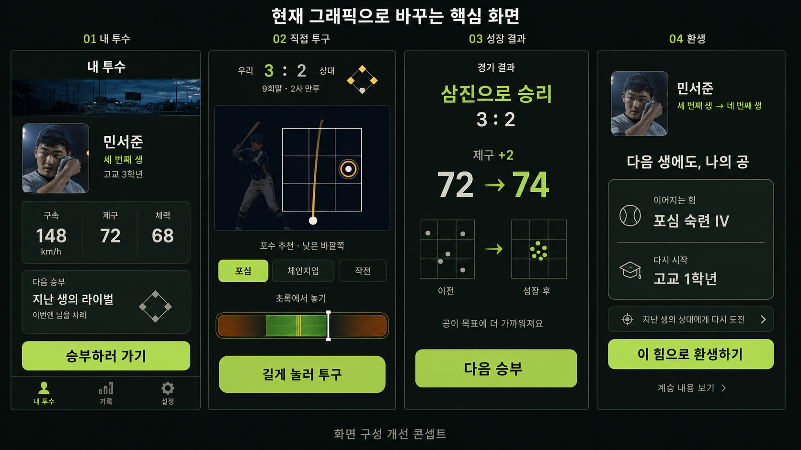

# 모바일 핵심 경험 개선 실행 계획

작성일: 2026-09-05. 대상: iOS SwiftUI, Android Jetpack Compose.

상태: 첫 개선판 구현과 로컬 검증을 진행했다. 결과와 남은 외부 검증은 [구현·검증 기록](MOBILE_CORE_EXPERIENCE_REPORT_2026-09-05.md)에 정리한다. 현재 작업 폴더의 소스를 기준으로 작성했으며 배포 바이너리와의 동일성을 전제하지 않는다.

## 1. 제품 목표와 기준 시안

**내가 더 잘 던지고, 내 투수도 강해져서, 지난 생에 넘지 못한 상대를 이긴다.**

기존 선수 초상·구장 이미지·2D 스트라이크존·공 궤적을 사용한다. 시안에서 승인된 것은 정보 우선순위와 화면 방향이다. 예시 숫자, 경기 승리, 특정 숙련 등급, 라이벌 재대결은 실제 저장과 진행 규칙으로 뒷받침될 때 표시한다.

첫 개선판은 다음 경험을 연결한다.

`현재 선수/다음 행동 → 직접 슬라이더 투구 → 확정 경기 결과/성장 → 다음 진행 → 생의 결말/계승 → 같은 선수의 다음 생`

훈련·관계·각성·학교 선택·프로 계약 등 필수 결정은 이 흐름 안에서 처리한다. 진행 조건을 충족하지 않은 상태에서 등판 버튼으로 단계를 건너뛰지 않는다.

## 2. 확인한 현재 상태

| 항목 | 현재 코드 근거 | 계획에 미치는 영향 |
|---|---|---|
| 앱 셸 | iOS `AppShell.swift`, Android `Phase8Screens.kt` 모두 커리어·기록·설정 3개 탭 | 탭 구조 재개발보다 커리어 첫 화면을 내 투수 중심으로 재구성한다. 탭 ID와 기존 링크의 목적지는 유지한다. |
| 그래픽 | `PortraitView`/`PlayerPortrait`, 기존 구장 이미지, `PitchDramaView`의 2D 캔버스 | 신규 3D 제작 없이 구현한다. 기존 초상 선택 규칙과 라이선스 범위를 따른다. |
| 투구 | iOS `PitchView.swift`, Android `PitchActivity.kt`/`PitchDeliveryControl.kt` | 슬라이더·조준·손 떼기 판정은 유지하고 화면 배치부터 바꾼다. |
| 성장 | iOS 확정 전후 능력 비교 및 경기 성장, Android 훈련 증거·경기 완료 경로 존재 | 결과 화면은 확정 데이터만 투영한다. 모든 경기에서 고정 +2를 지급하지 않는다. |
| 능력 눈금 | iOS는 내부 능력치를 1~100으로 표시, Android의 기존 화면은 20~80 표시 | 표시 정책을 통일하고 관련 세부 화면까지 함께 점검한다. 내부 능력과 세이브 수치는 변환하지 않는다. |
| 환생 | 빠른 환생·대표 유산·기억·계보 계승 경로가 이미 존재 | 정산과 계승 절차를 간결하게 연결한다. 시안의 `포심 숙련 IV`를 새 기능으로 가정하지 않는다. |
| 정체성 | Android 빠른 환생은 기존 identity 사용. iOS에는 회차별 portraitSeed 변화 확인 경로 존재 | 동일 캐릭터의 표시 정체성을 별도로 점검해야 한다. 이름만 같으면 얼굴도 같다고 가정하지 않는다. |
| 계측 | 두 플랫폼의 `first_pitch` 발생 의미에 차이 존재 | 기존 이벤트 이름만으로 첫 직접 투구 시간을 비교하지 않는다. 실제 수동 릴리스의 공통 정의를 먼저 만든다. |
| 통합 상태 | Android 네이티브 전환·훈련·현지화, iOS 설정·투구·셸 등에 작업 중 변경 다수 | 현재 변경을 기준선으로 삼고 파일 전체 교체·일괄 되돌리기·세이브 초기화를 하지 않는다. |

상세 참고: `docs/android-compose/TRAINING_COMPARISON_2026-09-05.md`, `docs/android-compose/PLAYER_POLISH_2026-09-05.md`, `apps/android/README.md`.

## 3. 첫 개선판의 제품 규칙

1. 주 행동을 첫 화면에서 찾을 수 있게 한다. 화면마다 강조 행동은 원칙적으로 하나이며, 결과가 갈리는 필수 선택에는 선택지별 비용/효과를 함께 보인다.
2. 반복 설명과 부가 기록은 상세로 이동한다. 부상·피로 경고, 초기화되는 항목, 지불 비용, 저장 실패는 현재 행동 가까이에 남긴다.
3. 수동 투구 슬라이더는 새 게임·설정 초기화의 기본이다. 이미 사용자가 선택한 접근성 설정은 존중한다.
4. 결과를 보러 가거나 다음 공을 던지기 위해 화면을 위아래로 반복 이동하지 않는다.
5. 일반 성장은 기존 규칙에 따라 자동 반영한다. 성장 보상 수령 버튼을 추가하지 않는다. 훈련 종류·강도나 각성 등 원래 필요한 결정은 명시적으로 선택한다.
6. 기존 3탭을 사용하고 첫 탭의 사용자 표시를 `내 투수`로 정리한다. 투구 중에는 하단 탭이 조작 영역을 차지하지 않는다.
7. UI 표시로 RNG를 소비하거나 결과를 다시 계산하지 않는다. 화면 재진입으로 성장·계승·보상이 중복되지 않는다.
8. 한국어·영어·일본어를 같은 단계에서 구현한다. 긴 번역을 작은 글자로 억지로 맞추지 않는다.

## 4. 화면별 상세 설계

### A. 내 투수와 현재 진행

일반 진입 화면의 순서는 `얕은 구장 배너 → 선수 초상/이름/현재 생 → 핵심 능력 3개 → 지금 할 일 → 주 행동`이다. 기존 긴 키아트와 여러 소개 카드를 중복 배치하지 않는다.

- 핵심 능력: 구속·제구·체력. 구속은 실제 프로필의 기준 구종/단위를 사용하고, 경기에서 방금 나온 실측 구속과 구분한다.
- `능력 자세히`에는 구종별 능력·잠재력·세부 성장·계보를 둔다.
- 홈의 다음 상대는 실제 일정에 있는 상대다. 다음 경기까지 훈련이 남았다면 `훈련 후 등판`처럼 실제 조건을 표시한다.
- 라이벌 재대결 문구는 기존 대전 기록과 해당 상대의 재등장이 확인되는 경우에만 표시한다. 다른 상대에게 과거 라이벌 문구를 붙이지 않는다.
- 소식·대회표·주간 과제·연대기·업적은 기록 탭 또는 해당 단계의 상세로 이동한다. 내용과 진입 경로의 누락 여부를 기능 목록으로 검증한다.
- 홈을 모든 단계 앞에 덧붙이지 않는다. 경기 후에는 다음 필수 결정으로 바로 이어가고, 일반 복귀 시 내 투수 화면이 현재 행동을 알려준다.

| 현재 상태 | 주 행동/처리 |
|---|---|
| 최초 실행 | 기존 첫 투구 도입 경로 유지. 홈을 한 단계 더 끼워 넣지 않는다. |
| 훈련 가능 | 추천 훈련과 피로/팔 부담을 표시하고 `훈련하기`. 종류·강도·대상 구종은 변경 가능. |
| 회복 필요 | 현재 건강 규칙에 맞는 회복 행동을 앞에 표시. 위험한 선택의 비용은 숨기지 않는다. |
| 관계·각성·학교 선택 | 핵심 대사/상황 1개와 효과가 명확한 선택 카드. 승낙 없이 자동 선택하지 않는다. |
| 중요 경기 가능 | `등판하기`. 실제 경기명과 상황을 짧게 표시. |
| 진행 중 경기 존재 | `이어 던지기`. 같은 세션/타석으로 재개. |
| 프로 진행 | 같은 내 투수 화면 안에서 프로 일정·주간 결정으로 연결. 별도 선수처럼 보이지 않게 한다. |
| 드래프트·은퇴·환생 | 실제 가능한 진로를 표시. 진행 중인 프로 커리어를 임의로 종료하지 않는다. |
| 저장/로드 실패 | 원인과 복구 행동을 표시. 다른 커리어가 없는 것처럼 오프닝으로 보내지 않는다. |

### B. 직접 투구

화면은 위에서부터 `경기 상황/전광판 → 2D 승부 영역 → 구종/조준 → 슬라이더/누르기 패드`다. 일반 글자 크기에서 이 네 영역을 한 화면에 넣는다.

- 전광판: 점수·이닝·아웃·볼카운트·주자만 먼저 표시한다. 승부의 의미를 설명하는 짧은 상황명은 유지한다.
- 승부 영역: 기존 타자/포수 이미지와 스트라이크존·공 궤적을 재사용한다. 준비·투구 중·결과 상태가 같은 공간에서 전환된다.
- 구종: 실제 사용 가능한 구종을 모두 고를 수 있어야 한다. 시안의 2개 구종으로 기존 보유 구종을 제한하지 않는다. 개수가 많으면 작은 글자 대신 가로 선택 영역이나 확장 선택기를 사용한다.
- 조준: 3×3 코스와 누른 채 조준하는 기존 기능을 모두 유지한다. 표시 목표점과 실제 좌표 변환을 함께 검증한다.
- 포수 사인: 기본 추천을 짧게 제시하고 사용자가 바꾸는 경로를 유지한다. 사인/직전 선택 유지 설정의 의미를 바꾸지 않는다.
- `작전` 상세: 타자 분석, 노림, 힘 배분, 사인 유지, 추가 설명. 누르기 중에는 패널이 열리거나 화면 높이가 변하지 않는다.
- 하단 조작: 슬라이더와 길게 누르기 패드를 고정한다. 손 떼기 한 번은 투구 한 번으로 이어진다. 제스처 취소·앱 비활성화는 투구 제출로 처리하지 않는다.
- 결과: 타이밍 품질과 야구 결과를 구분한다. 정확한 릴리스가 항상 삼진이라는 문구나 연출을 넣지 않는다.
- 다음 공은 같은 위치의 행동으로 준비한다. 로그와 분석은 접힌 상세에서 확인한다.

큰 글자/짧은 화면에서는 구장 영역과 배너 높이를 먼저 줄이고 부가 설명만 스크롤시킨다. 손 떼기 조작 영역을 가리거나 전체 글자 크기를 낮추지 않는다. 일반 크기의 무스크롤 기준과 접근성 크기의 필수 조작 접근 가능 기준을 분리한다.

### C. 경기 및 훈련 성장 결과

`실제 결과 → 가장 중요한 변화 → 다음 행동`의 순서로 정리한다. 기존 결과 표시는 통합하되 결과 확인 화면 수를 늘리지 않는다.

- 능력 변화는 저장된 완료 결과의 before/after에서 표시한다. 표시 +값은 표시 눈금의 전후 차이와 일치시킨다.
- 변화가 여러 개면 가장 중요한 1개를 크게, 나머지를 짧은 행으로 표시한다. 전체 내역은 펼쳐 볼 수 있다.
- 성장 0이면 0을 숨겨 성장한 것처럼 보이지 않는다. 실제 숙련 진척·회복 등 다른 성과가 있을 때만 그것을 보여준다.
- 피로·팔 부담·부상으로 다음 행동이 달라지면 해당 결과를 함께 표시한다.
- 시안의 산포 그림은 실제 경기 측정 그래프로 오해되지 않게 한다. 첫 개선판은 `제구 변화 예시`로 표시한 간단한 목표점 도식 또는 실제 로그에 근거한 시각화만 사용한다. 임의의 도트를 실측 개선으로 제시하지 않는다.
- 이닝 종료·경기 승리·개인 삼진은 각각 실제 상태에 맞는 제목을 사용한다. 한 타석 삼진을 팀 승리로 확대해 표시하지 않는다.
- 다음 단계가 훈련이면 `훈련으로`, 경기면 `다음 등판` 등 도착점을 드러낸다.
- 재실행 후 before 데이터가 없는 오래된 결과는 확정된 현재 값/기록만 표시한다. 과거 값을 추정해 만들어내지 않는다.

### D. 환생과 동일 캐릭터

정산은 `이번 생의 대표 성취 → 계승할 힘 선택 → 유지/재시작 미리보기 → 다음 생 시작`으로 연결한다. 후보 선택이 완료된 상태에서는 중복 요약 화면과 불필요한 확인 완료 버튼을 줄인다.

- 대표 유산 선택은 실제 후보와 효과를 사용한다. 발견한 유산, 현재 선택한 유산, 실제로 적용될 효과를 구분한다.
- 환생 미리보기는 `이어지는 것`과 `다시 시작하는 것`을 함께 표시한다. 야구혼 잔액 전체가 적용 보너스인 것처럼 보이지 않게 한다.
- 자동 적용·한도·소비 비용은 기존 규칙에 따른 실제값을 보여준다. 빠른 환생에서 원래 재구매하지 않는 소모 부스트를 자동 구매하지 않는다.
- 기본 경로는 같은 이름·기본 설정과 표시 정체성을 이어가는 빠른 환생이다. 별도 설정은 보조 행동으로 제공한다.
- 양쪽 플랫폼의 초상 선택을 확인하여 같은 투수의 기본 얼굴을 이어가게 한다. 기존 지속 가능한 키를 먼저 사용한다. 회차마다 바뀌는 seed만 존재하는 경우에는 선택적 표시용 키를 저장 메타데이터에 추가하고, 구형 저장은 현재 활성 선수에서 한 번만 초기화한다. 과거 기록의 초상과 core identity/결과 시드는 덮어쓰지 않는다. 이 변경은 별도 저장 호환 검사 항목이다.
- 현재 진행 중인 생은 그 생의 기존 얼굴을 유지한다. 새 표시 정책 때문에 업데이트 직후 얼굴이 바뀌는 일을 막는다.
- 기록 저장→계승 확정→다음 생 생성은 기존 명령/완료 식별자를 재사용한다. 재탭·백그라운드 전환·저장 실패 후 재시도에서 기록이나 보상이 중복되지 않아야 한다.
- 새 생의 시작 단계는 현재 규칙을 따른다. 필요한 학교/설정 선택을 완료하지 않았는데 `바로 등판`한다고 약속하지 않는다.
- 프로 진입·은퇴·미지명은 각각 현재 허용된 환생 경로로 연결한다. 성공한 선수의 조기 환생 선택이나 프로 분량 조정은 두 번째 개선판에서 다룬다.

## 5. 구현 순서와 산출물

| 단계 | 작업 | 완료 산출물/통과 기준 |
|---|---|---|
| 0. 기준선·계약 | 현재 변경/빌드 기준 고정, 상태별 화면과 실제 데이터 목록, 표시 눈금/이벤트/초상 정책 확정 | 동일 상태의 두 플랫폼 캡처·기능 도착지 표·세이브 호환 fixture. 시안과 실제 규칙의 차이를 제거한 화면 명세. |
| 1. 투구 전체 동선 | 한 화면에 전광판·2D 승부·조준·슬라이더 배치, 작전 상세와 결과 상태 전환 | 신규 기본 설정으로 수동 한 구 제출→실제 결과→다음 공까지 완료. 반복 스크롤과 조작 겹침 없음. |
| 2. 내 투수/필수 결정 | 공통 선수 헤더, 상태 기반 주 행동, 훈련·관계·각성 축약, 기록으로 부가 정보 이동 | 모든 커리어 상태에서 올바른 다음 행동 가능. 홈 추가로 필수 탭 수가 증가하지 않음. |
| 3. 성장 결과 | 경기/훈련 완료 데이터 기반 공통 전후 표시, 0성장·회복·중복 재진입 처리 | 저장 결과와 화면의 전후 숫자/단위 일치. 존재하지 않는 성장이나 승리를 표시하지 않음. |
| 4. 환생 | 대표 성취·유산 선택·적용 효과·초상 연속성·기존 빠른 환생 연결 | 기존 기록 보존, 동일 캐릭터 확인, 계승 효과 실제 적용, 중복 보상 없음, 다음 생 진행 가능. |
| 5. 통합 검증 | 전체 커리어/접근성/3개 언어/실기기/회귀 검증 및 사용자 관찰 | 차단 결함 0, 운영 세이브 보존, 수동 투구 증거, 신규·기존 사용자 관찰 결과와 배포 후보. |

각 단계는 한 플랫폼에서 화면/상태 결정을 먼저 검토한 뒤 같은 정의를 다른 플랫폼에도 적용한다. 첫 플랫폼 전체를 완성한 다음 다른 플랫폼을 처음부터 복제하는 방식으로 진행하지 않는다. 매 단계 두 플랫폼의 공통 완료 조건을 만족시킨다.

예상 작업량은 두 플랫폼 합산 **12~18 개발일**을 초기 가정으로 둔다. 1명이 기존 구조를 활용해 개발·회귀 검사하는 기준이며, 외부 사용자 모집/스토어 심사 대기와 두 번째 개선판은 제외한다. 단계 0에서 저장/능력 표시 수정 범위를 확인한 후 다시 산정한다. 첫 검토 가능한 결과는 단계 1의 실제 수동 투구 화면이다.

## 6. 코드 작업 위치

공통 상태 정의와 예시를 문서/fixture로 맞추고 UI는 각 플랫폼의 네이티브 컴포넌트로 구현한다. 이 작업을 위해 별도 공용 UI 엔진을 도입하지 않는다.

| 책임 | iOS 주요 파일 | Android 주요 파일 |
|---|---|---|
| 셸/내 투수 | `AppShell.swift`, `HighSchoolCareerView.swift`, `HighSchoolChapterHeaderViews.swift`, `TodayView.swift`, `CareerFlowView.swift` | `Phase8Screens.kt`, `Phase8ScreenModels.kt`, `MainActivity.kt`, `ProCareerJourneyScreens.kt` |
| 투구 | `PitchView.swift`, `PitchDramaView.swift`, 기존 수동 투구 컨트롤 | `PitchActivity.kt`, `PitchDeliveryControl.kt`, `PitchDramaView.kt` |
| 훈련/결과 | `HighSchoolTrainingViews.swift`, `HighSchoolTrainingResultViews.swift`, `HighSchoolCareerStore+ImportantGame.swift`, `PitchInningResultViews.swift` | `TrainingScreen.kt`, `TrainingPresentation.kt`, `PitchActivity.kt`, 완료 명령 투영 경로 |
| 환생/초상 | `RunRecapView.swift`, `HighSchoolDraftLegacyViews.swift`, `HighSchoolCareerStore+Rebirth.swift`, `AvatarFace.swift`, 저장 메타데이터 | `Phase8Screens.kt`, `Phase8ScreenModels.kt`, `PlayerPortrait.kt`, 기존 BeginRebirth/저장 메타데이터 |
| 문구/계측 | `GameCopyResolver`/문자열 리소스, `CareerTelemetry.swift`, `GameAnalytics.swift` | `GameCopy`, `LocalizedScreenProjection.kt`, 리소스/문구 원본, `Phase9AnalyticsProjector.kt` |

큰 화면 파일은 선수 요약·주 행동·결과 요약·계승 미리보기 단위로 분리한다. UI가 계산·진행·저장을 직접 소유하지 않도록 기존 application/store 경계를 지킨다.

## 7. 검증과 측정

### 출시 전 필수 시나리오

- 새 게임/설정 초기화 → 기본 수동 슬라이더 → 한 구 완료 → 다음 공. 자동 릴리스로 대신 검사하지 않는다.
- 누르기 취소·손가락 이탈·빠른 연속 입력·앱 백그라운드·재개. 투구/보상 중복과 의도치 않은 자동 제출이 없어야 한다.
- 60Hz/고주사율 Android와 iPhone에서 슬라이더 표시, 손 떼기 판정, 햅틱/음소거/모션 감소를 검증한다. 그래픽 단순화로 조작 응답이 나빠지지 않아야 한다.
- 작은 화면의 기본 글자 크기에서 주 행동과 슬라이더가 스크롤 없이 보임. 큰 글자/스크린리더에서는 핵심 정보와 조작이 가리지 않고 접근 가능함.
- 고교 훈련·회복·관계·각성·드래프트·미지명 환생, 지명 후 프로·은퇴·계승까지 상태 전환.
- 기존 세이브 업그레이드, 진행 중 경기 재개, 성장 0, 복수 능력 성장, 계승 효과 한도, 프로 연결 실패, 저장 취소/실패 재시도.
- 한국어·영어·일본어의 네 핵심 화면/필수 결정에서 잘림·번역 누락·부정확한 효과 없음.
- 실존 구단명/통용 약칭/리그명/로고를 게임 문구나 새 이미지에 추가하지 않았는지 검색 확인.

기존 `CareerSmokeUITests`, `PitchSessionTests`, `SignatureLegacyIntegrationTests`, Android `PitchGestureUiTest`, `TrainingUiTest`, `Phase8CareerCompletionStoreTest`, 저장 취소/호환 검사를 확장한다. UI 문자열의 존재만 확인하는 테스트보다 실제 한 구 제출·진행 상태·저장 결과를 검증한다.

문구/디자인/현지화 정적 검사를 실행하고 영향을 받은 회귀를 완료한다. 첫 개선판에서 엔진 결과를 유지하는 변경은 고정 입력의 결과 동일성을 검사한다. 후속 단계에서 밸런스를 바꾸면 별도로 분포와 플랫폼 일치 검증을 추가한다.

### 사용자 관찰

신규 사용자 5~8명과 기존 사용자 5~8명을 초기 문제 발견용으로 모집하는 안을 둔다. 이 규모로 유지율 개선을 통계적으로 확정하지 않는다. 기존판/개선판 비교 순서는 번갈아 배치하고 비슷한 난도의 상태를 사용한다.

확인할 질문은 `지금 무엇을 해야 하는가`, `내 조작이 결과에 어떻게 반영됐는가`, `무엇이 성장했는가`, `환생하면 무엇이 남는가`, `자발적으로 다시 도전하고 싶은가`다. 특정 답을 설명한 뒤 맞혔다고 기록하지 않는다.

### 공통 계측 정의

| 지표 | 정의/해석 |
|---|---|
| 첫 수동 투구까지 시간 | 플레이 가능한 첫 진입부터 첫 실제 수동 릴리스 제출까지의 활성 전경 시간. 로딩·백그라운드 시간은 분리. |
| 경기 사이 필수 조작 | 결과가 준비된 시점부터 다음 실제 플레이까지의 필수 탭·스크롤. 선택 상세 열람은 별도 기록. |
| 자발적 다음 승부 | 확정 결과를 본 사용자 중 같은 세션에서 다음 플레이를 시작한 비율. 일반 커리어와 도전 모드 구분. |
| 환생 후 플레이 | 환생을 실제 저장 완료한 사용자 중 같은 세션 및 24시간 안에 새 생의 수동 투구를 수행한 비율. |
| D1/D7 핵심 플레이 복귀 | 정의된 일자 코호트에서 실제 투구/핵심 진행을 수행한 복귀. 단순 실행과 구분하고 성숙한 코호트만 사용. |
| 유지 조건 | 저장/진행 실패, 크래시, 조작 취소의 오발사, 기존 사용자 진행 중단 증가가 없는지 확인. |

`first_pitch`의 과거 정의는 보존하고, 필요한 경우 실제 수동 릴리스용 버전 명시 이벤트를 추가한다. OS·앱 버전·신규/기존·일반/도전·수동/보조 조작을 나눠 본다. 선수 이름이나 상세 개인 데이터를 계측에 추가하지 않는다. 기존 분석 동의·전송 경로를 사용한다.

방문 수나 환생률만 오른 것을 성공으로 판정하지 않는다. 먼저 이해도/조작/저장 기준을 통과하고, 실제 다음 플레이와 충분한 후속 코호트로 지속 효과를 판단한다. 현재 유지율 수치는 이 계획에서 새로 조회하거나 확정하지 않았다.

## 8. 두 번째 개선판: 성장과 재대결의 깊이

첫 개선판의 화면/진행 데이터를 확인한 뒤 다음 순서로 검토한다.

1. 기존 라이벌과 경기 상황을 활용해 성장 전후 재대결을 연결한다. 동일한 상대/조건에서 효과를 비교하되 실제 결과를 미리 승리로 고정하지 않는다.
2. 일반 능력 상승과 다른 플레이 방식을 여는 각성/결정구의 역할을 정리한다. 매 경기 새로운 선택을 추가하지 않는다.
3. 같은 조건에서 좋은 릴리스가 주는 실행 품질의 차이를 확인한다. 조작 보정·타이밍 난도 변경은 첫 UI 개선과 별도로 검증한다.
4. 프로 성공 후에도 계승을 기대할 수 있는 경로, 첫 회차 길이, 훈련/경기 비중을 실측에 따라 조정한다. 첫 환생 8~12분이나 강제 패배를 요구사항으로 두지 않는다.

## 9. 배포 및 작업 산출물 관리

구현은 현재 작업 중 변경과 충돌하지 않도록 작은 단위로 통합한다. 검토 결과와 QA를 거친 동일 규칙/문구의 후보를 두 플랫폼에서 준비한다. 첫 개선판에서 기존 save identity·획득 자산·커리어 기록을 일괄 초기화하지 않는다.

Android는 기존 독립 QA application ID 및 native writer 경로를 사용하여 운영/개발 저장을 보존한다. iOS도 QA fixture와 사용 중인 저장을 분리한다. 빌드/검사 경로와 시뮬레이터는 기존 안정 경로/기기를 재사용한다.

iOS 심사 제출/출시 단계에는 한국어·영어·일본어 리소스가 서명된 IPA에 포함됨을 검사하고, 일본어 실기기 또는 TestFlight 스모크와 스토어 지원 언어 Japanese 표시를 확인한다. 이 조건을 통과하지 못하면 제출·출시하지 않는다.

보관 산출물은 승인 시안, 이 명세, 최신 구현 비교 캡처, 검증 요약으로 제한한다. 임시 빌드/로그/QA 출력은 저장 정책에 따라 정리하며 활성 프로세스가 사용하는 경로와 사용자 저장/미디어는 삭제하지 않는다.
