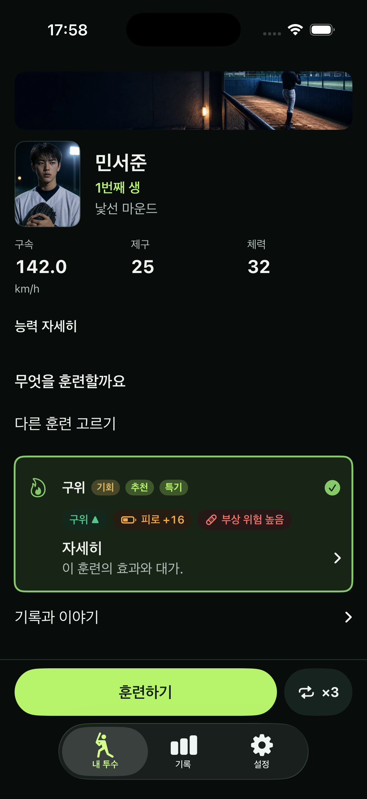
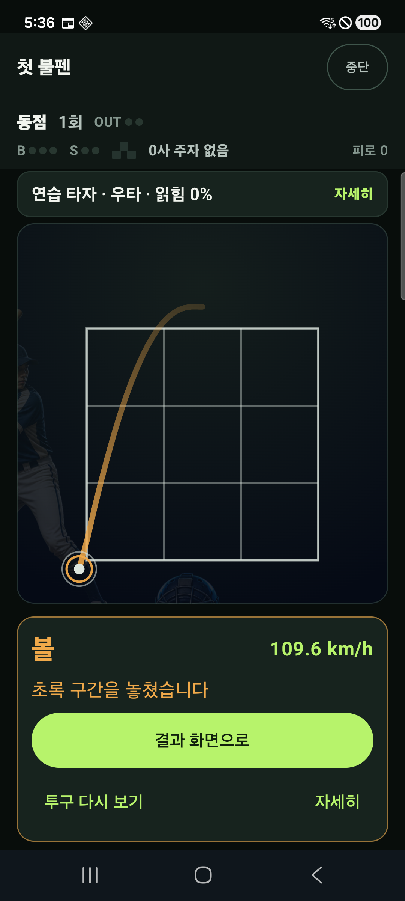
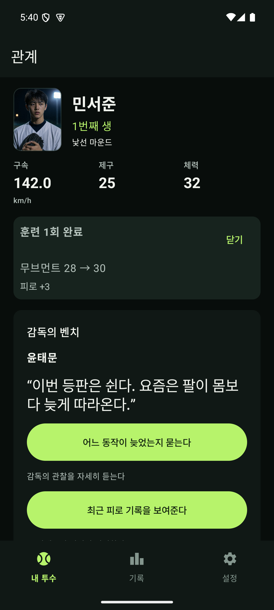

# 모바일 핵심 경험 개선 — 구현 및 검증 기록

> 후속 개선과 최종 검증 결과: [개선 완성 구현](/Users/solkim/Dev/baseball/docs/MOBILE_CORE_EXPERIENCE_FINAL_2026-09-05.md). 이 문서는 1차 구현 당시의 기록입니다.

2026-09-05 · iOS SwiftUI / Android Jetpack Compose · 로컬 검증본

추가 판정: [사용자 관점 재검토](MOBILE_CORE_EXPERIENCE_USER_REVIEW_2026-09-05.md)에서 화면 위계·성장 피드백·환생 설명과 두 가지 정확성 문제를 확인했다. 아래 테스트 통과를 UX 목표의 완전 달성으로 해석하지 않는다.

## 구현 결과

승인한 기존 그래픽 기반 시안을 따라 선수 초상·2D 스트라이크존·공 궤적을 재사용했다. 내 투수, 직접 투구, 성장 결과, 환생을 기존 커리어 진행과 연결했다.

- **직접 투구:** 전광판과 2D 승부 영역, 구종·코스, 하단 슬라이더로 정리했다. iOS의 결과/조작부 왕복 자동 스크롤을 제거했다. Android도 준비 화면에서 2D 조준을 보며 던질 수 있다. 분석·사인 근거·노림·힘 배분·보조 조작은 작전에서 확인한다.
- **내 투수:** 선수 초상·이름·현재 생·핵심 능력을 먼저 보여준다. 고교와 프로에 같은 정보 우선순위를 적용했다. 등판 등 주요 단계의 진행 버튼을 고정하고, 훈련은 현재 선택을 앞에 두고 다른 종류를 펼쳐 고른다. 비용과 부상 위험은 선택 가까이에 남겼다.
- **성장:** 실제 확정 전후 능력을 표시한다. Android는 최근 성장 전후값 한 건을 저장 메타데이터에 기록해 재실행과 배포용 저장에서도 유지한다. 성장 0, 회복, 여러 능력의 변화는 별도로 처리한다. UI가 RNG를 실행하거나 보상을 추가하지 않는다.
- **환생:** 대표 성취·계승 효과·다시 시작하는 단계를 먼저 보여주고 상세 회고는 펼쳐 본다. 같은 이름의 투수를 이어가는 iOS 새 생은 기존 초상 seed를 재사용한다. 현재 선수와 과거 기록을 다시 쓰지 않는다. Android는 기존 identity 계승 경로를 사용한다.
- **가독성:** 능력 표시 눈금을 맞추고 구속 숫자와 단위를 분리했다. 한국어·영어·일본어 문구를 함께 반영했으며 큰 글자에서 하단 탐색 영역의 높이도 확보했다.
- **계측:** 실제 수동 릴리스 성공 시점의 `manual_pitch_released_v2`를 추가했다. 기존 `first_pitch`의 의미는 유지한다. 수동/보조 경로를 구분하며 결과가 저장된 뒤의 분석 실패가 투구 재시도로 이어지지 않게 했다.

시안의 `제구 +2`, 특정 숙련 등급, 승리 문구는 고정값으로 구현하지 않았다. 현재 규칙과 저장에 있는 실제 효과·경기 결과를 표시한다. 반복 시간, 성장 보상량, 조기 환생 조건을 재설계하는 두 번째 개선판은 플레이 관찰 이후의 작업이다.

## 실제 화면

아래는 생성 이미지가 아닌 실행 화면이다. 선수와 숫자는 QA 상태에 따라 다르다.

### iOS 내 투수와 훈련

### Android 직접 투구 결과

### Android 확정 성장과 다음 선택

## 확인한 항목

| 범위 | 결과 |
|---|---|
| iOS 로직 회귀 | 588개 통과. 유산·저장 실패·프로 연계·동일 초상 보존 포함 |
| iOS 수동 투구 | 기본 수동 슬라이더로 실제 결과 생성 확인 |
| iOS 커리어 전체 동선 | 고교 진행 → 드래프트 → 유산 확정 → 환생 → 새 생의 이전 기록 연결 통과 |
| iOS 훈련 | 다른 훈련 선택지 접근, 확정 결과와 다음 진행 확인 |
| iOS 언어 | 영어 첫 투구, 일본어 오프닝·투구·선수 생성·프롤로그 확인. 사용자 이름은 번역하지 않고 보존 |
| Android 애플리케이션 회귀 | 105개 통과. 배포용 저장에서 성장 기록 재열기·중복 실행·구형 저장 포함 |
| Android 앱 단위 검사 | 9개 통과. 현지화 추가 회귀 6개도 통과 |
| Android lint/빌드 | 통과. 독립 QA 앱과 instrumentation APK 생성 |
| Android 첫 플레이 | 한국어 Galaxy 실기기, 영어·일본어 에뮬레이터에서 기본 슬라이더 → 확정 결과 → 다음 단계 통과 |
| Android 작전 상세 | 영어로 열기·사인 근거 확인·닫기·수동 투구 통과 |
| Android 큰 글자 | 훈련 선택/실행/저장 결과를 100%·200% 글자 크기로 확인 |
| Galaxy 제스처 | 취소 시 투구 0회, 의도적인 손 떼기 1회에 투구 1회 확인 |
| 정적 검사 | 디자인 시스템, 문구/IP, iOS 현지화, Android 계층/Phase 9, diff 공백 검사 통과 |

Galaxy A53의 120Hz 실행에서 한 번의 슬라이더 입력 구간에 프레임 106개와 중앙 간격 약 8.35ms가 기록됐다. 이는 해당 스모크의 측정값이며 장시간 플레이 전체의 성능이나 주관적인 손맛을 입증하는 수치는 아니다.

검증 중 실제 문제와 테스트 가정의 차이를 구분했다. 배포용 성장 저장 누락, 합성 문장의 번역 누락, 큰 글자 탐색 높이를 보완했다. 변경된 도입 순서·접힌 상세·동일한 접근성 노드가 중첩되는 시스템 확인창은 현재 UI를 실제로 조작하도록 테스트를 갱신했다.

## 검증본과 저장

- iOS QA bundle ID: `com.solkim.baseball.ios.coreqa`. `BASEBALL_QA_BUNDLE_SUFFIX=.coreqa`로 기본 앱과 분리한다.
- Android QA application ID: `com.solkim.baseball.android.core.compose.qa`. `baseballLaunchQa`, `baseballCoreQa`, `baseballQaNativeStore`로 기본 앱 및 다른 QA 작업과 분리한다.
- Android 검증 APK: `artifacts/mobile-core/qa/app-coreqa.apk`.
- 테스트 APK·로그·큰 글자 화면: `artifacts/mobile-core/qa/`.
- 여러 작업이 공용 Gradle 출력 경로를 갱신할 수 있어, 검증 APK를 위 경로에 고정하고 실제 manifest의 패키지 식별자를 확인한 뒤 사용한다.
- 초기화는 이 작업에서 만든 독립 QA 패키지/fixture에만 수행했다. 기존 선수 저장을 지워 새 플레이를 만드는 방법은 사용하지 않았다.
- XcodeBuildMCP 결과 번들과 테스트 제품은 해당 도구의 24시간 보관 정책에 맡긴다. 결과 번들 자체를 프로젝트에 복제하지 않았다. 마무리 시 이 프로젝트의 도구 작업 폴더는 테스트 제품 약 301MB, 결과 번들 약 92MB였다.
- 프로젝트 QA 산출물은 약 31MB이며 Android 검증 APK는 약 24MB다. 실패 시의 임시 화면과 초기 비교 파일은 정리했다. `verification-summary.json`에 결과와 APK 해시를 남겼다.

## 후속 검증과 출시

현재는 로컬 구현·검증 단계다. 실제 신규/기존 사용자 관찰과 D1/D7 코호트 비교는 아직 수행하지 않았다. 첫 투구까지의 시간·다음 승부·환생 후 플레이를 분리해 평가하고, 그 결과로 재대결 배치와 첫 회차 길이를 조정한다.

iOS 심사 제출/출시 전에는 서명된 IPA의 한국어·영어·일본어 리소스, 일본어 실기기 또는 TestFlight 스모크, 스토어 지원 언어 Japanese 표시를 별도로 확인해야 한다. 이 작업에서 스토어 제출이나 공개 출시는 실행하지 않았다.

상세 설계 기준은 [실행 계획](MOBILE_CORE_EXPERIENCE_PLAN_2026-09-05.md)을 따른다.
