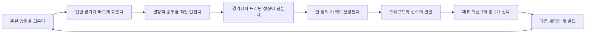

# 선수 육성·세대 계승 루프 구현 계획 — 2026-08

| 항목 | 값 |
|---|---|
| 상태 | 핵심 루프 구현 완료, 실제 투구 기반 정책·세대 계승·저장 무결성 내부 가드 통과. 60~90분 활성 시간과 리텐션 효과는 외부 플레이에서 미검증 |
| 기준일 | 2026-08-09 KST |
| 제품 범위 | 고교 선수 한 명의 60~90분 목표 성장, 드래프트, 유산 선택, 다음 세대 시작 |
| 주요 의사결정자 | 제품·게임 디자인·시뮬레이션 코어·iOS·분석·QA |
| 데이터 판단 | **Share with caveats** — 방향 선택에는 사용하되 절대 유지율이나 인과 효과로 해석하지 않음 |

이 문서는 사용자 인터뷰에서 확정된 핵심 재미를 현재 코드 위에 구현하기 위한 단일 계약이다. 기존의 기능 수를 늘리는 것이 목적이 아니다. 한 선수를 직접 키우고, 그 선수가 실제로 남긴 한 가지를 다음 세대에 전하며, 수집한 선택지가 다음 육성을 다르게 만드는 경험을 완성하는 것이 목적이다.

---

## 1. 확정된 제품 결정

### 1.1 핵심 재미

핵심 재미는 다음 두 축이 서로 증명하는 데서 나온다.

1. **내가 키운 선수에 대한 애착**
   - 훈련 방향과 경기 판단이 성장에 남는다.
   - 잘한 날뿐 아니라 버틴 날, 실패를 고친 과정, 함께한 사람이 기록된다.
   - 드래프트 결과가 단순 난수 판정이 아니라 한 선수의 3년 결산으로 읽힌다.
2. **세대를 잇는 빌드와 수집**
   - 한 인생의 플레이 기록이 정확히 세 개의 대표 유산을 만든다.
   - 사용자는 그중 하나를 골라 다음 선수에게 직접 전한다.
   - 세 후보는 모두 발견 목록에 남고, 그중 고른 하나만 다음 선수에게 직접 이어진다.
   - 영구 수집은 순수 능력 누적보다 새로운 방향과 정보에 가치를 둔다.

둘 중 하나만으로는 충분하지 않다. 애착만 강하면 작별이 종료 신호가 되고, 수집만 강하면 선수가 빌드 재료로 축소된다. 따라서 모든 장은 `선택 → 경기에서 확인 → 성장 → 기록 → 다음 선택`으로 닫혀야 한다.

### 1.2 변경할 수 없는 경험 계약

- 한 고교 인생의 **실제 조작 시간 목표는 60~90분**이다. 현재는 외부 플레이로 검증되지 않았다.
- 한 인생은 사용자가 인식하는 **네 장**으로 구성한다. 한 장은 15~20분을 목표로 한다.
- 각 장의 끝은 안전한 저장 지점이지만, 기다림·입장권·에너지 없이 곧바로 다음 장을 이어갈 수 있다.
- 성장의 두 원인은 **선택한 훈련**과 **경기에서 실제로 보여 준 과정**이다.
- 일반 경기는 대부분 자동 진행하고, 커리어 가치가 높은 승부처만 직접 던진다.
- 직접 투구 길이는 장면의 무게에 따라 짧게 또는 길게 달라진다.
- 첫 번째 선수도 프로에 갈 수 있지만, 방향성 있는 육성과 안정적인 투구가 필요할 만큼 어렵다.
- 드래프트·성장·유산 후보에서 플레이어가 통제하지 못하는 운의 영향은 작고 공개 가능해야 한다.
- 미지명은 벌점 화면이 아니라 다음 세대에 희망을 남기는 특별 후일담으로 끝난다.
- 실존 프로 구단·통용 약칭·리그·선수·로고·유니폼 문양·슬로건은 기본 콘텐츠에 사용하지 않는다.

---

## 2. 근거와 데이터 품질

### 2.1 저장된 Amplitude 분석에서 확인된 방향

분석 기준은 [Amplitude 성장 분석 노트북](../artifacts/analysis/amplitude-2026-08-09/amplitude_growth_analysis.ipynb)과 [게임플레이 리텐션 구현 계획](./GAMEPLAY_RETENTION_IMPLEMENTATION_PLAN_2026-08.md)이다.

| 관측 | 값 | 이 계획에 주는 의미 | 신뢰도 |
|---|---:|---|---|
| 온보딩 시작 → 첫 투구 | 57 → 53, **93.0%** | 투구를 빨리 보여 주는 현재 입구는 보존한다. | 중간 |
| 첫 투구 → 첫 공식 경기 완료 | 53 → 43, **81.1%** | 직접 투구 자체보다 그 이후의 장기 목적이 우선 과제다. | 중간 |
| 드래프트 → 다음 인생 시작 | 42 → 27, **64.3%** | 결말에서 다음 육성의 차이를 즉시 보여 줄 필요가 있다. | 낮음~중간 |
| 사용자당 경기 완료 | 약 **10.62회** | 첫날 소비 깊이는 높다. 한 세션 완주와 여러 세션 복귀를 분리해 측정해야 한다. | 낮음~중간 |
| 오늘의 이닝 진입 | 약 **6.98%** | 별도 모드보다 진행 중 선수와 다음 목표의 연결이 먼저다. | 낮음 |
| D2 | **0% 관측** | 다음 날 돌아올 이유가 약하다는 경고 신호일 뿐 절대 유지율이 아니다. | 낮음 |

현재 가장 안전한 해석은 “첫 투구와 첫 경기까지의 재미는 작동하지만, 첫날 소비 뒤 다음 세션에 남는 선수·목표·수집 동기가 약하다”이다. 인터뷰에서 확인된 선수 애착과 세대 계승은 이 문제를 설명하는 정성 근거이며, 출시 후 행동 변화는 별도로 검증해야 한다.

### 2.2 반드시 함께 표시할 데이터 한계

- 분석 당일 App Store 유료 다운로드는 1건인데 Amplitude 활성 사용자는 59명이다. TestFlight·개발·HTTP·합성 이벤트 혼입 가능성이 크다.
- 온보딩 완료 76회가 시작 57회보다 많고, 한 번만 기록되어야 할 활성화가 약 51명에게 96회 발생했다.
- HTTP API와 iOS SDK 이벤트가 섞였고, 검토 세션에는 안정적인 User ID가 없었다.
- 1.0.2가 분석 당일 출시되어 성숙한 D1·D7 코호트가 없었다.
- 과거 `draft_resolved → rebirth_started`에는 정상적으로 프로로 간 사용자가 분모에 섞였다. 앞으로는 `pro_career_started`를 제외한 적격 사용자만 센다.

따라서 위 수치는 우선순위와 초기 목표의 닻으로만 사용한다. `distribution=app_store`, `environment=production`, 대상 기능 버전이 동일한 코호트가 쌓이기 전에는 “기능이 유지율을 올렸다”는 문장을 쓰지 않는다. 정식 사용자 200명 미만에서는 노출 수·절대 전환·변화폭을 함께 제시하고 통계적 유의성을 주장하지 않는다.

---

## 3. 목표 플레이 구조

### 3.1 네 장과 시간 예산

현재 엔진의 8개 내부 진행 구간은 저장 호환성을 위해 유지하고, UI와 분석에서 두 구간씩 묶어 네 장으로 보여 준다. 시작된 저장의 일정과 결과를 재작성하지 않는다.

| 사용자에게 보이는 장 | 기존 내부 구간 | 목표 시간 | 핵심 질문 | 자동 진행 | 직접 플레이 | 장의 결산 |
|---|---|---:|---|---|---|---|
| 1장 · 자리를 얻다 | 1~2 | 15~20분 | 어떤 투수가 될 것인가? | 첫 시즌 일반 등판 | 짧은 첫 승부처 | 선택한 훈련과 첫 경기의 배움 |
| 2장 · 내 공을 만들다 | 3~4 | 15~20분 | 무엇을 주무기로 삼을 것인가? | 겨울·봄 일정 | 표준 길이의 전국 무대 | 가장 많이 쌓인 성장 근거와 관계 변화 |
| 3장 · 책임을 지다 | 5~6 | 15~20분 | 성적과 몸 상태 사이에서 무엇을 지킬 것인가? | 여름·가을 일정 | 표준 또는 긴 승부처 | 강점·약점·부상 위험의 변화 |
| 4장 · 이름을 남기다 | 7~8 | 15~20분 | 마지막 기회를 어떻게 쓸 것인가? | 최종 준비 일정 | 가장 긴 마지막 승부 | 드래프트 뒤 미지명 후일담·유산 또는 프로 시작 |

시간 기준은 활성 조작 시간이다. 백그라운드·시스템 팝업·앱 중단 시간은 제외한다.

- 중앙값 목표: 한 인생 **70~80분**, 각 장 **15~20분**.
- 분포 목표: 완주 인생의 **80% 이상이 60~90분**, P90은 **90분 이하**.
- 한 장을 끝내면 자동 저장하고 `다음 장 시작`과 `나중에 계속`을 모두 제공한다.
- 연속 플레이에는 인위적 대기·일일 제한·소모 재화가 없다.
- 복귀 시 마지막으로 끝낸 선택과 다음 행동을 한 화면에서 보여 준다.

### 3.2 한 장 안의 육성 루프

각 장은 아래 순서를 기본으로 하되, 관계 사건과 몸 상태가 순서를 조금 바꿀 수 있다.

1. **이번 장의 목표를 확인한다.** 현재 능력, 몸 상태, 예상 역할, 스카우트 평가 범위를 보여 준다.
2. **훈련 방향을 고른다.** 분야와 강도, 예상 성장, 피로·부상 위험을 확정 전에 표시한다.
3. **일반 경기가 빠르게 흐른다.** 결과는 경기별 긴 로그가 아니라 역할 변화와 성장 근거 중심으로 묶는다.
4. **승부처를 직접 던진다.** 구종·코스·존 의도·강도를 선택하고, 포수 추천은 빠른 기본값으로 쓴다.
5. **경기에서 배운 점을 성장에 반영한다.** 결과보다 과정 지표를 우선한다.
6. **한 장을 결산한다.** 무엇을 선택했고, 무엇이 달라졌고, 다음 장에서 해결할 문제가 무엇인지 한 장에 남긴다.

### 3.3 훈련 선택과 경기 기반 성장의 결합

새 구현은 훈련과 경기를 별개의 점수판으로 두지 않는다. 둘이 같은 `성장 근거 원장`을 채운다.

| 성장 근거 | 예시 입력 | 성장에 반영하는 방식 |
|---|---|---|
| 훈련 반복 | 같은 분야를 연속 선택, 강도, 회복 여부 | 해당 분야의 기본 성장과 루틴 보너스 |
| 투구 과정 | 초구 스트라이크, 유리한 카운트, 의도한 코스 실행 | 경기 운영·제구·구종별 숙련 근거 |
| 상대 대응 | 이전 타석과 다른 선택, 약점 공략, 반복 패턴 수정 | 수싸움과 변화구 활용 근거 |
| 위기 관리 | 볼넷 뒤 회복, 주자 상황에서 피해 제한 | 압박 대응과 체력 근거 |
| 몸 관리 | 과사용 회피, 회복 훈련, 경고 뒤 강도 조절 | 내구성과 회복 근거 |

구현 원칙:

- 경기 성장은 실점·승패만으로 주지 않는다. `expectedDamage`, `actualDamage`, 존 의도 실행, 볼넷, 투구 수, 수싸움 태그처럼 이미 계산 가능한 과정 신호를 사용한다.
- 한 경기의 우연한 인플레이 결과가 능력치를 크게 뒤집지 않도록 경기당 성장 상한을 둔다.
- 성장 근거와 실제 능력 상승을 모두 사용자에게 설명한다. 숨은 보정 문구만 보여 주지 않는다.
- 같은 상태·같은 선택·같은 시드는 같은 근거와 성장을 만든다.
- 일반 경기에서 얻는 성장은 한 장 단위로 합산해 보여 주되, 드래프트 반영 항목과 모순되지 않아야 한다.
- 훈련만 반복하거나 경기 결과만 잘 나온 한쪽짜리 빌드가 최적이 되지 않도록, 상위 성장은 훈련 근거와 경기 근거가 함께 있을 때 열린다.

### 3.4 경기의 무게에 따른 직접 투구 길이

기존처럼 모든 승부처를 4타자로 고정하지 않는다. 구현된 규칙은 장면에 따라 2·4·5·6타자로 달라지며, 내부 등급명은 UI에 노출하지 않고 상황 설명으로 길이를 예고한다.

| 내부 등급 | 사용자 경험 | 목표 길이 | 권장 범위 | 사용 위치 |
|---|---|---:|---:|---|
| `brief` | 이미 진행 중인 짧은 위기 | 1~3분 | 2타자 | 1장 첫 등판, 관계 콜백 |
| `standard` | 한 이닝의 핵심 구간 | 3~6분 | 4~5타자 | 2~3장의 대표 경기 |
| `finale` | 결과가 여러 타석에 걸쳐 누적되는 마지막 무대 | 6~10분 | 최대 6타자 | 4장 마지막 대회·쇼케이스 |

- 시작 전에 현재 이닝·점수·주자와 함께 예상 타자 수를 알려 준다.
- 새 규칙으로 시작한 인생은 각 장에 직접 던지는 승부처를 최소 하나 보장하고, 전체 직접 승부는 4~6회로 유지한다.
- 전체 공식 등판의 **70% 이상은 자동 진행**되게 하여 직접 투구가 반복 작업이 아니라 기억할 장면으로 남게 한다.
- 표준·긴 승부는 타석 경계마다 저장한다.
- 긴 승부에서도 남은 타석을 포수에게 맡길 수 있어야 하며, 자동 전환은 벌점이 아니라 접근성·페이스 선택이다.
- 직접 던지지 않은 일반 경기와 직접 던진 기록은 구분하되, 둘 다 선수의 시즌에는 존재한다.

### 3.5 드래프트: 첫 선수도 가능하지만 어렵게

첫 선수의 프로 진입은 막지 않는다. 다만 좋은 초기 난수 하나보다 일관된 육성과 투구 과정이 필요해야 한다.

밸런스 목표는 클릭 수가 아니라 사용한 화면 정보와 선택의 일관성으로 정책을 나눈다. 모든 정책은 실제 `PitchKernelEngine`으로 직접 경기를 끝낸다.

| 첫 선수 정책 | 정의 | 목표 지명률 |
|---|---|---:|
| UI 정보 활용 | 화면이 강조한 오늘의 기회를 따르고, 피로 경고 때 회복하며, 기본 포수 추천을 사용 | **35~55%** |
| 일관된 방향 육성 | 시작 유형·학교·훈련·각성을 한 방향으로 맞추고 공개된 관계 단서를 활용 | 각 방향 **35~55%**, 네 방향 차이 **15%p 이하** |
| 방향 분산 육성 | 여섯 훈련을 순환해 특정 강점을 만들지 않음 | **20~40%** |
| 저관리 육성 | 가벼운 훈련·회복 위주로 성장 기회를 대부분 쓰지 않음 | **5~20%** |

UI 정보 활용과 일관된 방향 육성은 서로 10%p 이상 벌어지지 않고, 둘 모두 방향 분산 육성보다 최소 5%p 높아야 한다. 경계에서 ±3%p 안에 걸린 1,000회 결과는 다른 시드 1,000회 또는 총 4,000회 이상으로 재현한다.

2번째 선수는 50~65%, 3번째 선수는 70~80%를 장기 목표로 하되 강제 확률 보정으로 만들지 않는다. 유산 선택권, 더 정확한 정보, 빌드 준비도가 차이를 만들어야 한다.

드래프트 뒤의 분기는 선수의 실제 인생 길이를 지킨다.

- 미지명이면 고교 3년이 그 선수의 결말이므로 특별 후일담과 유산 선택으로 이어진다.
- 지명되면 선수의 이야기는 프로에서 계속된다. 고교 결산에서 유산 선택을 강제하지 않는다.
- 지명 직후 사용자가 프로 진입 대신 그 인생을 접겠다고 명시적으로 선택한 경우에만 고교 기록으로 유산을 만든다.
- 프로로 간 선수의 대표 유산은 은퇴 또는 최종 종료 시 고교와 프로 기록을 함께 사용해 만든다.

운 영향 제한:

- 현재 드래프트의 공개 가능한 결정론 점수는 유지한다.
- 새 규칙의 최종 무작위 분산은 기존 ±5 대신 **-1 / 0 / +1을 20% / 60% / 20%**로 적용한다. 구버전 진행은 당시 ±5를 유지한다.
- 새 밸런스 규칙의 자동 시즌 항은 시작 유형별 실제 기대 기록을 0점으로 두고 **최대 ±2**로 제한한다. 구버전 진행은 당시 공식을 유지한다.
- 자동 경기와 최종 분산을 합쳐도 결정론 점수가 당락선에서 5점 이상 떨어진 결과를 뒤집지 못하게 한다.
- `luck_flip_rate`: 무작위 분산을 0으로 두었을 때와 당락이 달라지는 비율을 **10% 이하**로 유지한다.
- 모든 결과 화면에 능력·직접 경기 과정·자동 시즌·관계·몸 상태·최종 변동을 분리해 표시한다.
- 연패 보정, 몰래 올리는 성공률, 결제 여부에 따른 판정 변화는 사용하지 않는다.

수치는 구현 지시가 아니라 검증할 밸런스 가설이다. 1,000개 이상 시드의 정책 시뮬레이션과 외부 플레이를 모두 통과한 값만 확정한다.

### 3.6 구현 후 최종 내부 밸런스

실제 `PitchKernelEngine` 경로를 사용한 시작 방향별 1,000회 시뮬레이션에서 UI 정보 활용 정책의 첫 선수 지명률은 강한 공 **45.1%**, 코스 공략 **39.8%**, 변화구 **50.2%**, 긴 이닝 **39.6%**였다. 공개된 관계 효과까지 일관되게 사용한 방향 육성은 각각 **44.1% / 47.2% / 51.1% / 38.8%**였다. 네 방향 최대 차이는 12.3%p, 같은 방향의 두 정책 차이는 최대 7.4%p다.

방향 분산 정책은 **22.3%**, 실제 투구 커널에서 성장 기회를 거의 쓰지 않은 저관리 정책은 독립 시드 2,000회 합산 **5.15%**였다. 모든 정책의 `luck_flip_rate`는 8.9% 이하였고, 경기 성장은 대표 정책에서 경기의 약 23.8~30.1%에 발동해 경기당 최대 +1을 지켰다.

대표 유산 +4는 보존하고 자동 야구혼 곡선만 완만하게 했다. UI 정보 활용 정책 1,000쌍에서 대표 유산을 고른 두 번째 선수는 **60.6%**, 세 번째 선수는 **76.4%**로 목표 범위를 통과했다. 프로 은퇴 야구혼은 자동 능력에 합치지 않고 지갑에만 넣는다. 전설 경력 뒤 가장 강한 두 효과를 직접 구매한 스트레스 경로도 L3 **88.5%**로 90% 아래였다.

세부 정책·표본·목표 카드·바람 결과는 [밸런스 검증 보고서](./RETENTION_BALANCE_REPORT_2026-08.md)에 고정한다. 이 결과는 고정 행동 정책의 내부 검증이지 실제 사용자의 지명률 또는 재미 예측이 아니다. 실제 난이도와 반복 플레이 효과는 정식 코호트와 외부 플레이테스트로 확정한다.

---

## 4. 대표 유산과 영구 수집

### 4.1 후보 생성 계약

한 인생이 끝나면 무작위 카드 풀을 섞지 않고, 그 선수의 저장된 플레이 기록에서 정확히 **세 개의 대표 유산**을 생성한다.

각 후보는 다음 필드를 가진 동결 스냅숏이다.

- 안정적인 `legacy_id`와 규칙 버전.
- 사용자에게 보이는 이름과 한 줄 설명.
- 후보가 만들어진 실제 근거 1~3개.
- 다음 선수에게 적용될 직접 효과와 대가.
- 수집 분류: 구위·제구·변화구·체력·경기 운영·회복·관계·재도전.
- 원래 선수의 인생 번호와 대표 순간 참조. 원시 이름과 시드는 분석으로 보내지 않는다.

후보 우선순위:

1. 반복적으로 증명된 플레이 방식.
2. 큰 약점을 실제로 고친 과정.
3. 결정적인 경기 또는 관계의 결과.
4. 지명·미지명 결말과 가장 인과적으로 가까운 기록.

세 후보는 가능한 한 서로 다른 분류에서 뽑는다. 세 분류를 만들 만큼 기록이 없으면 훈련 집중, 가장 안정적이었던 경기 과정, 끝까지 보완하지 못한 약점에서 결정론적 대체 후보를 만든다. 어떤 완주에서도 빈 후보나 중복 후보 때문에 진행이 막혀서는 안 된다.

### 4.2 하나의 선택이 만드는 두 결과

사용자는 세 후보 중 하나만 고른다.

1. **직접 계승 1개**: 고른 유산 하나가 다음 선수의 시작 빌드에 적용된다.
2. **영구 후보 추가**: 이번에 발견한 세 유산의 원형이 계정의 수집 목록에 한 번씩 추가되어 이후 인생의 시작 선택에 등장할 수 있다.

선택하지 않은 두 후보도 그 선수의 아카이브와 발견 목록에는 남지만, 이번 다음 선수에게 직접 효과를 주지는 않는다. 선택의 무게는 영구 수집을 빼앗는 방식이 아니라 바로 다음 빌드의 방향을 하나로 제한하는 방식으로 만든다.

파워 예산:

- 직접 계승은 한 가지 플레이 방향을 앞당기되 약점을 지우지 않는다.
- 한 유산의 순수 초기 능력 효과는 기본 능력 총량의 약 2~3% 이내를 시작점으로 검증한다.
- 모든 영구 효과를 합쳐도 기존 제품 원칙인 8~10% 상한을 넘지 않는다.
- 영구 후보 추가는 선택 폭의 성장이지 같은 효과의 중첩 강화가 아니다.
- 유산의 강한 장점에는 좁은 적용 상황, 반대 분야 성장 감소, 피로 비용 같은 읽을 수 있는 대가를 붙일 수 있다.

### 4.3 기존 기억 시스템과의 호환

기존 배포 규칙은 18개 고정 `MemoryCardID` 전체를 섞어 5개를 제안하고, 저장 상태에 따라 2~4개를 반드시 고르게 했다. 새 규칙은 진행 중인 옛 선수를 즉시 덮어쓰지 않는다.

- 시작된 인생은 시작 당시 `legacy_rules_version`으로 끝낸다.
- 옛 저장에 이미 선택된 기억은 효과와 표시를 그대로 보존한다.
- 옛 기억 2~4개를 들고 시작하는 첫 새 버전 인생은 `v1_bridge`로 표시해 그 인생 동안만 기존 효과를 유지하고, 그 결말부터 새 단일 유산 규칙으로 전환한다.
- 새 규칙으로 시작한 인생부터 `대표 후보 3개 → 1개 선택`을 적용한다.
- 옛 기억을 새 수집 목록으로 마이그레이션할 때는 효과를 바꾸지 않는 호환 원형을 사용한다.
- 완료된 선수의 후보·선택·문구·효과는 아카이브에 동결한다. 이후 카탈로그 조정이 과거 기록을 바꾸지 않는다.
- 영구 후보 추가는 ID 기반 영수증으로 중복 지급을 막고, 로컬 저장과 동기화 거울에 함께 남긴다.

---

## 5. 미지명 특별 후일담

미지명은 “프로 실패”라는 한 줄과 다시 시작 버튼으로 끝내지 않는다. 다음 세대를 위한 희망을 현실적인 야구 기록 안에서 남긴다.

후일담 순서:

1. 마지막까지 검토한 이유와 부족했던 항목을 각각 1~2개 보여 준다.
2. 감독·포수·숙적 중 실제로 함께한 한 사람의 반응을 이름과 함께 남긴다.
3. 이 선수가 후배에게 남긴 훈련 기록, 공책, 그립, 재활 루틴 같은 구체적 물건을 보여 준다.
4. 그 기록에서 생성된 대표 유산 세 개를 제시한다.
5. 하나를 고르면 “이 기록이 다음 세대의 시작에 남습니다”라고 설명하고 바로 새 선수 시작 또는 나중에 이어가기를 제공한다.

내러티브 제약:

- 등장인물이 환생이나 이전 인생의 직접 기억을 마법으로 인식하지 않는다.
- 후배, 오래된 기록지, 낯익은 구장 소리, 손끝에 남은 습관처럼 현실적으로도 성립하는 표현을 쓴다.
- 실패를 조롱하거나 구매·알림 동의·공유를 압박하는 순간으로 사용하지 않는다.
- 지명된 선수의 결말보다 보상이 더 크지는 않지만, 미지명에서만 얻을 수 있는 재도전·회복 계열 유산이 존재할 수 있다.
- 같은 실패 원인을 반복해도 최초 획득 외의 영구 보상을 중복 지급하지 않는다.

---

## 6. 현재 코드가 충족하는 부분과 새 구현 범위

| 영역 | 현재 구현과 근거 | 판정 | 새 구현 범위 |
|---|---|---|---|
| 결정론적 진행 | 내부 8구간, 훈련 12~16회, 관계·직접 경기 4~6회, 각성 3회가 시드와 인생 번호로 생성됨 ([HighSchoolCareer.swift](../packages/simulation-core/Sources/SimulationCore/HighSchoolCareer.swift)) | 충족 | 내부 일정은 유지하고 네 장 표시 계층과 규칙 버전을 추가 |
| 훈련 선택 | 분야·강도·예상 성장·피로 위험을 선택하는 UI와 엔진 명령이 존재 ([HighSchoolCareerView.swift](../apps/ios/Sources/HighSchoolCareerView.swift)) | 충족 | 훈련 결과를 경기 기반 성장 원장과 연결 |
| 일반 경기 자동 진행 | 내부 구간 사이마다 자동 등판을 만들고 직접 던진 기록과 구분해 시즌 로그에 저장 ([HighSchoolCareer.swift](../packages/simulation-core/Sources/SimulationCore/HighSchoolCareer.swift)) | 충족 | 한 장 단위 요약, 통제 불가능한 드래프트 영향 상한 축소 |
| 직접 투구 | 고교·프로·오늘의 이닝이 공통 세션을 사용하고 타석 경계 저장을 지원하며, 고교 승부처는 2·4·5·6타자로 동결됨 ([PitchSession.swift](../apps/ios/Sources/PitchSession.swift), [PitchScenario.swift](../apps/ios/Sources/PitchScenario.swift)) | 부분 충족 | 남은 승부를 포수에게 맡기는 중도 자동 전환은 후속 범위 |
| 경기 과정 신호 | 예상·실제 피해, 수싸움 태그, 투구 수·볼넷·실점으로 결정론적 경기 성장 +1을 만들고 결과에 이유를 표시 ([CareerGameGrowth.swift](../packages/simulation-core/Sources/SimulationCore/CareerGameGrowth.swift)) | 충족 | 실제 코호트에서 발동률·능력별 편중을 관찰 |
| 드래프트 | 최종 변동 -1/0/+1, UI 정보 활용 39.6~50.2%, 방향 육성 38.8~51.1%, 전체 운 반전 8.9% 이하로 내부 가드 통과 ([HighSchoolCareer.swift](../packages/simulation-core/Sources/SimulationCore/HighSchoolCareer.swift)) | 충족 | 실제 사용자 정책 분포와 체감 공정성 외부 검증 |
| 세대 계승 | 실제 성장·경기 기록에서 서로 다른 대표 유산 3개를 만들고 1개만 직접 계승하며, 셋 모두 발견 목록·아카이브에 저장 ([CareerSignatureLegacy.swift](../packages/simulation-core/Sources/SimulationCore/CareerSignatureLegacy.swift), [HighSchoolCareerStore.swift](../apps/ios/Sources/HighSchoolCareerStore.swift)) | 충족 | 정식 코호트 후보 선택률·2/3번째 선수 복귀율 관찰 |
| 선수 애착 | 이름·학교·감독·포수·숙적·연대기·마지막 말이 저장됨 ([HighSchoolCareerStore.swift](../apps/ios/Sources/HighSchoolCareerStore.swift), [PlayerBondStory.swift](../apps/ios/Sources/PlayerBondStory.swift)) | 부분 충족 | 대표 유산 근거와 후일담에서 실제 인물·선택·경기를 연결 |
| 60~90분 페이스 | 기획 목표는 있으나 장별 활성 시간 이벤트와 실제 분포가 없음 | 미검증 | 네 장 타이머, 완료·중단 이벤트, 외부 플레이테스트 |
| 미지명 결말 | 원인 항목, 기억 선택, 재시작 경로가 존재 | 부분 충족 | 다음 세대 희망의 전용 후일담과 미지명 전용 후보 규칙 |
| 분석 | 훈련·경기 성장·대표 유산 후보/선택/적용·결말·프로 정상 분기와 배포 환경이 계측됨 ([GameAnalytics.swift](../apps/ios/Sources/GameAnalytics.swift)) | 부분 충족 | 장별 활성 시간과 미지명 후일담 완료 이벤트는 출시 전 추가 필요 |

새 범위가 아닌 것:

- 프로 시즌 전체 재설계, 타자 포지션, 투타 겸업.
- 실시간 멀티플레이, 리더보드 경제, 카드 뽑기, 에너지 제한.
- 대량의 범용 대사 추가. 먼저 실제 기록을 기존 문장에 연결한다.
- 실존 리그 데이터나 실제 선수·구단 라이선스 콘텐츠.
- 영구 능력치의 무제한 누적.

---

## 7. 도메인·저장 설계

구체적인 타입명은 구현 중 조정할 수 있지만 다음 계약은 지켜야 한다.

### 7.1 새 상태

- `development_rules_version`: 새 인생 시작 시 고정. 진행 중에는 앱 업데이트로 바뀌지 않는다.
- `act_number`: 기존 내부 구간에서 계산 가능한 1~4. 별도 저장이 필요하면 검증 가능한 파생값으로 둔다.
- `act_started_at_active_seconds`, `act_active_seconds`: 활성 조작 시간 집계. 도메인 판정에는 사용하지 않는다.
- `development_evidence`: 훈련·직접 경기·자동 경기의 성장 근거를 ID와 정수 카운트로 저장한다.
- `clutch_tier`: 직접 승부의 목표 길이와 종료 조건. 저장 복구 시 동일해야 한다.
- `generated_legacy_candidates`: 정확히 세 개의 동결 후보.
- `selected_legacy`: 확정된 한 개. 확정 이후 다시 고를 수 없다.
- `unlocked_legacy_ids`: 계정 단위 집합. ID 영수증으로 멱등 처리한다.
- `undrafted_epilogue`: 실패 이유·함께한 인물·남긴 물건의 동결 스냅숏.

### 7.2 무결성과 호환성

- 새 필드는 옛 저장이 읽히도록 optional 또는 명시적 기본값으로 추가한다.
- 진행 중 옛 인생은 기존 8구간·기억 규칙으로 끝낸다. 새 네 장 표시는 진행 위치만 묶어 보여 줄 수 있으나 결과 규칙은 바꾸지 않는다.
- 성장 근거, 승부 길이, 유산 후보, 선택 유산은 상태 commitment 또는 별도의 검증 토큰에 포함한다.
- 타석 경계, 장 완료, 드래프트 확정, 유산 선택 직후 각각 저장한다.
- 유산 선택과 영구 후보 추가는 한 트랜잭션처럼 복구되어 “효과는 적용됐지만 수집은 안 됨” 또는 그 반대 상태가 생기지 않아야 한다.
- 로컬·동기화 충돌 시 더 높은 유효 revision을 우선하되, 영구 후보 영수증은 합집합으로 병합한다.
- 완료된 아카이브는 새 카탈로그로 다시 계산하지 않는다.
- 같은 명령을 재전송해도 성장·보상·수집이 두 번 적용되지 않는다.

---

## 8. KPI와 수치 목표

모든 비율은 `distribution=app_store`, `environment=production`, 동일 `development_rules_version`의 안정 식별자 기준 고유 사용자로 계산한다. 시간 경계는 KST를 사용한다.

### 8.1 1차 KPI

| KPI | 정의 | 잠정 목표 | 판단에 쓰는 이유 |
|---|---|---:|---|
| 첫 인생 완주율 | 1장 시작 사용자 중 30일 안에 `draft_resolved` 도달 | **≥55%** | 60~90분 구조가 실제로 완결되는가 |
| 미지명 후 다음 세대 전환 | `undrafted_epilogue_completed` 사용자 중 24시간 안에 다음 `rebirth_started`; 프로 진입자 제외 | **≥75%** | 실패가 종료가 아니라 새 빌드의 시작이 되는가 |
| D1 의미 세션 | 첫 공식 경기 완료 다음 KST 날짜에 `game_finished` 재발생 | **≥20%** | 첫날 몰아하기를 실제 복귀와 구분 |

D7 의미 세션 **≥8%**를 장기 결과 가드레일로 함께 본다. 표본 100명 미만에서는 방향만 판단한다.

### 8.2 진단 지표

| 지표 | 목표 |
|---|---:|
| 각 장 중앙 활성 시간 | **15~20분** |
| 완주 인생 중 60~90분 비율 | **≥80%** |
| 1장 시작 → 첫 공식 경기 완료 | **≥75%**, 기존보다 5%p 이상 하락 금지 |
| 장별 다음 장 진입률 | 각 장 **≥80%**, 특정 장이 직전보다 10%p 이상 낮으면 조사 |
| 짧은 승부 중앙 시간 | **≤3분** |
| 표준 승부 중앙 시간 | **3~6분** |
| 마지막 승부 중앙 시간 | **6~10분** |
| 시작한 직접 승부의 중단률 | 짧은·표준 **≤8%**, 마지막 승부 **≤12%** |
| 전체 공식 등판 중 자동 진행 비율 | **≥70%** |
| 유산 후보 노출 → 선택 완료 | **≥90%** |
| 선택 유산이 다음 선수 시작에 적용 | **100%** |
| 2번째 선수 1장 완료율 | 첫 선수 1장 대비 **-10%p 이내** |
| UI 정보 활용 / 일관된 방향 육성의 첫 선수 지명률 | 각각 **35~55%**, 방향 간 차이 **15%p 이하** |
| 방향 분산 / 저관리 첫 선수 지명률 | 각각 **20~40% / 5~20%** |
| `luck_flip_rate` | **≤10%** |

### 8.3 정성 성공 기준

출시 후보 외부 테스터 30명 기준:

- 완료자의 **70% 이상**이 자신의 훈련 또는 투구 선택 하나가 성장에 어떻게 이어졌는지 설명한다.
- 완료자의 **70% 이상**이 첫 선수의 구체적 장면 하나를 회상한다.
- 완료자의 **60% 이상**이 감독·포수·숙적 중 한 명과 구체적 사건을 회상한다.
- 미지명 경험자의 **60% 이상**이 다음 선수에서 시험할 빌드 또는 고른 유산을 말한다.
- 완료자의 **50% 이상**이 스스로 다음 인생을 시작하고 싶다고 답한다.

목표치는 초기 제품 판단선이다. 데이터가 깨진 기준선에 맞춰 수치를 낮추지 않고, 정식 코호트 200명 이상에서 실제 분포와 신뢰구간을 함께 보고 재설정한다.

---

## 9. 분석 이벤트 계약

모든 이벤트에는 기존 공통 속성 `app_version`, `build`, `distribution`, `environment`, `platform`과 새 `development_rules_version`을 붙인다. 이름, 자유 입력 문장, 원시 시드, `careerID`, 구체적 인물명은 보내지 않는다.

### 9.1 새 이벤트와 기존 이벤트 확장

| 이벤트 | 정확한 기록 시점 | 필수 속성 | 용도 |
|---|---|---|---|
| `career_act_started` | 장의 첫 행동 화면이 실제로 보일 때 | `life_number`, `act_number`, `entry_point`, `resumed` | 장 진입과 복귀 |
| `career_act_completed` | 장 결산이 저장된 뒤 | `life_number`, `act_number`, `active_seconds`, `training_count`, `auto_games`, `direct_moments` | 15~20분 페이스와 장별 이탈 |
| `career_training_completed` | 훈련 결과가 상태에 적용된 뒤 | `life_number`, `act_number`, `focus_id`, `intensity_id`, `growth_points`, `fatigue_delta` | 선택과 성장 연결 |
| `clutch_moment_started` | 직접 투구 화면과 첫 타자가 실제로 보일 때 | `life_number`, `act_number`, `tier`, `target_batters`, `leverage_band` | 길이별 진입 |
| `clutch_moment_completed` | 결과가 상태에 한 번 적용된 뒤 | `life_number`, `act_number`, `tier`, `active_seconds`, `batters`, `pitches`, `result_band`, `process_grade` | 승부 길이·완료·과정 |
| `game_growth_applied` | 경기 근거가 성장 원장에 반영된 뒤 | `life_number`, `act_number`, `source`, `evidence_ids`, `growth_focus`, `growth_points` | 경기 기반 성장의 실제 사용 |
| `legacy_candidates_presented` | 세 후보가 생성되고 선택 화면의 첫 후보가 실제로 보일 때 | `life_number`, `drafted`, `candidate_ids`, `candidate_categories`, `fallback_count` | 후보 품질·도달률 |
| `legacy_selected` | 한 후보의 효과·영수증·저장이 모두 성공한 뒤 | `life_number`, `drafted`, `legacy_id`, `category`, `newly_added`, `direct_effect_type` | 선택·수집·계승 |
| `undrafted_epilogue_presented` | 미지명 전용 후일담의 핵심 내용이 실제로 보일 때 | `life_number`, `primary_reason_id`, `relationship_role`, `artifact_id` | 후일담 노출 |
| `undrafted_epilogue_completed` | 사용자가 후일담을 끝내고 유산 선택으로 이동할 때 | `life_number`, `active_seconds`, `primary_reason_id` | 적격 다음 세대 전환 분모 |

기존 이벤트 확장:

- `game_finished`: `act_number`, `tier`, `active_seconds`, 기존 과정 지표를 추가한다.
- `draft_resolved`: `life_number`, `drafted`, `core_score`, `threshold`, `rating_term`, `direct_game_term`, `auto_game_term`, `relationship_term`, `health_term`, `random_delta`, `draft_rules_version`을 추가한다.
- `rebirth_started`: 기존 `life_number`, `entry_point`에 `selected_legacy_id`, `same_identity`를 추가한다.
- `pro_career_started`: 드래프트 후 정상 프로 분기를 다음 세대 전환 이탈에서 제외하는 기준으로 유지한다.
- `session_ended`: `act_number`, `act_active_seconds`, `life_active_seconds`를 추가한다.

`candidate_ids`, `candidate_categories`, `evidence_ids`는 정렬·중복 제거한 안정 ID를 쉼표로 이은 `String`으로 보낸다. 후보는 최대 3개, 성장 근거는 최대 6개로 제한하고 자유 문장 배열은 보내지 않는다. 비율 속성은 0...1 `Double`, 점수·시간·개수는 `Int`, 참/거짓은 `Bool`로 고정한다.

### 9.2 퍼널과 코호트

1. **완주 퍼널**: `career_act_started(1) → career_act_completed(1...4) → draft_resolved`.
2. **미지명 계승 퍼널**: `draft_resolved(drafted=false) → undrafted_epilogue_presented → undrafted_epilogue_completed → legacy_candidates_presented → legacy_selected → rebirth_started`.
3. **프로 정상 분기**: `draft_resolved(drafted=true) → pro_career_started`; 이 사용자는 미지명 계승 분모에 들어가지 않는다.
4. **세대 깊이**: 2번째·3번째 선수의 `career_act_completed(1)`과 `draft_resolved`를 첫 선수와 비교한다.
5. **복귀**: 첫 `clutch_moment_completed`를 시작점으로 D1·D7 `game_finished`를 본다.

이벤트 QA는 필수 속성 누락 0, enum 허용값 위반 0, 완료 이벤트의 중복 0을 출시 조건으로 둔다. 화면 `onAppear`만으로 “읽음”을 추정하지 않고, 실제 콘텐츠 노출 또는 상태 적용 시점에 기록한다.

---

## 10. 단계적 출시와 롤백

한 빌드에는 행동 가설 하나만 노출한다. 시작된 인생은 안정적인 실험 배정과 규칙 버전을 끝까지 유지한다.

| 단계 | 노출 변경 | 최소 관찰 | 출시 판단 |
|---|---|---|---|
| 0 · 계측 기준선 | 장·활성 시간·승부 길이·유산 퍼널 이벤트만 추가 | 2일 및 정식 이벤트 200건 | 필수 속성 100%, 중복·금지 필드 0, 기존 퍼널 재현 |
| 1 · 네 장 페이스 | 내부 8구간을 네 장으로 묶고 장 결산·복귀 화면 제공; 밸런스는 유지 | 7일 또는 적격 사용자 200명 | 각 장 중앙값 15~20분, 첫 공식 경기 가드레일 유지 |
| 2 · 경기 기반 성장 | 성장 근거 원장과 짧음·표준·마지막 승부 길이 적용 | 14일 또는 직접 승부 500건 | 중단률 목표 통과, 원인 설명 70%, 완주율 하락 없음 |
| 3 · 대표 유산 | 기록 기반 세 후보, 하나 직접 계승, 영구 후보 추가 | 14일 또는 결말 200건 | 후보 선택 ≥90%, 적용 100%, 다음 세대 전환 ≥75% |
| 4 · 미지명 후일담·공정성 | 전용 후일담과 드래프트 운 상한 조정 | 14일 또는 미지명 200건 | 다음 세대 전환·회상 목표 통과, 지명률·운 영향 밴드 통과 |

표본을 채우지 못하면 외부 테스터 30명의 반복 플레이와 엔진 시뮬레이션으로 기능 품질만 판정한다. 유지율 상승을 주장하거나 여러 단계를 한꺼번에 출시한 뒤 원인을 추정하지 않는다.

### 10.1 즉시 롤백 조건

- 첫 공식 경기 활성화가 비교 코호트보다 **5%p 이상 하락**.
- 어느 장의 진입→완료가 비교 코호트보다 **8%p 이상 하락**.
- 직접 승부 중단률이 기존 또는 직전 단계보다 **5%p 이상 상승**.
- 완주자의 P90 활성 시간이 **95분 초과** 또는 60~90분 비율이 **60% 미만**.
- 미지명 후 다음 세대 전환이 비교 코호트보다 **8%p 이상 하락**.
- UI 정보 활용·일관된 네 방향·방향 분산·저관리 정책이 §3.5의 밴드를 벗어나거나 네 방향 차이가 **15%p 초과**.
- UI 정보 활용과 일관된 방향 육성이 서로 **10%p 초과**로 벌어지거나 방향 분산 육성보다 **5%p 이상 높지 않음**.
- `luck_flip_rate`가 **10% 초과**.
- 저장 유실·잘못된 복구·유산 중복 지급·선택과 다른 효과 적용이 **한 건이라도 재현**.
- 세 후보 미만, 중복 후보로 인한 진행 불가, 직접 계승이 0개 또는 2개 이상인 상태가 발생.
- VoiceOver·큰 글자·모션 감소·스위치 제어에서 핵심 선택이나 직접 투구 완료가 불가능.
- 실존 구단·선수·리그·로고·슬로건이 사용자 노출 콘텐츠에 포함.

롤백은 새 규칙 버전의 신규 시작만 끈다. 이미 시작된 인생의 규칙을 중간에 바꾸지 않고, 저장을 끝낼 수 있는 호환 경로를 유지한다.

---

## 11. 인수 테스트

### 11.1 코어·결정론

| ID | 조건 | 합격 기준 |
|---|---|---|
| DEV-CORE-001 | 기존 8구간을 네 장에 매핑 | 모든 구간이 정확히 한 장에 속하고 순서·일정·결과가 바뀌지 않음 |
| DEV-CORE-002 | 같은 시드·상태·명령으로 재실행 | 성장 근거, 자동 경기, 승부 길이, 후보 3개, 드래프트 결과가 완전 동일 |
| DEV-CORE-003 | 훈련과 경기 근거 적용 | 원장이 합산되고 상한·중복 방지·설명 항목이 일치 |
| DEV-CORE-004 | 결과 운 영향 | 자동 시즌·최종 변동의 개별/합산 상한 준수, 거리 5점 이상 당락 불변 |
| DEV-CORE-005 | 실제 PitchKernel의 1,000+ 시드 정책 시뮬레이션 | UI 정보 활용·네 방향 각각 35~55%, 방향 분산 20~40%, 저관리 5~20%, `luck_flip_rate` ≤10% |
| DEV-CORE-006 | 서로 다른 유효 빌드와 같은 시드 비교 | 네 방향 최대 차이 ≤15%p, UI 정보 활용과 방향 육성 차이 ≤10%p, 둘 모두 방향 분산보다 ≥5%p |

### 11.2 직접 투구와 자동 경기

| ID | 조건 | 합격 기준 |
|---|---|---|
| DEV-GAME-001 | 짧은·표준·마지막 승부 생성 | 각 장에 최소 1회, 전체 4~6회가 배치되고 목표 타자 수·종료 조건·길이 예고가 계약과 일치 |
| DEV-GAME-002 | 앱 종료 후 복구 | 모든 타석 경계에서 같은 타자·점수·주자·투구 로그로 복구 |
| DEV-GAME-003 | 긴 승부 자동 전환 | 남은 구간이 결정론적으로 처리되고 벌점·보상 중복 없이 기록에 합산 |
| DEV-GAME-004 | 일반 경기와 직접 경기 기록 | 시즌 합계와 구분 표시가 맞고 드래프트 항목의 합계와 일치 |
| DEV-GAME-005 | 경기 기반 성장 | 같은 과정이면 승패가 달라도 허용 범위 안에서 같은 핵심 성장 근거 생성 |

### 11.3 유산·수집·후일담

| ID | 조건 | 합격 기준 |
|---|---|---|
| DEV-LEGACY-001 | 풍부한 기록의 지명·미지명 각각 | 실제 근거를 가진 서로 다른 후보 정확히 3개 생성 |
| DEV-LEGACY-002 | 최소 기록·nil 옛 필드 | 결정론적 대체 후보 3개 생성, 진행 불가 없음 |
| DEV-LEGACY-003 | 후보 하나 선택 | 직접 계승 정확히 1개, 발견한 후보 3개의 영구 영수증이 각각 1개, 재호출 시 중복 없음 |
| DEV-LEGACY-004 | 선택하지 않은 후보 | 아카이브와 발견 목록에는 보존되지만 이번 다음 선수에게 직접 효과 없음 |
| DEV-LEGACY-005 | 옛 복수 기억 저장 | 기존 효과·표시·진행을 유지하고 새 규칙으로 강제 변환하지 않음 |
| DEV-LEGACY-006 | 미지명 후일담 | 실패 이유·실제 관계 인물·구체적 물건·다음 행동이 모두 존재 |
| DEV-LEGACY-007 | 지명 후 프로 선택 | 유산 선택이 프로 진입 전에 강제되지 않고 정상 프로 분기 보존 |
| DEV-LEGACY-008 | 지명 후 프로 은퇴 | 고교와 프로 기록을 함께 근거로 후보 3개를 만들고 최종 선택을 한 번만 적용 |

### 11.4 저장·동기화·분석

| ID | 조건 | 합격 기준 |
|---|---|---|
| DEV-SAVE-001 | 훈련·자동 경기·직접 경기·장 결산·드래프트·유산 선택 직후 강제 종료 | 마지막 확정 명령 이후 상태로 복구, 보상·성장 중복 0 |
| DEV-SAVE-002 | 옛 저장 디코드 | 1.0.x 저장이 오류 없이 열리고 해당 인생의 옛 규칙 유지 |
| DEV-SAVE-003 | 동기화 충돌 | 유효 revision 보존, 영구 후보 영수증 합집합, 선택 효과 중복 없음 |
| DEV-AN-001 | 이벤트 스키마 단위 테스트 | 필수 키·타입·허용 enum 100%, 이름·시드·자유 문장 0 |
| DEV-AN-002 | 퍼널 UI 테스트 | 완료·선택 이벤트는 정의된 인생/장 범위에서 한 번만 발생하고, 시작 이벤트는 한 번의 화면 진입마다 중복 없이 발생하며 시간 순서가 유효 |
| DEV-AN-003 | 프로 정상 분기 | `pro_career_started` 사용자가 미지명 다음 세대 전환 분모에서 제외 |

### 11.5 UI·접근성·플레이테스트

| ID | 조건 | 합격 기준 |
|---|---|---|
| DEV-UI-001 | 네 장 연속 진행 | 기다림·재화·강제 홈 이동 없이 한 세션 완주 가능 |
| DEV-UI-002 | 중단 후 복귀 | 현재 장·선수 변화·다음 행동을 첫 화면에서 이해 가능 |
| DEV-UI-003 | 유산 선택 | 세 후보의 실제 근거·효과·대가와 “하나만 선택”이 스크롤 전후 모두 명확 |
| DEV-UI-004 | VoiceOver·AX5 글자·모션 감소 | 모든 핵심 CTA, 후보, 결과 항목을 순서대로 읽고 확정 가능 |
| DEV-PLAY-001 | 초보 5명, 1장 | 도움 없이 첫 훈련과 첫 승부 완료, 원인 설명 4명 이상 |
| DEV-PLAY-002 | 외부 30명, 한 인생 | 80% 이상 60~90분 완주, 정성 성공 기준 충족 여부 기록 |
| DEV-PLAY-003 | 외부 10명, 미지명→다음 선수 | 8명 이상이 유산 효과를 찾고 도움 없이 다음 선수 시작 |

---

## 12. 사용자 문구와 IP 계약

내부 타입명·분석 ID·기획 용어를 UI에 그대로 노출하지 않는다. 아래 금칙어는 정의를 위해 이 문서에만 적는다.

| UI에서 쓰지 않을 개발자 용어 | 사용자에게 쓸 표현 |
|---|---|
| 회차 약속 | 이번 선수의 목표, 이번에 이루고 싶은 것 |
| 배합 숙련 | 수싸움이 통했다, 두 공이 이어졌다 |
| 본편 | 고교 3년, 선수의 이야기 |
| 중요 경기 | 승부처, 마지막 한 이닝, 스카우트가 지켜보는 등판 |
| 챕터 | 1장~4장, 봄·여름·겨울, 다음 이야기 |
| 프로 주간 | 시즌 일정, 이번 시기 |
| 현재 빌드·규칙 버전 | UI에 노출하지 않음 |
| 기억 슬롯 | 남길 수 있는 유산, 가져갈 한 가지 |
| 해금 | 기록에 추가됨, 다음부터 후보로 만날 수 있음 |

콘텐츠 규칙:

- 실제 도시명과 지역 정서는 사용할 수 있다.
- 구단·학교·대회·선수·코치 이름은 독자적인 가상 명칭만 사용한다.
- 실존 프로 구단명, 통용 약칭, 리그명, 선수명, 로고, 유니폼 문양, 응원 구호, 슬로건을 직접 또는 혼동 가능하게 사용하지 않는다.
- 후일담과 유산 문장은 실제 플레이 기록의 변수만 보간하고, 기록에 없는 영웅 서사를 임의로 만들지 않는다.
- 출시 전 `tools/check-copy.mjs`와 별도 금칙어 검색을 Sources·리소스·테스트 픽스처에 실행한다. 주석과 분석 ID는 사용자 노출 검사에서 제외하되 실제 UI 문자열은 제외하지 않는다.

---

## 13. 구현 순서와 완료 정의

1. 분석 이벤트·활성 시간·규칙 버전의 저장 계약을 먼저 추가한다.
2. 내부 8구간을 네 장으로 묶는 표시 계층과 장 결산을 구현한다.
3. 성장 근거 원장을 도입하고 기존 훈련·경기 과정 신호를 연결한다.
4. 직접 투구의 세 길이와 긴 승부 자동 전환을 구현한다.
5. 기록 기반 대표 유산 생성기, 단일 선택, 영구 후보 영수증을 구현한다.
6. 미지명 특별 후일담과 다음 선수 시작 화면을 연결한다.
7. 드래프트 자동 시즌·최종 변동 상한을 시뮬레이션으로 조정한다.
8. 각 단계를 별도 빌드에서 검증하고 수치·정성 기준을 통과한 뒤 다음 단계로 간다.

이 계획의 완료는 화면과 타입이 존재하는 상태가 아니다. 다음 조건을 모두 만족해야 한다.

- 한 선수를 60~90분 동안 네 장으로 키우는 리듬이 외부 플레이에서 확인된다.
- 사용자가 훈련과 투구가 성장에 남긴 이유를 설명할 수 있다.
- 첫 선수의 프로 진입이 어렵지만 통제 가능한 선택으로 가능하다.
- 모든 완주에서 실제 기록 기반 유산 세 개가 생성되고 하나만 다음 세대에 적용된다.
- 미지명이 다음 선수의 구체적 희망과 행동으로 이어진다.
- 옛 저장, 중단 복구, 동기화, 결정론, 접근성, 분석 스키마가 모두 릴리스 게이트를 통과한다.
- 사용자 노출 콘텐츠에 개발자 용어와 실존 야구 IP가 남지 않는다.

핵심 제품 결론은 단순하다. **리텐션을 위해 작별 문장을 늘리는 것이 아니라, 한 선수를 키운 선택이 경기에서 증명되고 그 증거 하나가 다음 세대의 새 빌드가 되게 한다.**
