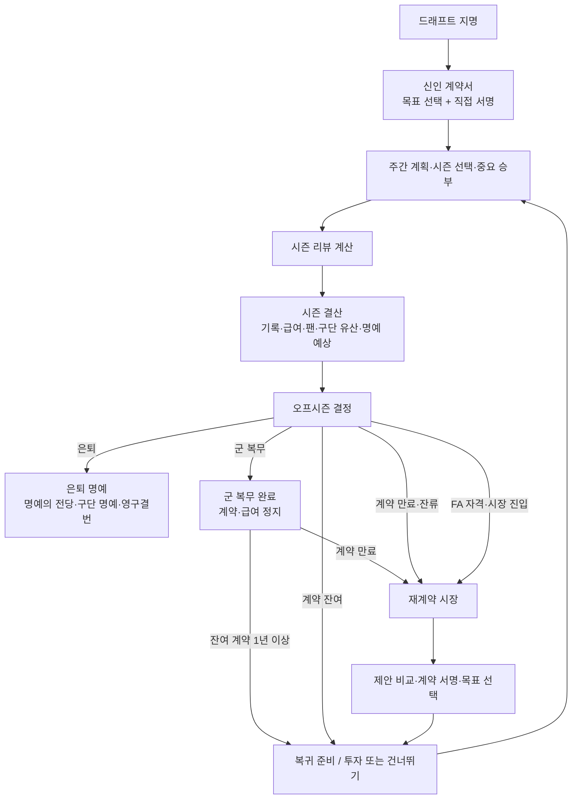

# 프로 커리어 계약·구단 유산·장기 목표 심화 구현 계획

| 항목 | 값 |
|---|---|
| 문서 ID | `DOC-PRO-CAREER-CONTRACT-LEGACY-DEPTH-2026-08-14` |
| 상태 | **iOS 단독 선행 출시 확정 — production 플래그 활성(§21.7). 실기기 ja smoke·ASC 제출 절차 진행 중** |
| 기준일 | 2026-08-17 KST |
| 실행 주체 | 이 저장소를 수정하는 AI 에이전트 |
| 입력 | 유료 구매자 리뷰 1건 + 현재 Swift/iOS/Kotlin 구현 + 기존 프로 주체성 계획 |
| 제품 범위 | 프로 입단부터 은퇴까지의 계약, 장기 목표, 구단별 유산, 팬, 제한된 재정 선택 |
| 1차 코드 범위 | `packages/simulation-core`, `apps/ios` |
| 이번 실행 범위 | Swift core와 iOS만 구현·검증. Kotlin/Android는 수정하지 않고 후속 웨이브로 보류 |
| 패리티 범위 | `apps/android/game-core`, `apps/android/game-application`, `apps/android/feature-career` |
| 비범위 | 광고 도입, 무료화, 가격 변경, 전체 구단 경영, 장비 인벤토리, 실제 야구 IP |

이 문서는 “콘텐츠가 없고 시즌을 반복 생산하는 느낌”, “계약·FA·연봉이 의미 없다”,
“한 구단의 상징이나 영구결번 같은 장기 목표가 없다”, “팬·수입·생활 선택이 커리어와
연결되지 않는다”는 외부 리뷰를 실제 구현 작업으로 바꾸는 단일 실행 명세다.

리뷰에 적힌 기능을 각각 독립 메뉴로 추가하지 않는다. 계약, 시즌 결산, 구단 유산, 팬,
재정, 은퇴 명예가 **한 선수의 같은 기록**을 읽고 서로 원인과 결과가 되게 만든다. 기능 수보다
다음 질문에 답할 수 있는 제품을 목표로 한다.

> 왜 이 팀에 남았는가, 이번 계약에서 무엇을 약속받았는가, 이번 시즌이 내 몸값과 구단 내
> 위치를 어떻게 바꿨는가, 은퇴할 때 무엇으로 기억되는가.

현재 코드와 이 문서가 충돌하면 현재 코드를 기술적 사실의 원본으로 삼는다. 다만 아래의 제품
결정과 불변 계약을 임의로 축소하지 않는다. 구현 중 변경이 필요하면 이 문서의 `결정 기록`에
이유, 저장 호환 영향, 대안, 테스트 영향을 먼저 남긴다.

---

## 0. 문서 우선순위와 실행 방법

### 0.1 기존 계획과의 관계

이 문서는 `docs/PRO_CAREER_AGENCY_FINAL_IMPLEMENTATION_PLAN_2026-08-13.md`를 폐기하지 않는다.
두 문서의 책임은 다음처럼 나눈다.

| 영역 | 우선 문서 |
|---|---|
| 주간 훈련, 회복, 예정 등판 회계, 직접 승부 합성, 기용 면담, 포수 1안·2안 | `PRO_CAREER_AGENCY_FINAL_IMPLEMENTATION_PLAN_2026-08-13.md` |
| 계약 만료, 재계약, FA 제안 비교, 시즌 결산, 구단별 누적 유산, 장기 목표, 팬, 재정, 은퇴 명예 | **이 문서** |
| 공통 저장·결정론·현지화·IP 규칙 | 더 엄격한 조건을 적용 |

기존 계획의 `ProCareerAgencyState`가 아직 구현되지 않았다는 이유로 이 문서의 계약·유산 기능을
그 aggregate 안에 억지로 넣지 않는다. 반대로 이 문서의 `ProCareerJourneyState`에 예정 등판이나
투구 추천 상태를 넣지도 않는다. 두 aggregate는 목적과 롤아웃을 분리한다.

### 0.2 구현 에이전트가 시작 전에 읽을 파일

다음 순서로 읽는다.

1. 루트 `AGENTS.md`
2. 이 문서 전체
3. `docs/PRO_CAREER_AGENCY_FINAL_IMPLEMENTATION_PLAN_2026-08-13.md`
4. `docs/LINEAGE_ATTACHMENT_REBIRTH_FINAL_IMPLEMENTATION_PLAN_2026-08-13.md`
5. `packages/simulation-core/Sources/SimulationCore/ProCareer.swift`
6. `apps/ios/Sources/CareerBootstrap.swift`
7. `apps/ios/Sources/MobileCareerStore.swift`
8. `apps/ios/Sources/CareerFlowView.swift`
9. `apps/ios/Sources/AppShell.swift`, `RecordView.swift`, `ProCareerPresentation.swift`
10. `apps/android/game-core/src/main/kotlin/com/solkim/baseball/core/pro/*`
11. 작업 대상 테스트와 localization catalog

### 0.3 구현 단위

- 한 번에 한 웨이브만 구현한다.
- 웨이브 0의 characterization test 없이 저장 모델을 바꾸지 않는다.
- Swift 규칙을 먼저 확정하고 exporter fixture를 만든 뒤 Kotlin이 같은 결과를 읽게 한다.
- iOS와 Android가 같은 production save를 공유한다는 뜻은 아니다. **같은 명령·상태 의미와
  결정론적 결과**를 fixture로 맞춘다는 뜻이다.
- 각 웨이브는 별도 커밋과 별도 evidence를 남길 수 있어야 한다.
- 현재 dirty worktree의 사용자 변경을 reset, checkout, stash, 삭제, 덮어쓰기 하지 않는다.

---

## 1. 리뷰 해석과 최종 제품 결정

### 1.1 받아들일 진단

리뷰의 가장 중요한 신호는 기능의 절대 개수가 아니다.

1. 프로 시즌을 넘긴 결과가 다음 시즌의 계약·대우·목표로 이어지지 않는다.
2. 같은 구단에 남는 것과 다른 구단으로 가는 것의 장기 차이가 없다.
3. 연봉은 존재해도 보이지 않거나 쓸 수 없어 숫자 장식이다.
4. 팬 관심과 유명세가 고교 이후 사라져 스타가 되어 가는 감각이 없다.
5. 명예의 전당은 은퇴 뒤 점수 하나로만 나타나므로 진행 중 목표가 되지 못한다.
6. 텍스트 이벤트를 더 넣는 것만으로는 “반복 작업”이라는 인상을 바꾸지 못한다.

### 1.2 그대로 채택하지 않을 요구

| 리뷰 요구 | 판정 | 이유 |
|---|---|---|
| 모든 FA를 장기 계약으로 고정 | 부분 채택 | 계약 기간은 1~4년 범위의 선택이어야 한다. 기간·연봉·보직·구단 유산의 trade-off가 핵심이다. |
| 생활용품·장비 상점 대량 추가 | 기각 | 영구 능력치 구매와 메뉴 반복은 현재의 작업감을 더 키우고 강한 선수가 더 강해지는 경제를 만든다. |
| CF·유니폼 판매를 별도 경영 게임으로 구현 | 기각 | 팬과 수입은 기존 시즌 결정·결산에 연결한다. 별도 광고회사/상품 경영 시뮬레이션은 만들지 않는다. |
| 광고를 넣고 무료화 | 기각 | 반복감과 목표 부재를 해결하지 못하고 “광고 없음·한 번 구매” 약속을 훼손한다. |
| 즉시 가격 인하 | 보류 | 단일 리뷰만으로 가격을 바꾸지 않는다. 먼저 구매 후 가치 체감을 고치고 시즌 진행 데이터를 본다. |

### 1.3 최종 제품 결정

1. 신인 계약은 자동 서명하지 않는다. 지명 뒤 **계약서 화면을 보고 직접 서명**한다.
2. 계약 기간은 실제로 0까지 줄고, 만료 시 재계약 또는 FA 시장이 열린다.
3. FA는 버튼 한 번으로 정해진 팀으로 이동하지 않는다. 2~3개의 비지배 제안을 비교한다.
4. 시즌 종료에는 별도 **시즌 결산 국면**이 있고, 기록·수상·급여·팬·구단 유산·명예의 전당
   예상·장기 목표가 한 번에 정산된다.
5. 구단별 기록을 분리해 같은 구단에서 쌓은 시간과 성적만 “구단의 상징”과 영구결번에 쓴다.
6. 커리어 목표를 계약 단위로 하나 선택하고 대시보드에서 항상 다음 기준을 보여 준다.
7. 연봉과 계약금은 `통산 수입`과 `사용 가능 자금`으로 남는다.
8. 자금은 시즌당 한 번의 제한된 오프시즌 투자에만 쓴다. 영구 능력치 상점은 만들지 않는다.
9. 프로 팬 지지를 추가하고 중요 승부·수상·장기 잔류·미디어 선택과 연결한다.
10. 은퇴 결말은 명예의 전당, 구단 명예, 영구결번, 통산 수입, 완수한 목표를 함께 보여 준다.

### 1.4 성공의 정의

사용자는 어느 프로 국면에서든 다음 다섯 문장에 답할 수 있어야 한다.

- 현재 계약은 어느 구단과 몇 년이며 연봉과 보직 약속은 무엇인가.
- 이 구단에서 몇 시즌을 보냈고 다음 구단 위상까지 무엇이 남았는가.
- 이번 커리어 목표와 현재 진행률은 얼마인가.
- 이번 시즌이 끝나면 계약·수입·팬·명예 점수가 어떻게 바뀌는가.
- 지금 이적하면 얻는 것과 잃는 것은 무엇인가.

---

## 2. 현재 코드 기준선과 결함

### 2.1 이미 있는 자산

- `ProContractSnapshot`에는 `yearsRemaining`, `annualSalary`, `rolePromise`가 있다.
- 신인 계약은 3년으로 생성된다.
- 오프시즌에는 잔류·군 복무·FA·은퇴 UI가 있다.
- FA 자격은 1군 등록 6년으로 계산한다.
- 프로 커리어는 최대 20시즌이다.
- 시즌 기록은 `ProSeasonStats.teamID`를 보존한다.
- 수상·마일스톤·뉴스·명예의 전당 점수가 있다.
- 최근 구현에는 시즌당 세 번의 선택과 `ProCareerStanding.clubSymbol`이 있다.
- Android Kotlin 코어에는 Swift fixture를 비교하는 `ProCareerFixtureTest`가 있다.

### 2.2 이번 계획이 고칠 구체적 결함

| 결함 | 현재 동작 | 목표 동작 |
|---|---|---|
| 신인 계약의 체감 부재 | `CareerBootstrap.startCareer`가 `start` 직후 `signContract`까지 호출한다. | `.contractOffer`에서 계약 조건·목표를 보고 서명한다. |
| 계약이 만료되지 않음 | 매년 `max(1, yearsRemaining - 1)`로 최소 1년에 고정된다. | 시즌 결산 때 0까지 감소하고 만료 시 시장을 연다. |
| FA 선택 부재 | 현재 팀 인덱스에서 `+3` 위치의 한 팀으로 자동 이동한다. | 현재 팀 포함 2~3개 저장형 제안을 비교하고 하나를 수락한다. |
| 연봉의 무의미 | 계약 필드에만 있고 주요 iPhone 화면과 재정 결과에 연결되지 않는다. | 급여를 정확히 한 번 지급하고 통산 수입·사용 가능 자금·투자에 연결한다. |
| 구단 상징의 오판 | 전체 `serviceYears`와 전체 성적만으로 새 구단에서도 `clubSymbol`이 될 수 있다. | 현재 구단에서 실제로 쌓은 시즌·기록·수상으로만 구단 위상을 계산한다. |
| 명예 점수의 사후성 | `hallOfFameScore`는 은퇴할 때만 확정된다. | 현재 시즌을 포함한 “은퇴한다면 예상” 값을 항상 보여 준다. |
| 시즌 결산의 빈약함 | 시즌 리뷰는 일반 `ActionCard`이고 결과는 요약 배너에 머문다. | 저장형 결산 화면에서 before/after와 다음 목표를 확인한다. |
| 프로 팬 축 부재 | 고교에는 `fanInterest`가 있으나 `ProCareerSnapshot`에는 대응 축이 없다. | 프로 팬 지지 0...100을 기록·미디어·구단 유산에 연결한다. |

### 2.3 기술 부채를 기능처럼 숨기지 않는다

- 현재 `contract` 필드를 화면에 노출하는 것만으로 완료 처리하지 않는다. 만료되지 않는 계약을
  보여 주면 결함이 더 잘 보일 뿐이다.
- 현재 `clubSymbol` 문구를 “프랜차이즈 스타”로 바꾸는 것만으로 완료 처리하지 않는다.
- FA 뉴스 문장을 세 개로 늘려도 선택 가능한 offer가 저장되지 않으면 완료가 아니다.
- 시즌 결산을 UI에서 현재 상태끼리 빼서 추측하지 않는다. 엔진이 settlement를 만들어 저장한다.

---

## 3. 목표와 비목표

### 3.1 목표

1. 계약 조건이 실제 기용과 오프시즌 선택에 영향을 준다.
2. 다년 계약의 기간이 실제로 흐르고 만료·재계약이 발생한다.
3. FA 제안이 서로 다른 장점을 가져 한 제안이 모든 면에서 지배하지 않는다.
4. 같은 구단에서 보낸 시간이 눈에 보이는 장기 진행이 된다.
5. 시즌 하나를 마칠 때 최소 한 개의 장기 진행 값이 달라진다.
6. 연봉과 팬이 숫자 장식이 아니라 선택의 자원과 결과가 된다.
7. 장기 시스템을 추가해도 한 시즌의 탭 수와 직접 투구 밀도를 불필요하게 늘리지 않는다.
8. 기존 저장, 결정론, 환생 계보, 한국어·영어·일본어 지원을 보존한다.

### 3.2 비목표

- 실제 프로 구단명, 구단 약칭, 리그명, 선수명, 로고, 유니폼 문양, 슬로건을 사용하지 않는다.
- 구단 재정, 샐러리캡, 에이전트 협상 대화, 트레이드 블록 전체를 시뮬레이션하지 않는다.
- 계약 협상을 확률형 미니게임이나 재시도 RNG로 만들지 않는다.
- 집·차·시계·글러브 같은 수집형 인벤토리를 만들지 않는다.
- 돈으로 구위·제구·변화·체력을 직접 영구 구매하지 않는다.
- 팬 지지를 소셜 네트워크, 계정, 온라인 서버와 연결하지 않는다.
- 광고 SDK, 보상형 광고, 인앱 재화, 구독을 추가하지 않는다.
- 현재 최대 20시즌, 24주 시즌, RA9 표기를 바꾸지 않는다.
- 완료된 과거 시즌을 새 규칙으로 재시뮬레이션하지 않는다.

### 3.3 일정 압박 시 범위 축소 순서

1. 저장 호환, 실제 계약 만료, settlement 원자성, non-dominated market, current-team 유산,
   ko/en/ja는 축소하지 않는다.
2. 먼저 미디어 출연 이벤트를 뒤 웨이브로 미룬다. 팬 지지 자체와 계약/결산 연결은 남긴다.
3. 다음으로 investment 선택지를 3종에서 연구소·회복팀·none으로 줄일 수 있으나 돈으로 영구
   능력치를 사는 대체 기능은 넣지 않는다.
4. 화려한 계약 도장·count-up 애니메이션은 가장 먼저 생략할 수 있다.
5. 가격 변경, 광고 SDK, 장비 상점으로 일정 문제를 “대체 해결”하지 않는다.

범위 축소도 결정 기록과 수용 기준을 갱신한 뒤 수행한다. 핵심 루프가 검증되기 전에 부가 기능을
동시에 구현해 저장 표면만 넓히지 않는다.

---

## 4. 절대 불변 제품 계약

### 4.1 선택 전 공개 계약

계약 제안은 수락 전에 다음을 모두 보여 준다.

- 구단
- 총 계약 기간과 남은 기간의 의미
- 연평균 연봉과 총 보장 금액
- 약속 보직
- 구단 상황: 성장 기회, 균형, 우승 도전 중 하나
- 계약 목표
- 현재 구단에 남을 때 유지되는 구단 유산
- 이적할 때 새 구단 위상이 처음부터 시작된다는 사실

숨은 보너스나 수락 후 처음 드러나는 핵심 페널티를 두지 않는다.

### 4.2 비지배 제안 계약

계약 시장의 한 제안이 다음 다섯 축에서 모두 다른 제안 이상이면 생성 실패다.

1. 연봉
2. 계약 기간
3. 보직 안정성
4. 구단 유산 연속성 또는 성장 기회
5. 계약 목표 난도(쉬울수록 우위)

예를 들어 가장 높은 연봉을 주는 구단은 짧은 기간, 낮은 보직 보장, 강한 경쟁 중 최소 하나를
가져야 한다. 현재 구단은 구단 유산 연속성을 독점하지만 항상 최고 연봉이어서는 안 된다.

### 4.3 구단별 유산 계약

- `clubSymbol`과 영구결번은 전체 서비스 연수가 아니라 **해당 구단에서 완료한 기록**만 본다.
- 이적해도 이전 구단 기록은 사라지지 않는다.
- 새 구단의 위상은 새로 시작하지만 전체 통산 기록·팬 지지·명예의 전당 예상은 유지된다.
- 구단 유산 점수는 화면과 엔진이 같은 순수 함수를 사용한다.
- 영구결번은 은퇴 시점의 결과이며 진행 중에는 “후보”로만 표기한다.

### 4.4 재정 계약

- 급여·계약금·응원 상품 수익·광고 출연료는 저장 성공 뒤 정확히 한 번만 지급한다.
- 자금은 음수가 될 수 없다.
- 한 시즌에 오프시즌 투자는 최대 한 번이다.
- 투자는 영구 능력치 직접 구매가 아니다.
- 고연봉 선수가 무한히 버프를 쌓지 못하도록 투자 효과는 1시즌 또는 1회 charge로 제한한다.
- 앱 결제와 선수 재정은 완전히 분리한다. 선수 자금은 구매 가능한 유료 재화가 아니다.

### 4.5 팬 계약

- 팬 지지는 0...100의 정수다.
- 팬 지지는 경기 결과 한 번으로 큰 폭으로 오르내리지 않는다.
- 중요 승부, 수상, 기록, 장기 잔류, 미디어 선택처럼 설명 가능한 사건만 바꾼다.
- 팬 지지는 구위·제구 같은 능력치를 직접 올리지 않는다.
- 팬 지지는 응원 상품 수익, 미디어 기회, 은퇴 명예, 구단 유산의 보조 조건에만 사용한다.

### 4.6 현 선수 우선 계약

- 은퇴 전 화면에서 다음 세대 보상보다 현 선수의 계약·목표·구단 위상·다음 시즌을 먼저 보여 준다.
- 장기 목표 완료의 1차 보상은 현 커리어 안의 칭호·팬 반응·결말이다.
- 환생 보상은 은퇴 결산의 후순위 결과로만 연결한다.

### 4.7 저장·결정론 계약

- 같은 상태·같은 명령·같은 시드는 같은 offer, settlement, 팬 변화, 재정 결과를 만든다.
- 계약 시장을 화면 재진입 때 다시 생성하지 않는다. 한 번 만든 offer를 저장한다.
- offer 생성에는 전용 안정 해시 스트림을 써 기존 투구 `nextSeed` 소비 순서를 바꾸지 않는다.
- 안정 해시는 기존 `StableHash.fnv1a64`의 UTF-8 구현을 쓰고 필드를 `|`로 연결한다. Swift
  `Hasher`, Kotlin `hashCode`, locale 숫자 문자열을 사용하지 않는다.
- 새 상태에는 현지화된 자유 문장을 저장하지 않는다. 안정 ID와 수치만 저장한다.
- 구저장에서 `journeyState == nil`이면 기존 commitment 문자열을 바꾸지 않는다.

### 4.8 현지화·배포 계약

- 새 iOS 공개 빌드는 한국어·영어·일본어 값을 모두 가진다.
- `Localizable.xcstrings`와 `GameContent.xcstrings`의 새 키에 `ko`, `en`, `ja`가 모두 없으면
  릴리스하지 않는다.
- 영어와 일본어에서도 계약 금액은 같은 한국 세계의 KRW로 표시한다. 통화를 변환하지 않는다.
- signed IPA에 `ko.lproj`, `en.lproj`, `ja.lproj`와 새 catalog 번역이 실제 포함됐는지 검사한다.
- 일본어 앱 이름·시스템 문구·앱 내부 언어 판별 경로를 일본어 기기/TestFlight에서 확인하고,
  App Store 지원 언어에 `Japanese`가 표시되기 전에는 심사 제출·수동 출시하지 않는다.

---

## 5. 목표 사용자 흐름

### 5.1 전체 상태 흐름



### 5.2 신인 계약

지명 연출 뒤 프로 저장은 `.contractOffer`에서 시작한다. 화면은 지명 구단의 한 개 신인 제안을
보여 준다. 신인 지명권을 무효화하는 거절·다른 구단 재추첨은 제공하지 않는다.

표시 순서:

1. 구단과 지명 순번
2. 계약금
3. 총 3년, 연봉, 선발 육성 약속
4. 구단의 육성 계획과 경쟁자
5. 첫 계약에서 추구할 커리어 목표 3개
6. `계약서에 서명한다`

서명 성공 뒤에만 계약금이 재정에 들어가고
`pro_contract_signed(market_kind = rookie)` 이벤트가 발생한다.

### 5.3 시즌 중 대시보드

기존 `TodayDashboard`의 상단 정보 계층을 다음처럼 고정한다.

1. 이번 시즌·주차·구단·보직
2. 다음 행동
3. 현재 계약: `3년 계약 · 2년 남음 · 연봉 1억 2,000만 원 · 선발 약속`
4. 현재 커리어 목표와 다음 기준
5. 현재 구단에서의 위상과 다음 tier
6. 명예의 전당 예상
7. 피로·감독의 믿음·부상
8. 시즌 긴장·라이벌·최근 등판·뉴스

모든 카드를 항상 펼치면 기존 정보 과다를 키운다. 계약·목표·구단 위상은 한 개의
`CareerDirectionCard` 안에서 핵심 한 줄과 progress를 먼저 보여 주고 세부는 펼친다.

### 5.4 시즌 결산

24주가 끝나면 기존 `seasonReview` 계산 뒤 `.seasonSettlement`로 이동한다. 결산은 다음 순서다.

1. 이번 시즌 기록과 리그/팀 결과
2. 새 수상과 주요 기록
3. 이번 시즌 급여와 응원 상품 수익 지급
4. 팬 지지 before → after
5. 현재 구단 유산 점수와 tier before → after
6. 명예의 전당 예상 before → after
7. 계약 잔여 기간 before → after
8. 커리어 목표 진행 또는 완료
9. 다음 행동: 계약 유지, 계약 만료, FA 가능, 은퇴 가능 중 하나

사용자가 `결산을 확인했다`를 누르기 전에는 오프시즌 선택으로 넘어가지 않는다. 저장 후 재실행하면
같은 결산 화면이 다시 열리고, 두 번 급여를 지급하거나 점수를 더하지 않는다.

### 5.5 오프시즌

오프시즌 선택 가능성은 상태에 따라 달라진다.

| 조건 | 가능한 선택 |
|---|---|
| 계약 잔여 1년 이상 | 현재 계약으로 다음 시즌, 군 복무, 은퇴 |
| 계약 만료·FA 자격 미달 | 현재 구단 재계약 시장, 군 복무, 은퇴 |
| 계약 만료·FA 자격 충족 | 현재 구단만 재계약 협상, FA 시장, 군 복무, 은퇴 |
| 최대 시즌 도달 | 은퇴만 가능 |

`FA`는 계약이 남아 있을 때 잠그고 남은 기간을 설명한다. 첫 버전에는 opt-out, 방출, 트레이드,
보상 선수, 샐러리캡을 넣지 않는다.

군 복무는 `militaryCompleted == false`일 때만 표시한다. 잔여 계약이 있으면 그 계약을 정지한 채
복귀하고, 이미 계약이 만료됐다면 복귀 시점에 FA 자격 충족 여부에 따라 재계약 또는 FA market을
한 번 생성한다. 계약이 0년인 채 투자 화면이나 다음 시즌으로 우회할 수 없다.

### 5.6 계약 시장

- FA 자격 미달 재계약: 같은 구단의 `장기 안정`과 `단기 증명` 2개 제안.
- FA 시장: 현재 구단 1개 + 다른 구단 2개, 총 3개 제안.
- 10개 구단 전체를 목록으로 보여 주거나 원하는 구단을 자유 선택하게 하지 않는다.
- offer는 시장을 열 때 한 번 생성해 저장하며 취소·재진입해도 같다.
- 수락 전 확인 화면에서 연봉, 기간, 보직, 목표, 구단 유산 영향을 다시 읽는다.

### 5.7 오프시즌 투자

계약을 이어 가거나 새 계약에 서명한 뒤 시즌당 한 번만 연다. 투자하지 않고 바로 다음 시즌으로
갈 수 있다. 첫 시즌 시작 전에는 투자 화면을 열지 않아 신인 onboarding을 늘리지 않는다.

결산·오프시즌·계약 시장·투자 화면에서는 `state.season`이 방금 완료한 시즌 N에 머문다. 투자
선택 또는 `투자하지 않고 다음 시즌` 명령이 성공할 때만 나이, 시즌 N+1, 빈 시즌 기록을 한 번에
적용한다. 따라서 화면 재실행이나 market 왕복으로 나이·시즌이 두 번 증가하지 않는다.

### 5.8 은퇴

은퇴 결산은 다음을 독립 판정한다.

- 명예의 전당 헌액 여부
- 마지막 구단의 영구결번 여부
- 각 구단의 명예 tier
- 완수한 커리어 목표와 칭호
- 통산 기록·수상·통산 수입
- 마지막 계약과 마지막 구단
- 그 뒤에만 야구혼·대표 유산 등 다음 선수에게 남기는 것을 보여 준다.

계약 기간이 남은 자발적 은퇴 확인에는 남은 시즌 수와 “플레이하지 않은 시즌의 연봉은 통산
수입에 지급되지 않습니다”를 수락 전에 표시한다. 이미 완료한 시즌 급여는 되돌리지 않는다.

---

## 6. 목표 상태 모델

`ProCareerSnapshot`은 이미 필드가 많고 Swift에서 수기 `==`와 `replacing(...)`을 사용한다. 개별
필드를 계속 늘리지 않고 옵셔널 aggregate 하나를 추가한다.

```swift
public struct ProCareerJourneyState: Codable, Equatable, Sendable {
    public let rulesVersion: Int
    public let activeGoal: ProCareerGoalState?
    public let goalHistory: [ProCareerGoalRecord]
    public let pendingContractMarket: ProContractMarket?
    public let contractHistory: [ProContractRecord]
    public let teamRecords: [ProTeamCareerRecord]
    public let recognitions: [ProCareerRecognition]
    public let reputation: ProReputationState
    public let finances: ProFinanceState
    public let activeSeasonBenefit: ProSeasonBenefit?
    public let lastSettlement: ProSeasonSettlement?
    public let settlementAcknowledged: Bool
    public let offseasonTransition: ProOffseasonTransition?
    public let retirementHonors: [ProRetirementHonor]
    public let migration: ProJourneyMigration
}
```

`ProCareerSnapshot`에는 다음 한 필드만 추가한다.

```swift
public let journeyState: ProCareerJourneyState?
```

`journeyState == nil`은 기존 규칙으로 읽는다. 신규 커리어와 안전한 전환 경계에서만 v1을 만든다.

아래는 위 aggregate에서 참조하는 감사·전환 타입이다. 구현 에이전트가 문자열 배열이나 임시 Bool로
대체하지 않는다.

```swift
public enum ProCareerGoalOutcome: String, Codable, Sendable {
    case completed
    case replaced
    case retiredIncomplete = "retired_incomplete"
}

public struct ProCareerGoalRecord: Codable, Equatable, Identifiable, Sendable {
    public let id: String
    public let ambition: ProCareerAmbition
    public let selectedSeason: Int
    public let anchorTeamID: String?
    public let completedSeason: Int?
    public let endedSeason: Int
    public let outcome: ProCareerGoalOutcome
}

public enum ProContractEndReason: String, Codable, Sendable {
    case expired
    case retired
    case migrated
}

public struct ProContractRecord: Codable, Equatable, Identifiable, Sendable {
    public var id: String { contractID }
    public let contractID: String
    public let teamID: String
    public let kind: ProContractKind?      // nil이면 legacy active contract
    public let signedSeason: Int
    public let totalYears: Int
    public let annualSalary: Int
    public let signingBonus: Int?
    public let rolePromise: ProRole
    public let expectation: ProContractExpectation?
    public let coveredSeasons: [Int]
    public let fulfilledExpectationSeasons: [Int]
    public let endedSeason: Int?
    public let endReason: ProContractEndReason?
}

public enum ProCareerRecognitionKind: String, Codable, Sendable {
    case award
    case milestone
}

public struct ProCareerRecognition: Codable, Equatable, Identifiable, Sendable {
    public let id: String                 // 사건 인스턴스 ID
    public let kind: ProCareerRecognitionKind
    public let contentID: String          // 예: pro.award.command
    public let season: Int
    public let teamID: String?
    public let value: Int?
}

public enum ProOffseasonTransitionRoute: String, Codable, Sendable {
    case underContract = "under_contract"
    case renewalMarket = "renewal_market"
    case freeAgencyMarket = "free_agency_market"
}

public struct ProOffseasonTransition: Codable, Equatable, Sendable {
    public let afterSeason: Int
    public let nextSeason: Int
    public let ageAdvanceYears: Int       // 일반 1, 군 복무 2
    public let includesMilitaryService: Bool
    public let route: ProOffseasonTransitionRoute
}

public enum ProJourneyMigrationSource: String, Codable, Sendable {
    case newCareer = "new_career"
    case legacySafeBoundary = "legacy_safe_boundary"
}

public struct ProJourneyMigration: Codable, Equatable, Sendable {
    public let source: ProJourneyMigrationSource
    public let initializedSeason: Int
    public let financeStartsSeason: Int
    public let unassignedLegacyAwards: Int
    public let financeNoticePending: Bool
}
```

감사 배열은 커리어 최대 20시즌이라는 상한 아래 `contractHistory`, `goalHistory` 각각 최대 20개,
`recognitions` 최대 256개로 검증한다. 정상 플레이에서 cap을 넘으면 오래된 계약·목표를 버리지 말고
validation error와 진단을 남긴다. 계약 서명 때 active 계약 record를 append하고, 매 결산에서 해당
record의 covered/fulfilled season을 갱신하며, 만료·은퇴 때만 종료 필드를 채운다.

`settlementAcknowledged`의 상태 조합도 고정한다.

- `.seasonSettlement`: `lastSettlement != nil`, `settlementAcknowledged == false`.
- acknowledge 성공: 같은 settlement를 유지하고 `settlementAcknowledged == true`로 만든 뒤 phase 이동.
- 다음 결산 생성: `lastSettlement`을 새 값으로 교체하고 다시 false로 만든다.
- 같은 settlement ID의 두 번째 acknowledge는 reload된 현재 state에서 phase guard보다 먼저 ID를
  확인해 값·revision·transaction을 바꾸지 않는 성공으로 처리한다. stale 원본 state를 다시 쓰지는
  않고 store CAS 충돌 뒤 현재 저장을 reload한다.
- 그 밖의 phase에서 `settlementAcknowledged == false`인 저장은 invalid다.

phase별 journey validation은 다음을 최소 조건으로 둔다.

| phase | 필수 조건 |
|---|---|
| 신인 `contractOffer` | contract nil, rookie market 1개, transition nil, `forSeason == 1` |
| non-rookie `contractOffer` | 기존 contract 0년, renewal 2개 또는 FA 3개 market, transition non-nil |
| `weeklyPlan` / `seasonDecision` / `importantGame` / `seasonReview` | full journey contract ID·team ID·1년 이상, pending market nil, transition nil |
| `seasonSettlement` | 저장된 settlement, acknowledged false, pending market/transition nil |
| `offseasonDecision` / `retirementDecision` | acknowledged true, pending market/transition nil |
| `offseasonInvestment` | 1년 이상 계약, pending market nil, route `underContract` transition non-nil |
| `completed` | pending market/transition nil, retirement honor canonical order |

모든 journey active contract는 snapshot ID와 마지막 미종료 contract record ID가 같아야 한다.
contract/team ID 불일치, 음수 자금, 범위 밖 팬, 중복 season/recognition/transaction ID, market kind와
offer 개수 불일치는 decode 뒤 첫 명령에서 조용히 고치지 말고 invalid state로 거부한다. 오직 명시된
legacy migration만 backfill할 수 있다.

active season phase에서는 `careerStats`에 `state.season`이 없어야 한다. settlement부터 다음 시즌
시작 전까지는 currentStats와 같은 season/team의 careerStats row가 정확히 하나 있어야 한다. 이 규칙이
HOF projection, team record, 급여의 이중 합산을 막는다.

### 6.1 계약 확장

기존 필드와 initializer 호출을 보존하면서 `ProContractSnapshot`을 확장한다.

```swift
public struct ProContractSnapshot: Codable, Equatable, Sendable {
    public let yearsRemaining: Int
    public let annualSalary: Int
    public let rolePromise: ProRole

    // journey v1. 구저장에는 nil이다.
    public let id: String?
    public let teamID: String?
    public let totalYears: Int?
    public let signedSeason: Int?
    public let kind: ProContractKind?
    public let expectation: ProContractExpectation?
}

public enum ProContractKind: String, Codable, Sendable {
    case rookie
    case renewalLong = "renewal_long"
    case proveIt = "prove_it"
    case freeAgent = "free_agent"
}
```

규칙:

- `yearsRemaining`은 현재 또는 다음에 수행할 보장 시즌 수다.
- 시즌 결산에서 급여 지급 뒤 1 감소하며 0을 허용한다.
- `.weeklyPlan`, `.seasonDecision`, `.importantGame`에서는 유효한 계약과 `yearsRemaining >= 1`이
  반드시 필요하다.
- `totalYears`는 1...4다. 신인 계약은 3년 고정이다.
- 새 offer의 years는 `min(기본 기간, maximumCareerSeasons - forSeason + 1)`로 줄여 20시즌 뒤
  미지급 보장 연도가 남지 않게 한다. 남은 플레이 시즌이 0이면 market을 만들지 않고 은퇴로 간다.
- `teamID`는 계약 기간 동안 `state.team.id`와 같아야 한다.
- 정상 active/expired record는 `coveredSeasons.count + yearsRemaining == totalYears`이고 covered season은
  중복 없이 오름차순이다. fulfilled expectation seasons는 covered seasons의 중복 없는 부분집합이다.
  `endReason == retired`만 미사용 보장 연도가 남은 조기 종료를 허용한다.
- 총 보장 연봉은 `Int64(annualSalary) * Int64(totalYears)`로 계산하며 별도 저장하지 않는다. 신인
  계약금은 이 금액과 분리해 offer, contract record, finance transaction으로 추적한다.
- 기존 3-argument initializer는 신규 필드를 모두 nil로 채우는 source-compatibility 경로로 남긴다.
  production journey 계약은 full initializer/factory만 사용하고 nil ID 계약을 새로 만들지 않는다.
- 구저장 계약의 신규 필드가 nil이면 `legacy` adapter가 읽기 전용 표시값을 만든다.

### 6.2 계약 시장과 제안

```swift
public struct ProContractMarket: Codable, Equatable, Sendable {
    public let id: String
    public let kind: ProContractMarketKind
    public let forSeason: Int
    public let generatedAtRevision: UInt64
    public let offers: [ProContractOffer]
}

public enum ProContractMarketKind: String, Codable, Sendable {
    case rookie
    case renewal
    case freeAgency = "free_agency"
}

public struct ProContractOffer: Codable, Equatable, Identifiable, Sendable {
    public let id: String
    public let teamID: String
    public let years: Int
    public let annualSalary: Int
    public let signingBonus: Int?
    public let contractKind: ProContractKind
    public let rolePromise: ProRole
    public let outlook: ProTeamOutlook
    public let expectation: ProContractExpectation
    public let preservesTeamLegacy: Bool
}

public enum ProTeamOutlook: String, Codable, Sendable {
    case opportunity   // 성장·기용 기회가 크고 연봉은 낮다.
    case balanced
    case contender     // 경쟁이 강하고 연봉은 높지만 보직 보장이 약하다.
}
```

offer에는 구단명·설명문을 저장하지 않는다. `teamID`, enum, 수치만 저장하고 catalog와 localization이
표시 문장을 만든다. 신인 offer의 `signingBonus`는 `StartProCareerParams.draftResult.signingBonus`와
같아야 하며 non-rookie offer에서는 nil이다. `Int64(annualSalary) * Int64(years)`는 총 보장
연봉이고 계약금은 여기에 포함하지 않는다. UI도 `총 보장 연봉`과 `계약금`을 별도 행으로 표시한다.

non-rookie offer의 `preservesTeamLegacy`는 `offer.teamID == state.team.id`와 정확히 같아야 한다.
이적해도 과거 team record를 삭제하지 않지만 새 current-team tier는 그 새 팀 record에서 계산한다.

신인 offer는 다른 market band를 쓰지 않고 다음 고정 table로 시작한다.

| 지명 라운드 | 연봉 |
|---:|---:|
| 1 | 8,000만 원 |
| 2 | 6,000만 원 |
| 3 | 5,000만 원 |
| 4 이상 | 4,000만 원 |

기간 3년, `contractKind = rookie`, `rolePromise = starter`, `outlook = opportunity`,
`preservesTeamLegacy = true`, expectation difficulty accessible이다. drafted인데
round/signing bonus/team이 nil이면 임의 값을 만들지 않고 start를 거부한다.

### 6.3 계약 목표

```swift
public enum ProContractExpectationKind: String, Codable, Sendable {
    case majorRoster = "major_roster"
    case innings
    case strikeouts
    case saves
    case runPrevention = "run_prevention"
}

public struct ProContractExpectation: Codable, Equatable, Sendable {
    public let kind: ProContractExpectationKind
    public let target: Int
    public let difficulty: ProExpectationDifficulty
}

public enum ProExpectationDifficulty: String, Codable, Sendable {
    case accessible
    case standard
    case stretch
}
```

- 목표는 현재 역할과 능력에 맞게 하나만 준다.
- `majorRoster` target은 1, innings target은 아웃 수, strikeouts/saves는 개수, RA9 target은 permille
  정수로 저장한다.
- 시즌 목표 달성은 감독의 믿음 +3과 settlement fan reason +3을 적용한 뒤 각 전역 범위로
  clamp한다. 다음 market의 +5/0/-3은 7.3의 계약 전체 달성률로 한 번 계산한다.
- 시즌 목표 미달은 settlement fan reason -1만 적용하며 커리어를 막거나 계약을 일방 해지하지
  않는다.
- 목표 진행은 대시보드와 결산에 항상 보인다.
- expectation은 계약의 각 covered season에 같은 target을 적용하고 계약 중간에 몰래 올리지 않는다.
  UI는 `계약 기간 동안 매 시즌 목표`라고 명시한다.

초기 expectation builder는 다음 단일 규칙을 사용한다.

| 조건 | kind | 기본 target |
|---|---|---:|
| 신인 또는 현재 minor | `majorRoster` | 1 |
| major `starter` | `innings` | `clamp(max(240, 직전 inningsOuts × 90%), 240, 420)` |
| major `longRelief` | `innings` | `clamp(max(120, 직전 inningsOuts × 90%), 120, 240)` |
| major `setup` | `strikeouts` | `clamp(max(35, 직전 K × 90%), 35, 80)` |
| major `closer` | `saves` | `clamp(max(12, 직전 SV × 90%), 12, 30)` |
| `contender` offer이며 직전 60아웃 이상 | `runPrevention`으로 교체 | `clamp(직전 RA9permille, 3_500, 5_000)` |

직전 기록이 없으면 표의 하한을 쓴다. `proveIt`은 difficulty stretch로 counting target을 110%로
올리고 RA9 target을 90%로 낮춘다. `renewalLong`과 opportunity offer는 accessible로 counting 90%,
RA9 110%로 완화한다. contender는 stretch, 나머지는 standard다. 각 표의 최종 clamp를 다시 적용한다.
counting은 target 이상, run prevention은 target 이하가 성공이다.
RA9는 해당 시즌 60아웃 미만이면 actual nil·미달로 처리한다. `majorRoster` actual은 결산 시 level이
major면 1, 아니면 0이다. 화면과 settlement가 이 actual 함수를 같이 쓴다.

### 6.4 구단별 기록

```swift
public struct ProTeamCareerRecord: Codable, Equatable, Identifiable, Sendable {
    public var id: String { teamID }
    public let teamID: String
    public let completedSeasons: Int
    public let consecutiveSeasons: Int
    public let games: Int
    public let starts: Int
    public let inningsOuts: Int
    public let strikeouts: Int
    public let wins: Int
    public let saves: Int
    public let awardCount: Int
    public let communityPoints: Int
    public let lastSeason: Int?
}
```

- 현재 시즌은 결산이 끝나기 전까지 `completedSeasons`에 들어가지 않는다.
- 동일 시즌을 두 번 더할 수 없다.
- 시즌 N 결산에서 기존 `lastSeason == N - 1`이면 consecutive +1, 아니면 1로 시작한다. 군 복무는
  플레이 시즌 번호를 소비하지 않으므로 이 연속성을 끊지 않는다.
- `teamRecords`는 teamID 오름차순 canonical order로 저장한다.
- 구단 catalog 최대 10개이므로 배열도 최대 10개다.
- games/starts/inningsOuts/K/wins/saves의 전체 합계는 `careerStats`와 일치해야 한다. 구저장
  migration의 award backfill 예외는 별도 표시한다.
- 새 구단 계약 시 통계 0의 record가 없으면 생성한다. 따라서 첫 시즌 전 fan foundation도 새 구단의
  community에 안전하게 기록할 수 있지만 `completedSeasons`는 결산 전까지 0이고 `lastSeason`은
  nil이다.

### 6.5 커리어 목표

```swift
public enum ProCareerAmbition: String, Codable, Sendable {
    case franchiseIcon = "franchise_icon"
    case recordBook = "record_book"
    case enduringPro = "enduring_pro"
}

public struct ProCareerGoalState: Codable, Equatable, Sendable {
    public let id: String
    public let ambition: ProCareerAmbition
    public let selectedSeason: Int
    public let anchorTeamID: String?
    public let completedSeason: Int?
}

public enum ProCareerGoalMetricKind: String, Codable, Sendable {
    case anchorTeamSeasons = "anchor_team_seasons"
    case anchorTeamLegacy = "anchor_team_legacy"
    case hallOfFameProjection = "hall_of_fame_projection"
    case awards
    case proSeasons = "pro_seasons"
    case majorServiceYears = "major_service_years"
}

public struct ProCareerGoalMetric: Codable, Equatable, Sendable {
    public let kind: ProCareerGoalMetricKind
    public let current: Int
    public let target: Int
}

public struct ProCareerGoalProgress: Codable, Equatable, Sendable {
    public let ambition: ProCareerAmbition
    public let metrics: [ProCareerGoalMetric] // 아래 표 순서의 정확히 2개
    public let completed: Bool
}
```

목표 조건:

| 목표 | 완료 조건 | 주된 선택 |
|---|---|---|
| 한 구단의 상징 | anchor 구단 8시즌 이상 + 구단 유산 80 이상 | 장기 잔류와 구단 활동 |
| 기록으로 남는다 | 명예의 전당 예상 70 이상 + 수상 3개 이상 | 성적·기록·수상 |
| 오래 버틴 프로 | 통산 12시즌 이상 + 1군 등록 8년 이상 | 건강·보직 적응·장기 생존 |

`ProCareerGoalRules.progress(state:goal:)`가 위 표의 두 metric을 순서대로 만들고 둘 다 target 이상일
때만 completed를 반환한다. UI가 두 조건을 하나의 임의 percent로 합치지 않는다. 예를 들어
`해당 구단 5/8시즌 · 구단 유산 46/80`처럼 둘 다 보여 준다.

- 계약을 새로 서명할 때 현재 목표를 유지하거나 새 목표를 선택할 수 있다.
- `franchiseIcon`을 새 구단에서 선택하면 `anchorTeamID`는 새 구단이다. 같은 ambition raw value라도
  팀이 바뀌면 이전 goal을 replaced로 닫고 새 goal ID를 만든다.
- 미완료 목표를 그대로 유지하면 같은 goal ID와 최초 `selectedSeason`을 보존한다. 다른 목표로
  바꾸거나 완료 목표를 닫을 때만 이전 목표를 `goalHistory`에 append한다.
- 이전 목표의 진행 기록은 `goalHistory`에 남지만 미완료 목표를 실패 칭호로 벌주지 않는다.
- 목표 완료는 영구 능력치를 주지 않는다. 즉시 팬 지지 +10,
  `pro.ambition.<raw>.completed` typed milestone 칭호, 은퇴 명예를 준다.
- 같은 ambition 보상은 한 커리어에서 한 번만 지급한다.
- 완료 판정과 +10 지급은 settlement 생성 시점에만 한다. 시즌 중 dashboard는 예상 progress만
  보여 주며 팬 재단·미디어 선택 직후 목표를 완료 처리하지 않는다.
- 완료된 ambition은 다음 계약에서 비활성 선택지로 보여 준다. 세 ambition을 모두 완료했다면
  `activeGoal == nil`을 허용하고 계약 서명 화면에는 `모든 장기 목표 완료`를 표시한다. 신인 계약은
  반드시 하나를 선택해야 한다.
- 은퇴 저장 시 active goal을 completed 또는 retiredIncomplete record로 닫고 activeGoal을 nil로 만든다.
  active contract record도 같은 원자 명령에서 `endReason = retired`로 닫는다.

### 6.6 팬과 평판

```swift
public struct ProReputationState: Codable, Equatable, Sendable {
    public let fanSupport: Int        // 0...100
    public let lastMerchandiseTier: ProMerchandiseTier?
    public let endorsementSeasons: [Int]
}

public enum ProMerchandiseTier: String, Codable, Sendable {
    case local
    case rising
    case star
    case icon
}
```

초기 팬 지지:

- 새 고교 연계 커리어는 가능한 경우 고교 `fanInterest`를 전달해 `clamp(5 + fanInterest / 2, 5, 30)`.
- 구형 caller나 직접 프로 시작은 `clamp(5 + max(0, draftEvaluation - 50) / 2, 5, 25)`.
- 언어, 기기 시간, 설치 ID에 따라 달라지지 않는다.

이를 위해 `StartProCareerParams`에 `sourceFanInterest: Int? = nil`을 additive로 추가한다. 고교→프로
정규 caller만 실제 고교 값을 넘기고 direct-start/debug/legacy RPC는 nil을 쓴다. save에는 원본
fanInterest를 복제하지 않고 계산된 `fanSupport`만 남긴다.

### 6.7 재정

```swift
public struct ProFinanceState: Codable, Equatable, Sendable {
    public let careerEarnings: Int64
    public let availableFunds: Int64
    public let salaryCreditedThroughSeason: Int
    public let transactions: [ProFinanceTransaction]
    public let investmentSeason: Int?
}

public struct ProFinanceTransaction: Codable, Equatable, Identifiable, Sendable {
    public let id: String
    public let season: Int
    public let kind: ProFinanceTransactionKind
    public let amount: Int64
}

public enum ProFinanceTransactionKind: String, Codable, Sendable {
    case signingBonus = "signing_bonus"
    case salary
    case merchandise
    case endorsement
    case investment
}
```

`careerEarnings`는 양의 수입 총합이며 지출로 줄지 않는다. `availableFunds`만 지출로 줄어든다.
transaction은 최근 64개까지만 저장하되 `careerEarnings`와 `availableFunds`는 전체 누적값을
보존한다. 수입 transaction은 양수, investment는 음수다. `careerEarnings`는 signing bonus,
salary, merchandise, endorsement의 양수 합만 누적하고 investment 환불이나 음수 수입은 허용하지
않는다.

신규 커리어는 둘 다 0으로 시작하고 신인 서명 성공 transaction에서 draft signing bonus를 더한다.
legacy migration도 과거 수입을 추정하지 않고 0에서 시작하며 `financeStartsSeason` 이후만 집계한다.
초기 `salaryCreditedThroughSeason`은 `financeStartsSeason - 1`이다.

### 6.8 시즌 투자

```swift
public enum ProOffseasonInvestment: String, Codable, Sendable {
    case pitchLab = "pitch_lab"
    case recoveryTeam = "recovery_team"
    case fanFoundation = "fan_foundation"
    case none
}

public enum ProDevelopmentFocus: String, Codable, Sendable {
    case stuff
    case command
    case movement
    case stamina
}

public enum ProSeasonBenefitKind: String, Codable, Sendable {
    case developmentHeadStart = "development_head_start"
    case injuryMitigation = "injury_mitigation"
}

public struct ProSeasonBenefit: Codable, Equatable, Sendable {
    public let kind: ProSeasonBenefitKind
    public let focus: ProDevelopmentFocus?
    public let remainingCharges: Int
}
```

associated-value enum 대신 위의 `kind/focus/remainingCharges` wire를 Swift와 Kotlin이 그대로
공유한다. validation은 development일 때 focus non-nil·charge 1, injury일 때 focus nil·charge 1만
허용한다. focus와 현재 주간 plan의 대응은 다음으로 고정한다.

| focus | 대응 `ProWeekPlan` |
|---|---|
| `stuff` | `developStuff` |
| `command` | `refineCommand` |
| `movement` | `developMovement` |
| `stamina` | `buildStamina` |

초기 가격과 효과:

| 선택 | 비용 | 효과 |
|---|---:|---|
| 투구 연구소 | 5,000만 원 | 다음 시즌 선택한 성장 분야 progress를 1로 시작. 첫 성장 1회를 앞당기되 능력치를 즉시 올리지 않음. |
| 개인 회복팀 | 4,000만 원 | 다음 시즌 첫 부상 발생 시 RNG를 다시 굴리지 않고 부상 기간을 1주 줄인 뒤 charge 소모. |
| 팬 재단 | 2,000만 원 | 팬 지지 +8, 현재 구단 communityPoints +4. |
| 투자하지 않음 | 0원 | 효과 없음. |

한 시즌에 하나만 선택한다. development benefit은 다음 시즌을 여는 원자 명령에서 해당
`ProDevelopmentProgress`를 1로 seed한 뒤 즉시 제거한다. recovery benefit은 다음 시즌 첫 부상에
원래 계산된 `injuryWeeks`를 `max(0, injuryWeeks - 1)`로 만든 뒤 charge를 소비하며, RNG를 다시
호출하지 않는다. 부상이 없으면 새 시즌 결산에서 미사용 상태로 소멸한다. `fanFoundation`은 즉시 효과라 active
benefit을 만들지 않는다.

모든 유료 선택은 차감 전 `availableFunds >= cost`를 검증한다. 팬 지지는 100에서 clamp하고
communityPoints는 Int overflow를 검사한 뒤 더한다.

`finances.investmentSeason`과 실제 투자 transaction의 season은 방금 끝난 N이 아니라 효과 대상인
`offseasonTransition.nextSeason == N + 1`을 저장한다. 같은 nextSeason 값이 이미 있으면 `.none`을
포함한 두 번째 선택을 거부한다. `.none`은 finance transaction을 만들지 않지만 investmentSeason은
기록해 뒤로 가서 다시 투자하지 못하게 한다.

### 6.9 시즌 결산

```swift
public struct ProSeasonSettlement: Codable, Equatable, Identifiable, Sendable {
    public let id: String
    public let season: Int
    public let teamID: String
    public let stats: ProSeasonStats
    public let newAwardIDs: [String]
    public let newMilestoneIDs: [String]
    public let salaryIncome: Int64
    public let merchandiseIncome: Int64
    public let fanBefore: Int
    public let fanAfter: Int
    public let teamLegacyBefore: Int
    public let teamLegacyAfter: Int
    public let hallOfFameBefore: Int
    public let hallOfFameAfter: Int
    public let contractYearsBefore: Int
    public let contractYearsAfter: Int
    public let contractExpectation: ProContractExpectation?
    public let contractExpectationActual: Int?
    public let contractExpectationMet: Bool?
    public let goalProgressBefore: ProCareerGoalProgress?
    public let goalProgressAfter: ProCareerGoalProgress?
    public let goalCompleted: Bool
    public let nextRoute: ProSettlementNextRoute
}

public enum ProSettlementNextRoute: String, Codable, Sendable {
    case underContract = "under_contract"
    case renewalMarket = "renewal_market"
    case freeAgencyEligible = "free_agency_eligible"
    case forcedRetirement = "forced_retirement"
}
```

settlement는 `reviewSeason` 성공 시 한 번 완성해 저장한다. UI가 상태를 다시 계산해 settlement와
다른 숫자를 만들지 않는다. `newAwardIDs`와 `newMilestoneIDs`는 `recognitions[].id`를 참조하며
번역문 자체가 아니다. journey 전환 뒤 새 수상·마일스톤은 typed recognition을 원본으로 삼고,
기존 `awards`/`milestones` 문자열 배열에는 새 현지화 문장을 append하지 않는다. 명예의 전당과
기록 화면은 frozen legacy 항목 + typed recognition을 중복 없이 합친 projection을 사용한다.

settlement의 `hallOfFameBefore`와 goal progress before는 시즌 N current stats를 제외한 기존
`careerStats`/team records로 계산한다. after는 시즌 N stats와 새 recognition을 포함한 final 값이다.
시즌 중 dashboard의 “오늘 끝난다면” projection은 current stats를 포함하므로 settlement before와
같다고 가정하지 않는다.

`goalCompleted`는 active goal이 이번 settlement에서 미완료→완료로 처음 바뀐 경우만 true다. 이미
완료된 goal이 다음 계약까지 남아 있는 후속 settlement에서는 progress.completed는 true여도
goalCompleted는 false이며 보상도 반복하지 않는다.

recognition instance ID는 `recognition:<careerID>:<season>:<kind>:<contentID>`로 만들고 contentID
오름차순으로 저장한다. 같은 시즌·kind·contentID 중복은 하나만 인정한다.

### 6.10 은퇴 명예

```swift
public enum ProRetirementHonorKind: String, Codable, Sendable {
    case hallOfFame = "hall_of_fame"
    case retiredNumber = "retired_number"
    case clubHall = "club_hall"
    case ambitionCompleted = "ambition_completed"
    case careerEarnings = "career_earnings"
}

public struct ProRetirementHonor: Codable, Equatable, Identifiable, Sendable {
    public let id: String
    public let kind: ProRetirementHonorKind
    public let teamID: String?
    public let referenceID: String?     // ambition raw value 등 stable ID
    public let value: Int64?
}
```

은퇴 명예도 자유 문장이 아니라 stable type과 값으로 저장한다. HOF는 final score, career earnings는
통산 수입을 value에 넣고, ambition honor는 `referenceID = ambition.rawValue`를 쓴다. retired number와
club hall만 teamID를 요구한다. canonical order는 HOF → retired number → teamID순 club hall →
ambition raw-value순 완료 목표 → career earnings다.

HOF honor는 final score 70 이상일 때만 만든다. 미달이어도 기존 `hallOfFameScore`와 은퇴 화면에는
최종 점수를 보여 준다. career earnings honor row는 금액과 무관하게 항상 하나만 만든다.

---

## 7. 핵심 규칙 상세

### 7.1 계약 기간 처리

시즌 진행 중 계약 값은 바꾸지 않는다. `reviewSeason`은 기존 리뷰 결과와 journey settlement를 한
저장 transaction에서 다음 순서로 확정한다.

1. active contract, 시즌 N, 기존 settlement 부재를 검증한다.
2. current stats를 career stats에 한 번 append하고 새 typed recognition을 만든다.
3. 결산 전 fan, team legacy, HOF projection, goal progress, contract years를 캡처한다.
4. 현재 계약의 `annualSalary`와 결산 전 fan 기준 응원 상품 수익을 정확히 한 번 지급한다.
5. 현재 level이 major면 `serviceYears`를 1 올리고, current team record와 contract record의
   `coveredSeasons`를 한 번 갱신한다.
6. 계약 expectation의 actual/met를 확정하고 met이면 contract record에 시즌 N을 넣는다.
7. 수상·기록·잔류·expectation을 합쳐 팬, team legacy, 장기 목표 완료를 적용한다.
8. `yearsRemaining -= 1` 한다. 0을 허용하고, 0이면 contract record를 `endedSeason = N`,
   `endReason = expired`로 닫는다.
9. 결산 후 projection과 `nextRoute`를 계산한다. 시즌 N이 최대 시즌이면 contract 잔여와 무관하게
   `forcedRetirement`, 아니면 0년은 `renewalMarket` 또는 `freeAgencyEligible`, 1년 이상은
   `underContract`다. FA 판정은 5번에서 갱신된 serviceYears가 6 이상인지 본다.
10. 완성된 settlement를 저장하고 `.seasonSettlement`로 이동한다.

동일 settlement ID를 다시 적용하면 1~9를 다시 실행하지 않고 기존 settlement를 반환한다.
`serviceYears`, team record, contract record, finance transaction 중 일부만 저장된 중간 상태는
허용하지 않는다.

#### 시즌·나이 전환의 단일 경계

- settlement, offseason, non-rookie contract market, investment 동안 `state.season == N`과
  `currentStats.season == N`을 유지한다.
- settlement acknowledge는 나이·시즌을 바꾸지 않는다.
- retire 외 오프시즌 선택이 성공하면 `offseasonTransition(afterSeason: N, nextSeason: N + 1, ...)`
  을 정확히 하나 만든다. 일반 경로의 `ageAdvanceYears`는 1, 군 복무는 2다.
- market `forSeason`은 항상 N+1이다. offer 계산에서 나이가 필요하면 저장된 현재 나이가 아니라
  `state.age + offseasonTransition.ageAdvanceYears`를 사용한다. 능력 평가는 기존 나이 하락 순수 함수를
  그 effective age에 미리 적용한 projected pitcher를 쓰고, 다음 시즌 시작 때 같은 결과를 저장한다.
- non-rookie 계약 수락은 transition을 보존하고 route만 `underContract`로 확정한다. 신인 계약
  수락은 transition 없이 시즌 1 `.weeklyPlan`로 바로 간다.
- `chooseInvestment` 또는 동일 명령의 `.none` 성공만 `age += ageAdvanceYears`, `season = N + 1`,
  `week = 0`, 빈 current stats/game lines, 새 season tension을 원자적으로 적용하고 transition을
  지운다. 위에서 market에 사용한 기존 나이 하락 규칙도 이때 한 번만 적용한다.
- transition이 없거나 `nextSeason != state.season + 1`이면 다음 시즌 시작을 거부한다.

### 7.2 군 복무와 계약

- 군 복무 선택 저장 성공 시 `militaryCompleted = true`로 만들고 age advance 2를 transition에
  기록한다. 실제 나이와 다음 시즌 증가는 위 단일 경계에서 적용한다.
- 군 복무 기간에는 시즌 급여와 팬 상품 수익을 지급하지 않는다.
- 계약 `yearsRemaining >= 1`이면 기간을 줄이지 않고 일시 정지한 뒤 같은 구단으로 복귀한다.
- 계약이 이미 0년이면 복귀 시즌 전에 계약이 필요하다. FA 자격 미달은 renewal market, 충족은
  current team을 포함한 free-agency market을 한 번 생성하고 `.contractOffer`로 이동한다.
- 팬 지지는 `max(0, fanSupport - 3)`으로 한 번 감소한다. 구단 유산·연속 시즌은 끊지 않되 완료
  시즌 수도 늘리지 않는다.
- 복귀 시즌에는 `return_from_service` 계약/시즌 긴장 ID를 추가한다.
- 이미 복무를 마쳤거나 최대 시즌에 도달했거나 settlement가 미확인인 상태에서는 선택을 거부한다.

### 7.3 시장 가치

시장 점수는 0...100 정수이며 `ProContractMarketRules.marketScore` 한 함수에서 계산한다.

```text
ratingScore = clamp((weightedRating - 35) * 2, 0, 100)

ra9Score =
  표본 60아웃 미만이면 50
  아니면 clamp((6000 - RA9permille) / 40, 0, 100)

workloadScore = clamp(inningsOuts * 100 / 360, 0, 100)
commandScore = clamp((strikeouts - walks) * 100 / max(1, strikeouts), 0, 100)
seasonPerformance = (ra9Score * 45 + workloadScore * 30 + commandScore * 25) / 100

standingScore = prospect 20 / roster 40 / established 60 / ace 80 / clubSymbol 90
ageScore = age <= 30 ? 100 : max(40, 100 - (age - 30) * 8)

baseMarketScore =
  (ratingScore * 35
   + seasonPerformance * 30
   + standingScore * 15
   + ageScore * 10
   + fanSupport * 10) / 100

fulfillmentRate = fulfilledExpectationSeasons.count * 100 / max(1, coveredSeasons.count)
expectationAdjustment = rate 75 이상 +5 / 50...74 0 / 49 이하 -3 / legacy·목표 없음 0
marketScore = clamp(baseMarketScore + expectationAdjustment, 0, 100)
```

`weightedRating`은 기존 드래프트 평가와 같은 3:3:2:2 가중 평균을 재사용한다. 6.2의 신인 고정
offer는 이 market score를 호출하지 않는다. fulfillment rate는 방금 만료된 가장 최근 contract
record 하나만 사용하고 이전 계약과 누적하지 않는다.

### 7.4 연봉 band

시장 점수별 기준 연봉은 다음으로 시작한다.

| 시장 점수 | 기준 연봉 |
|---:|---:|
| 0...39 | 4,000만~9,000만 원 |
| 40...54 | 1억~2억 4,000만 원 |
| 55...69 | 2억 5,000만~5억 원 |
| 70...84 | 5억 5,000만~9억 원 |
| 85...100 | 9억 5,000만~14억 원 |

band 내부 값은 다음 정수 순서로 결정한다.

```text
stepCount = (bandMax - bandMin) / 10_000_000
base = bandMin + (StableHash(marketID|teamID|contractKind) % (stepCount + 1)) * 10_000_000
adjusted = base * archetypeMultiplierNumerator / archetypeMultiplierDenominator
salary = clamp(roundToNearest10Million(adjusted), 30_000_000, 1_500_000_000)
```

중간 곱은 Int64다. `roundToNearest10Million(x) = ((x + 5_000_000) / 10_000_000) * 10_000_000`의
양수 정수 half-up을 쓴다. 부동소수점과 locale formatter를 규칙 계산에 쓰지 않는다.

이 값은 초기 밸런스다. 실제 세계의 특정 선수 계약을 복제하거나 실존 구단의 재정과 연결하지 않는다.

### 7.5 offer 구성

FA 시장 3개 offer는 다음 archetype을 기본으로 한다.

| offer | 기간 | 연봉 계수 | 보직 | 구단 유산 |
|---|---:|---:|---|---|
| 현재 구단 잔류 | 3~4년 | 0.90~1.00 | 현재 역할 유지 | 유지 |
| 우승 도전 | 2~3년 | 1.05~1.15 | 경쟁으로 한 단계 낮을 수 있음 | 새로 시작 |
| 기회 중심 | 1~2년 | 0.80~0.95 | 현재 역할 또는 한 단계 높은 약속 | 새로 시작 |

재계약 시장은 같은 구단의 두 offer를 만든다.

- 장기 안정: 3~4년, 기준 연봉 90%, 현재 역할 약속
- 단기 증명: 1년, 기준 연봉 110%, 목표 난도 한 단계 높음

범위 값은 5%p 정수 step에서 고른다. 잔류 `90/95/100`, 도전 `105/110/115`, 기회
`80/85/90/95` 중 `StableHash(marketID|teamID|archetype|multiplier) % count`로 하나를 선택한다.
기간도 같은 방식의 별도 `|years` label로 범위 내 정수를 선택한다. 계수는 `95/100` 같은 정수
분수로 적용하고 hash 입력 label을 서로 재사용하지 않는다.

동일 팀·동일 기간·동일 연봉·동일 보직 offer가 둘 이상이면 생성 실패다. 모든 시장에는 진행을
막지 않는 유효 offer가 최소 하나 있어야 한다.

여기서 “생성 실패”는 사용자를 error 화면에 막는다는 뜻이 아니다. candidate set이 duplicate 또는
dominated면 stable attempt suffix 0...7로 다음 set을 만든다. 그 뒤 문서화된 유한 기간·계수 범위를
모두 소진해도 정규 hash-base 조합이 성립하지 않으면 **collision-safe canonical fallback**을 쓴다.
이는 재량으로 연봉을 보정하거나 임의의 `+10,000,000`을 더하는 수리가 아니다. 선택된 market
score band의 `maximum` 하나를 모든 offer 공통의 canonical salary base로 삼고, 기존 half-up
10,000,000원 반올림과 전역 clamp를 적용한다. renewal은 long `90%`, prove-it `110%`, FA는
stay `100%`, challenge `115%`, opportunity `85%`의 문서화된 canonical multiplier만 사용한다.
canonical offer의 기간은 아래 표의 canonical 기간(renewal 4/1년, FA 4/2/1년)에 6.1의 남은
플레이 시즌 cap을 적용하며, market ID·candidate ID·역할·outlook·난도는 바꾸지 않는다.
canonical tuple까지 validator를 통과하지 못하면 programmer error로 테스트/진단을 발생시키며
잘못된 market을 저장하지 않는다.

`marketScore`를 알고 수행하는 strict validator는 regular tuple 또는 canonical tuple 중 하나만
받는다. regular는 각 offer가 해당 `marketID|teamID|contractKind` hash base와 문서화된 허용
multiplier/range를 정확히 재현해야 한다. canonical은 전체 offer set이 canonical 기간 cap,
공통 band maximum base, 고정 role/outlook/difficulty/ID/candidate 조건을 동시에 만족해야 한다.
따라서 임의 `+10,000,000`, regular salary와 canonical salary의 혼합, `accessible` contender,
잘못된 outlook, malformed market/offer ID는 저장·재검증 모두에서 거부한다.

`ProRole` raw value나 enum 선언 순서를 보직 서열로 쓰지 않는다. 한 단계 변화는 다음 명시적
matrix만 사용한다.

| 현재 역할 | 경쟁 offer의 낮은 약속 | 기회 offer의 높은 약속 |
|---|---|---|
| `starter` | `longRelief` | `starter` |
| `longRelief` | `longRelief` | stamina가 55 이상이고 stuff/movement 평균 이상이면 `starter`, 아니면 `setup` |
| `setup` | `longRelief` | `closer` |
| `closer` | `setup` | `closer` |

non-dominance의 보직 안정성 비교도 `ProContractMarketRules.roleValue(current:promised:)` 한 함수로
계산한다. 명시적 승격은 2, 현재 역할 유지는 1, 위 표의 하향은 0이다. 선발과 마무리를 서로
자동 승격·강등 관계로 취급하지 않는다.

validator의 다섯 정수 축은 다음처럼 고정한다.

```text
salaryValue = annualSalary
durationValue = years
roleValue = 명시 matrix의 0...2
directionValue = preservesTeamLegacy ? 2 : (outlook == opportunity ? 1 : 0)
expectationValue = accessible 2 / standard 1 / stretch 0
```

A가 모든 축에서 B 이상이고 적어도 한 축에서 크면 A가 B를 지배한다. enum raw order를 이 비교에
쓰지 않는다.

### 7.6 offer 구단 선택

- 현재 구단은 FA 시장에 반드시 포함한다.
- 다른 두 구단은 기존 육성 수요(`DraftTeamSnapshot.need`, `demand`)와 안정 해시를 조합해 고른다.
- 같은 구단을 중복 선택하지 않는다.
- 실존 구단을 연상시키는 새 명칭을 만들지 않고 기존 가상 10구단 catalog만 사용한다.
- 상위 두 외부 후보를 먼저 demand와 `marketID|candidate` 안정 해시로 고정한다. 그 두 팀에 대해
  `teamID|forSeason|demand` 안정 신호를 계산하고, 신호가 큰 팀을 challenge slot, 작은 팀을
  opportunity slot에 배정한다. 신호가 같으면 teamID 오름차순으로 tie-break한다. 따라서
  demand/season 신호가 바뀌면 **후보 set은 그대로인 채 slot만 안정적으로 바뀔 수 있다**.
  저장 offer의 outlook은 공개 trade-off 축이므로 slot에 맞춰 각각 `contender`/`opportunity`로
  유지한다. 이 신호를 단지 연봉 hash label에 추가하는 것으로 대체하지 않는다.
- offer를 새로고침하거나 광고 시청으로 다시 뽑는 기능을 만들지 않는다.

후보 팀은 현재 팀을 제외하고 `demand * 1_000 + StableHash(marketID|teamID|candidate) % 1_000`을
내림차순, 동점이면 teamID 오름차순으로 정렬해 상위 두 팀을 고른다. `need`는 outlook/presentation의
육성 분야에 쓰되 문자열 이름으로 비교하지 않는다.

### 7.7 계약 수락

명령은 `marketID`, `offerID`, `expectedRevision`을 함께 받는다.

- 저장된 market과 ID가 다르면 stale error.
- 새 contract의 `signedSeason`과 새 goal의 `selectedSeason`은 화면의 완료 시즌이 아니라
  `market.forSeason`을 쓴다. 교체되는 이전 goal의 `endedSeason`은 방금 완료한 `state.season`이다.
- 수락 성공 시 `state.team`, `contract`, `rolePreference`, `activeGoal`, `contractHistory`를 한 번에 저장한다.
- 다른 구단이면 현재 시즌 기록을 새 팀으로 옮기지 않는다.
- 계약이 보장하는 매 시즌 시작에 `rolePreference = rolePromise`를 다시 적용하고 첫 시즌 actual role도
  promise로 시작한다. 이후 실제 role 변경은 기존 기용 면담·성적 규칙만 통하며 임의 오프시즌
  reset으로 약속을 지우지 않는다. 하향 변경이 생겨도 v1에서는 계약 해지 대신 `role_promise_at_risk`
  긴장과 다음 협상 설명 사유로 남기며 선수 market score를 깎지 않는다.
- 수락 후 market을 지우고 같은 offer를 다시 수락할 수 없게 한다.

### 7.8 구단 유산 점수

`ProTeamLegacyRules.score(record:)`는 다음 정수 합으로 계산한다.

```text
tenure       = min(40, completedSeasons * 5)
strikeouts   = min(25, strikeouts / 40)
workload     = min(15, inningsOuts / 180)
awards       = min(12, awardCount * 4)
continuity   = min(8, consecutiveSeasons)
community    = min(8, communityPoints)

legacyScore = min(100, tenure + strikeouts + workload + awards + continuity + community)
```

초기 tier:

| tier | 조건 |
|---|---|
| 새 얼굴 | 0...14 |
| 전력의 한 축 | 15 이상 |
| 중심 선수 | 35 이상 |
| 구단 에이스 | 50 이상 + 해당 구단 4시즌 |
| 구단의 상징 | 65 이상 + 해당 구단 6시즌 |
| 영구결번 후보 | 80 이상 + 해당 구단 8시즌 |

global `careerStanding`의 `clubSymbol`은 현재 팀 record가 위 조건을 충족할 때만 반환한다. 이적
직후에는 전체 serviceYears가 높아도 `clubSymbol`이 될 수 없다.

### 7.9 영구결번

은퇴 시 다음을 모두 충족하면 마지막 구단의 영구결번 honor를 만든다.

- 마지막 구단과 해당 record의 teamID가 같다.
- 해당 구단 완료 시즌 8 이상.
- 구단 유산 점수 80 이상.
- 팬 지지 60 이상.
- 은퇴가 정상 저장 완료됐다.

다른 구단에서 영구결번 후보를 만들고 이적해 은퇴했다면 이전 구단에는 `clubHall` honor만 줄 수
있고 영구결번은 주지 않는다. 첫 버전에는 사후 영구결번, 복수 구단 영구결번을 넣지 않는다.

`clubHall`은 팀별 완료 시즌 6 이상이고 유산 점수 65 이상인 모든 구단에 준다. 다만 마지막 구단이
retired number를 받으면 같은 구단의 중복 clubHall 카드는 만들지 않는다. 이전 구단의 clubHall은
현재 팀 위상이나 영구결번 판정에 합산하지 않는 독립 회고다.

### 7.10 명예의 전당 예상

현재 private `hallOfFameScore`를 다음 두 공개 순수 함수로 분리한다.

```swift
public static func hallOfFameProjection(for state: ProCareerSnapshot) -> Int
public static func hallOfFameFinalScore(for state: ProCareerSnapshot) -> Int
```

- projection은 완료 시즌과 아직 `careerStats`에 없는 진행 중 현재 시즌을 “오늘 끝난다면” 기준으로
  합친다. settlement/offseason처럼 같은 season/team record가 이미 careerStats에 있으면 currentStats를
  다시 더하지 않는다.
- final은 결산이 끝난 `careerStats`만 쓴다.
- 진행 중 시즌 기록이 0이면 두 값의 공통 완료 기록 부분이 같다.
- 기존 헌액 기준 70을 유지한다.
- UI는 projection을 “헌액 확정”이라고 쓰지 않고 `명예의 전당 예상 N/70`으로 쓴다.

### 7.11 팬 변화

settlement에서 적용하는 한 시즌 팬 변화는 안정 reason을 합산한 뒤 -12...+20으로 clamp한다.

| 원인 | 초기 변화 |
|---|---:|
| 중요 승부 무실점 | +2 |
| 중요 승부 3실점 이상 | -1 |
| 시즌 수상 1개당 | +4, 시즌 최대 +8 |
| 통산 주요 기록 | +2 |
| 같은 구단 시즌 완주 | +1 |
| 계약 목표 달성 | +3 |
| 계약 목표 미달 | -1 |
| 커리어 목표 완료 | +10 |

매주 자동 경기만으로 팬 지지를 올리지 않는다. 노이즈보다 기억되는 사건을 사용한다.

FA 이적은 계약 수락 저장 명령에서 `max(0, fanSupport - 3)`, fan foundation과 media fan 효과는
각 선택 저장 transaction에서 즉시 적용한다. 이 즉시 변화는 다음 settlement reason에 다시 넣지
않는다. UI는 현재 fan과 직전 settlement before/after를 구분해, 오프시즌 변화 때문에 저장된
settlement 숫자를 다시 계산하지 않는다.

### 7.12 응원 상품 수익

시즌 결산에서 fanSupport before 값을 기준으로 다음을 한 번 지급한다.

```text
merchandiseIncome = fanSupport * 500_000원
상한 = 50_000_000원
```

표시 tier:

- 0...24: 지역의 응원
- 25...49: 떠오르는 이름
- 50...74: 구단 스타
- 75...100: 리그의 얼굴

결산 지급과 함께 fanSupport before의 tier를 `lastMerchandiseTier`에 저장한다. tier는 수입 공식을
추가로 곱하지 않는 표시·분석용 값이다.

“유니폼 판매량”처럼 실제 재고를 암시하는 상세 숫자를 만들지 않는다. 가상 세계의 `응원 상품
수익`으로 표시한다.

### 7.13 미디어·광고 출연

여기서 광고는 게임 세계 안 선수의 미디어 일정이며 앱에 노출하는 광고·보상형 광고 SDK가 아니다.

팬 지지 35 이상이고 해당 시즌에 아직 미디어 기회가 없을 때, 기존 시즌 결정 6·13·20주 중
최대 한 슬롯에 `mediaOpportunity`를 후보로 넣는다. 시즌 결정 총 횟수 3회는 늘리지 않는다.

대상 슬롯은 `StableHash(proCareerID|season|media) % 3`으로 시즌 시작 때 고정한다. 그 슬롯 진입
시 fan 35 미만이면 그 시즌 media 기회는 건너뛰고 다른 슬롯에서 재추첨하지 않는다. 기존
decision history에 같은 season의 media type이 있으면 생성하지 않는다.

선택:

| 선택 | 효과 |
|---|---|
| 광고 촬영 | 출연료 +3,000만 원, 팬 +5, 피로 +6 |
| 팬과 함께하는 촬영 | 출연료 +1,000만 원, 팬 +10, 현재 구단 community +2, 피로 +4 |
| 시즌에 집중 | 수입 없음, 피로 -4 |

실존 기업·상품명을 쓰지 않는다. 돈·팬 효과는 `ProJourneyEffect`라는 별도 optional effect로
저장하고 기존 `ProDecisionEffect`의 능력/신뢰 의미를 오염시키지 않는다.

```swift
public struct ProJourneyEffect: Codable, Equatable, Sendable {
    public let income: Int64
    public let fanDelta: Int
    public let communityDelta: Int
}
```

`ProSeasonDecisionChoice`와 `ProDecisionRecord`에 `journeyEffect: ProJourneyEffect?`를 additive로
추가한다. 피로는 기존 `ProDecisionEffect.fatigueDelta`, 수입·팬·community는 journey effect만
적용한다. 새 media decision의 title/detail/choice는 완성 문장 대신 stable content ID를 저장하고
presentation이 ko/en/ja 문장을 만든다. 기존 저장의 localized title/detail은 legacy decoder가
그대로 보존한다. 선택 transaction과 decision record가 함께 저장되지 않으면 어느 쪽도 적용하지
않는다.

### 7.14 재정 지급 원자성

모든 transaction ID는 다음처럼 안정적으로 만든다.

```text
salary:<careerID>:<season>:<contractID>
merch:<careerID>:<season>
signing:<careerID>:<contractID>
endorsement:<careerID>:<season>:<decisionID>
investment:<careerID>:<season>:<kind>
```

같은 ID가 이미 transactions에 있으면 다시 지급·차감하지 않는다. transaction 64개 cap 때문에
오래된 ID가 사라져도 `salaryCreditedThroughSeason`, `investmentSeason`, decision history로 핵심
중복을 추가 차단한다. signing은 contract history의 contract ID, merchandise는 이미 완료된
season/settlement, endorsement는 decision history도 함께 확인한다.

transaction은 적용 순서대로 append한 뒤 최근 64개만 보존한다. 합계를 먼저 Int64 overflow 검사해
갱신하고 history를 자르며, cap 때문에 totals를 다시 합산하지 않는다. 어떤 guard에 걸린 중복 명령도
부분 금액이나 새 분석 이벤트를 만들지 않는다.

---

## 8. 상태 머신과 명령 계약

### 8.1 phase 추가

```swift
public enum ProCareerPhase: String, Codable, Sendable {
    case contractOffer = "contract_offer"
    case weeklyPlan = "weekly_plan"
    case seasonDecision = "season_decision"
    case importantGame = "important_game"
    case seasonReview = "season_review"
    case seasonSettlement = "season_settlement"
    case offseasonDecision = "offseason_decision"
    case offseasonInvestment = "offseason_investment"
    case retirementDecision = "retirement_decision"
    case completed
}
```

`contractOffer`는 신인 계약과 재계약/FA 시장에 공통 사용한다. 화면은
`journeyState.pendingContractMarket.kind`로 문맥을 구분한다.

### 8.2 신규·변경 명령

```swift
public struct AcceptProContractParams: Codable, Equatable, Sendable {
    public let seed: String
    public let state: ProCareerSnapshot
    public let expectedRevision: UInt64
    public let marketID: String
    public let offerID: String
    public let ambition: ProCareerAmbition?
}

public struct AcknowledgeProSettlementParams: Codable, Equatable, Sendable {
    public let seed: String
    public let state: ProCareerSnapshot
    public let expectedRevision: UInt64
    public let settlementID: String
}

public struct ChooseProInvestmentParams: Codable, Equatable, Sendable {
    public let seed: String
    public let state: ProCareerSnapshot
    public let expectedRevision: UInt64
    public let investment: ProOffseasonInvestment
    public let focus: ProDevelopmentFocus?
}

public struct ProOffseasonParams: Codable, Equatable, Sendable {
    public let seed: String
    public let state: ProCareerSnapshot
    public let expectedRevision: UInt64?
    public let decision: OffseasonDecision
}
```

`ambition == nil`은 세 ambition을 모두 이미 완료한 non-rookie 커리어에서만 유효하다. 신인 계약,
완료하지 않은 ambition이 남은 커리어, 미완료 active goal을 명시적으로 바꾸는 경우에는 유효한
ambition ID가 필요하다. pitch lab 이외의 investment에서 `focus != nil`이면 invalid다.
journey v1 offseason에서는 `expectedRevision`이 필수이고 state revision과 같아야 한다. optional은
기존 RPC decode 호환만을 위한 것이며 nil은 journey state에서 거부한다.

기존 `signContract(_:)`은 source compatibility adapter로 남기되 journey v1 상태에서는 임의 첫
offer를 자동 선택하지 않는다. 테스트 fixture나 레거시 RPC만 명시적 legacy 경로에서 쓸 수 있다.

### 8.3 명령별 phase

| 명령 | 허용 phase | 성공 후 phase |
|---|---|---|
| `start` | 없음 | `contractOffer` |
| `acceptContract` | `contractOffer` | 첫 계약이면 `weeklyPlan`, 이후 계약이면 `offseasonInvestment` |
| `planWeek` | `weeklyPlan` | 기존 규칙 |
| `reviewSeason` | `seasonReview` | `seasonSettlement` |
| `acknowledgeSettlement` | `seasonSettlement` | `offseasonDecision` 또는 `retirementDecision` |
| `chooseOffseason(continue)` | `offseasonDecision` | 계약 잔여면 `offseasonInvestment`, 만료면 현재 구단 `contractOffer` |
| `chooseOffseason(freeAgency)` | `offseasonDecision` | `contractOffer` |
| `chooseOffseason(military)` | `offseasonDecision` | 계약 잔여면 `offseasonInvestment`, 만료면 자격별 `contractOffer` |
| `chooseInvestment` | `offseasonInvestment` | 다음 시즌 `weeklyPlan` |
| `chooseOffseason(retire)` | `offseasonDecision`/`retirementDecision` | `completed` |

`continue`은 FA 자격이 있어도 현재 구단 두 offer만 여는 renewal market이고, `freeAgency`는 현재
구단을 포함한 세 offer를 여는 market이다. 잔여 계약이 있으면 두 market 명령 모두 invalid다.
expired-contract military 경로는 별도 선택을 다시 묻지 않고 FA 자격 충족 시 free-agency,
미달이면 renewal market을 생성한다. 모든 non-rookie 경로는 먼저 transition을 만든 뒤 market 또는
investment로 이동하며, `chooseInvestment`가 transition을 소비한다.

### 8.4 seed 소비

주요 instance ID는 다음 canonical 입력의 FNV-1a 결과 또는 아래 문자열 자체를 사용한다. 한 플랫폼만
UUID를 생성하지 않는다.

```text
market:<careerID>:<forSeason>:<marketKind>
offer:<marketID>:<teamID>:<contractKind>
contract:<careerID>:<signedSeason>:<offerID>
goal:<careerID>:<selectedSeason>:<ambition>:<anchorTeamID-or-none>
settlement:<careerID>:<season>:<teamID>
honor:<careerID>:<honorKind>:<team-or-reference-or-none>
```

- 신인/재계약/FA offer는 `StableHash` 기반 전용 stream으로 만들고 기존 `nextSeed`를 소비하지 않는다.
- 급여, 점수, settlement, 투자 적용은 RNG를 소비하지 않는다.
- 미디어 기회가 기존 시즌 결정 후보 순서를 바꾸는 경우 journey rules version에서만 새 stable
  content hash를 쓰고 v1 결과는 그대로 둔다.
- 명령 결과의 `nextSeed`가 변하지 않는 작업은 입력 seed를 그대로 반환한다.

---

## 9. UI 상세 계약

### 9.1 iOS 화면

#### `ProContractOfferView` 신규

- 신인 시장은 한 장의 계약서와 목표 3개를 보여 준다.
- 재계약/FA는 offer 카드를 동일한 정보 순서로 비교한다.
- 계약 목표는 `현실적/표준/도전적` 난도와 실제 target을 함께 보여 준다.
- 최고 연봉이나 추천 offer를 기본 선택하지 않는다.
- 카드 선택 뒤 확인 dialog에서 이적 시 구단 유산이 새로 시작됨을 다시 알린다.
- 수락 성공 전에는 화면·분석·목표가 바뀌지 않는다.
- Dynamic Type에서 총액·연봉·기간·보직이 가로 한 줄에 강제되지 않게 한다.

#### `CareerDirectionCard` 신규

기존 `TodayDashboard`, `WeeklyPlanView`, `RecordBoard`가 같은 projection을 재사용한다.

접힌 상태:

```text
3년 계약 · 2년 남음 · 연봉 1억 2,000만 원
한 구단의 상징 · 해당 구단 5/8시즌 · 구단 유산 46/80
구단의 중심 선수 · 다음 단계까지 4점
```

펼친 상태:

- 계약 목표와 진행률
- 구단별 완료 시즌·K·수상
- 명예의 전당 예상
- 팬 지지
- 통산 수입과 사용 가능 자금

#### `ProSeasonSettlementView` 신규

- `ProSeasonSettlement`만 렌더링한다.
- before/after가 같은 값은 작은 보조 행으로 내린다.
- 가장 큰 변화 1~2개를 상단에 보여 준다.
- 돈만 크게 보이지 않게 기록·구단 유산·목표를 먼저 배치한다.
- `결산을 확인했다`는 idempotent 명령이다.

#### `ProOffseasonInvestmentView` 신규

- 보유 자금과 네 선택을 보여 준다.
- 살 수 없는 선택은 필요한 금액과 함께 잠근다.
- 효과와 지속 기간을 수락 전에 말한다.
- `투자하지 않고 다음 시즌`을 동등한 선택으로 둔다.

#### 은퇴 화면 확장

- 명예의 전당 점수 숫자만 보여 주지 않는다.
- honor별 카드와 조건을 보여 준다.
- 진행 중 영구결번 preview는 마지막 구단 시즌 N/8, 유산 N/80, 팬 N/60을 모두 보여 준다.
- 영구결번은 해당 가상 구단명과 함께 표시한다.
- 통산 수입은 자랑 요소이되 최상단은 기록·구단 유산이다.
- 환생 보상은 마지막 섹션에 둔다.

### 9.2 Android Compose

Android production 대상은 `apps/android`의 Compose 셸이다. 신규 UI를
`apps/android-unity/Assets/Game/Presentation/Pro`에 먼저 추가하지 않는다.

- `game-core`: Swift와 같은 stable model/command/result.
- `game-application`: settlement, contract market, direction card projection.
- `feature-career`: 계약/결산/투자/은퇴 Compose 화면.
- `feature-records`: 구단별 커리어 기록과 명예 예상.
- Unity는 이 기능에 관여하지 않는다.

현재 Android migration phase가 production cutover 전이면 Kotlin core와 fixture까지만 구현하고,
UI 완료를 거짓으로 표시하지 않는다.

### 9.3 접근성

- offer 카드는 `구단 → 기간 → 연봉 → 보직 → 목표 → 유산 영향` 순으로 읽는다.
- 색만으로 잔류/이적, 충족/미충족을 구분하지 않는다.
- 금액은 VoiceOver/TalkBack가 한국식 단위로 읽을 수 있는 완성 문자열을 제공한다.
- progress는 `46퍼센트`가 아니라 `현재 46, 목표 80`처럼 의미를 읽는다.
- 최대 Dynamic Type에서도 수락·건너뛰기 버튼이 화면 밖으로 사라지지 않는다.
- 모션 감소에서는 계약 도장·결산 count-up을 즉시 최종 상태로 보여 준다.

---

## 10. 현지화·카피·IP 규칙

### 10.1 stable copy ID

신규 상태와 이벤트는 다음 계열의 ID를 사용한다.

```text
pro.contract.kind.*
pro.contract.expectation.*
pro.contract.market.*
pro.team-outlook.*
pro.ambition.*
pro.team-legacy.tier.*
pro.settlement.*
pro.investment.*
pro.reputation.*
pro.retirement-honor.*
pro.error.*
```

상태에 `"한 구단의 상징"`, `"영구결번"` 같은 완성 문장을 새로 저장하지 않는다.

신규 명령 오류도 한국어 `SimulationError` 문자열을 새로 박지 않고 stable code를 반환한다. 최소
code는 `missing_contract`, `expired_contract`, `stale_revision`, `stale_market`, `invalid_offer`,
`fa_ineligible`, `military_already_completed`, `invalid_transition`, `insufficient_funds`,
`investment_already_selected`, `invalid_settlement`다. RPC는 code와 필요한 숫자 detail만 전달하고
iOS/Android presentation이 `pro.error.<code>`를 ko/en/ja로 표시한다. 기존 legacy 오류 문자열은
호환을 위해 그대로 decode한다.

### 10.2 한국어 작성 규칙

- `연봉`, `계약금`, `총액`, `잔여 기간`을 혼용하지 않는다.
- `3년 계약 · 2년 남음`처럼 총 기간과 남은 기간을 구분한다.
- `FA 신청`을 누르면 바로 팀이 바뀌는 문구를 제거하고 `FA 시장을 연다`고 쓴다.
- 이적 손실은 완곡하게 숨기지 않는다: `전체 통산 기록은 남지만 새 구단 위상은 처음부터 시작합니다.`
- “팬덤”, “셀럽”, “브랜딩”보다 게임 세계에 맞는 `팬 지지`, `응원 상품`, `광고 촬영`을 쓴다.
- 같은 결산에서 `확정`, `달성`, `기록`, `다음`을 반복하지 않도록 문장 기능을 나눈다.

### 10.3 영어·일본어

- 한국 제도인 군 복무와 원화 계약을 다른 제도로 바꾸지 않는다.
- 영어는 `annual salary`, `guaranteed years`, `role promise`, `team legacy`를 일관되게 쓴다.
- 일본어는 야구 문맥의 자연스러운 용어로 재작성하되 한국 세계와 원화는 유지한다.
- 번역에서 실제 일본·미국 구단명이나 리그명을 예시로 넣지 않는다.

### 10.4 IP 검사

신규 카피 작성 뒤 다음을 검색한다.

- 실존 한국·미국·일본 프로 구단명과 통용 약칭
- 실존 리그명
- 실존 선수명
- 특정 구단 슬로건과 유니폼 고유 문양

기존 `npm run check:copy`를 단일 자동 게이트로 유지하고 신규 catalog도 검사 대상에 넣는다.

---

## 11. 저장 호환과 마이그레이션

### 11.1 기본 원칙

- `journeyState`는 optional이다.
- 진행 중 결정을 버리거나 과거 시즌을 재시뮬레이션하지 않는다.
- migration은 RNG를 소비하지 않고 두 번 실행해도 결과가 같다.
- `.seasonDecision`, `.importantGame`, `.seasonSettlement`, `.contractOffer` pending 중간에는 자동
  migration하지 않는다.
- 신규 phase와 aggregate가 없는 구버전 앱이 새 저장을 쓰지 못하도록 save schema/version gate를
  올리고 downgrade를 지원한다고 주장하지 않는다.

### 11.2 migration 경계

| 저장 상태 | 처리 |
|---|---|
| 새 커리어, 계약 전 | journey v1 신인 market 생성 |
| 기존 `weeklyPlan` 안정 상태 | 현재 시즌 결과는 유지, journey v1은 다음 시즌 결산 직전 또는 오프시즌에 생성 |
| 기존 `seasonReview` | review 명령 안에서 journey v1 생성 후 새 settlement 생성 |
| 기존 `offseasonDecision` | 화면 진입 전 journey v1 생성. 이미 끝난 시즌 급여는 소급 지급하지 않음 |
| 기존 pending decision/game | 먼저 기존 규칙으로 resolve, 안전 상태에서 전환 |
| completed | 저장을 변경하지 않고 legacy 은퇴 화면 유지. 별도 사용자 명시 동의 없는 재정 소급 없음 |

### 11.3 기존 구단 기록 backfill

- `careerStats`를 `teamID`로 group해 시즌·경기·이닝·K·승·세이브를 합친다.
- `consecutiveSeasons`는 season 순서가 연속이고 같은 teamID인 구간으로 계산한다.
- 기존 `awards`는 자유 번역문으로 새로 파싱하지 않는다.
- 이미 출시된 고정 한국어 raw 문자열의 `시즌 N` prefix는 **frozen legacy adapter**에서만 파싱할
  수 있다. 인식하지 못한 award는 전체 명예의 전당에는 남기되 team awardCount에는 넣지 않는다.
- migration이 award를 일부 team에 배정하지 못했다면 `ProJourneyMigration.unassignedLegacyAwards`
  수치를 보존해 진단할 수 있게 한다.

### 11.4 기존 계약

- 신규 필드가 없는 active contract는 stable ID
  `contract:<careerID>:legacy:<initializedSeason>`, 현재 teamID, signedSeason=initializedSeason,
  `totalYears = max(1, yearsRemaining)`를 채우고 `kind/expectation = nil`인 legacy contract로 전환한다.
  같은 값의 contract record 하나를 만들되 과거 계약 history를 추정하지 않는다.
- `kind/expectation == nil`은 migration source legacy에서만 허용하고 새 offer factory는 만들 수 없다.
- 현재 시즌은 기존 계약 아래 정상 완료한다.
- 다음 결산부터 급여 지급과 0까지 감소를 시작한다.
- 과거 시즌 연봉·계약금·자금을 추정해 소급 지급하지 않는다.
- `financeStartsSeason`은 새 커리어 1, seasonReview 경계 migration은 현재 N, 이미 offseason인
  migration은 N+1이다.
- UI에는 `재정 기록은 이번 업데이트 이후 시즌부터 집계됩니다`를 migration flag가 있을 때 한 번만
  보여 준다.
- review 경계에서 migration됐다면 settlement가 이 안내를 보여 주고 acknowledge 성공 때 flag를
  지운다. 기존 offseason 진입에서 migration됐다면 offseason 화면이 보여 주고 첫 유효 offseason
  명령 성공 때 지운다. 화면을 보지 않은 background migration만으로 flag를 지우지 않는다.

### 11.5 기존 팬 지지

고교 원본을 복구할 수 없으면 다음 결정론적 backfill을 사용한다.

```text
fanSupport = clamp(
  10 + awards.count * 5 + milestones.count * 2 + serviceYears * 2,
  10,
  60
)
```

완료 시즌이 없는 신인 기존 저장은 10으로 시작한다.

### 11.6 commitment

- `journeyState == nil`이면 기존 commitment token을 그대로 만든다.
- non-nil이면 `journey:v1:<canonical-token>`을 추가한다.
- 배열은 stable ID 순으로 canonicalize한다.
- 금액은 locale formatted string이 아니라 decimal integer를 넣는다.
- pending market, settlement, finance balance, team records, goal completion의 변조를 검출한다.
- transaction history cap 이전의 totals도 commitment에 포함한다.

### 11.7 Android codec

Kotlin `ProStateCodec`의 기존 binary wire를 조용히 바꾸지 않는다.

1. codec version을 올린다.
2. v1 decoder를 보존한다.
3. journey section은 길이 prefix가 있는 optional block으로 추가한다.
4. Swift exporter가 stable semantic fixture JSON을 만든다.
5. Kotlin이 fixture를 읽고 같은 offer, settlement, score, honor를 계산한다.
6. C# Unity 구현은 migration oracle로만 유지하며 새 production 권위를 추가하지 않는다.

---

## 12. 분석 이벤트와 제품 검증

자유 문장, 선수 이름, 임의 입력은 보내지 않는다. 구단은 안정 catalog ID만 사용한다.

| 이벤트 | 발생 시점 | 필수 속성 |
|---|---|---|
| `pro_contract_market_seen` | 실제 offer 화면 노출 | market_kind, season, offer_count, service_years, current_team_id |
| `pro_contract_offer_selected` | 선택 확인 전 카드 선택 | market_kind, offer_id, team_id, years, salary_band, role, expectation_difficulty, preserves_legacy |
| `pro_contract_signed` | 저장 성공 | market_kind, team_changed, years, salary_band, role, expectation_difficulty, ambition |
| `pro_season_settlement_seen` | 저장된 결산 화면 노출 | season, team_id, salary_band, expectation_met, fan_delta, legacy_delta, hof_delta, contract_expired, goal_completed |
| `pro_settlement_acknowledged` | 확인 저장 성공 | season, next_route |
| `pro_ambition_selected` | 계약 서명 성공 | ambition, season, team_changed |
| `pro_ambition_completed` | 결산에서 최초 완료 | ambition, season, pro_seasons |
| `pro_team_legacy_tier_changed` | 결산 저장 성공 | team_id, old_tier, new_tier, score_band |
| `pro_offseason_investment_selected` | 투자 저장 성공 | season, investment, affordable, funds_band |
| `pro_endorsement_selected` | 미디어 결정 저장 성공 | season, choice, fan_band, income_band |
| `pro_retirement_honor_awarded` | 은퇴 저장 성공 | honor_kind, team_id_optional, value_band |

세 ambition 완료 뒤 계약의 nil ambition은 분석에서 누락시키지 않고 stable 값 `all_completed`로
보낸다. 원 단위 금액, 선수명, 자유 뉴스 문장은 보내지 않는다.

### 12.1 정확성 지표

- duplicate salary transaction: 0
- negative funds: 0
- contractless active season: 0
- stale offer acceptance: 0
- settlement duplicate application: 0
- team record/careerStats mismatch: 0
- clubSymbol assigned from another team’s service: 0
- missing ko/en/ja release key: 0

### 12.2 학습 지표

- 프로 시작자 중 신인 계약 서명률
- 프로 시작자 중 첫 시즌 결산 도달률
- 평균·중앙값 완료 프로 시즌 수
- 계약 만료 도달률과 FA 시장 도달률
- 최고 연봉 offer 선택률
- 현재 구단 잔류 offer 선택률
- 장기 목표별 선택률·진행률·완료율
- 결산 확인 뒤 다음 시즌 시작률
- 시즌 6, 시즌 12, 은퇴 도달률

한 offer 선택률이 85%를 넘으면 trade-off가 무너졌다고 본다. 최고 연봉 선택률이 지나치게 높으면
보직·유산 가치가 약하고, 현재 구단 잔류가 지나치게 높으면 이적 제안이 장식이다.

### 12.3 제품 판정 최소 표본

- 정확성은 표본과 무관하게 0건이어야 한다.
- 방향성 판단은 최소 100개 시즌 결산 또는 30개 프로 커리어 시작 중 먼저 충족한 표본으로 한다.
- 장기 목표·영구결번은 프로덕션 표본을 오래 기다리기 전에 1,000시드 자동 완주 분포와 최소 5명의
  직접 과업 테스트를 함께 사용한다.
- 단일 리뷰가 없어졌다는 이유만으로 완료하지 않는다.

---

## 13. 구현 웨이브

웨이브별 커밋은 가능하지만 웨이브 1~5의 부분 상태를 공개 배포하지 않는다. 테스트가 주입할 수 있는
`AppFeatureConfiguration.proCareerJourneyV1`을 두고 production 기본값은 웨이브 6 release gate 전까지
false로 유지한다. false일 때 기존 저장을 journey 형식으로 쓰지 않는다. true가 포함된 빌드를 공개한
뒤에는 downgrade를 허용하지 않으며 rules/codec version을 되돌리지 않는다.

### 웨이브 0 — characterization과 기준선

**목표:** 현재 결함과 분포를 코드로 고정한다. 제품 동작은 바꾸지 않는다.

작업:

1. 신인 시작이 자동 서명까지 가는 테스트를 추가한다.
2. 계약이 1년에서 더 줄지 않는 5시즌 characterization test를 추가한다.
3. FA가 항상 catalog `+3` 팀으로 가는 테스트를 추가한다.
4. 이적 직후 전체 serviceYears로 `clubSymbol`이 되는 fixture를 추가한다.
5. 시즌 리뷰에서 급여·팬·유산 settlement가 없음을 UI/store test로 고정한다.
6. 1,000시드×20시즌의 현재 계약·구단 이동·HOF 분포를 저장한다.
7. Swift→Kotlin 기존 pro fixture green을 확인한다.

산출물:

```text
artifacts/analysis/pro-career-depth-baseline-2026-08-14/
  README.md
  contract-lifecycle.json
  team-tenure.json
  hall-of-fame.json
  career-completion.json
```

이 evidence는 위 한 디렉터리를 재사용하고 총 5MB 이하의 요약 JSON만 보존한다. retry마다 새
timestamp 디렉터리나 result bundle을 만들지 않으며 테스트 원본·DerivedData는 저장소에 복사하지
않는다.

수용 기준:

- 리뷰 증상이 테스트에서 재현된다.
- v1 golden과 current `nextSeed`가 기록된다.
- 작업 전 전체 test baseline의 실패와 기존 dirty tree 영향을 분리해 기록한다.

### 웨이브 1 — journey 저장 골격과 시즌 결산

**목표:** 행동을 바꾸기 전에 저장·결산·진행 표시의 단일 원본을 만든다.

작업:

1. `ProCareerJourneyState`와 하위 타입을 추가한다.
2. snapshot initializer, 수기 equality, replacing, Codable, commitment를 갱신한다.
3. safe-boundary migration과 frozen legacy adapter를 구현한다.
4. typed recognition, current-team settlement aggregator, team record backfill,
   `hallOfFameProjection`, legacy score 순수 함수를 구현한다.
5. `.seasonSettlement` phase와 idempotent acknowledgment를 구현한다.
6. 급여는 아직 지급하지 않고 settlement 필드 0으로 두는 scaffold를 금지한다. 이 웨이브에서 실제
   현재 계약 급여를 정확히 한 번 지급한다.
7. iOS `ProSeasonSettlementView`와 `CareerDirectionCard`를 연결한다.
8. ko/en/ja 새 키와 테스트를 같은 웨이브에서 추가한다.

수용 기준:

- 기존 저장이 열리고 안정 경계에서만 migration된다.
- settlement 재진입·앱 재실행·ack 중복으로 급여가 두 번 지급되지 않는다.
- 현재 시즌 전후 HOF 예상, 구단 기록, 팬, 계약 잔여가 settlement와 UI에서 같다.
- 진행 중 pending 저장은 migration으로 깨지지 않는다.

### 웨이브 2 — 신인 계약 직접 서명과 실제 계약 만료

**목표:** 계약이 보이는 숫자가 아니라 state machine이 된다.

작업:

1. `CareerBootstrap`의 자동 `signContract` 호출을 제거한다.
2. start가 신인 `ProContractMarket` 한 개 offer를 저장하게 한다.
3. `AcceptProContractParams`와 stale 검증을 구현한다.
4. signing bonus를 finance에 한 번 지급한다.
5. 계약 goal 선택과 실제 role promise 연결을 구현한다.
6. 시즌 결산에서 `yearsRemaining`이 0까지 감소하게 한다.
7. 계약 잔여/만료에 따라 오프시즌 선택을 잠그고 설명한다.
8. 기존 direct-start/debug caller를 명시적 legacy 또는 offer 수락 흐름으로 고친다.

수용 기준:

- 지명 뒤 프로 첫 주로 자동 진입하지 않고 계약서가 보인다.
- 3년 계약은 정확히 세 번의 시즌 급여와 세 번의 decrement 뒤 0이 된다.
- 계약 없는 active phase는 엔진 validation에서 거부된다.
- signing bonus·salary 중복 지급이 없다.

### 웨이브 3 — 재계약·FA offer 시장

**목표:** 팀 이동을 실제 trade-off 선택으로 만든다.

작업:

1. market score와 salary band를 단일 rules 타입에 구현한다.
2. 재계약 2개, FA 3개 offer 생성과 non-dominance validator를 구현한다.
3. FA 자격과 계약 만료를 함께 검증한다.
4. offer 수락이 team·contract·role preference·goal을 원자적으로 갱신하게 한다.
5. `ProContractOfferView` 비교 UI와 접근성을 구현한다.
6. Android Swift oracle fixture에 market rows를 추가한다.
7. v1 `+3 team` 경로는 legacy save 호환 외 production caller에서 제거한다.

수용 기준:

- 화면 재진입과 저장 재개에도 offer가 바뀌지 않는다.
- 한 offer가 다섯 공개 축을 모두 지배하지 않는다.
- 현재 구단이 항상 포함되고 다른 구단 중복이 없다.
- offer 수락 전후 팀별 기록과 현재 시즌 기록이 섞이지 않는다.
- 최고 연봉, 최장 기간, 최고 보직, 유산 유지가 한 카드에 동시에 모이지 않는다.

### 웨이브 4 — 구단별 유산·장기 목표·은퇴 명예

**목표:** 한 시즌을 반복할 장기 이유와 한 구단에 남을 이유를 만든다.

작업:

1. 웨이브 1의 current-team record aggregator를 standing·goal·honor의 유일한 입력으로 연결한다.
2. legacy score/tier와 다음 기준 projection을 연결한다.
3. global `careerStanding.clubSymbol`을 current-team rule로 고친다.
4. 계약마다 ambition 유지/변경 선택을 연결한다.
5. 목표 진행·완료·보상을 settlement에 연결한다.
6. 영구결번·club hall·HOF retirement honor를 구현한다.
7. 기록 탭에 구단별 커리어 표를 추가한다.

수용 기준:

- 한 구단의 기록이 다른 구단 legacy에 더해지지 않는다.
- 이적 직후 `clubSymbol`이 유지되지 않는다.
- 이전 구단 record는 기록 탭과 은퇴 회고에 남는다.
- 영구결번 조건은 은퇴 직전 preview와 최종 결과가 같다.
- 목표 보상은 같은 ambition에서 한 번만 지급된다.

### 웨이브 5 — 팬·재정 투자·미디어 기회

**목표:** 리뷰의 생활·인기 요구를 핵심 루프를 해치지 않는 얕은 선택으로 수용한다.

선행 조건:

- 웨이브 1~4 정확성 지표가 green이어야 한다.
- 계약/결산 UI가 정보 과다 과업 테스트를 통과해야 한다.

작업:

1. fan reason 합산과 merchandise income을 구현한다.
2. investment 3종과 `none`을 구현한다.
3. benefit의 1시즌/1charge 소멸을 구현한다.
4. 미디어 시즌 결정과 `ProJourneyEffect`를 구현한다.
5. 투자·미디어 UI, ko/en/ja 카피, 분석 이벤트를 추가한다.
6. 경제 자동 완주 gate를 추가한다.

수용 기준:

- 자금이 음수가 되지 않는다.
- 한 시즌에 투자를 두 번 할 수 없다.
- 돈으로 능력치가 즉시 영구 상승하지 않는다.
- 팬 100이 초반 자동 경로가 되지 않는다.
- 미디어 기회가 시즌 결정 횟수를 늘리지 않는다.
- 광고를 거절해도 진행 불가나 큰 영구 페널티가 없다.

### 웨이브 6 — Android 패리티·QA·출시

**목표:** Swift 기준 규칙을 Kotlin에 이식하고 실제 배포 조건을 증명한다.

작업:

1. Swift fixture exporter schema를 v2로 올린다.
2. Kotlin model/kernel/codec/command를 같은 stable wire로 구현한다.
3. Compose projection과 화면을 구현한다. production cutover 전이면 fixture 완료까지만 표시한다.
4. 1,000시드 career distribution을 Swift/Kotlin에서 비교한다.
5. iOS Simulator, 일본어 실기기/TestFlight, Android 지원 기기에서 수직 흐름을 검증한다.
6. 스토어 문안·스크린샷은 실제 기능이 배포 후보에 포함된 뒤에만 갱신한다.
7. evidence 문서와 release gate를 갱신한다.

수용 기준:

- Swift/Kotlin fixture hash와 의미 결과가 같다.
- iOS signed IPA에서 ko/en/ja 리소스가 확인된다.
- 일본어 환경에서 계약→결산→오프시즌→은퇴 중 최소 한 수직 흐름을 완료한다.
- 기존 저장 업그레이드 후 한 시즌 완료와 재실행이 안전하다.
- P0/P1 저장·계약·재정 결함 0건이다.

---

## 14. 파일별 구현 지도

| 파일/영역 | 책임 |
|---|---|
| `packages/simulation-core/Sources/SimulationCore/ProCareer.swift` | phase/명령 전환, legacy 경로, contract decrement, validation |
| `packages/simulation-core/Sources/SimulationCore/ProCareerJourney.swift` 신규 | journey aggregate, goal, reputation, settlement, honor 타입 |
| `packages/simulation-core/Sources/SimulationCore/ProContractMarket.swift` 신규 | market score, offer 생성, non-dominance, salary band |
| `packages/simulation-core/Sources/SimulationCore/ProTeamLegacy.swift` 신규 | team record 집계, legacy score/tier, retired-number rule |
| `packages/simulation-core/Sources/SimulationCore/ProCareerFinance.swift` 신규 | transaction, salary/merch income, investment benefit |
| `packages/simulation-core/Sources/ProCareerFixtureExporter` | Swift semantic oracle v2 |
| `packages/simulation-core/Sources/SimulationProtocol/RPCModels.swift`, `RPCServer.swift` | accept/ack/invest 명령 wire, legacy sign adapter, 오류 매핑 |
| `apps/ios/Sources/CareerBootstrap.swift` | 자동 서명 제거, 고교 fan/signing bonus 전달 |
| `apps/ios/Sources/AppFeatureConfiguration.swift` 신규 | 테스트 주입 가능한 journey rollout gate, release enable 시점 |
| `apps/ios/Sources/MobileCareerStore.swift` | accept/ack/invest 원자 명령, rollback, 분석 이벤트 |
| `apps/ios/Sources/CareerFlowView.swift` | 계약 시장, 결산, 투자, 은퇴 흐름 |
| `apps/ios/Sources/AppShell.swift` | `CareerDirectionCard`, Today 정보 계층 |
| `apps/ios/Sources/RecordView.swift` | 구단별 기록, 명예 예상, 재정 기록 |
| `apps/ios/Sources/ProCareerPresentation.swift` | stable ID→ko/en/ja presentation, legacy adapter |
| `apps/ios/Sources/Localization/*.xcstrings` | 신규 정적·콘텐츠 문구 ko/en/ja |
| `apps/ios/Sources/GameAnalytics.swift` | 신규 event와 privacy-safe 속성 |
| `apps/android/game-core/.../pro/ProModels.kt` | Swift journey model parity |
| `apps/android/game-core/.../pro/ProKernel.kt` | 계약·결산·유산·재정 규칙 parity |
| `apps/android/game-core/.../pro/ProStateCodec.kt` | versioned optional journey block |
| `apps/android/game-application` | screen projection, command orchestration, analytics |
| `apps/android/feature-career` | Compose 계약/결산/투자/은퇴 UI |
| `tools/check-pro-career.mjs` | 계약·유산·경제 자동 분포 gate |
| `tools/check-ios-localization.mjs` | 신규 ko/en/ja key와 signed bundle 검사 |

새 iOS Swift 파일을 앱 target에 추가하면 `apps/ios/project.yml`을 원본으로 Xcode 프로젝트를
재생성하고 현재 사용자 diff와 충돌하지 않는지 확인한다.

---

## 15. 테스트와 자동 게이트

### 15.1 코어 단위 테스트

최소 다음 테스트를 추가한다.

#### 계약

- 신인 계약 market은 정확히 1개 offer, 3년, 현재 지명 구단이다.
- 신인 offer의 signing bonus는 draft 값과 같고 총 보장 연봉에 합산되지 않는다.
- 3년 계약은 결산 세 번 뒤 0이 된다.
- 급여는 시즌당 한 번만 지급된다.
- 잔여 계약 군 복무는 계약 기간과 급여를 진행시키지 않고 investment로 복귀한다.
- 만료 계약 군 복무는 investment를 우회해 자격별 renewal/FA market으로 복귀한다.
- 저장 재개와 market 왕복 뒤에도 나이·시즌 전환이 정확히 한 번이다.
- 계약 없는 weekly phase를 거부한다.
- stale market/offer/revision을 거부한다.
- 수락한 offer의 팀·기간·연봉·보직이 정확히 적용된다.

#### 시장

- 같은 state에서 같은 offer와 ID가 나온다.
- 다른 언어·timezone에서도 offer가 같다.
- FA market에 current team과 서로 다른 두 팀이 있다.
- 모든 offer가 non-dominated다.
- 연봉이 base band × 허용 archetype 계수와 전역 상한 안에 있고 1,000만 원 단위다.
- role promise 승격·유지·하향이 명시 matrix와 같고 enum raw order에 의존하지 않는다.
- FA 자격 미달 또는 계약 잔여 시 FA market을 열 수 없다.

#### 결산·재정

- settlement 저장·재개·ack가 idempotent다.
- settlement phase/acknowledged/lastSettlement의 invalid 조합을 거부한다.
- salary, signing, merchandise, endorsement transaction이 중복되지 않는다.
- investment는 잔액 부족과 동일 시즌 중복을 거부한다.
- recovery benefit은 RNG 재추첨 없이 기간만 1주 줄인다.
- development benefit은 즉시 rating을 올리지 않는다.
- 20시즌 동안 `availableFunds >= 0`이고 Int64 overflow가 없다.

#### 구단 유산·목표

- team record 합이 careerStats와 같다.
- 이적 전후 기록이 올바른 teamID에 남는다.
- 10년 통산이 있어도 새 팀 0시즌이면 clubSymbol이 아니다.
- 영구결번 preview와 final honor가 같다.
- 팬 59이면 영구결번이 아니고 60이면 다른 조건 충족 시 가능하다.
- ambition 완료 보상은 정확히 한 번이다.
- 각 ambition은 두 metric을 모두 충족해야 하며 UI projection과 settlement 값이 같다.
- 목표를 변경해도 과거 완료 기록은 남는다.

#### 저장·마이그레이션

- journey 없는 v1 JSON decode·resume.
- migration 두 번 실행 결과 동일.
- pending game/decision 중 migration 거부 또는 지연.
- commitment가 market/settlement/finance 변조를 잡는다.
- typed recognition은 언어를 바꿔도 ID·HOF·team award count가 같고 표시문만 바뀐다.
- completed legacy career는 바이트를 재작성하지 않는다.

### 15.2 속성·분포 테스트

릴리스 후보는 최소 1,000시드×20시즌을 자동 완주한다.

| 지표 | 초기 수용 범위 |
|---|---:|
| active season with missing/expired contract | 0 |
| duplicate salary/settlement | 0 |
| negative funds | 0 |
| FA market offer count | 항상 3 |
| dominated offer market | 0 |
| 재계약 market offer count | 항상 2 |
| 시즌 3 이전 fanSupport 100 | 1% 이하 |
| 12시즌 이상 완주 중 영구결번 비율 | 5~25% |
| 12시즌 이상 완주 중 HOF 비율 | 5~35% |
| 각 ambition 자동 완주 성공률 | 10~50% |
| 같은 offer archetype 선택이 oracle상 항상 최적 | 금지 |
| team record stats mismatch | 0 |

수용 범위를 바꿀 때 실패를 숨기기 위해 넓히지 않는다. before/after 분포, 사용자 경험 이유,
변경 상수를 evidence에 남긴다.

offer 자동 완주는 하나의 숨은 종합 점수만 쓰지 않는다. `salary-first`, `legacy-first`,
`role-first`, `security-first`, stable-random의 다섯 deterministic 정책을 같은 seed set에 실행하고 정책별
선택률을 따로 기록한다. 특정 archetype이 다섯 정책 모두에서 사실상 고정 선택이면 trade-off 실패다.

### 15.3 iOS UI·접근성 테스트

- 드래프트 지명 뒤 `pro.contract.offer`가 보이고 `pro.advanceWeek`는 아직 없다.
- 계약 서명 뒤 정확한 첫 주로 이동한다.
- 시즌 종료 뒤 settlement를 확인하기 전 offseason 버튼이 없다.
- 계약 만료 전 FA는 잠기고 남은 기간을 읽는다.
- FA offer 세 카드의 VoiceOver 순서가 같다.
- 이적 확인 dialog가 구단 유산 초기화를 읽는다.
- 최대 Dynamic Type에서 금액·목표·수락 버튼이 잘리지 않는다.
- ko/en/ja UI test에서 placeholder 또는 한국어 fallback이 없다.
- 은퇴 화면이 HOF/영구결번/구단 명예/통산 수입을 정확히 표시한다.

### 15.4 Android parity 테스트

- `swift-pro-career-oracle-v2.json` input/output hash.
- Kotlin offer canonical rows가 Swift와 같다.
- settlement 금액·fan·legacy·HOF·next route가 같다.
- codec v1→v2 decode와 v2 round-trip.
- Compose semantics에 계약 비교 핵심 값이 모두 있다.

### 15.5 실행 명령

구현 중 저장소의 실제 script 이름을 우선 확인한다. 최종 게이트는 최소 다음을 포함한다.

```sh
npm run check:copy
npm run check:korean-copy:ci
npm run test:korean-copy
npm run check:ios-localization
npm run check:balance
npm run check:pro-career
swift test --package-path packages/simulation-core

cd apps/ios
xcodegen generate
xcodebuild test \
  -project Baseball.xcodeproj \
  -scheme BaseballIOS \
  -destination 'platform=iOS Simulator,name=<available iPhone>' \
  -only-testing:BaseballIOSTests

cd apps/android
./gradlew :game-core:test :game-application:test :feature-career:testDebugUnitTest
```

존재하지 않는 script를 문서대로 만들었다고 가정하지 않는다. 명령이 없으면 해당 웨이브에서
package script와 CI 연결을 추가하고 실제 실행 결과를 evidence에 남긴다.

---

## 16. 수동 QA 시나리오

### QA-01 신인 계약

1. 고교 지명 성공.
2. 계약 화면에서 계약금·3년·연봉·선발 약속 확인.
3. 목표 `한 구단의 상징` 선택.
4. 서명 후 첫 주 진입.
5. 재실행 후 계약과 목표 유지.

### QA-02 3년 계약 만료

1. 고정 fixture로 시즌 1 결산: 2년 남음.
2. 시즌 2 결산: 1년 남음.
3. 시즌 3 결산: 0년, 재계약 market.
4. 장기 안정/단기 증명 조건 비교.
5. 한 offer 서명 후 다음 시즌 계약 확인.

### QA-03 FA

1. 1군 등록 6년·계약 만료 fixture.
2. 현재 구단 + 타 구단 2개 확인.
3. 각 offer가 연봉/기간/보직/유산 중 다른 장점을 가짐을 확인.
4. 타 구단 수락.
5. 전체 통산 유지, 새 구단 위상 초기화, 이전 구단 record 유지 확인.

### QA-03B 군 복무와 계약 경계

1. 잔여 계약 2년 fixture에서 군 복무 선택 후 나이 +2, 시즌 +1, 계약 2년 유지 확인.
2. 재실행 후 나이·시즌이 다시 증가하지 않음을 확인.
3. 계약 만료·FA 미달 fixture에서 군 복무 후 renewal market으로 복귀 확인.
4. 계약 만료·FA 충족 fixture에서 군 복무 후 current team 포함 FA market으로 복귀 확인.
5. 두 만료 fixture 모두 계약 0년 상태로 investment/weeklyPlan에 들어갈 수 없음을 확인.

### QA-04 영구결번

1. 한 구단 8시즌, 유산 80, 팬 60 fixture.
2. 진행 중 `영구결번 후보` 표시.
3. 같은 구단에서 은퇴해 honor 확인.
4. 동일 fixture에서 이적 후 은퇴하면 영구결번 대신 이전 구단 club hall만 확인.

### QA-05 재정과 투자

1. 급여·응원 상품 수익 settlement 지급.
2. 투구 연구소 선택 후 자금 차감.
3. 같은 오프시즌 두 번째 투자 거부.
4. 다음 시즌 첫 해당 훈련에서 progress 효과 확인.
5. development benefit은 시즌 시작 때 제거되고, 별도 recovery fixture는 미사용 시 다음 결산에서
   소멸함을 확인.

### QA-06 미디어 기회

1. 팬 35 이상 fixture.
2. 시즌 결정 한 슬롯에 미디어 기회 확인.
3. 광고 촬영 선택 후 수입·팬·피로 확인.
4. 앱 재실행 후 중복 지급 없음.
5. 같은 시즌에 두 번째 미디어 기회 없음.

### QA-07 현지화

한국어·영어·일본어 각각에서 다음 흐름을 수행한다.

```text
계약서 → 시즌 결산 → FA 비교 → 투자 → 은퇴 명예
```

금액, 구단명, 역할, 목표, VoiceOver/TalkBack가 언어별 완성 문장으로 읽혀야 한다.

---

## 17. AI 에이전트 실행 규칙

1. 작업 시작 시 `git status --short`와 대상 파일 diff를 읽는다.
2. 기존 Android/Unity/iOS 현지화 변경을 되돌리거나 정리하지 않는다.
3. 이 문서 전체를 읽지 않은 채 특정 타입만 추가하지 않는다.
4. 제품 규칙은 core에 두고 SwiftUI/Compose에 계산식을 복제하지 않는다.
5. snapshot을 바꾸면 initializer, equality, replacing/copy, Codable/codec, commitment, fixture,
   migration을 같은 웨이브에서 수정한다.
6. 새 문자열을 state나 analytics에 저장하지 않는다.
7. offer와 settlement는 저장 성공 전에 화면/분석으로 발표하지 않는다.
8. save failure 시 자금·팬·계약·목표·분석 side effect를 함께 rollback한다.
9. golden이 바뀌면 이유를 밝히지 않고 fixture hash만 갱신하지 않는다.
10. 실제 사람 검증 없이 “사용자가 목표를 이해한다”고 완료 보고하지 않는다.
11. 광고·무료화·가격 변경을 이 구현의 후속 작업으로 자동 실행하지 않는다.
12. 신규 콘텐츠에 실존 야구 IP가 없는지 검색한다.
13. 공개 iOS 빌드 전 일본어 binary localization 조건을 반드시 확인한다.
14. 프로젝트별 하나의 안정 DerivedData와 기존 simulator를 재사용하고 retry별 임시 build/result
    디렉터리를 만들지 않는다. 웨이브 종료 시 AGENTS.md 보존 한도에 맞춰 비활성 임시 산출물을
    정리하되 사용자 파일·tracked source·실행 중 경로는 삭제하지 않는다.

### 17.1 즉시 중단 조건

다음 중 하나가 발생하면 다음 웨이브로 넘어가지 않는다.

- 구저장이 열리지 않거나 완료 시즌 기록이 변한다.
- journey nil인 v1 commitment나 RNG가 설명 없이 바뀐다.
- 계약이 0년인데 시즌을 시작한다.
- 같은 settlement에서 급여가 두 번 지급된다.
- 한 offer가 모든 공개 축에서 다른 offer를 지배한다.
- 타 구단 기록으로 current team clubSymbol/영구결번이 열린다.
- 자금이 음수가 되거나 영구 능력치를 돈으로 직접 산다.
- 팬·재정 값이 UI 추측과 core 결과로 이중 계산된다.
- ko/en/ja 중 한 언어가 빠진다.
- 실존 구단명·약칭·리그명·선수명·슬로건이 신규 카피에 들어간다.

### 17.2 웨이브 완료 보고 형식

```text
웨이브:
변경 파일:
변경한 제품 계약:
보존한 legacy 경로:
추가·수정 테스트:
실행 명령과 결과:
Swift/Kotlin fixture 결과:
Simulator/기기 증거:
저장 migration 증거:
현지화 증거:
남은 위험 또는 blocker:
다음 웨이브 진입 가능 여부:
```

---

## 18. 리뷰 문장별 완료 판정

| 리뷰 신호 | 완료 증거 |
|---|---|
| “FA인데 1년씩이고 팀만 바뀐다” | 계약이 0까지 흐르고 재계약 2안/FA 3안을 기간·연봉·보직·유산으로 비교한다. |
| “한 팀의 프랜차이즈가 되는 목표가 없다” | current-team record, 유산 score/tier, 계약 목표, `franchiseIcon` 진행률이 항상 보인다. |
| “영구결번 같은 미션이 없다” | 8시즌·유산 80·팬 60 조건을 진행 중 preview하고 같은 팀 은퇴 시 honor를 저장한다. |
| “계약금·연봉이 없다” | 신인 계약서와 대시보드에 보이고, settlement에서 정확히 한 번 finance에 지급된다. |
| “장비·특별 훈련 선택이 없다” | 장비 상점 대신 시즌당 한 번의 연구소·회복팀·팬 재단 trade-off가 실제 효과와 비용을 가진다. |
| “팬·유니폼·CF가 없다” | 팬 지지, 응원 상품 수익, 시즌당 최대 한 번의 미디어 결정이 기록·재정·은퇴 명예와 연결된다. |
| “반복 생산적인 일처럼 느껴진다” | 매 시즌 결산에서 계약·목표·구단 유산·명예 예상 중 최소 하나가 진행되고 다음 장기 기준이 남는다. |
| “가격 대비 부실하다” | 가격을 즉시 바꾸는 대신 구매 후 프로 커리어의 완결성과 선택 결과를 구현하고 실제 다음 시즌 진행률로 검증한다. |

---

## 19. 완료 정의

### 19.1 코드 완료

- 웨이브 0~6 중 승인된 범위의 hard gate가 모두 통과한다.
- 신인 계약, 실제 만료, 재계약, FA market, 결산, 구단별 유산, 목표, 은퇴 honor가 저장형
  state machine으로 연결된다.
- 급여·팬·투자는 중복·음수·무한 누적 없이 동작한다.
- legacy save, commitment, 결정론, Swift/Kotlin fixture가 통과한다.
- iOS ko/en/ja localization과 signed IPA 검사가 통과한다.
- 실존 야구 IP 검사 결과가 green이다.

### 19.2 제품 완료

- 정확성 지표가 모두 0이다.
- 최소 5명의 사용자가 계약 조건, 이적 trade-off, 구단 유산, 다음 목표를 도움 없이 설명한다.
- 결산 뒤 다음 시즌 시작률과 평균 완료 시즌 수를 기존 기준선과 비교할 수 있다.
- 한 offer나 한 ambition이 사실상 유일한 정답으로 수렴하지 않는다.
- 리뷰의 구체 요구를 메뉴 개수로 채운 것이 아니라 한 선수의 커리어 원인·결과로 연결했다.

### 19.3 출시 후 보류 항목

다음은 별도 사용자 근거가 생길 때만 새 계획으로 검토한다.

- 트레이드·방출·트라이아웃 시장
- 계약 옵션·성과급·opt-out
- 주택·차량·장비 수집 인벤토리
- 구단 우승 반지·포스트시즌 전체 시뮬레이션
- 복수 구단 영구결번
- 선수 에이전트 캐릭터와 협상 대화
- 계약·구단 유산 상태를 조건으로 하는 추가 서사 이벤트 묶음(반복 데이터 확인 후 별도 설계)
- 별도 무료 데모 또는 가격 실험

---

## 20. 결정 기록

| 날짜 | 결정 | 이유 |
|---|---|---|
| 2026-08-14 | 리뷰의 기능 목록을 독립 메뉴가 아니라 계약→결산→유산→은퇴 루프로 통합 | 반복 작업감을 메뉴 수로 해결하지 않기 위해 |
| 2026-08-14 | 모든 FA 4년 고정 대신 1~4년 비지배 offer 채택 | 기간·연봉·보직·유산 선택을 만들기 위해 |
| 2026-08-14 | 장비 인벤토리 대신 시즌당 1회 투자 채택 | 경제 snowball과 관리 피로를 제한하기 위해 |
| 2026-08-14 | `journeyState`를 기존 agency 상태와 분리 | 저장 책임과 롤아웃을 분리하기 위해 |
| 2026-08-14 | 영구결번을 current-team 8시즌·유산 80·팬 60으로 시작 | 장기 잔류·성적·팬 인정을 함께 요구하기 위해 |
| 2026-08-14 | 가격·광고 변경은 범위 밖으로 확정 | 콘텐츠 가치 문제와 수익화 문제를 섞지 않기 위해 |
| 2026-08-14 | 오프시즌 전환 상태를 별도 저장 | 계약 시장 왕복·군 복무·재실행에서 나이와 시즌의 중복 증가를 막기 위해 |
| 2026-08-14 | 만료 계약의 군 복무 복귀는 반드시 renewal/FA market을 거치게 함 | 0년 계약으로 투자·시즌에 진입하는 우회를 막기 위해 |
| 2026-08-14 | 수상·마일스톤 신규 원본을 typed recognition으로 전환 | 저장 언어에 따른 판정 차이와 문자열 파싱 확장을 막기 위해 |
| 2026-08-14 | offer non-dominance에 공개 계약 목표 난도를 포함 | 마지막 시즌의 기간 cap 이후 재계약 2안도 실제 trade-off를 유지하기 위해 |
| 2026-08-15 | Wave 3 canonical fallback은 선택 band maximum 공통 base와 renewal 90/110·FA 100/115/85 multiplier를 쓰는 collision-safe tuple로 확정 | contractKind/teamID가 salary hash base를 분리해 정규 시도만으로 non-dominance가 수학적으로 불가능한 충돌을 해소하되, 임의 연봉 수리·ID/기간 변경·formula 완화를 금지하기 위해 |
| 2026-08-15 | FA 외부 후보는 demand hash로 set을 고정한 뒤 `teamID|forSeason|demand` signal과 stable teamID tie-break로 challenge/opportunity slot에 배정 | 시즌 신호가 slot trade-off를 바꿀 수 있게 하면서 persisted public outlook을 contender/opportunity로 유지하고 후보 재추첨을 막기 위해 |
| 2026-08-15 | `stable_random` 자동 분포 cohort는 FA 자격 발생 시 저장된 3개 FA offer를 사용하고, 주간 계획·시즌 결정·투자는 정책과 독립된 deterministic 표본을 사용 | 재계약 행동은 `legacy_first`·`security_first`가 별도 진단하므로 balance denominator에 재계약 route coin을 다시 섞지 않고, 공개된 FA trade-off를 한 seed당 한 커리어로 측정하기 위해 |
| 2026-08-15 | 자동 완주의 중요 경기 입력을 6개 결과(0~4실점, 0~3볼넷, 0~3피안타)로 확장하되 제품 수상 조건·HOF 70점 기준·v3 산식은 변경하지 않음 | 기존 러너 입력이 좋은 결과에 치우쳐 평범한 장기 커리어도 명예의 전당에 과다 진입한 문제를 입력 표본에서 교정하고, 실패를 숨기려고 제품 판정 상수를 완화하지 않기 위해 |
| 2026-08-15 | 미완료 `record_book`은 자동 완주에서 완료 또는 은퇴까지 유지하고, 다른 미완료 목표는 계약 갱신 시 75% deterministic continuity를 적용하며 iOS는 현재 목표를 기본 선택으로 표시 | 커리어 전체 누적 목표가 계약마다 초기화되는 비현실적 행동을 피하면서 사용자가 새 계약에서 목표를 바꿀 선택권은 보존하기 위해 |
| 2026-08-15 | 사용자 지시에 따라 이번 구현·검증 범위를 Swift core와 iOS로 제한하고 Kotlin/Android 패리티·출시 작업은 후속 웨이브로 보류 | 미완성 다중 플랫폼 상태를 공개하지 않으며, iOS production gate는 계속 `false`로 유지하기 위해 |
| 2026-08-17 | 사용자 결정으로 **iOS 단독 선행 출시** 확정 — `AppFeatureConfiguration.production.proCareerJourneyV1 = true`. Kotlin/Android 패리티는 계속 후속 웨이브 | 2026-08 출시 데이터에서 이탈이 프로 구간에 집중되고(경기 완료→인생 완주 57%) 리뷰가 계약·FA·연봉 부재를 지목함. Android는 아직 미출시 상태라 플랫폼 동시성보다 iOS 리텐션 개선이 우선 |

---

## 21. 2026-08-15~16 Swift/iOS 구현 실행 결과

이 절은 계획을 대체하지 않고, 현재 작업 트리에서 실제로 구현·실행한 범위와 아직 완료로 볼 수
없는 항목을 고정한다. 다음 AI 에이전트는 아래 표의 `보류`를 임의로 완료 처리하거나 production
rollout을 켜지 않는다.

### 21.1 범위 판정

| 영역 | 상태 | 판정 근거 |
|---|---|---|
| Swift journey state machine | 구현·자동 검증 완료 | 계약, 결산, 재정, 목표, 구단 유산, 은퇴 명예가 공개 명령으로 20시즌 완주 |
| Swift 분포 runner | 구현·release gate 통과 | 5정책 × 1,000커리어 × 20시즌, 합계 100,000시즌 |
| Swift semantic oracle v2 | 구현·결정론 검증 완료 | 정렬된 11 case, 두 번 생성한 파일이 byte-identical |
| iOS SwiftUI 흐름 | 구현·자동 검증 완료 | feature gate, 계약·결산·투자·은퇴 화면, ko/en/ja copy와 접근성 식별자 |
| iOS 일본어 20시즌 UI 여정 | 검증 완료 | 실제 UI로 신인 계약부터 20회 정산, 최대 시즌 은퇴와 명예 표시까지 1/1 통과 |
| 최신 소스의 signed IPA | 검증 완료 | App Store export, 배포 서명·entitlement·ko/en/ja·Release gate 검사 통과 |
| Kotlin/Android 패리티 | **보류** | 사용자 지시로 이번 실행 범위에서 제외. 기존 Android 변경은 수정·되돌림 금지 |
| 실제 사용자 5명 이해도 조사 | **보류** | 자동 테스트로 대체할 수 없는 제품 완료 조건 |
| 일본어 실기기/TestFlight smoke | **보류 → 출시 전 필수(§21.7)** | ASC 제출 직전 실기기 또는 TestFlight에서 재확인 |
| production rollout | **활성 (2026-08-17)** | 사용자 결정으로 iOS 단독 선행 출시. `AppFeatureConfiguration.production.proCareerJourneyV1 == true` |

### 21.2 실제 구현 요약

#### Swift core와 장기 안정성

- 재정 transaction ID suffix를 64비트 안정 해시 전체로 확장하고, cap eviction 뒤에도 signing
  bonus·급여·결산의 exact-once 의미를 검증한다.
- settlement 저장·확인·다음 phase 전환의 단조성과 idempotency를 강화한다.
- `activeGoal`과 `goalHistory` 사이의 유일성·완료 상태 불변식을 strict validation에 포함한다.
- 신규 journey는 versioned HOF v3 projection을 사용하고, 기존 save의 과거 판정 branch는 고정한다.
- 시즌 수상 조건은 제품 상수를 바꾸지 않았다. 경계 테스트가 `K >= 120`, `RA9 < 3.0 &&
  games >= 20`, `BB9 < 2.5 && outs >= 180`, `H9 < 8.5 && outs >= 180`,
  `inningsOuts >= 360`을 정확히 고정한다.

#### 분포 runner

- 합성 결과를 사후 보정하지 않고 `start`, 계약 수락, 주간 계획, 중요 경기, 시즌 결정, 결산,
  오프시즌, 투자, 은퇴의 public command를 실제로 호출한다.
- `salary_first`, `legacy_first`, `role_first`, `security_first`, `stable_random`을 같은 seed set에서
  실행한다. release balance denominator는 seed당 한 커리어인 `stable_random`만 사용한다.
- `stable_random`은 FA 자격 시 저장된 3개 FA offer 중 하나를 안정적으로 표본화한다. 다른 4정책은
  trade-off 진단이며 balance 분모에 합산하지 않는다.
- 중요 경기 입력을 6개 결과군으로 넓혔지만 수상 조건, HOF 70점 threshold, HOF v3 공식은
  완화하지 않았다.
- 미완료 `record_book`은 은퇴 또는 완료까지 유지한다. 다른 미완료 목표는 계약 협상마다
  deterministic 75% 확률로 이어가고, 나머지 경우 실제 미완료 대안으로 전환한다.
- release 실행에서 smoke 전용 policy/FA-route 환경 변수를 받으면 즉시 실패한다.

#### Swift oracle exporter

- production이 호출할 수 있는 fixture SPI를 제거했다.
- 신인 계약, 재계약, FA, 결산, 팬·재정·미디어, 투자, migration, 오류, replay, 구단 유산·목표·명예,
  실제 은퇴 명령의 11개 독립 semantic case를 만든다.
- 재계약 row와 20시즌 은퇴 row는 projection fallback이 아니라 public command 결과만 사용하며
  `inputKind=real_command_generated`를 기록한다.
- 각 case의 input/output canonical hash와 fixture root input/output hash는 서로 독립적으로 계산한다.
  내부 state signature를 semantic output으로 내보내지 않는다.

#### iOS

- `-uiTestProCareerJourneyV1`은 `#if DEBUG`에서만 컴파일한다. Release는 launch argument와 무관하게
  `.production`을 사용한다.
- UI reset은 lazy store를 먼저 restore한 뒤 정상 delete 경로로 tombstone을 써서 과거 프로
  저장이 되살아나는 문제를 막는다.
- 계약, 결산, 시즌 결정, 투자, 은퇴 preview/honors root에 안정 접근성 식별자를 제공한다.
- 결산의 연봉·응원 상품 카드 title key와 값/VoiceOver 문장 key를 분리해 placeholder 오용을 막고
  ko/en/ja를 모두 채웠다.
- namespaced 시즌 결정 ID를 copy catalog suffix로 안전하게 변환하며 과거 unnamespaced save도
  그대로 표시한다.
- 계약 확인 dialog의 SwiftUI 전환 중 nil offer에서는 인자를 요구하는 template을 해석하지 않는다.
- 후속 계약 시장은 현재 미완료 목표를 기본 선택하지만 사용자가 다른 목표로 바꿀 수 있다.
- 일본어 UI acceptance는 신인 계약, 주간 계획, 시즌 결정, 중요 경기, 20회 결산, 투자,
  후속 계약, 최대 시즌 은퇴, 명예 표시를 한 실제 화면 여정으로 검증한다.

### 21.3 자동 검증 증거

다음 결과는 이 작업 트리와 안정 build 경로에서 직접 실행했다.

| 검증 | 결과 |
|---|---|
| `npm run check:copy` | 통과, 실존 IP/internal term 위반 0 |
| `npm run check:korean-copy:ci` | 1,393 strings, error 0, warning 0 |
| `npm run test:korean-copy` | 10/10 통과 |
| `npm run check:ios-localization` | 3,200 entries, pending 0 |
| `npm run check:balance` | 통과 |
| `npm run check:pro-career` | 14/14 통과, 수상 exact-boundary 포함 |
| `xcodebuild test -only-testing:BaseballIOSTests` | 474/474 통과 |
| Swift package 전체 테스트 | 452개 실행, 실패 0, 명시적 opt-in evidence 1개 skip, 714.215초 |
| 일본어 최대 시즌 UI test | 1/1 통과, 실패·skip 0, 테스트 본체 2,182.535초 |
| signed IPA 검사 | archive/export 성공, Apple Distribution 서명, `get-task-allow=false`, ko/en/ja 포함, Release UI-test gate 부재 |

안정 경로는 Swift `.build/pro-career-depth-swift`, iOS `.build/pro-career-depth-ios`다. retry마다
새 DerivedData를 만들지 않았다. 원래 고정 simulator가 다른 프로젝트의 반복 UI 실행에 점유돼
첫 run은 환경 간섭 증거가 있는 무효 run으로 제외했다. 코드나 테스트를 그 실패에 맞춰 바꾸지 않고
`Baseball Pro Career QA` 한 대만 임시로 만든 뒤, iPhone 17 Pro Max / iOS 26.5의 깨끗한 환경에서
같은 테스트를 통과시켰다. 통과한 `.xcresult`는
`.build/pro-career-depth-ios/journey.xcresult`에 있으며 84MB다. 전용 임시 simulator는 테스트 종료와
결과 보존을 확인한 직후 삭제했고, 다른 작업이 사용 중인 기존 simulator는 변경하지 않았다.

Swift 전체 결과 로그는 `.build/pro-career-depth-swift/swift-test-final.log`다. 해당 로그의 최종
`All tests` 집계는 452개 실행, 실패 0, 예상하지 못한 실패 0, skip 1이다. skip은 Wave 0 evidence
생성을 명시적으로 opt-in했을 때만 실행하는 기존 characterization test다.

최신 IPA는 `.build/pro-career-depth-ios/export-app-store/BaseballIOS.ipa`이고 SHA-256은
`b616dce8874abd37835fb8a954e67a4501c82cf473f54aa1b87c23d6a3cea26f`다. 서명은
`Apple Distribution: sol kim (D48DDX5D5W)`, provisioning profile의 `get-task-allow`는 `false`다.
서명된 payload에는 `en.lproj`, `ja.lproj`, `ko.lproj`와 세 언어의 앱 이름이 있고 Release
executable에는 `uiTestProCareerJourneyV1` 문자열이 없다. 이 export는 파일 생성만 했으며 ASC에
업로드하지 않았다.

보존한 iOS 안정 build 경로 전체는 약 2.9GB다. 그 안의 signed archive는 약 87MB, IPA는
28,771,500 bytes, 통과한 UI `.xcresult`는 약 84MB다. 분포·oracle evidence 디렉터리는 약
3.6MB다. 실패한 첫 UI run의 result와 일시적인 IPA 압축 해제본은 macOS 휴지통으로 옮겼고,
최신 통과 evidence와 배포 서명 산출물만 보존했다.

### 21.4 1,000 seed × 20 season 분포 판정

최종 release artifact는
`artifacts/analysis/pro-career-wave6/swift-distribution-1000x20.json`이다.

| `stable_random` 지표 | 교정 전 기준선 | 최종 | 수용 범위 | 판정 |
|---|---:|---:|---:|---|
| 조기 fan 100 커리어 발생률 | 0.0% | 0.0% | 1% 이하 | 통과 |
| 12시즌 이상 HOF | 43.7% | 33.8% | 5~35% | 통과 |
| 12시즌 이상 영구결번 | 30.4% | 21.4% | 5~25% | 통과 |
| `enduring_pro` | 19.7% | 39.0% (`179/458`) | 10~50% | 통과 |
| `franchise_icon` | 19.2% | 37.0% (`183/494`) | 10~50% | 통과 |
| `record_book` | 9.9% | 33.8% (`328/968`) | 10~50% | 통과 |

최종 artifact는 `mode=release`, `thresholdEnforced=true`, `valid=true`, `failingChecks=[]`다.
실패 run, 계약 누락, 중복 finance/salary/settlement, 음수 잔액, offer 수 불일치, dominated market,
team record 불일치는 모두 0이다. 5개 정책 axis profile은 모두 다르고, 같은 seed에서 비교 가능한
65,518회 선택 중 45,480회가 정책별로 달라 `noUniversallyOptimalOfferArchetype=true`다.

| evidence | SHA-256 |
|---|---|
| 최종 release 분포 | `561bbf31e4d958d87cb3ab3d77dfff2108832f2448a74f42dbe8f9376fe5d58e` |
| 교정 전 기준선 | `dbb6c012b034e428bb277ee7891e51f15cb3d23c5c7d1b971d6c469719a101b7` |

### 21.5 Swift oracle 판정

최종 evidence는 `artifacts/analysis/pro-career-wave6/swift-pro-career-oracle-v2.json`이다.

- 두 번 생성한 JSON은 byte-identical이며 파일 SHA-256은
  `41e81d0f65fe201516fa382803eb1869ef1adce6c3517c204d1cb23e5281b451`이다.
- case ID 11개는 중복 없이 정렬되어 있다.
- root input SHA-256은
  `70ec6c6305350f07c9c4af316440bd30be7b9c00b6b3304a9cb6fdb967b4f83c`다.
- semantic output SHA-256은
  `1f77b55e16093a7064f086d39fb7c50f837b635ec2392ed8758a3a297c297400`이다.
- 실제 은퇴 row는 647개 public command로 정확히 20시즌을 끝낸 뒤
  `choose_offseason.retire`를 실행한다. 최종 phase는 `completed`이고 preview와 command 결과가
  일치한다.
- 현재 Android fixture와 semantic output/root input hash가 같은 것은 read-only로 확인했지만,
  Swift provenance 개선분으로 전체 JSON byte는 다르다. Kotlin fixture 갱신은 이번 범위가 아니다.

### 21.6 자동 검증 이후 보류 조건과 후속 에이전트 규칙

Swift core/iOS로 한정된 이번 구현과 자동 검증은 완료됐다. 다만 아래 외부 검증과 rollout 조건은
자동 테스트 통과와 구분하며, 완료되기 전에는 제품 전체 또는 공개 출시 완료로 판정하지 않는다.

1. ~~signed IPA 검사는 완료됐지만 `proCareerJourneyV1` production 값을 켜거나 ASC에 업로드하지 않는다.~~
   → 2026-08-17 사용자 결정으로 대체(§21.7). production 값은 켰고, ASC 업로드는 §21.7의 출시 전
   필수 절차를 통과한 뒤 별도 승인으로 진행한다.
2. Kotlin/Android 작업은 별도 승인 뒤 Swift oracle을 소비하는 후속 웨이브로 시작한다. 현재 Android
   diff를 정리·되돌리거나 Swift 결과에 맞춰 조용히 덮어쓰지 않는다.
3. 제품 완료를 선언하려면 최소 5명의 실제 사용자가 계약 조건, 이적 trade-off, 구단 유산,
   다음 목표를 도움 없이 설명하는지 별도로 관찰한다. 이 조건은 iOS 선행 출시를 막지 않는 대신
   출시 후 첫 패치 전까지 수집한다(§21.7).
4. 공개 제출 전 일본어 실기기 또는 TestFlight smoke와 signed IPA 현지화 검사를 다시 실행한다.
5. 이 실행에서는 commit, push, 배포, ASC 제출을 하지 않는다.

### 21.7 2026-08-17 iOS 단독 선행 출시 결정

사용자가 iOS 단독 선행 출시를 확정했다. 근거: 2026-08 출시 데이터에서 첫 인생 완주 전 이탈이
43%로 프로 구간에 집중되고, 리뷰가 계약·FA·연봉·선발 보직 부재를 직접 지목했다. Android는
미출시 상태이므로 플랫폼 동시성이 iOS 리텐션 개선을 막을 이유가 없다.

적용한 변경:

- `AppFeatureConfiguration.production.proCareerJourneyV1 = true`.
- 구버전 공개 빌드(≤1.1.x)의 legacy 스키마-2 라이터 규약은 새 고정 설정
  `AppFeatureConfiguration.legacyTests`로 계속 회귀 검증한다(테스트가 production 대신 이것을 쓴다).
- Wave 0 golden oracle과 legacy 엔진 동작은 변경하지 않았다 — journey는 별도 상태 기계이고,
  기존 스키마-2 저장은 safe boundary에서만 자동 이전된다(기존 Wave 1 검증 유지).

출시 전 필수 절차(순서대로):

1. ✅ 2026-08-17 전체 자동 검증 재실행 완료:
   - core `swift test` 453개 통과(스킵 1: opt-in Wave0 생성기), Wave5 분포
     `seeds=1000 seasons=20` 위반 0.
   - `check:pro-career`(Wave 4 gate) 14개 통과, `check:pro-career:wave5` 통과.
   - iOS 유닛 전체(프로모 익스포트 제외) 통과 — production 플래그 전환에 맞춰 legacy
     특성화 테스트 3건은 `AppFeatureConfiguration.legacyTests`로 고정.
   - UI: 고교 드래프트·환생 스모크, 수동 릴리스 제스처(투구 슬라이더 불변 규칙),
     일본어 journey 20시즌 완주(전용 시뮬레이터, 38분) 모두 통과.
   - 참고: 공유 시뮬레이터에서 병렬 세션의 유닛 테스트가 같은 앱 프로세스에 끼어들어
     UI 테스트가 오탐 실패한 사례가 있었다. 여정급 UI 검증은 전용 시뮬레이터에서 돌린다.
2. 마케팅 버전 상향(1.2.0 (57), 완료)과 릴리스 아카이브 생성, signed IPA의 ko/en/ja
   현지화 리소스 검사(AGENTS.md iOS 배포 불변 규칙). 아카이브는 작업 트리의 병렬
   리팩터링(스토어·뷰 분할)이 수렴한 뒤에 뜬다. What's New 문안은
   `marketing/appstore/RELEASE_NOTES_1.2.0.md`.
3. 일본어 실기기 또는 TestFlight smoke — journey 화면(계약 제안·시즌 결산·투자·은퇴 명예)을
   일본어로 신인 계약부터 최소 1회 정산까지 통과.
4. 사용자 승인 후 ASC 업로드·심사 제출. App Store 지원 언어에 Japanese 표시 확인.

출시 후 조건:

- 실사용자 5명 이해도 관찰(§21.6-3)을 첫 패치 전까지 수집하고 결과를 이 문서에 기록한다.
- Amplitude에서 `pro_contract_signed`·`pro_season_decision_selected`·`life_completed` 퍼널과
  `screen_stall_detected`(2026-08-17 추가)를 journey 코호트로 나눠 모니터링한다.
