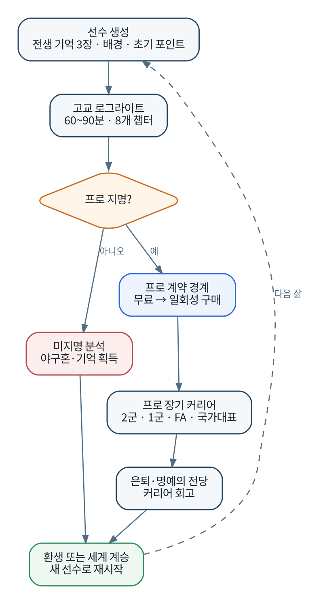

# 제품 요구사항 문서(PRD)

| 항목 | 값 |
|---|---|
| 문서 ID | DOC-01 |
| 제품 | 야구 못하면 또 환생함 |
| 버전 | 1.0 Baseline |
| 상태 | 승인 기준선 |
| 제품 책임자 | 솔 |

## 1. 요약

야구 못하면 또 환생함은 한국형 가상 야구 세계에서 한 명의 선수를 중학교 말부터 육성하고, 고교 드래프트를 통과하면 프로 은퇴까지 살아가는 싱글플레이 데이터 야구 RPG다. 고교 구간은 짧고 반복 가능한 로그라이트로, 프로 구간은 하나의 선수에게 애착을 형성하는 장기 커리어로 설계한다.

기존 야구 게임의 빈 공간은 세 가지 조합에 있다.

1. OOTP 수준의 기록과 인과관계를 **한 선수의 시야**로 보여준다.
2. 손기술이 아니라 구종, 코스, 강도, 훈련, 감독·포수와의 관계를 판단한다.
3. 고교에서 실패한 경험이 다음 선수의 선택지로 남고, 드래프트 성공이 긴 프로 커리어의 관문이 된다.

{width=3.25in}

## 2. 해결하려는 사용자 문제

### 2.1 현재 시장의 불편

- 구단 경영 게임은 깊지만 특정 선수 한 명에게 감정적으로 몰입하기 어렵다.
- 액션 야구 게임의 커리어 모드는 플레이어 손기술이 선수 능력보다 중요해질 수 있다.
- 육성 모드는 반복성이 높지만 프로 전체 인생과 역사 축적이 짧거나 단절되는 경우가 많다.
- 모바일 야구 게임은 카드 수집, 에너지, 확률형 과금이 성장 체험을 대체하는 경우가 많다.
- 모든 시즌을 직접 플레이하면 장기 커리어가 지루하고, 모두 자동으로 돌리면 개입감이 부족하다.

### 2.2 제품이 제공하는 해결책

- 현재 세부 스탯과 경기 데이터를 정확히 보여주어 분석의 재미를 제공한다.
- 중요 장면에서는 야구 판단을 직접 내리되, 일반 경기는 빠르게 압축한다.
- 고교 실패와 성공을 메타 진행으로 연결하여 재도전 동기를 제공한다.
- 프로 진출 이후에는 메타 보너스를 전면에 내세우지 않고 한 선수의 기록과 선택에 집중한다.
- 무료 구간 자체가 완결된 고교 드래프트 게임이며, 유료 구매는 승리 확률이 아니라 콘텐츠 범위를 연다.

## 3. 제품 비전과 성공 정의

### 3.1 비전

> 사용자가 “내가 가장 잘 키운 캐릭터”가 아니라 “내가 실제로 살아본 것 같은 야구선수”를 기억하게 한다.

### 3.2 핵심 감정

- 평범한 유망주가 프로와 스타로 성장하는 성취감.
- 드물게 등장한 천재의 잠재력을 발견하고 기록을 깨는 쾌감.
- 구종, 훈련, 진학, 감독과의 갈등 같은 선택이 한 사람의 인생을 바꾼다는 감각.
- 실패한 삶이 다음 생에 의미 있게 남는 재도전 욕구.

### 3.3 제품 원칙

1. **판단이 조작보다 중요하다.** 반사신경 미니게임을 핵심 성장 수단으로 사용하지 않는다.
2. **결과보다 인과를 설명한다.** 좋은 선택과 나쁜 결과, 나쁜 선택과 운 좋은 결과를 구분한다.
3. **현재는 투명하고 미래는 불확실하다.** 현 능력은 전부 공개하고 잠재력은 범위로 표현한다.
4. **짧은 반복과 긴 애착을 분리한다.** 고교는 로그라이트, 프로는 장기 시뮬레이션이다.
5. **실패를 판매하지 않는다.** 과금, 광고, 가챠로 실패를 우회시키지 않는다.
6. **기능보다 속도를 우선한다.** 사용자는 중요 결정을 빠르게 찾고 시즌을 원하는 속도로 진행할 수 있어야 한다.

## 4. 목표 사용자

### Persona A: 데이터 야구 팬

- OOTP, 세이버 지표, 구종 데이터, 기록 비교를 좋아한다.
- 3D 그래픽보다 일관된 시뮬레이션과 깊은 통계를 중시한다.
- 원하는 기능: 상세 스탯, 구종별 결과, 역사, 결정론, 빠른 시뮬레이션.

### Persona B: 선수 육성·커리어 팬

- 한 캐릭터가 성장하고 관계와 선택으로 삶이 달라지는 게임을 좋아한다.
- 실패 후 다른 빌드로 다시 시도하는 것을 즐긴다.
- 원하는 기능: 학교 선택, 감독·포수·라이벌, 드래프트 긴장, 기억·각성.

### Persona C: 짧게 플레이하는 모바일·휴대 사용자

- 한 번에 5~15분 단위로 진행하고, 중요한 장면만 직접 플레이하려 한다.
- 복잡한 표를 볼 때도 다음 행동은 명확하기를 원한다.
- 원하는 기능: 추천 행동, 자동 진행, 세로형 중요 투구 UI, 저장 안정성.

### 비주요 사용자

- 실시간 PvP와 사실적인 3D 액션만을 기대하는 사용자.
- 실제 구단·실명 선수 라이선스를 필수로 여기는 사용자.
- 선수 카드 수집과 경쟁 랭킹을 핵심 동기로 삼는 사용자.

## 5. 제품 범위

### 5.1 무료 제품: 고교 로그라이트

- 중학교 3학년 프롤로그.
- 고교 선택 및 3년 압축 커리어.
- 선수 생성, 현재 세부 스탯, 잠재력 범위.
- 훈련, 휴식, 감독·포수·라이벌 관계.
- 중요 경기의 전략 선택.
- 각성 3개, 전생 기억 최대 3장.
- 드래프트 방송, 지명 또는 미지명 엔딩.
- 야구혼 진행과 다음 생.

### 5.2 유료 제품: 프로 커리어 해금

- 프로 계약, 2군, 1군 데뷔.
- 주전 경쟁, 감독 면담, 포지션·역할 변경.
- 병역, 국가대표, 외국인 선수와의 경쟁·관계.
- 트레이드, 방출, 입단 테스트, FA.
- 부상·재활, 노쇠화, 은퇴와 한 차례 복귀.
- 명예의 전당, 은퇴 후 후일담, 세계 계승.

### 5.3 플랫폼 범위

- 1차: Windows PC.
- 2차: iPhone·iPad.
- 공유: Swift 기반 시뮬레이션 코어, 콘텐츠, 저장 규칙.
- 분리: 플랫폼별 UI, 입력, 구매, 파일, 오디오 어댑터.

## 6. 핵심 사용자 여정

1. 사용자가 새 세계 또는 기존 세계를 선택한다.
2. 야구혼 배분, 전생 기억, 선수 프리셋과 세부 포인트를 결정한다.
3. 중학교 프롤로그에서 첫 경기와 포수·라이벌을 만난다.
4. 학교를 선택하고 8개 고교 챕터를 진행한다.
5. 매 챕터 훈련·관계·중요 경기 중 핵심 결정을 내린다.
6. 드래프트에서 지명되면 구단과 육성 계획을 확인한다.
7. 프로 계약 버튼에서 전체 프로 커리어 해금을 안내한다.
8. 구매 후 같은 저장에서 프로 생활을 계속한다.
9. 은퇴 후 커리어를 회고하고 새 세계 또는 세계 계승으로 다음 선수를 시작한다.

## 7. 기능 요구사항

### 7.1 선수 생성·스탯

- **PRD-FR-001** 사용자는 투수 프리셋 또는 자유 배분으로 선수를 생성할 수 있어야 한다.
- **PRD-FR-002** 현재의 모든 세부 능력과 실측 데이터는 상세 화면에서 확인 가능해야 한다.
- **PRD-FR-003** 미래 능력은 최소·최대 범위와 신뢰도로 표시해야 한다.
- **PRD-FR-004** 숨은 학습률, 압박 반응, 성장 시점은 직접 숫자로 노출하지 않고 관찰 로그로 추론하게 해야 한다.
- **PRD-FR-005** 신체, 기술, 정신, 구종, 동적 상태의 변화 원인을 확인할 수 있어야 한다.

### 7.2 고교 진행

- **PRD-FR-010** 한 고교 런은 평균 60~90분 안에 끝나도록 압축해야 한다.
- **PRD-FR-011** 고교 3년은 8개 챕터와 약 12~16회의 핵심 성장 결정으로 구성해야 한다.
- **PRD-FR-012** 사용자는 일반 경기를 빠르게 넘기고 중요 장면만 직접 플레이할 수 있어야 한다.
- **PRD-FR-013** 학교는 출전 기회, 시설, 스카우트 노출, 감독 철학이 서로 달라야 한다.
- **PRD-FR-014** 드래프트 미지명은 해당 삶의 종료이되, 원인 분석과 메타 보상을 제공해야 한다.

### 7.3 중요 투구

- **PRD-FR-020** 투수 플레이어는 구종, 3×3 코스, 존 의도, 투구 강도를 선택할 수 있어야 한다.
- **PRD-FR-021** 포수는 주 추천과 위험 구조가 다른 대안 추천을 제시해야 한다.
- **PRD-FR-022** 타자 계획은 플레이어 투구 입력보다 먼저 확정돼야 한다.
- **PRD-FR-023** 타자와 상대 구단은 실제 관찰된 투구 기록을 바탕으로 장기 적응해야 한다.
- **PRD-FR-024** 결과 설명은 선택, 실행, 타자 반응, 타구 결과를 분리해 제공해야 한다.
- **PRD-FR-025** 중요 경기라는 이유만으로 성공 확률을 높이거나 연속 실패를 보정해서는 안 된다.

### 7.4 로그라이트 진행

- **PRD-FR-030** 야구혼은 영구 정보·선택지와 제한된 초기 능력 보너스를 제공해야 한다.
- **PRD-FR-031** 영구 보너스의 순수 경기 능력 기여는 초기 기준 대비 최대 약 8~10%로 제한해야 한다.
- **PRD-FR-032** 새 생은 전생의 기억을 최대 3장 장착할 수 있어야 한다.
- **PRD-FR-033** 한 고교 런에서 각성은 3개만 획득해야 한다.
- **PRD-FR-034** 첫 삶은 방향성 있게 플레이할 경우 약 35~45%, 두 번째 50~65%, 세 번째 70~80%의 프로 지명 목표 범위를 가진다.
- **PRD-FR-035** 후기 플레이어는 업보를 선택해 난이도와 보상을 동시에 높일 수 있어야 한다.

### 7.5 프로·구매

- **PRD-FR-040** 드래프트 결과와 구단 육성 계획은 구매 전에 모두 보여야 한다.
- **PRD-FR-041** 프로 계약 서명 시점에서 일회성 전체 프로 커리어 해금을 제안해야 한다.
- **PRD-FR-042** 구매하지 않은 저장은 삭제하지 않고, 구매 후 같은 선수로 계속할 수 있어야 한다.
- **PRD-FR-043** 구매는 프로 지명 확률, 스탯, 기억 카드에 영향을 주면 안 된다.
- **PRD-FR-044** iOS 구매는 비소모성 상품으로 복원 가능해야 한다.

### 7.6 저장·접근성·모드

- **PRD-FR-050** 모든 핵심 선택과 경기 종료 뒤 자동 저장해야 한다.
- **PRD-FR-051** 앱 강제 종료 후에도 마지막 확정 명령 이전의 일관된 상태로 복구해야 한다.
- **PRD-FR-052** 텍스트 확대, 고대비, 색상 외 상태 표현, 키보드 조작, 화면 읽기 레이블을 지원해야 한다.
- **PRD-FR-053** 초기 모드는 구단명, 선수명, 로고, 유니폼 교체를 지원해야 한다.
- **PRD-FR-054** 사용자 모드는 임의 실행 코드를 허용하지 않는 선언형 콘텐츠 팩이어야 한다.

## 8. 비기능 요구사항

- **PRD-NFR-001 결정론**: 같은 시드, 콘텐츠 버전, 명령 순서에서 동일한 도메인 이벤트를 생성한다.
- **PRD-NFR-002 반응성**: 중요 투구 입력 후 결과 피드백은 일반적인 PC·지원 iOS 기기에서 체감 지연 없이 표시한다.
- **PRD-NFR-003 진행 속도**: 한 공의 일반적인 결정은 숙련 후 2~4초, 중요 이닝은 3~5분을 목표로 한다.
- **PRD-NFR-004 저장 신뢰성**: 원자적 저장과 체크섬으로 손상 파일을 감지하고 이전 정상 스냅숏으로 복구한다.
- **PRD-NFR-005 오프라인**: 게임과 저장, 구매한 콘텐츠 이용은 로그인 없이 가능해야 한다. 구매 복원은 플랫폼 연결이 필요할 수 있다.
- **PRD-NFR-006 지역화**: 모든 사용자 문구는 코드와 분리하고 한국어를 기준 언어로 영어 확장이 가능해야 한다.
- **PRD-NFR-007 개인정보**: 계정 생성과 온라인 경쟁을 요구하지 않으며, 제작용 텔레메트리는 로컬 또는 명시적 동의 기반이다.
- **PRD-NFR-008 호환성**: 저장 포맷은 플랫폼 간 이동 가능성을 고려한 버전형 중립 포맷을 사용한다.

## 9. 성공 지표

### 9.1 Pitcher Lab

- 튜토리얼 없이 두 번째 등판에서 80% 이상이 주 추천을 그대로 수락하거나 한 요소만 수정해 투구를 완료한다.
- 한 공당 중앙값 결정 시간이 8초 이하, 네 번째 등판에서는 4초 이하를 목표로 한다.
- 플레이테스터의 70% 이상이 두 가지 이상의 투구 선택 전략을 설명할 수 있다.
- 플레이테스터의 60% 이상이 첫 선수의 숨은 성장 유형을 완전히는 아니더라도 방향성 있게 추정한다.
- 두 번째 삶을 시작하는 비율이 65% 이상이다.

### 9.2 무료 고교 제품

- 첫 삶 완료율.
- 첫 미지명 후 두 번째 삶 시작률.
- 드래프트 결과 화면 도달률.
- 세 번째 삶 이내 최초 지명 비율.
- 지명 직후 프로 해금 화면 도달률.
- 반복 플레이 중 동일 프리셋·동일 행동 편중도.

### 9.3 유료 프로 제품

- 구매 후 1군 데뷔 도달률.
- 시즌 완료 및 은퇴 완료율.
- 평균 커리어 길이와 중요 장면 개입 빈도.
- 저장 손상·복구 실패율.
- 구매 복원 성공률.
- 사용자 리뷰에서 데이터 깊이, 선택의 인과, 반복 피로도에 관한 정성 평가.

## 10. 출시 범위와 제외 범위

### 최초 출시 핵심

- 투수 전용 고교 로그라이트.
- 가상 학교·프로 10구단.
- 프로 커리어는 투수 역할 중심.
- 현재 스탯·잠재 범위·상세 경기 데이터.
- Windows 무료 고교 + 프로 해금.
- 한국어.

### 명시적 후속 범위

- 타자 플레이와 수비·주루 개입.
- 투타 겸업.
- iOS 네이티브 앱.
- 미국·일본 등 해외리그.
- 고급 이벤트 모딩.
- 지도자 커리어 직접 플레이.

### 하지 않는 것

- 실시간 멀티플레이.
- 선수 카드 가챠.
- 광고 시청 보상.
- 실제 구단·선수 실명 데이터 기본 제공.
- 3D 액션 야구.
- 집, 자동차, 투자 등 생활 경제 시뮬레이션.

## 11. 출시 승인 기준

무료 고교 버전은 다음 조건을 모두 만족해야 한다.

1. 한 삶이 60~90분 범위에서 완결된다.
2. 지명과 미지명 모두 다음 행동이 명확하다.
3. 세 가지 이상의 유효한 투수 빌드가 존재한다.
4. 저장을 강제로 중단한 테스트에서 일관된 복구가 가능하다.
5. 결정론 회귀 테스트가 플랫폼별로 통과한다.
6. 구매하지 않은 사용자가 고교 전체를 제한 없이 반복할 수 있다.
7. 접근성 핵심 기능과 키보드 전체 조작이 가능하다.
8. 실제 상표·선수 데이터가 기본 콘텐츠에 포함되지 않는다.
