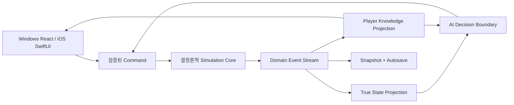

# 야구 못하면 또 환생함 개발 계획

> 상태: 실행 기준선 v0.1  
> 작성일: 2026-07-21  
> 기준 자료: [ChatGPT 공유 대화 — 시뮬레이션 야구게임 구상](https://chatgpt.com/share/6a5f68e9-ceb0-83ee-81de-0a446f437202)  
> 전제: 신규 저장소에서 시작하는 전업 1인 개발. 일정과 밸런스 수치는 플레이테스트로 조정한다.

## 1. 계획의 목적

이 문서는 확정된 게임 방향을 실제 개발 순서로 바꾸는 실행 계획이다. 제품 범위, 기술 구조, 단계별 산출물, 완료 조건, 테스트, 출시 게이트를 한 문서에서 관리한다.

이 프로젝트의 핵심은 다음 한 문장으로 고정한다.

> 여러 번의 고교 야구 인생에서 얻은 기억으로 프로 드래프트를 돌파하고, 지명된 단 한 명의 선수로 은퇴까지 살아가는 데이터 야구 로그라이트 RPG.

개발은 아래 세 가지 질문을 순서대로 검증한다.

1. 손기술이 아닌 구종·코스·강도 선택만으로 투구가 재미있는가?
2. 30~45분의 첫 삶과 두 번째 삶이 서로 다른 빌드와 이야기를 만드는가?
3. 60~90분의 고교 로그라이트가 장기 프로 커리어를 시작하고 싶게 만드는가?

이 세 질문이 검증되기 전에는 프로 전체 커리어, iOS, 타자 플레이를 확장하지 않는다.

---

## 2. 확정된 제품 기준선

| 항목 | 기준선 |
|---|---|
| 장르 | 데이터 중심 야구 RPG + 고교 로그라이트 + 프로 커리어 시뮬레이션 |
| 출시 포지션 | 투수 전용 |
| 고교 단계 | 무료, 한 생 60~90분, 반복 가능 |
| 프로 단계 | 일회성 구매, 한 선수 8~15시간 목표 |
| 세계관 | 한국 야구 기반의 가상 학교·가상 10구단 |
| 직접 개입 | 모든 경기가 아니라 중요한 이닝·타자만 개입 |
| 입력 | 구종, 코스, 강도, 포수 추천 수정 |
| 정보 원칙 | 현재 능력은 정확히 공개, 미래와 숨은 성향은 범위·신뢰도로 표시 |
| 메타 진행 | 야구혼, 전생의 기억 3장, 이번 생 각성 3개 |
| 영구 성장 상한 | 직접적인 경기 능력 상승 총합 8~10% 이내 |
| 실패 처리 | 불운 보정이나 세이브 되감기 없이 실패도 유산과 선택지로 전환 |
| 저장 | 자동 저장, 버전 마이그레이션, 결정론적 재현 지원 |
| 1차 플랫폼 | Windows PC |
| 후속 플랫폼 | iPhone·iPad 네이티브 UI |
| 수익화 | 고교·드래프트 무료, 프로 계약 서명 시 일회성 해금 |
| 금지 수익화 | 광고 보상, 에너지, 가챠, 장비·능력치 판매 |

### 출시 1.0에서 제외

- 타자 플레이와 투타 겸업
- 포수 전용 플레이
- 메이저리그·해외 리그
- 국가대표 콘텐츠
- 결혼·가정·부동산 등 생활 시뮬레이션
- 모든 학교와 아마추어 선수의 상세 시뮬레이션
- 복잡한 구단 재정·에이전트 경제
- 수십 세대에 걸친 가계 계승
- 전체 이벤트 모딩 도구

---

## 3. 개발 원칙

### 3.1 재미를 먼저 검증한다

첫 플레이어블은 전체 게임의 축소판이 아니다. 투구 판단, 훈련에 따른 빌드 변화, 환생의 의미만 검증하는 `Pitcher Lab`으로 만든다.

### 3.2 결정론을 기반 기능으로 취급한다

동일한 콘텐츠 버전, 시드, 초기 상태, 명령 순서가 주어지면 동일한 이벤트 스트림과 결과가 나와야 한다. 이 조건은 버그 재현, 밸런스 대량 실험, 저장 복구, AI 공정성 검증의 기반이다.

### 3.3 실제 정보와 플레이어가 아는 정보를 분리한다

시뮬레이션의 `True State`와 화면에 노출되는 `Player Knowledge`를 별도 모델로 둔다. 상대 AI, 포수 추천, 스카우팅 화면은 플레이어에게 허용된 정보만 사용한다. 이 경계를 테스트로 고정해 AI가 숨은 수치를 참조하지 못하게 한다.

### 3.4 깊이는 데이터에, 속도는 흐름에 둔다

경기 중 피드백은 한 문장으로 제한하고, 타자 종료 후 요약, 경기 후 상세 분석으로 나눈다. 긴 시즌은 자동 진행하고 중요한 순간에만 개입한다.

### 3.5 고정 규칙과 조정 수치를 분리한다

- 고정 규칙: 투수 우선, 기억 3장, 각성 3개, 고교 무료, 프로 일회성 구매
- 조정 수치: 훈련 효율, 부상률, 드래프트 확률, 이벤트 가중치, 성장 곡선

조정 수치는 버전 관리되는 설정 파일에서 바꾸고, 코드에 흩어 넣지 않는다.

---

## 4. 제품 단계와 전체 일정

아래 일정은 전업 1인 개발의 순수 작업량 기준이다. 외주 제작, 스토어 심사, 사용자 모집 대기 시간은 포함하지 않는다. 파트타임 개발이면 달력 기간을 대략 1.8~2.5배로 본다.

| 단계 | 목표 | 예상 작업량 | 누적 작업량 | 출시 판단 |
|---|---|---:|---:|---|
| P0 | 제품·기술 Spike | 2~3주 | 2~3주 | 아키텍처 진행 여부 |
| P1 | Pitch Kernel | 4~6주 | 6~9주 | 투구 결과의 신뢰성 |
| P2 | Pitcher Lab | 6~8주 | 12~17주 | 핵심 재미 검증 |
| P3 | 고교 Vertical Slice | 10~14주 | 22~31주 | 60~90분 루프 검증 |
| P4 | 무료 고교 1.0 | 12~18주 | 34~49주 | 공개 데모 가능 |
| P5 | 프로 데뷔 확장 | 12~16주 | 46~65주 | 유료 전환 가치 검증 |
| P6 | Windows Commercial 1.0 | 24~36주 | 70~101주 | 정식 출시 |
| P7 | iOS 확장 | 12~18주 | P6 이후 | 모바일 출시 |
| P8 | 타자·투타 겸업 | 별도 산정 | 출시 이후 | 확장팩/대형 업데이트 |

### 현실적인 목표 구간

- 첫 외부 플레이테스트: 시작 후 3~4개월
- 무료 고교 공개 빌드: 시작 후 9~13개월
- Windows 상용 1.0: 시작 후 약 18~26개월
- iOS: Windows 1.0 안정화 이후 약 3~5개월

일정이 지연될 경우 기능을 병렬로 늘리지 않고 각 단계의 콘텐츠 수량을 줄인다. 핵심 시스템과 완료 조건은 유지한다.

---

## 5. 기술 아키텍처 계획

### 5.1 목표 구조

| 영역 | 권장 기술 | 책임 |
|---|---|---|
| 공유 시뮬레이션 코어 | Swift Package | 규칙, RNG, 성장, 경기, 커리어, 저장 모델 |
| Windows 앱 | Tauri + React + TypeScript | 화면, 입력, 내비게이션, 로컬 파일·스토어 연동 |
| Windows 코어 연결 | Swift 실행 프로세스 + JSON-RPC | 명령 전달, 이벤트·스냅숏 반환 |
| iOS 앱 | SwiftUI | 모바일 전용 화면과 플랫폼 기능 |
| 콘텐츠 | JSON/YAML + JSON Schema | 이벤트, 구단, 학교, 인물 원형, 밸런스 |
| 테스트 도구 | Swift CLI + 리포트 생성기 | 대량 시뮬레이션, 회귀 비교, 밸런스 분석 |

Swift의 Windows 빌드·배포와 Tauri 연동은 P0에서 가장 먼저 검증한다. 다음 조건 중 하나라도 충족하지 못하면 P0 종료 시 ADR로 공유 코어 언어를 재검토한다.

- Windows CI에서 재현 가능한 빌드가 되지 않음
- 서명된 앱에 sidecar를 안정적으로 묶을 수 없음
- JSON-RPC 호출·오류·종료 복구가 제품 수준으로 구현되지 않음
- 패키지 크기나 디버깅 비용이 1인 개발에 과도함

### 5.2 도메인 흐름



AI는 자신의 관찰 정보와 난이도에 허용된 정보만 사용한다. 플레이어 잠재력의 실제 상한이나 숨은 부상 취약성 등을 직접 읽을 수 없다.

### 5.3 명령·이벤트 구조

대표 명령:

- `CreateWorld`
- `CreatePitcher`
- `ChooseTraining`
- `ChooseEventOption`
- `SelectAwakening`
- `AcceptCatcherRecommendation`
- `OverridePitchPlan`
- `SimulatePitch`
- `AdvanceWeek`
- `EnterDraft`
- `CarryLegacy`

대표 이벤트:

- `WorldCreated`
- `TrainingCompleted`
- `RelationshipChanged`
- `TraitRevealed`
- `PitchResolved`
- `AppearanceCompleted`
- `AwakeningGranted`
- `PlayerDrafted`
- `PlayerUndrafted`
- `MemoryUnlocked`
- `CareerRetired`

명령은 의도를 나타내고 이벤트는 발생한 사실만 기록한다. 화면은 코어 내부 객체를 직접 수정하지 않는다.

### 5.4 제안 저장소 구조

```text
/
├── apps/
│   ├── windows/                 # Tauri + React
│   └── ios/                     # SwiftUI
├── packages/
│   ├── simulation-core/         # Swift Package
│   ├── simulation-cli/          # 대량 실행·회귀 도구
│   └── shared-schemas/          # JSON Schema
├── content/
│   ├── balance/
│   ├── events/
│   ├── schools/
│   ├── teams/
│   └── localization/
├── fixtures/                    # 고정 시드·골든 결과
├── docs/
│   ├── adr/
│   ├── playtests/
│   └── releases/
└── tools/
```

---

## 6. 단계별 실행 계획

### P0. 제품·기술 Spike

**목표:** 전체 개발을 시작하기 전에 가장 위험한 가정들을 2~3주 안에 검증한다.

#### 구현 범위

- 저장소, 자동 빌드, 코드 스타일, 테스트 실행 환경 구성
- Swift 코어를 Windows와 macOS에서 빌드
- Tauri 앱에서 Swift sidecar를 실행하고 JSON-RPC 왕복
- 시드 기반 RNG와 최소 명령·이벤트 모델 구현
- 한 투구를 입력해 결정론적 결과를 받는 세로 관통 데모
- 저장 manifest, 스키마 버전, 콘텐츠 버전의 초안 정의
- ADR 작성
  - ADR-001 공유 코어 언어
  - ADR-002 Windows IPC
  - ADR-003 명령·이벤트·스냅숏
  - ADR-004 콘텐츠 포맷

#### 종료 조건

- Windows CI에서 클린 빌드와 테스트가 성공한다.
- 같은 시드와 명령으로 1,000회 반복 시 결과 해시가 항상 같다.
- sidecar 비정상 종료를 감지하고 사용자 데이터 손상 없이 다시 시작할 수 있다.
- 기술 구조를 유지하거나 변경한다는 결정을 ADR에 기록한다.

---

### P1. Pitch Kernel

**목표:** 투구 한 공의 선택과 결과를 믿을 수 있는 규칙 엔진으로 만든다.

#### 구현 범위

- 투수 능력치와 20~80 표시 체계
- 구종별 구속, 움직임, 제구, 커맨드, 피로 영향
- 타자 핫·콜드존, 구종 대처, 노림수, 카운트 성향
- 포수의 구종·코스·강도 추천과 이유
- 3×3 존과 볼·스트라이크·인플레이 결과
- 실투, 헛스윙, 파울, 타구 질, 볼넷, 삼진 계산
- 수비·구장 효과는 처음에는 단순 확률 모델로 추상화
- 경기 중 한 문장 피드백과 경기 후 상세 원인 로그
- AI 정보 차단 테스트
- 대량 시뮬레이션 CLI와 고정 시드 회귀 테스트

#### 초기 성능·품질 가설

- 단일 투구 계산 p95 10ms 이내
- 10만 투구 대량 실행을 개발 환경에서 수 분 안에 완료
- 동일 시드 회귀 결과 100% 일치
- 볼넷·삼진·장타율 등이 프리셋별 의도한 상대 순서를 유지
- 포수 추천을 무조건 따르는 전략이 항상 최적이 아님

#### 종료 조건

- 네 가지 투수 프리셋이 통계적으로 서로 다른 결과와 운영법을 보인다.
- 구종·코스·강도를 바꾸면 결과 분포가 설명 가능한 방향으로 변한다.
- 숨은 실제 수치를 AI나 UI가 참조하지 않는 테스트가 통과한다.
- 투구 결과 로그만으로 버그를 재현할 수 있다.

---

### P2. Pitcher Lab

**목표:** 30~45분짜리 두 번의 삶으로 핵심 재미와 환생의 의미를 검증한다.

#### 플레이 범위

- 투수 프리셋 4종
- 훈련 선택 6회
- 중요 이닝 3회
- 라이벌 타자와 2회 대결
- 포수 관계 이벤트 2회
- 각성 선택 2회
- 최종 스카우팅 평가
- 미지명 또는 프로토타입 종료 후 환생
- 전생 기억 1장, 생성 포인트 2점, 학교·코치 후보 1개 해금
- 동일 구조의 두 번째 삶

#### 필요한 화면

1. 새 실험 시작
2. 투수 프리셋 선택
3. 현재 상태와 잠재력 범위
4. 훈련 선택
5. 관계 이벤트
6. 경기 전 스카우팅
7. 중요 이닝 투구
8. 경기 분석
9. 스카우팅 평가
10. 기억 선택과 두 번째 삶

#### 플레이테스트

- 내부 테스트: 5~8명
- 1차 외부 테스트: 8~12명
- 수정 후 2차 테스트: 20~30명
- 화면 녹화, 선택 로그, 종료 인터뷰를 함께 사용

#### 통과 기준

- 참가자의 70% 이상이 포수 추천 이유와 수정 결과를 설명한다.
- 참가자의 60% 이상이 두 번째 삶을 자발적으로 시작한다.
- 두 번째 삶이 단순히 쉬워진 것이 아니라 선택 폭이 넓어졌다고 응답한다.
- 하나의 구종·코스 조합이 전체 선택의 35% 이상을 독점하지 않는다.
- 네 프리셋 중 적어도 세 가지가 플레이테스트에서 유효한 빌드로 사용된다.
- 중대한 진행 불가·저장 손상 버그가 없다.

통과하지 못하면 P3으로 확장하지 않고 투구 규칙, 피드백, 환생 보상 중 원인을 찾아 반복한다.

---

### P3. 고교 Vertical Slice

**목표:** 실제 제품과 같은 60~90분의 한 생을 처음부터 드래프트까지 완성한다.

#### 구현 범위

- 중학교 프롤로그와 선수 생성
- 학교·감독·포수·라이벌의 조합 생성
- 8개 커리어 챕터
- 훈련 결정 12~16회
- 핵심 관계 인물 3명
- 관계 이벤트 4~5회
- 중요 경기 4~6회
- 직접 플레이 중요 이닝 약 4회
- 각성 선택 3회
- 10개 프로 구단의 포지션 수요와 드래프트
- 미지명 시 기억 3장 구성과 다음 삶 시작
- 자동 저장, 강제 종료 복구, 설정, 기본 접근성

#### 콘텐츠 최소량 가설

- 학교 원형 4종
- 감독 원형 4종
- 포수 원형 4종
- 라이벌 타자 원형 6종
- 관계·성장 이벤트 30~40개
- 경기 상황 시나리오 12개 이상
- 각성 후보 18개 이상
- 기억 카드 후보 18개 이상

수량보다 재조합 가능성과 선택의 영향이 우선이다. 같은 문장을 이름만 바꿔 반복하지 않는다.

#### 종료 조건

- 첫 삶의 중앙값이 60~90분에 들어온다.
- 90% 이상의 테스트 세션이 드래프트 또는 미지명 결말에 도달한다.
- 방향성 있게 플레이한 첫 삶의 지명률이 35~45% 범위에 근접한다.
- 두 번째 삶 50~65%, 세 번째 삶 70~80%라는 목표를 대량 시뮬레이션에서 조정 가능하다.
- 현재 수치, 미래 범위, 경험으로 밝혀지는 특성이 화면에서 명확히 구분된다.
- 강제 종료 후 마지막 확정 선택 이전 또는 이후의 일관된 상태로 복구된다.

---

### P4. 무료 고교 1.0

**목표:** 반복 가능한 무료 고교 게임을 외부 사용자에게 공개할 수 있는 품질로 만든다.

#### 구현 범위

- 학교·감독·포수·라이벌·이벤트의 제작량 확장
- 야구혼 선택 트리와 정보 정확도 향상
- 기억 카드 3장과 업보 카드 선택
- 이번 생 각성 3개
- 10개 가상 프로 구단의 드래프트 수요
- 튜토리얼과 첫 삶 온보딩
- Windows 키보드·마우스·게임패드 기본 지원 여부 결정
- 로컬 우선, 옵트인 분석 로그
- 접근성: 글자 크기, 색상 외 상태 표시, 키보드 이동, 모션 감소
- 오류 보고용 익명 진단 패키지 생성
- 프로 지명 후 유료 영역 미리보기

#### 무료 퍼널 목표

- 2~3시간 안에 첫 삶, 첫 유산, 두 번째 삶, 드래프트 가능성을 모두 경험
- 늦어도 세 번째 삶 전후에 방향성 있는 플레이어가 지명 가능
- 지명 후 구단, 순위, 계약금, 육성 계획, 경쟁자, 코치, 첫 시즌 목표를 공개
- 결제 전 프로 콘텐츠의 가치를 충분히 이해

#### 공개 게이트

- 저장 손상과 진행 불가 결함 0건
- 결정론·AI 정보차단·마이그레이션 테스트 100% 통과
- 30명 이상 외부 테스트에서 첫 삶 완료율 70% 이상
- 첫 삶 중앙값 60~90분
- 2회차 시작률 50% 이상
- 최근 테스트 빌드의 크래시 없는 세션 99% 이상

수치는 초기 제품 가설이며 표본이 쌓이면 기준을 다시 승인한다.

---

### P5. 프로 데뷔 확장

**목표:** 프로 계약의 구매 가치와 장기 커리어의 기본 루프를 검증한다.

#### 구현 범위

- 프로 계약 서명과 일회성 해금
- 구매 복원, 오프라인 권한 캐시, 오류·취소 흐름
- 2군과 1군의 역할 경쟁
- 선발·불펜 보직과 감독 평가
- 주간 훈련, 피로, 부상, 기용
- 일반 경기 자동 진행과 중요 이닝 개입
- 시즌·통산 기록, 구종별 데이터, 이정표
- 계약 조건과 과정 중심 미션
- 경쟁자·포수·코치·감독 관계
- 최소 2~3시즌의 플레이 가능한 프로 슬라이스

#### 종료 조건

- 고교에서 만든 선수와 모든 관련 기록이 프로로 손실 없이 이어진다.
- 한 시즌이 반복 입력 없이 빠르게 진행된다.
- 감독 평가는 실제 보직·기용·계약에 설명 가능한 영향을 준다.
- 프로 슬라이스 테스트 참가자의 60% 이상이 다음 시즌 진행 의향을 보인다.
- 결제 실패·취소·복원·오프라인 재실행 시 권한 상태가 일관된다.

---

### P6. Windows Commercial 1.0

**목표:** 프로 입단부터 은퇴까지 하나의 완결된 선수 인생을 제공한다.

#### 구현 범위

- 가상 10구단 리그와 시즌 운영
- 2군·1군, 보직 전환, 방출, 트라이아웃
- 계약 갱신, 다년 계약, 트레이드, FA
- 병역 선택과 커리어 영향
- 부상, 회복, 신체 성장, 노쇠화
- 팀·선수의 추상화된 성장·이적·은퇴
- 수상, 기록 달성, 언론, 팬 반응, 인터뷰
- 은퇴, 명예의 전당, 강력한 전생 기억 획득
- 8~15시간 커리어 페이싱
- 전체 저장 마이그레이션과 장기 회귀 테스트
- 배포, 서명, 업데이트, 개인정보·법무·등급 준비

#### 세계 시뮬레이션 범위

- 플레이어, 같은 구단 경쟁자, 주요 라이벌은 상세 계산
- 다른 구단의 핵심 선수는 중간 수준으로 계산
- 나머지 선수는 역할·능력 분포·시즌 결과 중심으로 추상화
- 구단 재정과 프런트 운영은 플레이어 커리어에 필요한 결정만 모델링

#### 정식 출시 게이트

- 시작부터 은퇴까지 완주 가능한 저장으로 20회 이상 자동 회귀
- 저장 마이그레이션이 지원 대상 모든 버전에서 통과
- P0 또는 P1 치명도 버그 0건
- 접근성 필수 항목과 구매 복원 테스트 통과
- 주요 투수 빌드 간 커리어 성공률 격차가 허용 범위 안에 있음
- 단일 전략이 모든 상대·커리어 단계에서 지배하지 않음
- 오프라인 플레이 핵심 루프가 정상 작동

---

### P7. iOS 확장

**목표:** 공유 코어와 저장 규칙을 유지하면서 iPhone·iPad에 맞는 별도 UX를 제공한다.

#### 구현 범위

- SwiftUI 네이티브 화면
- `오늘의 상태 → 이번 주 선택 → 중요 장면 → 결과` 단방향 흐름
- iPhone 세로형 중요 이닝 UI
- iPad 분할 화면과 비교 보기
- 터치 목표 크기, 동적 글자 크기, VoiceOver
- 백그라운드 전환과 강제 종료 복구
- 모바일 구매·복원
- PC와 동일한 규칙·콘텐츠 버전 호환성 검증

PC 화면을 그대로 축소하지 않는다. 공유하는 것은 코어, 규칙, 기록, 콘텐츠, 저장 포맷이고 화면 구조와 상호작용은 플랫폼별로 만든다.

---

## 7. 밸런스 및 데이터 계획

### 7.1 공개 정보 수준

| 수준 | 예시 |
|---|---|
| 정확히 공개 | 현재 구속, 움직임, 제구, 커맨드, 체력, 피로 보정, 경기 기록 |
| 범위로 공개 | 미래 능력, 성장 속도, 소프트 캡, 선발·불펜 장기 적성 |
| 경험으로 발견 | 압박 반응, 실투 방향, 회복력, 코치 궁합, 부상 취약성 |

### 7.2 초기 목표 수치

| 지표 | 목표 |
|---|---:|
| 한 공 선택 | 2~4초 |
| 한 타자 상대 | 20~40초 |
| 중요 이닝 | 3~5분 |
| 한 주 진행 | 1~2분 |
| 고교 한 생 | 60~90분 |
| 첫 삶 지명률 | 35~45% |
| 두 번째 삶 지명률 | 50~65% |
| 세 번째 삶 지명률 | 70~80% |
| 직접 영구 능력 보너스 상한 | 8~10% |

### 7.3 밸런스 운영

- 모든 조정 수치에 소유자, 의도, 허용 범위, 마지막 변경 이유를 기록한다.
- 고정 시드 100~500개를 회귀 세트로 유지한다.
- 변경 전후 1만~10만 회 자동 시뮬레이션을 비교한다.
- 평균만 보지 않고 프리셋, 학교, 코치, 구종 조합별 분포를 본다.
- 지배 전략은 선택률, 성공률, 상대 독립성 세 기준으로 탐지한다.
- 플레이어 실패를 보이지 않는 확률 보정으로 없애지 않는다. 대신 정보와 선택 결과를 더 명확하게 만든다.

---

## 8. 콘텐츠 제작 계획

이벤트는 코드가 아니라 검증 가능한 데이터로 작성한다.

### 이벤트 필수 필드

- 고유 ID와 스키마 버전
- 발생 챕터와 조건
- 필요한 인물·관계·능력 태그
- 중복 제한과 쿨다운
- 플레이어에게 보이는 상황과 선택지
- 각 선택의 즉시 효과와 지연 효과
- 숨은 결과를 공개하는 시점
- 로컬라이제이션 키
- 분석용 분류 태그

### 집필 원칙

- 선택지는 능력치 생산 버튼이 아니라 가치·위험·관계의 충돌을 보여준다.
- 결과를 완전히 숨기지 않고 위험의 종류와 가능한 방향을 알려준다.
- 한 번의 극단적 무작위 사건이 한 생 전체를 무효화하지 않게 한다.
- 같은 효과를 야구혼, 기억, 각성, 배경 특성에 중복 배치하지 않는다.
- 경기 피드백은 원인과 다음 판단에 필요한 정보만 전달한다.

### 콘텐츠 QA

- 스키마 검증
- 도달 불가능 조건 탐지
- 순환·상충 효과 검사
- 금지 표현·오탈자·말투 검사
- 모든 선택지의 로그와 저장 복구 검사
- 한국어 기준 작성 후 영어 키 구조를 함께 유지

---

## 9. 테스트 전략

### 9.1 자동 테스트

| 층 | 핵심 테스트 |
|---|---|
| 단위 | 능력치 계산, 피로, 성장, 구종, 드래프트, 계약 |
| 속성 기반 | 확률 범위, 상태 불변조건, 음수 자원 방지, 기록 합계 |
| 결정론 | 동일 시드·명령·콘텐츠 버전의 이벤트 해시 일치 |
| AI 공정성 | 허용되지 않은 True State 접근 실패 |
| 골든 시나리오 | 고정 선수·상대·상황의 결과 분포 회귀 |
| 대량 시뮬레이션 | 빌드별 성공률, 지명률, 부상률, 커리어 길이 |
| IPC | 요청·응답, 시간 초과, 재시작, 중복 명령, 버전 불일치 |
| 저장 | 자동 저장, 원자적 교체, 손상 복구, 마이그레이션 |
| UI | 핵심 사용자 흐름, 키보드, 접근성, 오류 상태 |
| 구매 | 성공, 실패, 취소, 복원, 오프라인 권한 |
| 콘텐츠 | 스키마, 참조, 도달 가능성, 로컬라이제이션 누락 |

### 9.2 저장 안전성

- 임시 파일 작성 → 검증 → 원자적 교체 순서 사용
- 최근 정상 자동 저장 3개를 순환 보관
- manifest에 앱, 코어, 콘텐츠, 스키마 버전 기록
- 모든 마이그레이션은 원본을 보존한 사본에서 실행
- 명령 ID로 중복 실행 방지
- 개발 빌드에서 이벤트 로그를 저장해 결과 재생 가능

### 9.3 완료 정의

기능은 아래 조건을 모두 만족해야 완료다.

- 사용자 흐름과 오류 흐름이 구현됨
- 단위·통합 테스트가 추가됨
- 결정론과 저장에 미치는 영향이 검토됨
- 분석 이벤트와 개인정보 영향이 검토됨
- 접근성 기본 상태가 구현됨
- 밸런스 수치가 설정 파일에 있고 변경 이유가 기록됨
- 관련 문서와 ADR이 갱신됨

---

## 10. UX/UI 계획

### Windows

- 한 화면의 핵심 질문을 하나로 제한한다.
- 현재 상태, 이번 선택, 예상 위험을 우선 배치한다.
- 상세 데이터는 계층적으로 펼치되 기본 화면을 표로 가득 채우지 않는다.
- 중요 이닝에서는 포수 추천, 추천 이유, 수정 가능한 구종·코스·강도를 한 흐름에 둔다.
- 결과 화면은 `무슨 일이 일어났는가 → 왜 일어났는가 → 다음에 무엇을 바꿀 수 있는가` 순서로 구성한다.

### iOS

- 화면을 PC에서 공유하지 않고 상태와 디자인 토큰만 공유한다.
- 세로형 한 손 입력을 기본으로 한다.
- 긴 비교 표는 카드, 요약, 드릴다운으로 나눈다.
- 한 공 선택 2~4초 목표를 해치는 긴 설명은 경기 후로 이동한다.

### 접근성 최소 기준

- 색만으로 상태를 전달하지 않음
- 200% 글자 확대에서 핵심 기능 사용 가능
- 키보드만으로 Windows 핵심 흐름 완료 가능
- 포커스 순서와 스크린 리더 레이블 제공
- 모션 감소와 깜박임 방지
- 숫자·범위·신뢰도의 의미를 텍스트로 제공

---

## 11. 분석과 플레이테스트 운영

분석은 오프라인 우선, 명시적 동의 방식으로 시작한다. 개인 식별 정보나 자유 입력 문장은 수집하지 않는다.

### 핵심 지표

- 첫 삶 시작·완료율과 소요 시간
- 각 챕터 이탈 지점
- 추천 수락·수정 비율
- 구종·코스·강도 선택 분포
- 훈련·각성·기억 선택 분포
- 빌드별 지명률과 커리어 성공률
- 첫 실패 후 두 번째 삶 시작률
- 드래프트 후 프로 해금 화면 도달률
- 프로 슬라이스의 다음 시즌 진행률
- 크래시, 저장 복구, 마이그레이션 성공률

### 해석 원칙

- 지표는 재미의 대리값일 뿐 단독 출시 기준이 아니다.
- 인터뷰에서 말한 이유와 실제 선택 로그를 함께 본다.
- 플레이어가 규칙을 이해하지 못한 실패와 이해했지만 감수한 실패를 구분한다.
- 전환율 때문에 고교 난이도나 드래프트를 몰래 조정하지 않는다.

---

## 12. 주요 리스크와 대응

| 리스크 | 조기 신호 | 대응 | 결정 시점 |
|---|---|---|---|
| Swift Windows 배포 불안정 | CI·서명·sidecar 복구 실패 | P0에서 대체 코어 언어 ADR 검토 | P0 종료 |
| 투구 선택이 반복적 | 추천 수락률 과도, 한 조합 독점 | 타자 스카우팅·상황·노림수 강화 | P2 이전 |
| 환생이 단순 능력 상승 | 2회차 선택은 같고 성공률만 상승 | 정보·경로·상대 대응 해금 중심으로 전환 | P2 게이트 |
| 콘텐츠 제작량 폭증 | 이벤트 재사용감, 집필 속도 저하 | 원형·태그·조합 구조, 수량 축소 | P3 중간 |
| 밸런스 조합 폭발 | 회귀 결과 변동, 지배 전략 빈발 | 효과 층 3개 유지, 직접 보너스 상한 | 상시 |
| 프로 커리어가 수동 반복 | 한 시즌 진행 시간이 증가 | 일반 경기 자동화, 중요 장면만 개입 | P5 |
| 데이터 UI 피로 | 화면 체류·이탈 증가 | 경기 중·타자 후·경기 후 3단 피드백 | P2~P4 |
| 저장 마이그레이션 실패 | 이전 빌드 세이브 손상 | manifest·원본 보존·자동 회귀 | P3부터 |
| 무료 구간 이탈 | 2회차 시작률 저조 | 첫 실패 직후 의미 있는 기억·경로 해금 | P4 |
| 1인 개발 범위 초과 | 단계 종료 조건 전에 새 기능 추가 | 출시 제외 목록과 단계 게이트 강제 | 상시 |

---

## 13. 작업 방식과 변경 관리

### 2주 단위 반복

1. 한 개의 사용자 결과를 스프린트 목표로 선택
2. 코어·콘텐츠·UI·테스트를 세로로 연결
3. 마지막 2일에 플레이 가능한 빌드와 회귀 리포트 생성
4. 데모 후 수치·범위·ADR 변경 사항 기록
5. 다음 스프린트에서 가장 큰 위험 하나를 우선 제거

### 문서 체계

- `DEVELOPMENT_PLAN.md`: 단계와 게이트의 기준선
- `docs/adr/`: 되돌리기 어려운 기술·제품 결정
- `docs/playtests/`: 빌드, 표본, 질문, 관찰, 결정
- `docs/releases/`: 변경점, 저장 호환성, 알려진 문제
- 요구사항, 구현 항목, 테스트에 공통 ID를 부여해 추적

### 범위 변경 규칙

다음 중 하나를 바꾸려면 일정 영향과 제거할 범위를 함께 기록한다.

- 투수 우선 출시
- 고교 무료·프로 일회성 구매
- 기억·각성 개수
- 직접 능력 보너스 상한
- Windows 우선 출시
- 중요 순간만 직접 개입
- 출시 제외 항목

새 기능은 “좋아 보인다”는 이유만으로 추가하지 않고 현재 단계의 종료 조건을 직접 개선하는지 확인한다.

---

## 14. 첫 30일 실행안

### 1주차 — 기준선과 저장소

- 제안 디렉터리 구조 생성
- Swift, Tauri, React 빌드 자동화
- 코드 품질, 테스트, 릴리스 빌드의 최소 CI 구성
- 명령·이벤트·스냅숏과 콘텐츠 버전 초안
- ADR-001~004 작성

### 2주차 — Windows 관통 Spike

- Tauri에서 Swift sidecar 실행
- `SimulatePitch` JSON-RPC 왕복
- 시간 초과, 잘못된 요청, 프로세스 종료 복구
- Windows 패키징·서명 전 단계까지 검증
- 공유 코어 구조의 유지 여부 결정

### 3주차 — 결정론적 투구 뼈대

- 시드 RNG와 이벤트 해시
- 최소 투수·타자·구종 모델
- 3×3 코스와 볼·스트라이크 결과
- 고정 시드 100개 회귀 테스트
- 대량 실행 CLI 초안

### 4주차 — 첫 플레이 가능한 한 타자

- 포수 추천과 추천 이유
- 구종·코스·강도 수정 UI
- 한 타자 종료까지 투구
- 타자 종료 요약과 상세 원인 로그
- 3~5명의 관찰 테스트로 이해 가능성 확인

### 첫 30일 종료 산출물

- Windows에서 실행되는 한 타자 데모
- 재현 가능한 시드와 결과 로그
- 대량 시뮬레이션 리포트 초안
- 기술 ADR 4개
- P1 상세 백로그와 추정 갱신

---

## 15. 즉시 생성할 초기 백로그

### 최우선

- 저장소와 CI 초기화
- Windows Swift 빌드 Spike
- JSON-RPC envelope와 오류 코드
- 시드 RNG와 이벤트 해시
- 투수·타자·구종 최소 데이터 모델
- `SimulatePitch` 명령과 `PitchResolved` 이벤트
- 골든 시드 회귀 테스트
- 3×3 투구 UI
- 포수 추천과 플레이어 수정
- 대량 시뮬레이션 CLI

### P1 완료 전

- 카운트와 타석 상태 머신
- 피로·제구·실투 모델
- 타구 질과 결과 모델
- 타자 노림수와 적응
- Player Knowledge 경계
- 경기 중·타자 후·경기 후 피드백
- 개발용 결과 탐색 화면

### P2에서 시작

- 훈련 6회
- 투수 프리셋 4종
- 라이벌 타자 1종 이상
- 포수 관계 이벤트
- 각성 2개 선택
- 최종 평가와 환생
- 기억 1장과 두 번째 삶
- 플레이테스트 로깅·내보내기

---

## 16. 아직 열려 있는 결정

| 결정 | 기본 방향 | 결정 기한 |
|---|---|---|
| 정식 제품명 | **결정: 야구 못하면 또 환생함** | 결정 완료 |
| 공유 코어 언어 | Swift 우선 | P0 종료 |
| Windows 판매·배포 채널 | Steam 정식판 + 별도 Steam 데모 | 결정 완료 |
| PC↔iOS 세이브 동기화 | 1.0 필수 아님 | P6 종료 전 |
| 게임패드 지원 | 플레이테스트로 판단 | P4 중반 |
| 그래픽 표현 | 데이터 UI + 제한적 2D 연출 우선 | P2 종료 |
| 음성·해설 | 출시 1.0 필수 아님 | P5 종료 |
| 조기 출시 방식 | Coming Soon + 30~45분 Steam 데모 | 결정 완료 |
| 모딩 | 설정·콘텐츠 내부 포맷만 안정화 | P6 이후 |

---

## 17. 최종 성공 기준

Windows 1.0은 기능 목록이 많을 때가 아니라 다음 경험이 완결될 때 출시한다.

1. 플레이어는 한 공의 결과를 완전히 통제하지 못하지만 왜 그 선택이 합리적이었는지 이해한다.
2. 첫 고교 인생의 실패는 시간 낭비가 아니라 다음 선수의 새로운 선택지가 된다.
3. 두세 번의 삶 안에 드래프트 도전이 실제로 달라진다.
4. 프로에 지명된 선수는 다시 버리는 로그라이트 말이 아니라 은퇴까지 기억할 한 사람이 된다.
5. 현재 데이터는 정확하고, 미래는 불확실하며, 경험이 숨은 성향을 밝혀낸다.
6. 게임은 깊지만 일반 경기를 빠르게 넘기고 중요한 판단에만 시간을 쓴다.
7. 저장, RNG, AI 정보 사용, 구매 권한이 테스트로 신뢰할 수 있다.

이 기준을 지키면 이 프로젝트는 OOTP의 축소판이나 파워프로 사クセス의 영구 성장 변형이 아니라, 고교 로그라이트와 프로 커리어가 서로를 보상하는 독립적인 야구 RPG가 된다.
