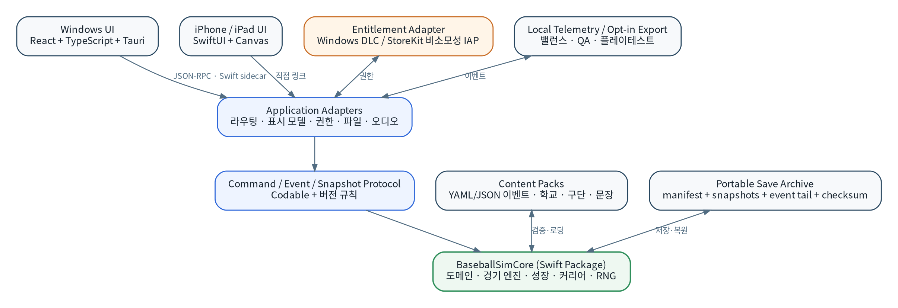
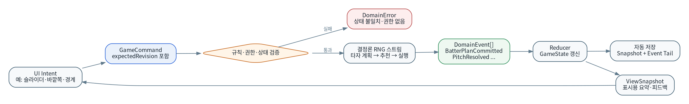
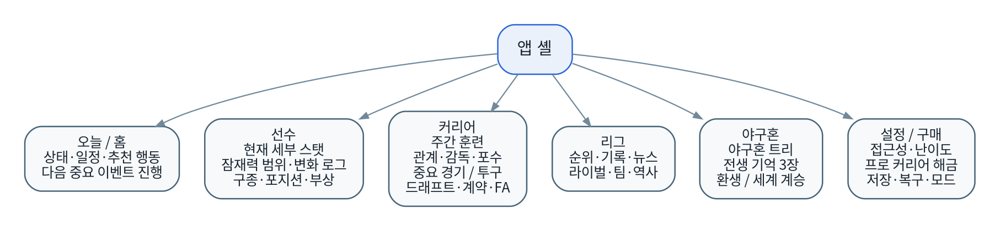

% 야구 못하면 또 환생함
% 개발 문서 패키지 — PRD · GDD · TRD · IA · Use Case · Design Guide · QA · Release
% Baseline v1.0 · 2026-07-21

> **제품 정의**  
> 여러 번의 고교 야구 인생에서 얻은 기억으로 프로 드래프트를 돌파하고, 지명된 한 명의 선수로 은퇴까지 살아가는 데이터 중심 야구 로그라이트 RPG.

| 항목 | 값 |
|---|---|
| 제품 책임자 | 솔 |
| 개발 형태 | 1인 개발 |
| 최초 플랫폼 | Windows PC |
| 후속 플랫폼 | iPhone · iPad |
| 첫 구현 | 고교 선발투수 · Pitcher Lab |
| 수익화 | 고교·드래프트 무료, 프로 커리어 일회성 해금 |
| 상태 | 제품 기준선 확정, 세부 수치 프로토타입 검증 대상 |

## 문서 구성

1. 문서 인덱스 및 공통 용어집
2. 제품 요구사항 문서(PRD)
3. 경쟁작 분석 및 적용 원칙
4. 게임 디자인 문서(GDD)
5. 기술 요구사항 문서(TRD)
6. 정보 구조 및 사용자 흐름
7. Use Case 명세
8. UX/UI 디자인 가이드
9. Pitcher Lab 프로토타입 사양
10. 게임 밸런스 및 메타 진행
11. 데이터 모델·명령·이벤트 프로토콜
12. 콘텐츠·내러티브·지역화 바이블
13. 분석·KPI·텔레메트리
14. QA 및 테스트 전략
15. 개발 로드맵·백로그
16. 수익화·출시·법무·접근성
17. 리스크·ADR·열린 결정
18. 요구사항 추적성 매트릭스

\newpage
# 문서 인덱스 및 공통 용어집

| 항목 | 값 |
|---|---|
| 정식 제품명 | **야구 못하면 또 환생함** |
| 구 코드명 | Project Diamond Soul |
| 내부 식별자 | `baseball` |
| 문서 버전 | 1.0 Baseline |
| 기준일 | 2026-07-21 |
| 제품 책임자 | 솔 |
| 개발 형태 | 1인 개발, Windows 우선·iOS 후속 |
| 문서 상태 | 핵심 콘셉트 확정, 세부 밸런스는 프로토타입 검증 대상 |

## 1. 문서 세트의 목적

이 문서 세트는 제품 기획, 게임 규칙, 기술 구조, 정보 구조, 사용 사례, 디자인, 밸런스, 콘텐츠, QA, 출시까지 서로 다른 관점의 결정을 하나의 기준선으로 묶는다. 구현 중 충돌이 생기면 아래 우선순위를 따른다.

1. **PRD**: 누구를 위해 어떤 문제를 해결하고 무엇을 출시하는가.
2. **GDD**: 게임에서 실제로 어떤 규칙과 경험이 발생하는가.
3. **TRD**: 그 경험을 어떤 기술 구조와 품질 기준으로 구현하는가.
4. **IA·Use Case·Design Guide**: 사용자가 기능을 어떻게 찾고 조작하는가.
5. **Data·Balance·Content 문서**: 수치, 데이터 구조, 텍스트가 어떻게 생산·검증되는가.
6. **QA·Traceability**: 요구사항이 실제로 구현되고 검증됐는가.

상위 문서와 하위 문서가 모순되면 상위 문서를 기준으로 하되, 변경 이유를 의사결정 기록(ADR)에 남긴다.

## 2. 포함 문서

| ID | 문서 | 주 독자 | 핵심 산출물 |
|---|---|---|---|
| DOC-00 | 문서 인덱스·용어집 | 전원 | 공통 정의, 문서 우선순위 |
| DOC-01 | PRD | 제품·개발 | 목표, 범위, 요구사항, KPI |
| DOC-02 | GDD | 게임 디자인·개발 | 핵심 루프, 규칙, 콘텐츠 구조 |
| DOC-03 | TRD | 개발 | 아키텍처, 저장, 결정론, 품질 기준 |
| DOC-04 | IA·사용자 흐름 | UX·개발 | 사이트맵, 화면 목록, 주요 흐름 |
| DOC-05 | Use Case 명세 | 개발·QA | 정상·대안·오류 흐름 |
| DOC-06 | UX/UI 디자인 가이드 | 디자인·개발 | 토큰, 컴포넌트, 반응형·접근성 |
| DOC-07 | Pitcher Lab 사양 | 초기 개발·플레이테스트 | 첫 프로토타입의 범위와 합격 조건 |
| DOC-08 | 밸런스·메타 진행 | 게임 디자인·QA | 성장곡선, 기억·각성, 난이도 |
| DOC-09 | 데이터·명령·이벤트 | 개발 | 엔터티, 스키마, IPC, 저장 포맷 |
| DOC-10 | 콘텐츠·내러티브 바이블 | 집필·개발 | 세계관, 문체, 이벤트 제작 규칙 |
| DOC-11 | 분석·KPI 계획 | 제품·QA | 퍼널, 밸런스 지표, 로컬 텔레메트리 |
| DOC-12 | QA·테스트 전략 | 개발·QA | 테스트 계층, 릴리스 게이트 |
| DOC-13 | 로드맵·백로그 | 개발 | 단계, 에픽, 완료 기준 |
| DOC-14 | 수익화·출시·법무·접근성 | 제품·개발 | 무료/유료 경계, 스토어, IP 원칙 |
| DOC-15 | 리스크·ADR·열린 결정 | 전원 | 위험, 확정 결정, 추후 결정 |
| DOC-16 | 요구사항 추적성 | 개발·QA | PRD → Use Case → 모듈 → 테스트 연결 |
| DOC-17 | 경쟁작 분석 | 제품·디자인 | 적용 요소, 피해야 할 합성 실패 |

## 3. 제품 한 문장 정의

> **여러 번의 고교 야구 인생에서 얻은 기억으로 프로 드래프트를 돌파하고, 지명된 한 명의 선수로 은퇴까지 살아가는 데이터 중심 야구 로그라이트 RPG.**

## 4. 확정된 제품 원칙

- 고교 단계는 **60~90분짜리 반복 가능한 로그라이트 런**이다.
- 프로 단계는 **8~15시간 규모의 장기 커리어 시뮬레이션**이다.
- 고교와 드래프트까지 무료이며, 프로 계약 직전에 일회성 구매로 전체 프로 커리어를 연다.
- 첫 구현 포지션은 **선발투수**다. 타자와 투타 겸업은 후속 범위다.
- 현재 세부 스탯은 모두 공개한다. 미래는 잠재력 범위와 신뢰도로 표시한다.
- 정확한 학습률, 성장 시점, 압박 반응, 부상 취약성과 같은 미래·성향 정보는 경험으로 발견한다.
- 경기 중 직접 조작은 반사신경이 아니라 **구종·코스·강도·전술 판단**이다.
- 중요 장면에만 개입하고 일반 경기는 빠르게 진행한다.
- 결과에 극적 보정이나 연패 보정을 적용하지 않는다.
- 영구 메타 성장은 선택권과 정보가 중심이며, 순수 능력 상승은 최대 약 8~10% 이내로 제한한다.
- 새 생 시작 시 전생의 기억은 최대 3장, 한 고교 런에서 각성은 3개를 획득한다.
- 완전 싱글플레이·오프라인 우선이며 광고, 가챠, 에너지 판매, 능력치 판매를 사용하지 않는다.

## 5. 핵심 용어

| 용어 | 정의 |
|---|---|
| 삶 / 런 | 한 명의 선수가 중학교 프롤로그부터 드래프트 또는 프로 은퇴까지 진행하는 단위. 문맥상 고교 런을 뜻할 때는 명시한다. |
| 고교 로그라이트 | 중학교 프롤로그와 고교 3년을 8개 챕터로 압축한 60~90분 반복 플레이 구간. |
| 프로 커리어 | 드래프트 지명 후 계약, 2군, 1군, FA, 은퇴까지 이어지는 장기 구간. |
| 야구혼 | 여러 삶을 거치며 축적되는 영구 메타 진행. 세계관에서는 명확한 환생 기억이 아니라 설명하기 어려운 감각으로 표현한다. |
| 전생의 기억 | 새 생 시작 시 장착하는 최대 3개의 특수 효과. 특정 실패·성취에서 해금된다. |
| 각성 | 이번 삶에서만 적용되는 3개의 빌드 특성. 실제 행동과 성장 방향에 따라 후보가 달라진다. |
| 업보 | 선택적으로 장착하는 난이도 제약. 보상 배율과 희귀 해금을 높인다. |
| 현재 스탯 | 현재 선수의 실제 기술·신체·정신 능력. 세부 값까지 공개한다. |
| 적용 스탯 | 현재 스탯에 피로, 감각, 심리, 관계 등의 동적 보정을 반영한 경기용 값. |
| 잠재력 범위 | 장기적으로 도달 가능한 수준에 대한 추정 범위. 평가 신뢰도에 따라 폭이 달라진다. |
| 중요 장면 | 경기 승패, 드래프트, 기록, 관계 등 커리어 가치가 높은 상황으로 사용자가 직접 개입하는 구간. |
| 포수 추천 | 포수가 제안하는 주 추천과 위험 구조가 다른 대안 추천. 정답이 아닌 불완전한 조언이다. |
| 결정론 | 같은 콘텐츠 버전, 세계 시드, 명령 순서가 같으면 동일한 도메인 이벤트가 생성되는 성질. |
| 세계 계승 | 이전 선수가 은퇴한 같은 리그 세계에서 다음 선수를 시작하는 모드. 이전 선수는 역사나 NPC로 남는다. |
| 새 세계 | 리그 역사와 인물을 새로 생성하되 야구혼과 해금은 유지하는 모드. |
| 프로 커리어 해금 | 드래프트 지명 후 계약 서명 시 필요한 일회성 구매 권한. |

## 6. 요구사항 ID 규칙

- `PRD-FR-###`: 기능 요구사항
- `PRD-NFR-###`: 비기능 요구사항
- `GDD-RULE-###`: 게임 규칙
- `UC-###`: 사용 사례
- `UI-###`: 화면 또는 UI 요구사항
- `TECH-###`: 기술 요구사항
- `DATA-###`: 데이터·이벤트 규칙
- `QA-###`: 테스트 또는 릴리스 게이트
- `ADR-###`: 아키텍처·제품 결정

## 7. 변경 관리

기준선 변경은 다음 정보를 포함해야 한다.

1. 변경되는 요구사항 ID.
2. 사용자 가치 또는 기술적 이유.
3. 영향을 받는 문서와 저장 호환성.
4. 밸런스·콘텐츠·QA 영향.
5. 롤백 가능 여부.

단순 문장 교정은 문서 패치 버전을 올리고, 규칙·범위·데이터 구조 변경은 마이너 버전을 올린다. 저장 호환성을 깨는 변경은 메이저 버전과 마이그레이션 계획이 필요하다.


\newpage

# 제품 요구사항 문서(PRD)

| 항목 | 값 |
|---|---|
| 문서 ID | DOC-01 |
| 제품 | 야구 못하면 또 환생함 |
| 버전 | 1.0 Baseline |
| 상태 | 승인 기준선 |
| 제품 책임자 | 솔 |

## 1. 요약

야구 못하면 또 환생함은 한국형 가상 야구 세계에서 한 명의 선수를 중학교 말부터 육성하고, 고교 드래프트를 통과하면 프로 은퇴까지 살아가는 싱글플레이 데이터 야구 RPG다. 고교 구간은 짧고 반복 가능한 로그라이트로, 프로 구간은 하나의 선수에게 애착을 형성하는 장기 커리어로 설계한다.

기존 야구 게임의 빈 공간은 세 가지 조합에 있다.

1. OOTP 수준의 기록과 인과관계를 **한 선수의 시야**로 보여준다.
2. 손기술이 아니라 구종, 코스, 강도, 훈련, 감독·포수와의 관계를 판단한다.
3. 고교에서 실패한 경험이 다음 선수의 선택지로 남고, 드래프트 성공이 긴 프로 커리어의 관문이 된다.

{width=3.25in}

## 2. 해결하려는 사용자 문제

### 2.1 현재 시장의 불편

- 구단 경영 게임은 깊지만 특정 선수 한 명에게 감정적으로 몰입하기 어렵다.
- 액션 야구 게임의 커리어 모드는 플레이어 손기술이 선수 능력보다 중요해질 수 있다.
- 육성 모드는 반복성이 높지만 프로 전체 인생과 역사 축적이 짧거나 단절되는 경우가 많다.
- 모바일 야구 게임은 카드 수집, 에너지, 확률형 과금이 성장 체험을 대체하는 경우가 많다.
- 모든 시즌을 직접 플레이하면 장기 커리어가 지루하고, 모두 자동으로 돌리면 개입감이 부족하다.

### 2.2 제품이 제공하는 해결책

- 현재 세부 스탯과 경기 데이터를 정확히 보여주어 분석의 재미를 제공한다.
- 중요 장면에서는 야구 판단을 직접 내리되, 일반 경기는 빠르게 압축한다.
- 고교 실패와 성공을 메타 진행으로 연결하여 재도전 동기를 제공한다.
- 프로 진출 이후에는 메타 보너스를 전면에 내세우지 않고 한 선수의 기록과 선택에 집중한다.
- 무료 구간 자체가 완결된 고교 드래프트 게임이며, 유료 구매는 승리 확률이 아니라 콘텐츠 범위를 연다.

## 3. 제품 비전과 성공 정의

### 3.1 비전

> 사용자가 “내가 가장 잘 키운 캐릭터”가 아니라 “내가 실제로 살아본 것 같은 야구선수”를 기억하게 한다.

### 3.2 핵심 감정

- 평범한 유망주가 프로와 스타로 성장하는 성취감.
- 드물게 등장한 천재의 잠재력을 발견하고 기록을 깨는 쾌감.
- 구종, 훈련, 진학, 감독과의 갈등 같은 선택이 한 사람의 인생을 바꾼다는 감각.
- 실패한 삶이 다음 생에 의미 있게 남는 재도전 욕구.

### 3.3 제품 원칙

1. **판단이 조작보다 중요하다.** 반사신경 미니게임을 핵심 성장 수단으로 사용하지 않는다.
2. **결과보다 인과를 설명한다.** 좋은 선택과 나쁜 결과, 나쁜 선택과 운 좋은 결과를 구분한다.
3. **현재는 투명하고 미래는 불확실하다.** 현 능력은 전부 공개하고 잠재력은 범위로 표현한다.
4. **짧은 반복과 긴 애착을 분리한다.** 고교는 로그라이트, 프로는 장기 시뮬레이션이다.
5. **실패를 판매하지 않는다.** 과금, 광고, 가챠로 실패를 우회시키지 않는다.
6. **기능보다 속도를 우선한다.** 사용자는 중요 결정을 빠르게 찾고 시즌을 원하는 속도로 진행할 수 있어야 한다.

## 4. 목표 사용자

### Persona A: 데이터 야구 팬

- OOTP, 세이버 지표, 구종 데이터, 기록 비교를 좋아한다.
- 3D 그래픽보다 일관된 시뮬레이션과 깊은 통계를 중시한다.
- 원하는 기능: 상세 스탯, 구종별 결과, 역사, 결정론, 빠른 시뮬레이션.

### Persona B: 선수 육성·커리어 팬

- 한 캐릭터가 성장하고 관계와 선택으로 삶이 달라지는 게임을 좋아한다.
- 실패 후 다른 빌드로 다시 시도하는 것을 즐긴다.
- 원하는 기능: 학교 선택, 감독·포수·라이벌, 드래프트 긴장, 기억·각성.

### Persona C: 짧게 플레이하는 모바일·휴대 사용자

- 한 번에 5~15분 단위로 진행하고, 중요한 장면만 직접 플레이하려 한다.
- 복잡한 표를 볼 때도 다음 행동은 명확하기를 원한다.
- 원하는 기능: 추천 행동, 자동 진행, 세로형 중요 투구 UI, 저장 안정성.

### 비주요 사용자

- 실시간 PvP와 사실적인 3D 액션만을 기대하는 사용자.
- 실제 구단·실명 선수 라이선스를 필수로 여기는 사용자.
- 선수 카드 수집과 경쟁 랭킹을 핵심 동기로 삼는 사용자.

## 5. 제품 범위

### 5.1 무료 제품: 고교 로그라이트

- 중학교 3학년 프롤로그.
- 고교 선택 및 3년 압축 커리어.
- 선수 생성, 현재 세부 스탯, 잠재력 범위.
- 훈련, 휴식, 감독·포수·라이벌 관계.
- 중요 경기의 전략 선택.
- 각성 3개, 전생 기억 최대 3장.
- 드래프트 방송, 지명 또는 미지명 엔딩.
- 야구혼 진행과 다음 생.

### 5.2 유료 제품: 프로 커리어 해금

- 프로 계약, 2군, 1군 데뷔.
- 주전 경쟁, 감독 면담, 포지션·역할 변경.
- 병역, 국가대표, 외국인 선수와의 경쟁·관계.
- 트레이드, 방출, 입단 테스트, FA.
- 부상·재활, 노쇠화, 은퇴와 한 차례 복귀.
- 명예의 전당, 은퇴 후 후일담, 세계 계승.

### 5.3 플랫폼 범위

- 1차: Windows PC.
- 2차: iPhone·iPad.
- 공유: Swift 기반 시뮬레이션 코어, 콘텐츠, 저장 규칙.
- 분리: 플랫폼별 UI, 입력, 구매, 파일, 오디오 어댑터.

## 6. 핵심 사용자 여정

1. 사용자가 새 세계 또는 기존 세계를 선택한다.
2. 야구혼 배분, 전생 기억, 선수 프리셋과 세부 포인트를 결정한다.
3. 중학교 프롤로그에서 첫 경기와 포수·라이벌을 만난다.
4. 학교를 선택하고 8개 고교 챕터를 진행한다.
5. 매 챕터 훈련·관계·중요 경기 중 핵심 결정을 내린다.
6. 드래프트에서 지명되면 구단과 육성 계획을 확인한다.
7. 프로 계약 버튼에서 전체 프로 커리어 해금을 안내한다.
8. 구매 후 같은 저장에서 프로 생활을 계속한다.
9. 은퇴 후 커리어를 회고하고 새 세계 또는 세계 계승으로 다음 선수를 시작한다.

## 7. 기능 요구사항

### 7.1 선수 생성·스탯

- **PRD-FR-001** 사용자는 투수 프리셋 또는 자유 배분으로 선수를 생성할 수 있어야 한다.
- **PRD-FR-002** 현재의 모든 세부 능력과 실측 데이터는 상세 화면에서 확인 가능해야 한다.
- **PRD-FR-003** 미래 능력은 최소·최대 범위와 신뢰도로 표시해야 한다.
- **PRD-FR-004** 숨은 학습률, 압박 반응, 성장 시점은 직접 숫자로 노출하지 않고 관찰 로그로 추론하게 해야 한다.
- **PRD-FR-005** 신체, 기술, 정신, 구종, 동적 상태의 변화 원인을 확인할 수 있어야 한다.

### 7.2 고교 진행

- **PRD-FR-010** 한 고교 런은 평균 60~90분 안에 끝나도록 압축해야 한다.
- **PRD-FR-011** 고교 3년은 8개 챕터와 약 12~16회의 핵심 성장 결정으로 구성해야 한다.
- **PRD-FR-012** 사용자는 일반 경기를 빠르게 넘기고 중요 장면만 직접 플레이할 수 있어야 한다.
- **PRD-FR-013** 학교는 출전 기회, 시설, 스카우트 노출, 감독 철학이 서로 달라야 한다.
- **PRD-FR-014** 드래프트 미지명은 해당 삶의 종료이되, 원인 분석과 메타 보상을 제공해야 한다.

### 7.3 중요 투구

- **PRD-FR-020** 투수 플레이어는 구종, 3×3 코스, 존 의도, 투구 강도를 선택할 수 있어야 한다.
- **PRD-FR-021** 포수는 주 추천과 위험 구조가 다른 대안 추천을 제시해야 한다.
- **PRD-FR-022** 타자 계획은 플레이어 투구 입력보다 먼저 확정돼야 한다.
- **PRD-FR-023** 타자와 상대 구단은 실제 관찰된 투구 기록을 바탕으로 장기 적응해야 한다.
- **PRD-FR-024** 결과 설명은 선택, 실행, 타자 반응, 타구 결과를 분리해 제공해야 한다.
- **PRD-FR-025** 중요 경기라는 이유만으로 성공 확률을 높이거나 연속 실패를 보정해서는 안 된다.

### 7.4 로그라이트 진행

- **PRD-FR-030** 야구혼은 영구 정보·선택지와 제한된 초기 능력 보너스를 제공해야 한다.
- **PRD-FR-031** 영구 보너스의 순수 경기 능력 기여는 초기 기준 대비 최대 약 8~10%로 제한해야 한다.
- **PRD-FR-032** 새 생은 전생의 기억을 최대 3장 장착할 수 있어야 한다.
- **PRD-FR-033** 한 고교 런에서 각성은 3개만 획득해야 한다.
- **PRD-FR-034** 첫 삶은 방향성 있게 플레이할 경우 약 35~45%, 두 번째 50~65%, 세 번째 70~80%의 프로 지명 목표 범위를 가진다.
- **PRD-FR-035** 후기 플레이어는 업보를 선택해 난이도와 보상을 동시에 높일 수 있어야 한다.

### 7.5 프로·구매

- **PRD-FR-040** 드래프트 결과와 구단 육성 계획은 구매 전에 모두 보여야 한다.
- **PRD-FR-041** 프로 계약 서명 시점에서 일회성 전체 프로 커리어 해금을 제안해야 한다.
- **PRD-FR-042** 구매하지 않은 저장은 삭제하지 않고, 구매 후 같은 선수로 계속할 수 있어야 한다.
- **PRD-FR-043** 구매는 프로 지명 확률, 스탯, 기억 카드에 영향을 주면 안 된다.
- **PRD-FR-044** iOS 구매는 비소모성 상품으로 복원 가능해야 한다.

### 7.6 저장·접근성·모드

- **PRD-FR-050** 모든 핵심 선택과 경기 종료 뒤 자동 저장해야 한다.
- **PRD-FR-051** 앱 강제 종료 후에도 마지막 확정 명령 이전의 일관된 상태로 복구해야 한다.
- **PRD-FR-052** 텍스트 확대, 고대비, 색상 외 상태 표현, 키보드 조작, 화면 읽기 레이블을 지원해야 한다.
- **PRD-FR-053** 초기 모드는 구단명, 선수명, 로고, 유니폼 교체를 지원해야 한다.
- **PRD-FR-054** 사용자 모드는 임의 실행 코드를 허용하지 않는 선언형 콘텐츠 팩이어야 한다.

## 8. 비기능 요구사항

- **PRD-NFR-001 결정론**: 같은 시드, 콘텐츠 버전, 명령 순서에서 동일한 도메인 이벤트를 생성한다.
- **PRD-NFR-002 반응성**: 중요 투구 입력 후 결과 피드백은 일반적인 PC·지원 iOS 기기에서 체감 지연 없이 표시한다.
- **PRD-NFR-003 진행 속도**: 한 공의 일반적인 결정은 숙련 후 2~4초, 중요 이닝은 3~5분을 목표로 한다.
- **PRD-NFR-004 저장 신뢰성**: 원자적 저장과 체크섬으로 손상 파일을 감지하고 이전 정상 스냅숏으로 복구한다.
- **PRD-NFR-005 오프라인**: 게임과 저장, 구매한 콘텐츠 이용은 로그인 없이 가능해야 한다. 구매 복원은 플랫폼 연결이 필요할 수 있다.
- **PRD-NFR-006 지역화**: 모든 사용자 문구는 코드와 분리하고 한국어를 기준 언어로 영어 확장이 가능해야 한다.
- **PRD-NFR-007 개인정보**: 계정 생성과 온라인 경쟁을 요구하지 않으며, 제작용 텔레메트리는 로컬 또는 명시적 동의 기반이다.
- **PRD-NFR-008 호환성**: 저장 포맷은 플랫폼 간 이동 가능성을 고려한 버전형 중립 포맷을 사용한다.

## 9. 성공 지표

### 9.1 Pitcher Lab

- 튜토리얼 없이 두 번째 등판에서 80% 이상이 주 추천을 그대로 수락하거나 한 요소만 수정해 투구를 완료한다.
- 한 공당 중앙값 결정 시간이 8초 이하, 네 번째 등판에서는 4초 이하를 목표로 한다.
- 플레이테스터의 70% 이상이 두 가지 이상의 투구 선택 전략을 설명할 수 있다.
- 플레이테스터의 60% 이상이 첫 선수의 숨은 성장 유형을 완전히는 아니더라도 방향성 있게 추정한다.
- 두 번째 삶을 시작하는 비율이 65% 이상이다.

### 9.2 무료 고교 제품

- 첫 삶 완료율.
- 첫 미지명 후 두 번째 삶 시작률.
- 드래프트 결과 화면 도달률.
- 세 번째 삶 이내 최초 지명 비율.
- 지명 직후 프로 해금 화면 도달률.
- 반복 플레이 중 동일 프리셋·동일 행동 편중도.

### 9.3 유료 프로 제품

- 구매 후 1군 데뷔 도달률.
- 시즌 완료 및 은퇴 완료율.
- 평균 커리어 길이와 중요 장면 개입 빈도.
- 저장 손상·복구 실패율.
- 구매 복원 성공률.
- 사용자 리뷰에서 데이터 깊이, 선택의 인과, 반복 피로도에 관한 정성 평가.

## 10. 출시 범위와 제외 범위

### 최초 출시 핵심

- 투수 전용 고교 로그라이트.
- 가상 학교·프로 10구단.
- 프로 커리어는 투수 역할 중심.
- 현재 스탯·잠재 범위·상세 경기 데이터.
- Windows 무료 고교 + 프로 해금.
- 한국어.

### 명시적 후속 범위

- 타자 플레이와 수비·주루 개입.
- 투타 겸업.
- iOS 네이티브 앱.
- 미국·일본 등 해외리그.
- 고급 이벤트 모딩.
- 지도자 커리어 직접 플레이.

### 하지 않는 것

- 실시간 멀티플레이.
- 선수 카드 가챠.
- 광고 시청 보상.
- 실제 구단·선수 실명 데이터 기본 제공.
- 3D 액션 야구.
- 집, 자동차, 투자 등 생활 경제 시뮬레이션.

## 11. 출시 승인 기준

무료 고교 버전은 다음 조건을 모두 만족해야 한다.

1. 한 삶이 60~90분 범위에서 완결된다.
2. 지명과 미지명 모두 다음 행동이 명확하다.
3. 세 가지 이상의 유효한 투수 빌드가 존재한다.
4. 저장을 강제로 중단한 테스트에서 일관된 복구가 가능하다.
5. 결정론 회귀 테스트가 플랫폼별로 통과한다.
6. 구매하지 않은 사용자가 고교 전체를 제한 없이 반복할 수 있다.
7. 접근성 핵심 기능과 키보드 전체 조작이 가능하다.
8. 실제 상표·선수 데이터가 기본 콘텐츠에 포함되지 않는다.


\newpage

# 경쟁작 분석 및 적용 원칙

| 항목 | 값 |
|---|---|
| 문서 ID | DOC-17 |
| 버전 | 1.0 Baseline |
| 목적 | 검증된 야구 게임의 장점을 적용하고 범위·정체성 충돌을 방지 |

## 1. 핵심 결론

야구 못하면 또 환생함의 차별점은 개별 기능이 아니라 다음 조합이다.

> **한국형 고교 로그라이트를 반복해 드래프트를 돌파하고, 성공한 한 선수로 데이터 중심 프로 커리어를 은퇴까지 이어가는 구조.**

학생부터 프로까지, 선수 한 명 커리어, 데이터 시뮬레이션, 구종 예측, 로그라이트 육성은 각각 기존 게임에 존재한다. 따라서 제품은 기능 수가 아니라 `고교의 짧은 반복`과 `프로의 긴 애착`을 분리하고, 손기술 대신 야구 판단을 제공해야 한다.

## 2. 게임별 교훈

### OOTP Baseball

**강점**

- 장기적으로 이어지는 가상 야구 세계.
- 세밀한 기록과 세이버 지표.
- 빠른 시뮬레이션과 플레이 바이 플레이의 공존.
- 선수 성장·노쇠화·역사의 축적.

**적용**

- 모든 시즌·통산 기록과 구종 데이터를 보존한다.
- 중요한 장면만 세밀하게 펼치고 일반 경기는 압축한다.
- 세계의 다른 선수도 성장·이적·은퇴하되 플레이어 주변을 우선 상세 계산한다.

**적용하지 않음**

- 구단 전체 재정·트레이드 운영.
- 수천 명의 선수를 같은 깊이로 노출하는 UI.

### Baseball Mogul

**강점**

- 빠른 장기 시뮬레이션.
- 기록과 뉴스가 연결되는 구조.
- 단순한 시각 표현에서도 결과를 이해할 수 있는 흐름.

**적용**

- 장기 프로 시즌의 속도를 사용자가 조절한다.
- 뉴스는 실제 기록과 사건 reason code에서 생성한다.

### 파워프로 Success

**강점**

- 제한된 기간·행동 수 안에서 훈련, 휴식, 관계를 선택한다.
- 같은 시나리오를 다른 빌드로 반복할 수 있다.
- 장점과 단점이 함께 있는 특수능력이 플레이 방식을 바꾼다.

**적용**

- 고교를 60~90분의 한정된 런으로 압축한다.
- 훈련과 휴식에 명확한 기회비용을 둔다.
- 기억과 각성은 강점·대가를 함께 제공한다.

**주의**

- 한 번의 무작위 사건이 전체 런을 결정하지 않게 한다.
- 최적 이벤트 루트를 외우는 것이 실제 야구 판단보다 중요해지지 않게 한다.

### 파워프로 My Life

**강점**

- 프로 입단부터 은퇴까지 한 선수의 생활과 계약을 다룬다.
- 트라이아웃, 연봉, 관계가 커리어 단계와 연결된다.

**적용**

- 프로의 역할, 계약, 방출, 재도전, 은퇴를 구현한다.

**축소**

- 집, 자동차, 소비, 취미를 별도 경제로 관리하지 않는다.
- 야구 외 삶은 언론·팬·친구·동료·감독의 핵심 사건에 제한한다.

### MLB The Show Road to the Show

**강점**

- 학생·아마추어 단계에서 프로와 명예의 전당까지 연결한다.
- 커리어를 단계·목표·이정표로 구성한다.
- 기록과 수상을 연출로 축하한다.

**적용**

- 고교 8챕터와 프로 단계별 목표를 사용한다.
- 첫 홈런, 첫 승, 드래프트, 1군 데뷔, 기록 돌파를 별도 연출한다.

**차별화**

- 직접 액션 조작 대신 구종·코스·훈련·관계 판단을 핵심으로 한다.

### 프로야구 스피리츠 스타플레이어

**강점**

- 감독 평가와 기용, 계약 평가가 연결된다.
- 장기 선수 커리어의 역할 변화를 다룬다.

**적용**

- 감독 신뢰와 약속이 선발·콜업·역할에 실제 영향을 준다.
- 미션은 결과보다 과정 중심으로 설계한다.

예: `안타를 맞지 말라`보다 `볼넷 2개 이하`, `개발 구종 3회 사용`, `투구 수 관리`.

### New Star Baseball

**강점**

- 선수 한 명, 짧은 중요 상황, 관계·언론을 결합한다.
- 모바일에서 간단한 입력으로 커리어를 진행한다.

**적용**

- 일반 경기를 건너뛰고 중요 이닝만 플레이한다.
- 포수 추천 수락은 한 번의 입력으로 가능하게 한다.

**피함**

- 에너지·장비·재화 과금으로 진행을 막지 않는다.

### BASEBALL 9

**강점**

- 빠른 경기와 명확한 수동·자동 전환.
- 모바일에서 이해하기 쉬운 핵심 스탯.

**적용**

- 한 공 2~4초, 중요 이닝 3~5분의 숙련 페이스를 목표로 한다.
- 자동 진행 중 언제든 중요 장면에 개입한다.

### MLB 9 Innings Rivals

**강점**

- 구종·코스 예상과 스카우팅 정보.
- 짧은 이닝 중심 모바일 흐름.

**적용**

- 타자와 투수 모두 예상 구종·코스를 가지며 예측 성공이 결과를 보장하지 않는다.
- 스카우팅은 범위와 신뢰도로 제공한다.

**피함**

- 카드 등급과 확률형 수집이 전술을 압도하지 않게 한다.

### Super Mega Baseball

**강점**

- 접근성 있는 표현과 깊은 야구 규칙.
- 난이도를 세부 축으로 조절한다.
- 선수 특성이 팀·상황과 상호작용한다.

**적용**

- 커리어 가혹도, 정보 명확도, 시뮬레이션 난도, 개입 보조를 독립 조정한다.
- 특성은 순수 보너스보다 플레이 스타일을 만든다.

### Super Psycho Baseball 등 야구 로그라이트

**강점**

- 짧은 런과 즉시 체감되는 업그레이드.

**교훈**

- 10시간 프로 커리어 전체를 하나의 로그라이트 런으로 취급하지 않는다.
- 실패→보상→재시도의 빠른 주기는 고교 구간에만 집중한다.

## 3. 적용 우선순위

| 우선 | 적용 요소 | 이유 |
|---|---|---|
| 1 | 짧은 고교 런·긴 프로 커리어 분리 | 제품 정체성의 핵심 |
| 2 | 중요 장면 전략 선택과 인과 피드백 | 액션 게임과의 차별화 |
| 3 | 현재 전체 스탯·미래 범위 | 데이터 팬과 육성 팬을 연결 |
| 4 | 기억 3장·각성 3개 | 반복 빌드와 인지 부담의 균형 |
| 5 | 빠른 자동 진행 | 장기 커리어 피로 방지 |
| 6 | 감독·포수·라이벌 | 숫자를 인생 서사로 전환 |
| 7 | 4축 난이도 | 초보·하드코어 동시 지원 |

## 4. 피해야 할 합성 실패

- OOTP의 모든 메뉴 + Success의 모든 이벤트 + My Life의 모든 생활 기능을 동시에 구현.
- 로그라이트 보너스를 많이 넣는 것 자체를 차별화로 착각.
- 모든 현재 스탯과 모든 미래 내부값을 공개해 발견의 재미 제거.
- 고교를 여러 시간 플레이하게 해 재도전 주기 지연.
- 프로에서도 매 시즌 메타 카드를 계속 선택해 선수 개인의 정체성 약화.
- 모바일에 PC의 표를 그대로 축소.
- 구매 전 일부러 드래프트를 어렵게 만드는 설계.

## 5. 참고 제품 페이지

- OOTP Baseball: `https://www.ootpdevelopments.com/`
- PowerPros: `https://www.konami.com/pawa/`
- MLB The Show: `https://theshow.com/`
- Professional Baseball Spirits: `https://www.konami.com/games/prospi/`
- New Star Baseball: `https://www.newstargames.com/`
- Super Mega Baseball: `https://www.ea.com/games/super-mega-baseball/`


\newpage

# 게임 디자인 문서(GDD)

| 항목 | 값 |
|---|---|
| 문서 ID | DOC-02 |
| 버전 | 1.0 Baseline |
| 장르 | 데이터 야구 커리어 RPG + 고교 로그라이트 |
| 기본 시점 | 한 명의 선수 |
| 첫 구현 | 고교 선발투수 |

## 1. 게임 판타지

플레이어는 완성된 스타를 조종하지 않는다. 신체와 기술이 아직 불완전한 중학생 유망주로 시작해 학교, 훈련, 포수, 감독, 라이벌, 중요 경기에서 선택한다. 현재 능력은 수치로 명확히 보이지만 미래의 성장 방식은 확정되지 않는다. 고교 드래프트에 실패하면 그 삶은 끝나지만 실패 원인이 다음 선수의 정보와 선택지로 남는다. 지명에 성공하면 반복 구조를 벗어나 한 명의 프로 선수로 긴 인생을 산다.

## 2. 디자인 기둥

### 2.1 Data Clarity

- 현재 능력과 경기 데이터는 상세히 공개한다.
- 동적 보정과 변화 원인을 분리해 보여준다.
- 잠재력은 범위와 신뢰도로 제공한다.
- 한 경기 결과보다 투구 내용과 장기 분포를 판단할 수 있게 한다.

### 2.2 Meaningful Baseball Decisions

- 중요 투구에서 구종, 코스, 존 의도, 강도를 선택한다.
- 포수 추천은 빠른 기본값을 제공하지만 완벽하지 않다.
- 타자 적응과 피로로 반복적인 정답이 무너진다.
- 결과는 보정하지 않고 인과 피드백을 제공한다.

### 2.3 Short Runs, Long Careers

- 고교는 반복 가능한 60~90분 런이다.
- 프로는 로그라이트 런이 아닌 8~15시간 장기 커리어다.
- 고교 재도전은 빨라야 하고, 프로는 되돌리지 않는 자동 저장을 사용한다.

### 2.4 Legacy Without Power Creep

- 야구혼은 지식, 후보, 선택권이 중심이다.
- 직접 능력 보너스는 작고 상한이 있다.
- 기억과 각성은 특정 스타일을 가능하게 하되 모든 약점을 제거하지 않는다.

## 3. 전체 게임 구조

### 3.1 고교 8개 챕터

| 챕터 | 시기 | 주요 내용 |
|---|---|---|
| 0 | 중3 프롤로그 | 선수 생성, 첫 중요 이닝, 포수·라이벌 소개, 학교 후보 |
| 1 | 고1 적응 | 훈련 루틴, 벤치·엔트리 경쟁, 첫 각성 후보 |
| 2 | 고1 여름 | 첫 대회, 감독 신뢰, 개발 구종 사용 여부 |
| 3 | 고2 봄 | 주전 또는 선발 경쟁, 중간 스카우팅 |
| 4 | 고2 여름 | 전국대회, 라이벌 재대결, 두 번째 각성 |
| 5 | 고3 봄 | 드래프트 수요, 훈련 특화, 부진·피로 관리 |
| 6 | 고3 여름 | 마지막 대회, 쇼케이스·비공개 테스트 가능 |
| 7 | 드래프트 | 예상 순위, 라운드 진행, 지명·미지명 결말 |

한 챕터는 1~3개의 핵심 노드로 구성한다. 모든 주를 날짜 단위로 플레이하지 않는다. 사용자는 훈련 비율을 유지하고, 챕터마다 집중 훈련·관계·경기 결정을 내린다.

### 3.2 프로 커리어 단계

1. 계약과 신인 캠프.
2. 2군 적응과 1군 콜업.
3. 주전·선발 로테이션 확보.
4. 전성기, 타이틀, 포스트시즌, 국가대표.
5. 병역·트레이드·FA·해외 진출 선택.
6. 노쇠화, 역할 변경, 방출과 재도전.
7. 은퇴, 한 차례 복귀, 명예의 전당.

## 4. 선수 생성

### 4.1 생성 방식

- 빠른 생성: 네 프리셋 + 미세 조정 포인트.
- 고급 생성: 동일 예산의 자유 배분.
- 현재 능력만 결정하며 학습률과 성장 시점은 직접 구매하지 못한다.
- 우투·좌투, 키·체격, 구종 역할, 기본 투구 철학을 선택한다.

### 4.2 투수 프리셋

| 프리셋 | 강점 | 약점 | 주요 검증 |
|---|---|---|---|
| 강속구 원석 | 포심 구위·출력 | 제구·폼 반복 | 전력투구, 실투 위험 |
| 정교한 커맨더 | 제구·커맨드 | 압도적 결정구 부족 | ABS 경계 승부 |
| 변화구 아티스트 | 구종 형태·시퀀싱 | 구속·체력 | 상대 적응, 개발 구종 |
| 체력형 이닝이터 | 체력·유지력 | 헛스윙 능력 | 투구 수와 타순 반복 |

### 4.3 구종 역할

- 포심은 첫 버전의 공통 직구다.
- 나머지 슬라이더, 커브, 체인지업 중 주력 1개, 보조 1개, 개발 1개를 정한다.
- 개발 구종은 언제든 사용할 수 있으나 경고와 높은 실행 위험이 있다.
- 실전 사용은 학습 신호를 제공하지만 단순 사용 횟수만으로 성장하지 않는다.

## 5. 스탯 시스템

### 5.1 표시 척도

- 실측값: km/h, rpm, 수평·수직 움직임, 익스텐션, 투구 수 등 실제 단위.
- 기술·정신 평가: 20~80 정수 척도. 상세 화면에서는 1단위까지 표시한다.
- 현재 적용값: 기본값 + 컨디션·피로·심리·관계 보정.
- 미래: 예상 범위 + 신뢰도.

### 5.2 공개되는 현재 스탯

- 신체: 근력, 하체, 코어, 유연성, 체력, 회복, 신체 성숙도.
- 메커니즘: 밸런스, 반복성, 릴리스, 암 스피드, 익스텐션, 디셉션.
- 공통 투구: 제구, 커맨드, 경계 실행, 유인구 실행, 시퀀싱, 실전 적용.
- 구종별: 구속, 움직임, 위장, 제구, 커맨드, 헛스윙, 약한 타구, 좌우 상성.
- 정신: 집중, 침착, 경쟁심, 실패 회복, 훈련 태도, 지도 수용, 독립성.
- 동적: 팔 신선도, 전신 피로, 구종 감각, 자신감, 부담감, 배터리 호흡.

### 5.3 숨겨지는 정보

- 구종별 실제 학습률.
- 신체 성장의 정확한 시점과 폭.
- 압박 반응의 원인 계수.
- 반복되는 실투 방향의 내부 파라미터.
- 부상 취약성의 정확한 값.
- 지도자와의 실제 궁합.

이 정보는 경기·훈련 로그와 코치 분석으로 점차 추론한다.

## 6. 주간·챕터 성장 루프

1. 현재 상태와 다음 이벤트를 확인한다.
2. 기본 훈련 비율을 유지 또는 수정한다.
3. 한 가지 집중 훈련을 고른다.
4. 관계·감독·포수 사건이 있으면 선택한다.
5. 일반 경기를 자동 진행하고 중요 장면에 개입한다.
6. 경기 후 결과와 투구 내용을 분리해 분석한다.
7. 스탯 변화와 잠재 범위의 신뢰도 변화를 확인한다.

### 6.1 투수 훈련 카테고리

- 포심 출력.
- 포심 커맨드.
- 변화구 형태.
- 체인지업 감각.
- 전체 제구.
- 투구폼 반복.
- 체력·회복.

훈련은 즉시 `+1`을 구매하는 방식이 아니다. 준비도, 감각, 기술 적응이 먼저 변하고 장기 스탯은 누적 신호와 성장 특성에 따라 변한다.

## 7. 중요 투구 시스템

### 7.1 입력

- 구종: 포심, 슬라이더, 커브, 체인지업.
- 코스: 타자 기준 3×3.
- 존 의도: 존 안, 경계, 유인구.
- 강도: 제구 우선, 표준, 전력.

포수가 주 추천과 대안 추천을 완성된 조합으로 제시한다. 사용자는 그대로 던지거나 일부만 수정한다.

### 7.2 처리 순서

1. 타자 AI가 예상 구종, 예상 코스, 타격 목적을 선확정한다.
2. 포수가 관찰 가능한 데이터로 추천을 만든다.
3. 플레이어가 투구 콜을 제출한다.
4. 목표점과 실제 투구가 제구·피로·압박·구종 상태에 따라 달라진다.
5. 타자가 공을 인식하고 스윙 또는 테이크를 결정한다.
6. 접촉 시 타구 속도, 발사각, 방향을 생성한다.
7. 수비와 구장으로 최종 결과를 계산한다.
8. 선택·실행·타자 반응·결과를 각각 평가한다.

### 7.3 포수

프로토타입의 포수는 중학교부터 함께한 동갑 친구다.

- 철학: 데이터와 타자 반응을 중시하는 분석형.
- 장점: 패턴 분석과 추천 이유가 명확함.
- 약점: 위기에서는 지나치게 보수적임.
- 반복적인 사인 변경은 즉시 관계를 깎지 않지만 경기 후 배터리 이벤트를 만든다.
- 플레이어의 독창적 선택이 반복 성공하면 포수가 새로운 계획을 학습한다.

### 7.4 라이벌

지역 최강팀의 중심타자이며 투구 패턴을 빠르게 학습하는 천재형이다. 첫 대결에서 약점이 보이더라도 재대결에서 같은 해법이 통하지 않도록 설계한다. 라이벌은 상대 적응 시스템의 튜토리얼이자 커리어 서사의 축이다.

## 8. 결과와 피드백

경기 중에는 한두 문장만 표시한다.

> 구종 선택은 노림수를 벗어났지만 슬라이더가 목표보다 높았습니다. 배트 끝에 맞은 타구가 우익수 앞에 떨어졌습니다.

타석 종료 후에는 선택과 실행을 요약한다. 경기 후 분석에서는 구종별 존율, 헛스윙률, 강한 타구율, 예상 피해, 패턴 경고, 타자 접근법 추정 범위를 제공한다.

좋은 선택과 결과는 독립적으로 평가한다.

- 선택 좋음 / 실행 좋음 / 결과 나쁨.
- 선택 좋음 / 실투 / 결과 나쁨.
- 선택 나쁨 / 타자 실수 / 결과 좋음.
- 선택 나쁨 / 실행 나쁨 / 결과 나쁨.

## 9. 피로·회복·부상

### 9.1 고교 초기 범위

- 등판 중 피로와 등판 후 회복을 구현한다.
- 피로가 먼저 손상시키는 영역은 선수별로 다르다.
- 회복 부족은 다음 등판 적용 스탯과 훈련 효율을 낮춘다.
- Pitcher Lab에서는 부상을 제외하고, 고교 완성 버전부터 가벼운 통증과 부상을 추가한다.

### 9.2 프로 범위

- 투구 수, 전력 비중, 휴식 간격, 메커니즘, 내구성으로 위험이 누적된다.
- 큰 부상은 드물지만 역할과 커리어를 바꾸는 사건이다.
- 빠른 복귀와 장기 재활, 폼 변경, 선발·불펜 전환을 선택할 수 있다.

## 10. 고교 로그라이트 메타

### 10.1 야구혼

영구 메타 진행은 다음을 해금한다.

- 잠재력 평가 정밀도.
- 학교·코치 후보 수.
- 드래프트 수요 정보.
- 기억 카드와 업보.
- 최대 8~10% 이내의 초기 능력 보너스.

야구혼 포인트는 새 삶 시작 전 자유 재분배한다.

### 10.2 전생의 기억

- 최대 3장 장착.
- 특정 실패·성취에서 해금.
- 강한 카드는 조건 또는 대가를 가진다.
- 예: 마지막 쇼케이스, 재활 일지, 9회말의 기억, 변화구 장인의 손끝.

### 10.3 이번 생 각성

고교 런에서 3회 획득한다. 후보는 실제 행동과 스탯, 코치, 관계, 숨은 성장 특성에 따라 달라진다.

예:

- 높은 공의 감각: 상단 포심 보너스, 낮은 포심 커맨드 약화.
- 마운드의 주인: 포수 추천과 다른 첫 선택의 실행 안정성 증가, 실패 시 자신감 하락 확대.
- 손끝의 기억: 변화구 훈련 효과 증가, 근력 훈련 효과 감소.

### 10.4 업보

후기 플레이어가 자발적으로 난도를 높이는 제약이다.

- 무명의 땅.
- 완고한 감독.
- 한 가지 무기.
- 천재의 세대.
- 마지막 기회 없음.
- 기억 슬롯 제한.

업보는 유산 경험치, 희귀 카드, 특별 칭호 보상을 높인다.

## 11. 드래프트

### 11.1 평가 요소

- 현재 능력과 측정치.
- 잠재력에 대한 구단 평가.
- 전국대회와 최근 투구 내용.
- 포지션 가치와 구단 수요.
- 체력, 부상, 성격, 훈련 태도.
- 중요 경기의 선택보다 실제 투구 내용.

### 11.2 연출

- 관심 구단과 예상 범위.
- 라운드별 지명 방송.
- 주요 라이벌의 결과.
- 지명 시 구단 평가, 육성 역할, 경쟁자.
- 미지명 시 후보로 검토한 구단과 실패 원인.

### 11.3 난도 목표

| 삶 | 방향성 있게 플레이한 경우 목표 지명률 |
|---|---:|
| 1 | 35~45% |
| 2 | 50~65% |
| 3 | 70~80% |
| 4+ | 기본 난도에서는 높은 확률, 업보로 재상승 |

이는 강제 확률이 아니라 생성 포인트, 정보, 후보 개선으로 얻는 밸런스 목표다.

## 12. 프로 커리어 디자인

### 12.1 선수의 제한된 권한

플레이어는 라인업, 트레이드, 감독 결정을 통제하지 않는다. 대신 면담, 에이전트, 역할 요청, 트레이드 요구, FA 선택으로 커리어에 개입한다.

### 12.2 핵심 딜레마

- 선발을 고수할지 불펜으로 빨리 1군 기회를 얻을지.
- 새 구종을 만들지 현재 결정구를 완성할지.
- 통증을 참고 중요한 경기에 나설지.
- 높은 연봉, 주전 보장, 우승 가능성 중 무엇을 선택할지.
- 원소속 프랜차이즈로 남을지 새로운 팀에서 역할을 얻을지.

### 12.3 은퇴

- 플레이어가 은퇴 또는 마지막 시즌을 선언할 수 있다.
- 은퇴 후 1~3년 안에 한 차례 복귀를 시도할 수 있다.
- 명예의 전당은 통산·전성기·시대 보정·포스트시즌을 평가한다.
- 같은 세계를 이어가면 이전 선수는 코치, 감독, 해설자, 멘토로 등장할 수 있다.

## 13. 리그

- 가상 10개 프로 구단.
- 기본 정규시즌 144경기, 상위 5개 팀의 단계식 포스트시즌.
- ABS와 날씨·구장 효과를 적용한다.
- 리그 타고투저는 커리어 동안 완만하게 변한다.
- 외국인 선수는 관계·경쟁이 가능한 상세 인물이다.
- 실제 구단·선수 이름은 기본 콘텐츠에 사용하지 않는다.

## 14. 난이도

네 축을 독립적으로 조정한다.

| 축 | 낮음 | 높음 |
|---|---|---|
| 커리어 가혹도 | 기회·드래프트 관대 | 경쟁·방출 엄격 |
| 정보 명확도 | 잠재 범위 좁음 | 평가 오차 큼 |
| 시뮬레이션 난도 | 상대 적응 느림 | 패턴 분석·실투 처벌 강함 |
| 개입 보조 | 추천 이유·자동 운영 강화 | 힌트 축소 |

## 15. 반복 피로 방지

- 고교 한 삶의 길이를 제한한다.
- 이미 본 일반 이벤트는 압축 표시한다.
- 같은 행동의 반복 보상은 감소한다.
- 매 런 학교·감독·포수·라이벌·구단 수요가 바뀐다.
- 프로 진출 후에는 고교 메타 화면을 최소화한다.
- 사용자는 중요 장면 빈도를 조정하거나 자동 진행할 수 있다.


\newpage

# 기술 요구사항 문서(TRD)

| 항목 | 값 |
|---|---|
| 문서 ID | DOC-03 |
| 버전 | 1.0 Baseline |
| 아키텍처 방향 | Swift 공유 코어 + 플랫폼별 네이티브/웹 UI |
| 1차 플랫폼 | Windows |
| 2차 플랫폼 | iOS·iPadOS |

## 1. 기술 목표

- Windows와 iOS에서 동일한 경기·성장·커리어 결과를 생성한다.
- 게임 규칙을 UI, 스토어, 파일 시스템과 분리한다.
- 같은 시드와 명령 순서에서 재현 가능한 결정론을 보장한다.
- 한 명의 개발자가 작은 프로토타입부터 전체 커리어까지 모듈 단위로 확장할 수 있게 한다.
- 저장 손상과 콘텐츠 변경에 강한 버전형 구조를 사용한다.
- 데이터·콘텐츠·밸런스 검증을 자동화한다.

{width=6.2in}

## 2. 기술 스택 기준선

### 2.1 공유 코어

- 언어: Swift의 프로젝트 고정 안정 버전.
- 빌드: Swift Package Manager.
- 원칙: Foundation과 표준 라이브러리 위주, 플랫폼 프레임워크 의존 금지.
- 코어 대상: Windows x86_64 우선, 향후 ARM64와 Apple 플랫폼.
- 테스트: Swift Testing 또는 XCTest 호환 계층, 명령행에서 전체 수행.

Swift는 공식 Windows 도구 체인과 Swift Package Manager를 제공한다. 프로젝트는 개발 시작 시 검증된 안정 버전을 CI에 고정하고, 업그레이드는 ADR과 결정론 회귀 테스트를 통과한 뒤 진행한다.

### 2.2 Windows UI

- React + TypeScript.
- Tauri 2 데스크톱 셸.
- Swift 코어는 외부 바이너리(sidecar)로 패키징.
- 통신은 표준 입출력 기반 newline-delimited JSON-RPC.
- 긴 작업은 request ID와 progress event를 사용한다.
- 배포는 Windows용 NSIS 또는 MSI를 평가하되, 초기 베타는 NSIS 우선.

Tauri의 외부 바이너리 권한은 명시적 allow-list로 제한한다. UI가 임의 명령을 실행하지 못하고 등록된 코어 호스트만 호출하도록 한다.

### 2.3 iOS·iPadOS UI

- SwiftUI.
- iPhone: NavigationStack + 탭 중심.
- iPad: NavigationSplitView 기반 다중 열.
- 중요 경기 2D: SwiftUI Canvas 우선, 복잡한 애니메이션이 필요할 때 SpriteKit 어댑터.
- 구매: StoreKit의 현대 Swift API와 비소모성 상품.
- 코어: Swift Package를 앱에 직접 링크.

### 2.4 콘텐츠·도구

- 이벤트·구단·학교·문장: YAML 또는 JSON 원본.
- 런타임 로딩 전 콘텐츠 컴파일러가 정규화된 JSON 팩으로 변환.
- 빌드 도구: ContentCompiler, BalanceLab, SaveMigrator, EventPreviewer.
- 로컬라이제이션: 안정된 문자열 키와 언어별 완성 문장.

## 3. 모듈 구조

```text
Packages/
  BaseballDomain/          순수 엔터티·값 객체·규칙
  BaseballSimulation/      투구·타석·타구·경기 엔진
  BaseballDevelopment/     훈련·성장·피로·부상·노쇠화
  BaseballCareer/          학교·드래프트·프로·계약·은퇴
  BaseballMeta/            야구혼·기억·각성·업보
  BaseballContent/         콘텐츠 팩 모델·조건·효과
  BaseballProtocol/        명령·이벤트·스냅숏·오류
  BaseballPersistence/     저장 아카이브·마이그레이션
  BaseballAnalytics/       로컬 이벤트·밸런스 집계
Hosts/
  WindowsCoreHost/         JSON-RPC sidecar
Apps/
  WindowsDesktop/          React/Tauri
  iOS/                     SwiftUI
Tools/
  BalanceLab/
  ContentCompiler/
  EventPreviewer/
  SaveMigrator/
```

### 의존성 규칙

- Domain은 다른 프로젝트 모듈을 의존하지 않는다.
- Simulation·Development·Career·Meta는 Domain을 의존할 수 있다.
- Protocol은 공개 DTO를 정의하되 UI 타입을 포함하지 않는다.
- Persistence와 플랫폼 어댑터가 도메인 로직을 결정하지 않는다.
- UI는 도메인 엔터티를 직접 수정하지 않고 명령을 보낸다.

## 4. 명령·이벤트 아키텍처

{width=6.2in}

### 4.1 처리 규칙

1. UI는 `GameCommand`와 `expectedRevision`을 제출한다.
2. 코어는 현재 상태, 권한, 비즈니스 규칙을 검증한다.
3. 결정론 RNG를 사용해 필요한 계획과 결과를 생성한다.
4. 한 개 이상의 `DomainEvent`를 반환한다.
5. Reducer가 이벤트를 적용해 새 `GameState`를 만든다.
6. UI용 `ViewSnapshot`과 짧은 피드백을 생성한다.
7. 커밋 가능한 경계에서 원자적으로 저장한다.

### 4.2 이점

- 결과 재생과 버그 재현.
- 자동 저장과 중복 명령 방지.
- Windows·iOS 동일성 검증.
- AI 플레이테스터와 실제 UI가 같은 인터페이스 사용.
- 밸런스 실험의 대량 시뮬레이션.

## 5. 결정론과 수치

### 5.1 요구사항

- **TECH-001** 모든 확률 분기는 고정된 PRNG 스트림에서만 난수를 얻는다.
- **TECH-002** UI 애니메이션, 문장 변형, 오디오가 경기 결과 RNG를 소비하면 안 된다.
- **TECH-003** 플랫폼 간 부동소수점 오차가 분기를 바꾸지 않도록 핵심 판정은 정수 또는 고정소수점으로 처리한다.
- **TECH-004** 콘텐츠 순서 변경이 기존 저장의 RNG 결과를 무작위로 바꾸지 않도록 안정 ID를 사용한다.

### 5.2 RNG 설계

- root seed에서 목적별 스트림을 파생한다.
- 스트림 예: world, latentTalent, development, game, injury, relationship, narrative, cosmetic.
- 파생에는 안정된 해시와 엔터티 ID를 사용한다.
- PRNG 후보: SplitMix64로 시드 파생, xoshiro256 계열로 스트림 생성.
- 난수 요청은 의미 있는 태그와 함께 디버그 로그에 기록할 수 있다.

### 5.3 고정소수점 예

- 기술 능력: 내부 0~10,000, 표시 20~80.
- 위치: 플레이트 좌표 1/10,000 단위 정수.
- 구속: 0.1km/h.
- 움직임: 0.1cm.
- 확률: UInt32 전체 범위.
- 피로·자신감: 0~10,000.

## 6. 투구 엔진 파이프라인

### 6.1 보안적 순서

`BatterPlanCommitted`는 `SubmitPitchCall`보다 먼저 생성돼야 한다. 포수 추천기와 타자 AI는 플레이어가 제출할 투구를 읽을 수 없다.

### 6.2 단계

1. 경기 컨텍스트 구성.
2. 타자 계획 커밋.
3. 포수 주·대안 추천 생성.
4. 사용자 투구 콜 제출.
5. 목표 좌표와 실제 실행 분포 계산.
6. ABS 판정 또는 타자 반응.
7. 접촉 시 타구 속도·발사각·방향 계산.
8. 수비 결과와 주자 상태 계산.
9. 피로, 자신감, 패턴 메모리 갱신.
10. 인과 피드백과 분석 이벤트 생성.

### 6.3 자동 검증 불변조건

- 포수 추천 입력에 숨은 타자 계획이 포함되지 않는다.
- 타자 계획 생성 함수에 사용자 투구 콜 인자가 없다.
- 중요도는 연출과 진입 여부에만 영향을 주고 결과 분포를 수정하지 않는다.
- 같은 `PitchContext`와 같은 시드·명령은 같은 `PitchResolved`를 만든다.
- 선택 품질과 실행 품질은 최종 결과와 독립적으로 계산 가능하다.

## 7. 저장 포맷

### 7.1 Portable Save Archive

확장자 예: `.dscareer`.

```text
manifest.json
world.snapshot.json
career.snapshot.json
meta.snapshot.json
rng.json
events.ndjson
content-lock.json
checksums.json
optional/thumbnail.png
```

초기에는 사람이 검사 가능한 JSON과 ZIP 컨테이너를 사용한다. 용량이나 성능이 실제 문제로 확인되기 전에는 플랫폼별 DB를 저장의 원본으로 사용하지 않는다. 최근 저장 목록과 검색 인덱스는 별도 로컬 캐시를 사용할 수 있다.

### 7.2 저장 경계

- 주간 또는 챕터 계획 확정.
- 중요 선택 직후.
- 타석·이닝·경기 종료.
- 드래프트, 계약, 트레이드, FA.
- 구매 권한에 따른 프로 계약 진입.
- 앱 백그라운드·종료 요청.

### 7.3 원자성

1. 새 아카이브를 임시 경로에 기록.
2. 각 파일 체크섬 검증.
3. 이전 정상 저장을 백업 슬롯으로 유지.
4. rename 또는 플랫폼 원자 교체.
5. 실패 시 이전 정상 저장을 보존.

### 7.4 마이그레이션

- `schemaVersion`, `contentVersion`, `engineVersion`을 분리한다.
- 한 버전씩 순차 마이그레이션한다.
- 마이그레이션 전 자동 백업.
- 기존 이벤트 ID 삭제 금지. 폐기 상태로 유지한다.
- 호환 불가능한 모드는 명확한 오류와 안전한 복사본을 제공한다.

## 8. Windows IPC

### 8.1 프로토콜

- UTF-8 NDJSON.
- 각 요청: `jsonrpc`, `id`, `method`, `params`, `protocolVersion`.
- 각 응답: result 또는 typed error.
- 비동기 이벤트: progress, autosaveCompleted, entitlementChanged, fatalError.
- 한 줄 최대 크기와 전체 메시지 제한을 둔다.

### 8.2 메서드 예

- `session.create`
- `session.load`
- `session.submitCommand`
- `session.getSnapshot`
- `session.exportDebugBundle`
- `content.validate`
- `simulation.runBatch`

### 8.3 안전

- Tauri capability에서 코어 sidecar만 실행 허용.
- 셸 문자열을 조합하지 않고 구조화된 인자를 사용.
- 모드 파일은 sandbox 폴더에서 읽고 경로 traversal을 거부.
- UI의 저장 요청은 사용자 선택 경로를 플랫폼 어댑터가 검증한다.

## 9. 구매 권한

### 9.1 도메인 인터페이스

```swift
protocol EntitlementProvider: Sendable {
    func currentEntitlements() async throws -> Set<Entitlement>
    func purchase(_ product: ProductID) async throws -> PurchaseResult
    func restore() async throws -> Set<Entitlement>
}
```

코어는 StoreKit이나 Windows 스토어 타입을 알지 않는다. `SignProfessionalContract` 명령은 `proCareerAccess` 권한이 없으면 상태를 변경하지 않고 typed lock 응답을 반환한다.

### 9.2 iOS

- 비소모성 상품 한 개.
- 앱 시작·포그라운드·구매 완료 때 현재 entitlement를 갱신.
- 구매 복원 UI 제공.
- Xcode StoreKit 구성, Sandbox, 실제 테스트 계정의 세 단계로 검증.

### 9.3 Windows

- 무료 베이스 앱 + 프로 커리어 DLC 또는 영구 라이선스.
- 특정 스토어 API에 직접 결합하지 않고 어댑터를 사용.
- 오프라인 사용을 위한 서명된 로컬 entitlement 캐시와 재검증 정책은 배포 채널 확정 후 ADR로 고정한다.

## 10. 콘텐츠 엔진

### 10.1 이벤트 구성

- 안정 ID, 버전, 단계, 태그.
- 발동 조건.
- 인물 캐스팅 규칙.
- 언어별 문장 키.
- 선택지와 도메인 효과.
- 재발동 제한, 독점 그룹, 우선순위.

### 10.2 컴파일 검증

- 존재하지 않는 스탯·태그·이벤트 참조.
- 누락된 지역화 키와 변수.
- 도달 불가능하거나 항상 참인 조건.
- 무한 이벤트 연쇄.
- 합계가 예산을 넘는 효과.
- 저장과 호환되지 않는 ID 변경.
- 실제 상표·실명 금칙어 검사.

## 11. 성능 예산

### 코어

- 중요 투구 1회 해석: 일반 기기에서 즉시 완료되는 수준을 목표로 하며 성능 테스트 기준은 50ms 이하 P95로 시작한다.
- 한 주 자동 진행: 500ms 이하 P95 목표.
- 한 시즌 백그라운드 압축 진행: UI가 중단되지 않도록 비동기 처리와 진행률 제공.
- 10개 구단 리그 장기 시뮬레이션은 플레이어 주변 상세도에 따라 계층화한다.

### UI

- 화면 전환 100ms 이내 입력 반응.
- 긴 표는 가상화.
- 차트와 2D 경기 화면은 표시 스냅숏만 구독하여 불필요한 전체 재렌더링을 막는다.
- iOS에서는 Dynamic Type 최대 크기와 작은 화면에서 핵심 행동이 가려지지 않아야 한다.

## 12. 로깅과 진단

- 구조화 로그: timestamp, sessionID, revision, commandID, eventID, seed fragment.
- 일반 빌드에는 개인 식별자를 기록하지 않는다.
- 디버그 번들: 저장 복사본, 최근 명령·이벤트, 콘텐츠 버전, 시스템 정보, 로그.
- 숨은 스탯은 사용자 동의 없이 외부 전송하지 않는다.
- 플레이테스트 빌드는 로컬 CSV/JSON 내보내기를 우선한다.

## 13. 테스트 전략 요약

- 단위: 값 객체, 조건, 효과, 계약 규칙.
- 속성 기반: 능력 범위, 확률 보존, 상태 불변조건.
- 결정론 골든 파일: 동일 명령의 이벤트 해시.
- 대량 시뮬레이션: 구종·프리셋·드래프트 분포.
- 저장: 강제 종료, 손상, 버전 마이그레이션.
- IPC: 프로토콜 버전, 큰 메시지, sidecar 종료.
- UI: 키보드, Dynamic Type, 화면 읽기, 구매 잠금.
- StoreKit: 성공, 취소, 보류, 복원, 미확인 거래.

## 14. CI/CD

- 모든 PR에서 Swift 패키지 빌드·테스트.
- Windows에서 sidecar와 Tauri 빌드.
- 콘텐츠 컴파일·금칙어·지역화 검증.
- 결정론 골든 테스트.
- 저장 마이그레이션 회귀.
- 서명 없는 내부 설치 패키지 생성.
- 릴리스 태그에서 서명·공증·스토어 패키징.

## 15. 기술 리스크와 대응

| 위험 | 영향 | 대응 |
|---|---|---|
| Swift Windows 서드파티 생태계 제약 | 빌드·배포 지연 | 코어 의존성 최소화, 초기 spike, 표준 Foundation 우선 |
| Tauri↔Swift IPC 복잡도 | 디버깅 비용 | 프로토콜을 작게 유지, 골든 테스트, request revision |
| 수치 경우의 수 폭발 | 밸런스 불가능 | 3층 메타 제한, 대량 시뮬레이션, dominance 검사 |
| 저장 포맷 성장 | 로딩·마이그레이션 문제 | 이벤트 tail 제한, 정기 스냅숏, 버전 도구 |
| 콘텐츠 문장 직접 집필 부담 | 콘텐츠 부족 | 핵심 사건 우선, 변수 템플릿, 재사용 가능한 구조 |
| 플랫폼 UI 이중 개발 | 개발량 증가 | 코어·프로토콜·디자인 토큰 공유, iOS는 Windows 검증 후 |

## 16. 기술 참고 기준

2026년 7월 기준 공식 문서를 참고한 기술 선택이다.

- Swift.org Windows 설치·플랫폼 지원: `https://www.swift.org/install/windows/`, `https://www.swift.org/platform-support/`
- Tauri 외부 바이너리와 Windows 배포: `https://v2.tauri.app/develop/sidecar/`, `https://v2.tauri.app/distribute/windows-installer/`
- Apple SwiftUI·NavigationStack·Canvas: `https://developer.apple.com/swiftui/`, `https://developer.apple.com/documentation/swiftui/navigationstack`
- Apple StoreKit 비소모성 구매와 entitlement: `https://developer.apple.com/documentation/storekit/`, `https://developer.apple.com/documentation/storekit/transaction/currententitlements`


\newpage

# 정보 구조(IA) 및 사용자 흐름

| 항목 | 값 |
|---|---|
| 문서 ID | DOC-04 |
| 버전 | 1.0 Baseline |
| 대상 플랫폼 | Windows 우선, iPhone·iPad 후속 |

## 1. IA 원칙

1. 사용자는 항상 **지금 상태, 다음 중요한 일정, 추천 행동**을 첫 화면에서 확인할 수 있어야 한다.
2. 선수의 현재 능력과 미래 전망을 같은 화면에 섞되, `현재`, `동적 보정`, `잠재 범위`를 시각적으로 구분한다.
3. 고교 런에서는 다음 결정까지의 거리를 짧게 유지하고, 프로에서는 기록 탐색과 역사 회고를 깊게 제공한다.
4. 동일 정보가 여러 메뉴에 중복될 때는 원본 화면 하나를 두고 요약 카드에서 링크한다.
5. 결제 잠금은 기능을 숨기지 않고, 드래프트 결과와 프로 구단 계획을 보여준 뒤 계약 행동만 잠근다.
6. iPhone에서는 한 화면에 하나의 주 작업만 보여주고, Windows에서는 다중 패널로 비교를 지원한다.

{width=6.2in}

## 2. 전역 내비게이션

### 2.1 Windows

왼쪽 고정 내비게이션과 상단 컨텍스트 바를 사용한다.

- 오늘 / 홈
- 선수
- 커리어
- 리그
- 야구혼
- 설정 / 구매

상단 컨텍스트 바:

- 세계 연도와 현재 챕터·시즌.
- 다음 경기 또는 이벤트까지 남은 진행 단위.
- 자동 저장 상태.
- 선수 몸 상태·역할 요약.
- `다음 중요 이벤트까지 진행` 기본 행동.

### 2.2 iPhone

하단 탭 5개를 권장한다.

- 오늘
- 선수
- 커리어
- 리그
- 더보기

`더보기` 아래에 야구혼, 설정, 구매, 저장·복구, 모드를 둔다. 중요 경기 진입 시 탭을 숨기고 몰입형 전체 화면을 사용한다.

### 2.3 iPad

NavigationSplitView의 사이드바에 Windows와 동일한 상위 메뉴를 제공하고, 가운데 목록과 오른쪽 상세를 사용한다. 세부 스탯과 기록 비교가 핵심인 화면은 2~3열을 적극 사용한다.

## 3. 화면 인벤토리

### 3.1 앱·세계

| Screen ID | 화면 | 핵심 행동 |
|---|---|---|
| APP-001 | 시작 | 계속하기, 새 삶, 세계 관리 |
| APP-002 | 세계 선택 | 새 세계, 기존 세계 계승 |
| APP-003 | 저장 슬롯 | 불러오기, 복구본, 내보내기 |
| APP-004 | 콘텐츠 팩 | 활성 모드, 충돌, 검증 |

### 3.2 선수 생성

| Screen ID | 화면 | 핵심 행동 |
|---|---|---|
| CRT-001 | 야구혼 배분 | 영구 포인트 재배분 |
| CRT-002 | 기억 장착 | 최대 3장 선택, 업보 선택 |
| CRT-003 | 기본 정보 | 이름, 지역, 투타, 체격 |
| CRT-004 | 프리셋 | 4개 투수 유형 선택 |
| CRT-005 | 세부 배분 | 초기 포인트, 구종 역할 |
| CRT-006 | 첫 리포트 | 현재 스탯, 잠재 범위, 코치 의견 |

### 3.3 홈·선수

| Screen ID | 화면 | 핵심 행동 |
|---|---|---|
| HOME-001 | 오늘 | 일정, 상태, 추천 행동, 최근 소식 |
| PLR-001 | 선수 개요 | 핵심 스탯·역할·최근 추세 |
| PLR-002 | 전체 스탯 | 카테고리별 세부값, 적용값 |
| PLR-003 | 잠재력 | 범위, 신뢰도, 관찰 근거 |
| PLR-004 | 구종 | 구종별 실측·기술·결과 |
| PLR-005 | 변화 로그 | 훈련·경기·피로에 따른 변화 원인 |
| PLR-006 | 건강 | 피로, 회복, 통증, 부상 이력 |

### 3.4 커리어

| Screen ID | 화면 | 핵심 행동 |
|---|---|---|
| CAR-001 | 챕터 맵 | 현재 위치, 남은 노드, 잠긴 사건 |
| CAR-002 | 훈련 계획 | 기본 비율, 집중 훈련, 휴식 |
| CAR-003 | 관계 | 포수·감독·라이벌·동료 |
| CAR-004 | 이벤트 | 서사 선택과 영향 미리보기 |
| CAR-005 | 경기 전 계획 | 자동 이닝 운영, 상대 분석 |
| CAR-006 | 중요 투구 | 포수 추천, 구종·코스·강도 |
| CAR-007 | 타석 요약 | 선택·실행·타자 반응 분석 |
| CAR-008 | 경기 분석 | 구종별 지표, 예상 피해, 패턴 경고 |
| CAR-009 | 드래프트 | 관심 구단, 라운드 방송, 결과 |
| CAR-010 | 계약·역할 | 계약, 팀 계획, 면담, FA |

### 3.5 리그·역사

| Screen ID | 화면 | 핵심 행동 |
|---|---|---|
| LGE-001 | 순위 | 팀 순위, 포스트시즌 |
| LGE-002 | 기록 | 시즌·통산·고급 지표 |
| LGE-003 | 뉴스 | 기사, 팬 반응, 인터뷰 |
| LGE-004 | 라이벌 | 맞대결, 관계, 비교 |
| LGE-005 | 팀 | 로스터, 감독 철학, 경쟁자 |
| LGE-006 | 역사 | 우승, 기록, 명예의 전당 |

### 3.6 야구혼·시스템

| Screen ID | 화면 | 핵심 행동 |
|---|---|---|
| META-001 | 삶 회고 | 성과, 실패 원인, 획득 보상 |
| META-002 | 야구혼 트리 | 영구 해금·재분배 |
| META-003 | 기억 도감 | 카드 조건, 장착 이력 |
| META-004 | 환생 | 새 세계·세계 계승, 시간 점프 |
| SYS-001 | 난이도 | 4축 난이도, 중요 장면 빈도 |
| SYS-002 | 접근성 | 글자, 대비, 모션, 오디오, 입력 |
| SYS-003 | 구매 | 프로 해금, 복원, 권한 상태 |
| SYS-004 | 저장·복구 | 자동 저장, 백업, 디버그 번들 |

## 4. 주요 흐름

### 4.1 첫 실행

```text
시작
 → 언어·접근성 기본 설정
 → 새 세계 생성
 → 야구혼 0 안내
 → 투수 프리셋 선택
 → 첫 스탯 리포트
 → 중학교 중요 이닝
 → 포수·라이벌 이벤트
 → 학교 선택
 → 오늘 화면
```

원칙:

- 첫 실행에서 설정 질문을 최소화한다.
- 첫 투구 전에 4개 이상의 설명 모달을 연속 표시하지 않는다.
- 첫 스탯 리포트는 전체 상세값을 제공하되, 핵심 8개를 먼저 강조한다.

### 4.2 주간·챕터 진행

```text
오늘
 → 상태·일정 확인
 → 훈련 계획 열기
 → 기본 비율 유지 또는 수정
 → 집중 훈련 선택
 → 진행
 → 이벤트/일반 경기 자동 처리
 → 중요 장면 발생 시 진입
 → 결과·변화 요약
 → 오늘로 복귀
```

`다음 중요 이벤트까지 진행`은 기본 행동이며, 실행 전 예상되는 자동 처리 범위를 요약한다.

### 4.3 중요 이닝

```text
경기 전 계획
 → 중요 이닝 진입
 → 상황·타자·최근 투구 확인
 → 포수 주 추천·대안 확인
 → 그대로 수락 또는 일부 수정
 → 투구
 → 짧은 피드백
 → 다음 공
 → 타석 종료 상세 요약
 → 이닝 종료 경기 분석
```

사용자는 언제든 포수에게 남은 타석 자동 운영을 맡길 수 있어야 한다. Pitcher Lab 초기 프로토타입에서는 모든 공 직접 선택을 기본으로 두되, 정식 제품에서는 자동 전환을 지원한다.

### 4.4 드래프트 미지명과 환생

```text
드래프트 미지명
 → 검토 구단·실패 원인
 → 고교 커리어 회고
 → 야구혼 경험치·기억 카드
 → 새 삶 시작
 → 야구혼 재배분
 → 기억 3장 장착
 → 새 세계 또는 세계 계승
 → 선수 생성
```

실패 화면은 `다시 시작`만 제시하지 않고, 다음 삶에서 개선할 수 있는 구체적 단서를 2~3개 제시한다.

### 4.5 드래프트 지명과 구매

```text
지명 발표
 → 구단 평가·계약금·육성 계획
 → 경쟁자와 코치 소개
 → [프로 계약 서명]
     ├ 권한 있음: 프로 커리어 시작
     └ 권한 없음: 전체 해금 설명
          ├ 구매 성공: 같은 화면에서 서명
          ├ 취소: 저장 보관, 무료 고교로 복귀
          └ 보류/오류: 상태 설명, 재시도·복원
```

구매 화면은 선수의 구체적인 미래를 보여준 뒤 등장해야 한다. 구매하지 않아도 지명 성취와 야구혼 보상은 유지한다.

### 4.6 프로 시즌

```text
오늘
 → 주간 일정·예상 역할
 → 훈련·회복·면담
 → 자동 경기
 → 중요 등판/계약/관계 사건
 → 시즌 종료
 → 연봉·역할·이적 결정
 → 다음 시즌
```

프로에서는 챕터 맵보다 달력과 시즌 페이스를 중심으로 한다.

## 5. 정보 계층

### 5.1 선수 정보

1. 요약: 사용자가 이번 결정을 위해 알아야 할 핵심값.
2. 상세: 전체 세부 스탯과 적용값.
3. 근거: 최근 변화, 표본, 분석 신뢰도.
4. 역사: 시즌·통산 추세.

### 5.2 경기 정보

1. 현재 상황: 점수, 주자, 카운트, 피로.
2. 의사결정 정보: 타자 약점, 최근 패턴, 포수 추천.
3. 입력: 구종, 코스, 의도, 강도.
4. 즉시 결과: 짧은 인과 피드백.
5. 사후 분석: 선택 품질, 실행 품질, 타자 접근 추정.

### 5.3 잠금 정보

- 잠긴 기능을 숨기지 않는다.
- 구매가 필요한 행동에는 자물쇠와 `프로 커리어 해금`을 표시한다.
- 잠긴 화면에서도 기능 설명, 현재 선수에 적용될 예시, 구매 복원에 접근할 수 있다.

## 6. 오류·빈 상태

| 상태 | 표시 원칙 | 제공 행동 |
|---|---|---|
| 저장 없음 | 세계와 삶의 차이를 간단히 설명 | 새 세계 시작 |
| 저장 손상 | 손상 원인 추정과 백업 시각 | 백업 복구, 복사본 내보내기 |
| 구매 보류 | 거래가 완료되지 않았음을 명확히 표시 | 나중에 확인, 복원 |
| 모드 충돌 | 충돌 ID와 비활성화 이유 | 안전 모드 시작, 상세 로그 |
| 분석 표본 부족 | 추정치를 단정적으로 표시하지 않음 | 필요한 표본 설명 |
| 중요 장면 없음 | 자동 진행된 이유와 주요 결과 | 경기 요약 보기 |
| 인터넷 없음 | 게임은 계속 가능, 구매·복원만 제한 | 오프라인 계속 |

## 7. 상태 보존

- 모든 내비게이션은 저장 상태를 변경하지 않는다.
- 명령 제출 전 취소할 수 있고, 제출 후에는 결과를 되돌리지 않는다.
- 중요 투구 화면에서 앱이 종료되면 마지막 확정 투구까지 복구하고 현재 타석을 재구성한다.
- 필터·정렬·열 너비는 플랫폼 로컬 설정으로 저장한다.
- iOS 백그라운드 진입 시 즉시 저장 요청을 보내되, 이미 커밋된 revision만 기록한다.


\newpage

# Use Case 명세

| 항목 | 값 |
|---|---|
| 문서 ID | DOC-05 |
| 버전 | 1.0 Baseline |
| 표기 | UC-### |

## 1. 액터

| 액터 | 설명 |
|---|---|
| 플레이어 | 선수 생성, 훈련, 경기 판단, 관계·커리어 결정을 내리는 사용자 |
| 게임 코어 | 규칙 검증, 시뮬레이션, 저장 가능한 이벤트 생성 |
| 포수 AI | 불완전한 정보로 주·대안 추천을 생성 |
| 타자 AI | 플레이어 입력 전 접근 계획을 확정하고 공에 반응 |
| 감독 AI | 역할, 기용, 교체, 약속과 갈등을 결정 |
| 스카우트 시스템 | 현재·잠재 평가와 드래프트 관심을 갱신 |
| Entitlement Provider | 프로 커리어 구매·복원 권한 제공 |
| 콘텐츠 엔진 | 조건에 맞는 사건과 문장을 제공 |

## UC-001 새 세계 시작

**목표:** 신규 가상 야구 세계와 첫 삶을 만든다.

**사전조건:** 유효한 활성 콘텐츠 팩이 존재한다.

**트리거:** 시작 화면에서 `새 세계` 선택.

**기본 흐름:**

1. 게임은 세계 규칙, 10개 구단, 학교·인물 생성 시드를 만든다.
2. 사용자는 기본 난이도 4축과 중요 장면 빈도를 확인한다.
3. 야구혼 0 또는 기존 계정의 야구혼을 불러온다.
4. 세계 메타데이터와 첫 커리어 슬롯을 생성한다.
5. 선수 생성 화면으로 이동한다.

**대안 흐름:** 활성 모드가 있으면 세계 생성 전 사용 팩과 호환성을 표시한다.

**오류:** 콘텐츠 검증 실패 시 세계를 만들지 않고 충돌 ID를 표시한다.

**사후조건:** revision 0의 세계 스냅숏이 자동 저장된다.

## UC-002 기존 세계 계승

**목표:** 이전 선수가 존재하는 같은 세계에서 새 유망주를 시작한다.

**사전조건:** 은퇴·미지명 등 완료된 삶과 유효한 세계 저장이 있다.

**기본 흐름:**

1. 사용자는 바로 다음 시즌, 5년 후, 세대 건너뛰기 중 시작 시점을 고른다.
2. 필요하면 이전 선수와의 관계를 자녀·조카·제자·무관계 중 선택한다.
3. 게임은 중간 연도를 압축 시뮬레이션한다.
4. 이전 선수의 NPC 역할과 리그 기록을 갱신한다.
5. 새 선수 생성으로 이동한다.

**대안:** 관계의 연대가 맞지 않으면 해당 선택을 비활성화하고 이유를 보여준다.

## UC-003 투수 생성

**목표:** 고교 런에 사용할 선수를 생성한다.

**기본 흐름:**

1. 야구혼 포인트를 자유 배분한다.
2. 전생 기억 최대 3장과 선택적 업보를 고른다.
3. 우투·좌투, 체격, 지역, 이름을 정한다.
4. 강속구 원석, 커맨더, 변화구 아티스트, 이닝이터 중 프리셋을 고르거나 자유 배분을 선택한다.
5. 포심과 세 변화구의 주력·보조·개발 역할을 지정한다.
6. 초기 포인트를 배분한다.
7. 현재 전체 스탯, 잠재 범위, 평가 신뢰도를 확인한다.
8. 생성 확정 후 중학교 프롤로그를 시작한다.

**비즈니스 규칙:** 현재 능력 예산은 빠른 생성과 자유 배분이 동일하다. 잠재력·학습률은 구매할 수 없다.

## UC-004 훈련 계획 확정

**목표:** 다음 챕터 또는 주간의 성장 방향을 선택한다.

**사전조건:** 훈련 가능한 상태이며 미확정 계획이 있다.

**기본 흐름:**

1. 사용자는 기본 훈련 비율과 최근 반응을 본다.
2. 비율을 유지 또는 조정한다.
3. 집중 훈련 하나를 선택한다.
4. 피로와 다음 경기의 예상 영향을 확인한다.
5. 계획을 확정한다.
6. 코어는 `TrainingPlanCommitted` 이벤트를 생성하고 자동 저장한다.

**대안:** 회복 부족 경고가 있으면 휴식 프리셋을 제안하지만 강제하지 않는다.

**오류:** 합계가 100%가 아니거나 잠긴 훈련을 선택하면 확정하지 않는다.

## UC-005 다음 중요 이벤트까지 진행

**목표:** 반복적인 날짜를 압축하고 의미 있는 사건으로 이동한다.

**기본 흐름:**

1. 사용자는 자동 처리될 훈련·일반 경기 범위를 확인한다.
2. 진행을 확정한다.
3. 코어는 일반 경기를 계층화된 시뮬레이션으로 계산한다.
4. 중요도 임계치를 넘는 사건이 있으면 진행을 멈춘다.
5. 홈에 변화 요약과 다음 행동을 표시한다.

**대안:** 중요 사건이 없으면 챕터 종료까지 진행하고 결과 요약을 보여준다.

## UC-006 중요 투구 시작

**목표:** 중요 이닝에서 직접 전술을 선택한다.

**사전조건:** 경기 시뮬레이션이 중요 장면 진입 상태를 만들었다.

**기본 흐름:**

1. 코어가 타자 계획을 비공개로 커밋한다.
2. 포수 AI가 주 추천과 대안을 생성한다.
3. 화면에 점수, 주자, 카운트, 피로, 타자 분석, 최근 투구를 표시한다.
4. 플레이어는 추천을 검토한다.
5. UC-007 또는 UC-008로 이동한다.

**불변조건:** 타자 계획과 포수 추천은 플레이어의 아직 제출되지 않은 투구 콜을 참조하지 않는다.

## UC-007 포수 추천 수락

**목표:** 최소 입력으로 포수의 완성된 투구 조합을 사용한다.

**기본 흐름:**

1. 사용자가 `추천대로 투구`를 누른다.
2. 코어가 투구 콜을 검증하고 실행한다.
3. 결과와 짧은 피드백을 표시한다.
4. 타석이 끝나지 않았으면 다음 공으로 이동한다.
5. 타석 종료 시 상세 요약을 표시한다.

**대안:** 포수 추천이 현재 선수에게 실행 불가능해졌으면 코어가 재추천을 요구한다.

## UC-008 투구 조합 수정

**목표:** 포수 추천의 일부 또는 전체를 플레이어 판단으로 바꾼다.

**기본 흐름:**

1. 사용자는 구종, 코스, 존 의도, 강도 중 하나 이상을 수정한다.
2. UI는 예상 위험 프로필과 실행 난도 변화를 정성적으로 갱신한다.
3. 사용자가 투구를 확정한다.
4. 코어가 실제 위치, 타자 반응, 결과를 계산한다.
5. 추천과의 차이, 선택 품질, 실행 품질을 기록한다.

**관계 규칙:** 한 공의 변경은 포수 신뢰를 즉시 낮추지 않는다. 반복적인 패턴과 경기 후 대화가 관계 사건을 만든다.

## UC-009 경기 후 분석

**목표:** 실제 결과와 투구 내용을 구분해 다음 훈련을 결정한다.

**기본 흐름:**

1. 기본 기록과 예상 피해를 비교한다.
2. 구종별 존율, 헛스윙률, 강한 타구율을 본다.
3. 선택 품질과 실행 품질을 분리해 확인한다.
4. 상대 접근법 추정 범위와 신뢰도를 확인한다.
5. 패턴 경고와 성장 신호를 다음 훈련 후보로 보낸다.

**대안:** 표본이 작으면 분석을 숨기지 않고 `신뢰도 낮음`과 필요한 표본을 표시한다.

## UC-010 각성 선택

**목표:** 이번 삶의 행동에 맞는 빌드 특성을 하나 획득한다.

**기본 흐름:**

1. 각성 시점에 현재 행동·스탯·관계 기반 후보 3개를 생성한다.
2. 각 후보의 장점, 대가, 발동 조건을 표시한다.
3. 사용자가 하나를 선택한다.
4. 이번 삶의 각성 슬롯에 고정한다.

**규칙:** 고교 런 전체에서 3개만 획득하며 재선택은 불가능하다.

## UC-011 감독 면담

**목표:** 출전, 역할, 포지션, 투구 계획에 대한 요구를 전달한다.

**기본 흐름:**

1. 사용자는 사용 가능한 면담 주제를 선택한다.
2. 감독은 실력, 신뢰, 팀 수요, 약속 이력을 평가한다.
3. 긍정, 조건부, 거절 중 하나로 응답한다.
4. 약속이 생기면 기간과 조건을 추적한다.
5. 약속 미이행 시 재면담, 에이전트 중재, 공개 불만 등이 열린다.

**프로토타입 범위:** Pitcher Lab에서는 감독 교체·계약은 제외하고 `한 타자 더 상대` 교체 이벤트만 사용한다.

## UC-012 드래프트 진행

**목표:** 고교 런의 성과를 프로 지명 결과로 확정한다.

**기본 흐름:**

1. 관심 구단, 예상 범위, 평가 불확실성을 표시한다.
2. 라운드를 순서대로 진행한다.
3. 주요 라이벌의 지명과 구단 수요 변화가 표시된다.
4. 플레이어가 지명되면 구단 평가와 육성 계획을 보여준다.
5. 지명되지 않으면 UC-013으로 이동한다.

## UC-013 미지명 후 환생

**목표:** 실패를 분석하고 다음 삶을 시작한다.

**기본 흐름:**

1. 가장 높은 평가, 주요 약점, 검토 구단을 표시한다.
2. 고교 성과와 새로운 경험으로 야구혼 보상을 계산한다.
3. 실패 원인과 연결된 기억 카드 후보를 제공한다.
4. 사용자가 새 세계 또는 세계 계승을 선택한다.
5. 야구혼을 재배분하고 UC-003을 시작한다.

**악용 방지:** 같은 조기 실패를 반복하면 신규 경험 보상이 감소한다.

## UC-014 프로 커리어 구매

**목표:** 드래프트에 지명된 동일 선수로 프로 커리어를 연다.

**사전조건:** 지명 결과와 프로 계약 제안이 존재한다.

**기본 흐름:**

1. 사용자가 `프로 계약 서명`을 누른다.
2. 권한이 없으면 프로 해금 설명을 표시한다.
3. 상품 정보와 일회성 구매·복원 가능성을 보여준다.
4. 구매를 요청한다.
5. 검증된 entitlement를 받는다.
6. 코어가 계약 명령을 수락하고 프로 커리어를 시작한다.

**대안:** 취소 시 저장을 유지하고 무료 메뉴로 돌아간다.

**오류:** 보류·실패·검증 실패를 서로 다른 상태로 보여준다. 확인되지 않은 거래로 권한을 열지 않는다.

## UC-015 구매 복원

**목표:** 이전에 구매한 프로 권한을 현재 설치에서 복원한다.

**기본 흐름:**

1. 사용자가 설정 또는 잠금 화면에서 `구매 복원`을 선택한다.
2. 플랫폼 어댑터가 entitlement를 동기화한다.
3. 유효한 비소모성 권한을 찾으면 잠금을 해제한다.
4. 현재 지명 저장이 있으면 계약 화면으로 돌아간다.

**오류:** 연결 실패 시 오프라인 게임은 계속하고 나중에 재시도할 수 있다.

## UC-016 프로 역할 면담

**목표:** 선발·불펜·2군·포지션 등 프로 역할을 협상한다.

**기본 흐름:**

1. 사용자가 감독 또는 에이전트를 통해 요청한다.
2. 팀은 로스터, 성적, 계약, 감독 철학을 평가한다.
3. 단기 시험 기회 또는 조건을 제시할 수 있다.
4. 결과는 출전·신뢰·트레이드 관심에 영향을 준다.

## UC-017 은퇴와 복귀

**목표:** 현역 종료를 결정하고 한 차례 복귀를 시도할 수 있다.

**기본 흐름:**

1. 시즌 종료 또는 계약 공백에서 은퇴·마지막 시즌을 선택한다.
2. 은퇴 회고와 명예의 전당 후보 상태를 기록한다.
3. 은퇴 후 1~3년 내 한 번 복귀를 선언할 수 있다.
4. 테스트와 계약 제안을 거쳐 성공 시 커리어를 재개한다.
5. 실패하거나 두 번째 은퇴하면 최종 회고로 이동한다.

## UC-018 저장 복구

**목표:** 손상 또는 중단된 커리어를 마지막 정상 revision으로 복구한다.

**기본 흐름:**

1. 로드 시 체크섬과 manifest를 검증한다.
2. 최신 저장이 손상되면 이전 정상 스냅숏을 찾는다.
3. 사용자에게 손상본 보존 여부와 복구 시점을 표시한다.
4. 복구본을 새 파일로 만든 뒤 로드한다.

**규칙:** 손상본을 자동 덮어쓰지 않는다.


\newpage

# UX/UI 디자인 가이드

| 항목 | 값 |
|---|---|
| 문서 ID | DOC-06 |
| 버전 | 1.0 Baseline |
| 방향 | Data Calm, Dramatic Moments |

## 1. 경험 목표

평상시 화면은 차분한 스포츠 데이터 도구처럼 느껴져야 한다. 사용자는 많은 정보를 보더라도 다음 행동을 잃지 않아야 한다. 중요한 경기, 드래프트, 첫 1군, 은퇴에서는 화면 밀도와 움직임, 오디오를 바꾸어 드라마를 강조한다.

### 디자인 원칙

1. **Show the reason.** 수치 변화와 결과의 원인을 한 단계 안에서 확인할 수 있다.
2. **One primary action.** 모든 주요 화면에는 시각적으로 가장 강한 기본 행동 하나만 둔다.
3. **Progressive disclosure.** 요약 → 상세 → 근거의 3단계로 정보를 연다.
4. **Baseball first.** 장식보다 상황, 카운트, 주자, 스탯을 우선한다.
5. **No color-only meaning.** 색 외에 아이콘, 레이블, 패턴으로 상태를 표현한다.
6. **Fast repeat.** 자주 사용하는 투구 조합과 훈련 계획은 한두 번의 입력으로 반복한다.

## 2. 시각 정체성

### 2.1 분위기

- 데이터 화면: 스코어북, 구단 분석실, 방송 그래픽의 정돈된 느낌.
- 중요 순간: 야간 구장, 전광판, 긴장된 관중의 에너지를 색·음향·간결한 모션으로 표현.
- 환생: 판타지 빛 효과보다 오래된 기록지, 흐릿한 구장 소리, 반복되는 손의 감각처럼 절제된 초현실성.

### 2.2 기본 색상 토큰

| Token | 값 | 용도 |
|---|---|---|
| `color-bg` | `#F3F6F8` | 앱 기본 배경 |
| `color-surface` | `#FFFFFF` | 카드·표·모달 |
| `color-ink` | `#17232E` | 기본 텍스트 |
| `color-muted` | `#607383` | 보조 텍스트 |
| `color-primary` | `#163B57` | 내비게이션·제목 |
| `color-action` | `#2B65D9` | 기본 행동·선택 |
| `color-highlight` | `#E5742B` | 드래프트·클러치·중요 경고 |
| `color-positive` | `#2F8F5B` | 성장·회복·성공 |
| `color-negative` | `#C44D4D` | 부상·위험·감소 |
| `color-warning` | `#B78218` | 불확실·피로·주의 |
| `color-border` | `#CAD5DD` | 구분선·표 경계 |

다크 모드는 후속이지만 토큰 기반으로 준비한다. 팀 색상은 브랜드 장식에만 쓰고 상태 의미를 덮지 않는다.

### 2.3 타이포그래피

- 한글 기본: Noto Sans CJK KR 또는 시스템 산세리프.
- 숫자·코드·구종 데이터: 고정폭 숫자 지원 폰트 또는 tabular figures.
- 본문: 14~16px 모바일, 14px 이상 데스크톱.
- 중요 스코어·구속: 24~40px.
- 세부 표: 최소 12px, 확대 기능 제공.
- 굵기는 Regular, Medium, Bold 세 단계로 제한한다.

## 3. 레이아웃

### 3.1 Windows

- 최소 기준 폭: 1280px.
- 왼쪽 내비게이션: 220~248px.
- 상단 컨텍스트 바: 56~64px.
- 본문 최대 폭: 화면에 맞춰 유동, 주요 카드 12열 그리드.
- 오른쪽 보조 패널: 280~360px, 선택적 접기.
- 표·기록 화면은 전체 폭을 사용하고 열 고정·정렬·필터를 지원한다.

### 3.2 iPhone

- 한 화면 한 작업.
- 중요 투구 화면은 세로 모드 우선.
- 하단 기본 행동이 홈 인디케이터와 겹치지 않도록 safe area 확보.
- 긴 세부 스탯은 카테고리 접기와 검색을 제공한다.
- 가로 모드는 2D 야구장과 기록 비교의 선택적 보기로 지원할 수 있다.

### 3.3 iPad

- 사이드바 240~280pt.
- 목록 320~400pt.
- 상세는 남은 공간.
- 투구 화면에서는 분석 패널과 스트라이크존을 나란히 배치한다.

## 4. 핵심 컴포넌트

### 4.1 상태 카드

구성:

- 레이블.
- 현재 값.
- 변화 방향.
- 원인 1줄.
- 상세 링크.

예:

```text
포심 커맨드 46
오늘 적용 42  ▼4
피로 -2 · 감각 -3 · 압박 +1
```

변화 색과 함께 ▲▼, 부호, 원인 텍스트를 사용한다.

### 4.2 잠재력 범위 바

- 현재값은 실선 마커.
- 잠재 범위는 반투명 구간.
- 신뢰도는 구간의 테두리·패턴과 레이블로 표현.
- 정확한 미래값처럼 보이지 않도록 끝점을 과도하게 강조하지 않는다.

### 4.3 데이터 표

- 헤더 고정.
- 숫자 우측 정렬.
- 단위는 열 제목에 배치.
- 최근 변화와 적용값은 별도 열.
- 사용자가 열을 숨기거나 순서를 저장할 수 있다.
- 셀의 색 배경은 최소화하고 작은 배지·아이콘을 사용한다.

### 4.4 추천 카드

포수 추천은 주 추천과 대안을 동일한 구조로 비교한다.

```text
주 추천
슬라이더 · 바깥쪽 낮게 · 유인구 · 표준
헛스윙 기대 높음 / 볼넷 위험 높음
추천 확신: 보통
```

추천 이유는 한 문장, 상세 이유는 펼침 영역에 둔다.

### 4.5 선택 칩

구종, 강도, 존 의도는 선택 칩 또는 segmented control을 사용한다. 선택 상태를 색만으로 표시하지 않고 테두리, 체크, 굵기 변화를 함께 사용한다.

### 4.6 결과 피드백

경기 중:

- 최대 2문장.
- 첫 문장: 선택·실행.
- 둘째 문장: 타자 반응·결과.

타석 종료:

- 선택 품질.
- 실행 품질.
- 노림수 추정.
- 다음 타석에 남는 패턴.

## 5. 중요 투구 화면

### 5.1 정보 순서

1. 이닝·점수·아웃·주자·카운트.
2. 투수 피로와 당일 구종 상태.
3. 타자 약점과 최근 반응.
4. 포수 주·대안 추천.
5. 스트라이크존과 목표.
6. 구종·존 의도·강도.
7. 기본 행동 `투구`.

### 5.2 스트라이크존

- 3×3 셀.
- 타자 기준 몸쪽·바깥쪽을 명시한다.
- `존 안`, `경계`, `유인구`는 별도 선택.
- 목표점, 실제 통과점, 직전 투구는 서로 다른 모양으로 표시한다.
- 색각과 관계없이 목표는 십자, 실제는 원, 직전은 작은 점으로 구분한다.

### 5.3 빠른 입력

- 포수 추천 수락: 1회 입력.
- 하나만 수정: 해당 영역을 탭한 뒤 선택.
- 직전 투구 반복.
- 즐겨찾는 조합 최대 3개.
- 길게 누르기나 숨은 제스처를 필수 기능에 사용하지 않는다.

### 5.4 긴장 연출

- 레버리지 높은 상황에서 배경을 어둡게 하고 주변 정보 대비를 낮춘다.
- 점수·카운트·선택은 선명하게 유지한다.
- 투구 직전 짧은 오디오 레이어를 추가하되 모션 감소 설정에서는 정적 전환을 사용한다.
- 성공 확률이나 결과를 암시하는 과장 연출은 금지한다.

## 6. 오늘 화면

권장 카드 순서:

1. 다음 중요 일정과 기본 행동.
2. 선수 상태.
3. 최근 성적과 변화 원인.
4. 감독 역할·포수 관계.
5. 뉴스·팬 반응.
6. 기록 도전.

Windows는 2~3열, iPhone은 세로 스택이다. 사용자는 카드 순서를 일부 편집할 수 있다.

## 7. 선수 상세 화면

### 7.1 탭

- 개요.
- 신체.
- 메커니즘.
- 구종.
- 정신.
- 동적 상태.
- 변화 로그.

### 7.2 기본 셀

```text
포심 구속
평균 144.2 km/h · 최고 147.1
평가 58 · 오늘 적용 56
잠재 61~70 · 신뢰도 보통
최근 4주 +0.8 km/h
```

한 셀에서 모든 데이터를 보여주되, 설명은 펼침으로 둔다.

## 8. 야구혼·기억·각성 UI

### 8.1 야구혼

전통적인 거대한 스킬 트리보다 네 개 분야의 카드형 노드를 사용한다.

- 육체.
- 기술.
- 경기.
- 운명.

총 순수 능력 효과와 상한을 화면에 항상 표시한다.

### 8.2 전생의 기억

- 3개 슬롯을 명확히 표시.
- 카드에 획득 삶, 발동 조건, 장점, 대가를 표시.
- 같은 계열 중복 시 공명 비용 또는 효율 감소를 사전 표시.

### 8.3 각성

세 후보를 한 화면에서 비교한다. 단순 `+5`보다 플레이 방식을 바꾸는 문장을 먼저 배치한다.

## 9. 오디오·모션

### 오디오

- 투구·포구·타격·관중·전광판 효과음.
- 훈련과 일상은 절제된 루프.
- 드래프트, 첫 1군, 포스트시즌, 은퇴에 별도 테마.
- 소리로만 정보를 전달하지 않는다.

### 모션

- 표 정렬·수치 변화: 150~250ms.
- 카드 전환: 200~300ms.
- 중요 투구 궤적: 실제 결과를 빠르게 이해할 수 있는 400~800ms.
- 모션 감소 시 크로스페이드 또는 즉시 전환.

## 10. 문체

- 평상시: 짧고 사실적인 분석 문장.
- 중요 순간: 감정은 높이되 과장된 스포츠 만화식 표현을 남용하지 않는다.
- 수치는 문장 안에서 원인을 보조한다.
- 성공을 보장하거나 사용자를 비난하는 문구를 사용하지 않는다.

예:

- 좋은 예: `구종 선택은 노림수를 벗어났지만 공이 가운데로 몰렸습니다.`
- 피해야 할 예: `완벽한 선택이었지만 운이 나빴습니다!`
- 좋은 예: `현재 표본이 적어 체인지업 잠재 평가는 아직 넓습니다.`
- 피해야 할 예: `이 선수는 분명 천재입니다.`

## 11. 접근성

- 모든 기능의 키보드 조작과 명확한 포커스 링.
- 화면 읽기용 의미 있는 레이블과 값·단위.
- Dynamic Type 및 200% 확대에서 핵심 행동 유지.
- 고대비 모드.
- 적·녹 이외 상태 표시.
- 애니메이션 감소.
- 오디오 개별 볼륨과 자막.
- 투구 선택 시간 제한 없음.
- 복잡한 표의 열 설명과 요약 뷰.

## 12. 디자인 완료 체크리스트

- 화면의 기본 행동이 하나인가.
- 현재·적용·잠재가 혼동되지 않는가.
- 색 없이 상태를 구분할 수 있는가.
- 한 공을 추천 수락으로 한 번에 던질 수 있는가.
- 결과가 두 문장 이내로 이해되는가.
- 상세 원인에 2회 이하의 이동으로 접근 가능한가.
- iPhone 최대 글자 크기에서 행동 버튼이 보이는가.
- 잠긴 기능이 구매 이유는 설명하되 실패를 과금으로 연결하지 않는가.


\newpage

# Pitcher Lab 프로토타입 사양

| 항목 | 값 |
|---|---|
| 문서 ID | DOC-07 |
| 버전 | 1.0 |
| 목적 | 첫 구현에서 핵심 재미 3종을 검증 |
| 목표 세션 | 첫 삶 30~45분, 가속된 두 번째 삶 포함 70분 이내 |

## 1. 검증 질문

1. 한 공마다 구종·코스·강도를 선택하는 일이 반복 노동이 아니라 심리전으로 느껴지는가.
2. 훈련 선택이 실제 투구 분포와 플레이 스타일을 구분하는가.
3. 현재 세부 스탯을 모두 공개하면서도 숨은 성장 방식과 미래를 추측하는 재미가 남는가.
4. 두 번째 삶이 단순히 숫자가 높은 재시작이 아니라 첫 삶의 경험을 활용하는 느낌을 주는가.

## 2. 범위

### 포함

- 고교 2학년 선발투수.
- 우투·좌투.
- 네 프리셋과 자유 배분.
- 포심, 슬라이더, 커브, 체인지업.
- 훈련 결정 6회.
- 중요 이닝 3회.
- 라이벌 타자와 2회 이상 대결.
- 포수 관계 사건 2회.
- 각성 선택 2회. 정식 고교 런에서는 3회로 확장.
- 최종 스카우팅 리포트.
- 야구혼 분야 하나와 기억 카드 1장을 적용한 두 번째 삶.

### 제외

- 장기 부상.
- 견제·피치아웃 직접 조작.
- 타자 플레이.
- 투타 겸업.
- 전체 드래프트 방송.
- 프로 커리어.
- 국가대표·병역·FA.
- 외부 모드.

## 3. 플레이 구조

### 첫 삶

| 단계 | 내용 | 예상 상호작용 |
|---|---|---|
| 생성 | 프리셋·구종 역할·5포인트 | 5~8분 |
| 훈련 1~2 | 첫 루틴, 불펜 피드백 | 3~5분 |
| 등판 1 | 자신의 공 파악 | 중요 이닝 1개 |
| 훈련 3~4 | 약점 교정, 포수 대화 | 4~6분 |
| 등판 2 | 주자·피로·병살 상황 | 중요 이닝 1개 |
| 훈련 5~6 | 패턴 변경, 각성 | 4~6분 |
| 등판 3 | 라이벌 재대결·스카우트 | 중요 이닝 1개 |
| 회고 | 스탯·성장 유형·기억 | 4~6분 |

### 환생

- 첫 삶의 주요 성취·실패 3개.
- 야구혼 분야: 육체, 기술, 경기 중 하나.
- 기억 카드 후보 2개 중 1개.
- 두 번째 선수의 추가 포인트 +2 또는 정보 보너스.

### 두 번째 삶

- 동일 구조를 빠른 진행으로 반복.
- 이미 본 설명은 축약.
- 숨은 성장 특성과 포수·라이벌 패턴은 재생성.
- 첫 삶과 차이를 요약하는 최종 비교 화면 제공.

## 4. 프리셋 기준

| 프리셋 | 포심 평균 | 구위 | 제구 | 커맨드 | 변화구 | 체력 |
|---|---:|---:|---:|---:|---:|---:|
| 강속구 원석 | 144~147 km/h | 65 | 38 | 34 | 48 | 48 |
| 정교한 커맨더 | 138~141 | 42 | 63 | 65 | 52 | 53 |
| 변화구 아티스트 | 139~142 | 44 | 48 | 46 | 66 | 46 |
| 체력형 이닝이터 | 141~144 | 49 | 54 | 51 | 50 | 68 |

수치는 프로토타입 시작값이며 대량 시뮬레이션과 플레이테스트로 조정한다. 총 현재 능력 예산은 비슷하게 맞추고 강점과 약점의 분포만 다르게 한다.

## 5. 중요 이닝 시나리오

### 등판 1: 낮은 압박, 표본 없음

- 2회 또는 3회, 주자 없음 또는 1루.
- 상대는 투수에 대한 분석이 적다.
- 포수 추천이 투구 시스템의 기본 사용법을 설명한다.
- 합격 신호: 사용자가 3공 안에 추천 수락과 부분 수정을 모두 경험한다.

### 등판 2: 주자와 피로

- 4~5회, 1사 1루 또는 1·3루.
- 포심 구속 또는 커맨드에 초기 피로 신호.
- 도루는 자동 발생 가능.
- 전력투구 반복의 지연 비용을 경험한다.

### 등판 3: 라이벌 재대결

- 6회 전후, 한 점 차, 투구 수 누적.
- 라이벌은 이전 구종·코스 패턴을 학습한다.
- 스카우트 관전과 높은 레버리지 연출.
- 결과 보정은 없으며 투구 내용이 최종 평가에 반영된다.

## 6. 포수와 라이벌

### 포수: 한도윤(임시명)

- 동갑, 중학교부터 배터리.
- 분석형, 추천 이유를 잘 설명함.
- 위기에서 볼넷을 두려워해 지나치게 존 안 승부를 권할 수 있음.
- 사인 변경 누적에 따라 두 번째 관계 사건이 달라짐.

### 라이벌 타자: 서준혁(임시명)

- 지역 최강팀 중심타자.
- 패턴 학습과 구종 인식이 뛰어남.
- 첫 대결에서는 높은 포심, 재대결에서는 직전 시퀀스에 따라 접근을 바꿈.
- 완벽한 카운터가 아니라 표본과 분석 신뢰도에 따라 오판 가능.

## 7. 투구 입력

### 포수 추천 기본값

- 주 추천 1개.
- 위험 구조가 다른 대안 1개.
- 추천 확신.
- 1문장 이유.

### 사용자 수정

- 구종.
- 3×3 코스.
- 존 안·경계·유인구.
- 제구 우선·표준·전력.

### 결과 표시

공마다:

- 실제 구속.
- 목표와 실제 위치.
- 판정 또는 타구.
- 1~2문장 인과 피드백.

타석 종료:

- 선택 품질.
- 실행 품질.
- 타자 노림수 추정.
- 다음 타석 패턴 영향.

## 8. 성장·잠재 검증

프로토타입의 숨은 성장 특성은 최소 다음을 포함한다.

- 구속형 신체 성장.
- 변화구 학습형.
- 폼 교정 반응형.
- 실전 적용형.
- 회복형.
- 압박 적응형.

현재 세부 스탯은 전부 보이지만 위 특성의 내부값은 보이지 않는다. 훈련 반응과 경기 로그가 단서를 제공한다.

## 9. 최소 분석 지표

- 포심 평균·최고 구속.
- 구종별 존율.
- 경계 목표 실행률.
- 헛스윙률.
- 강한 타구율.
- 볼넷·삼진.
- 예상 피해와 실제 피해.
- 포수 추천 수락·변경 비율.
- 한 공 결정 시간.
- 구종·코스 사용 다양성.
- 전력투구 비율과 이후 실행 변화.

## 10. 합격 기준

### 전략

- 네 프리셋이 서로 다른 최적 운영을 요구한다.
- `2스트라이크 바깥쪽 슬라이더`, `항상 전력`, `항상 추천 수락` 같은 단일 전략이 전체 시나리오에서 우세하지 않다.
- 라이벌 재대결에서 첫 대결의 반복이 평균적으로 손해가 된다.

### UX

- 두 번째 등판에서 추천 수락은 1회 입력으로 완료된다.
- 네 번째 또는 마지막 중요 이닝에서 공당 중앙값 결정 시간이 4초 안팎으로 감소한다.
- 사용자가 목표점과 실제 위치를 즉시 구분한다.

### 인과

- 플레이테스터 70% 이상이 좋은 선택/나쁜 결과와 나쁜 선택/좋은 결과의 예를 설명할 수 있다.
- 결과 불만의 주된 원인이 `왜 이런 결과인지 모르겠다`가 되지 않는다.

### 성장

- 플레이테스터 60% 이상이 첫 선수의 성장 유형을 방향성 있게 추정한다.
- 동일 프리셋의 여러 시드가 서로 다른 성장 서사를 만든다.
- 두 번째 삶 시작률 65% 이상을 목표로 한다.

### 기술

- 동일 시드·명령 이벤트 해시가 Windows 반복 실행에서 일치한다.
- 타자 계획 선확정 불변조건 테스트가 통과한다.
- 임의 시점 강제 종료 후 마지막 정상 revision으로 복구한다.

## 11. 플레이테스트 질문

- 가장 고민된 한 공은 무엇이었나.
- 포수 추천을 언제 믿고 언제 바꿨나.
- 안타를 맞은 공 중 선택은 좋았다고 느낀 사례가 있었나.
- 선수의 미래를 어떤 유형으로 예상했나. 근거는 무엇인가.
- 두 번째 삶의 보너스가 강해진 느낌인가, 배운 느낌인가.
- 가장 반복적이었던 화면이나 입력은 무엇인가.
- 다음 삶에서 다른 프리셋을 시도하고 싶은가.


\newpage

# 게임 밸런스 및 메타 진행 사양

| 항목 | 값 |
|---|---|
| 문서 ID | DOC-08 |
| 버전 | 1.0 Baseline |
| 핵심 제한 | 영구 순수 능력 보너스 최대 8~10%, 기억 3장, 각성 3개 |

## 1. 밸런스 목표

- 첫 삶에도 프로 지명이 가능하지만 일반적인 성공은 아니다.
- 두 번째 삶부터 개선이 분명하고, 세 번째 삶 전후에는 숙련과 메타 진행이 지명을 안정시킨다.
- 후기에는 기본 모드가 쉬워지되 업보와 도전 시나리오가 난도를 다시 높인다.
- 강한 선수는 모든 능력이 좋은 선수가 아니라 명확한 강점과 관리 가능한 약점을 가진 선수다.
- 기록 결과보다 투구 내용의 분포가 실제 능력과 일치해야 한다.
- 메타 시스템이 현재 선수의 숨은 재능과 환경을 무의미하게 만들면 안 된다.

## 2. 스탯 척도

### 2.1 표시 척도 20~80

| 범위 | 동연령·리그 해석 |
|---|---|
| 20~29 | 현 단계에서 큰 약점 |
| 30~39 | 평균 이하 |
| 40~49 | 평균 근처 |
| 50~59 | 평균 이상·실전 활용 가능 |
| 60~69 | 상위권 강점 |
| 70~79 | 엘리트 |
| 80 | 해당 기준에서 극히 드문 최고 수준 |

고교와 프로는 평가 기준이 다르다. 고교 60이 곧 프로 60이 아니며, 스카우트 리포트는 현재 단계와 프로 전망을 분리한다.

### 2.2 내부값

- 내부 0~10,000.
- 표시 20~80은 비선형 변환을 사용할 수 있다.
- 상위 영역의 비용과 희귀도가 빠르게 증가한다.
- 실측값과 평가값을 함께 제공한다.

## 3. 현재·적용·잠재

```text
적용값 = 현재 기본값
       + 구종 감각
       + 체력·피로
       + 심리·압박
       + 포수 호흡
       + 상황별 특성
```

- 기본값은 장기 성장만으로 변한다.
- 동적 보정은 경기와 주간 단위로 변한다.
- 잠재 범위는 내부 soft capacity, 학습률, 신체 성장, 평가 오차를 종합한 추정이다.
- 범위의 중간값을 확정 미래값으로 사용하지 않는다.

## 4. 고교 런 페이스

### 4.1 목표 길이

- 총 60~90분.
- 8개 챕터.
- 훈련·휴식 결정 12~16회.
- 관계·서사 사건 4~6회.
- 중요 경기 4~6회.
- 각성 3회.
- 드래프트 5~10분.

### 4.2 진행 자원

복잡한 화폐 대신 다음 세 자원을 사용한다.

- 시간: 챕터 노드 수.
- 체력·회복: 훈련 강도와 경기 적용값.
- 감독 신뢰·스카우트 관심: 출전과 드래프트 기회.

훈련 포인트를 보관해 한 번에 능력치를 구매하는 구조는 사용하지 않는다.

## 5. 프로 지명 목표 곡선

| 삶 | 목표 지명률 | 제공되는 평균 개선 |
|---|---:|---|
| 1 | 35~45% | 기본 선택과 넓은 잠재 범위 |
| 2 | 50~65% | 기억 1~2장, 소규모 정보·포인트 보너스 |
| 3 | 70~80% | 기억 3장, 학교·코치 후보 개선 |
| 4+ | 기본 난도에서 높음 | 원하는 빌드 조정, 업보 해금 |

목표 지명률은 직접 확률 보정으로 구현하지 않는다. 다음 요소의 누적 효과로 달성한다.

- 초기 생성 포인트.
- 잠재·피로 정보 정확도.
- 학교와 코치 후보.
- 마지막 쇼케이스 같은 선택지.
- 기억 카드의 특수 대응.

## 6. 야구혼 경제

### 6.1 획득 원칙

야구혼 경험치는 삶의 길이와 기록만이 아니라 새로운 경험을 보상한다.

```text
획득 경험치 = 진행 보상
             + 성취 보상
             + 신규 경험 보상
             + 업보 배율
             - 반복 감쇠
```

### 6.2 권장 범위

| 결과 | 기본 경험치 범위 |
|---|---:|
| 초반 미지명 | 30~50 |
| 고교 완주 미지명 | 50~80 |
| 프로 지명 | 80~110 |
| 1군 데뷔 | 110~150 |
| 장기 프로·타이틀 | 150~220 |
| 전설급 커리어 | 220~280 |

수치는 계정 레벨을 빠르게 올리기 위한 화폐가 아니라 해금 페이스 기준이다. 첫 미지명에서도 다음 삶의 차이를 만들 수 있는 최소 보상을 보장한다.

### 6.3 반복 감쇠

- 동일 프리셋·배경·실패 원인의 반복 보상 감소.
- 새로운 포지션, 구종 빌드, 학교, 팀, 관계 결말에 다양성 보너스.
- 의도적 즉시 실패에는 진행 보상만 지급.

## 7. 영구 메타 트리

영구 트리는 새 삶 시작 전 무료 재분배한다.

### 7.1 능력 효과 예산

전체 영구 효과를 100으로 보았을 때 권장 비율:

- 직접 초기 능력: 20.
- 정보 정확도: 25.
- 시작 후보·기회: 25.
- 기억·특수 빌드 해금: 30.

직접 능력 효과를 모두 선택해도 초기 총 능력 예산 대비 8~10%를 넘지 않는다.

### 7.2 분야

#### 육체

- 초기 체력·회복의 소폭 개선.
- 신체 성장 이벤트 후보.
- 피로 위험 조기 경고.

#### 기술

- 주력 또는 개발 구종 초기 숙련.
- 폼 교정 적응 기간 감소.
- soft cap 돌파 사건 후보.

#### 경기

- 상대 패턴·피로·잠재 평가 정밀화.
- 포수 추천 이유 상세화.
- 경기 후 분석 신뢰도 향상.

#### 운명

- 학교·코치 후보 증가.
- 스카우트 노출 기회.
- 마지막 테스트·쇼케이스 후보.

## 8. 전생의 기억

### 8.1 슬롯

- 초반 1~2장, 해금 후 최대 3장.
- 프로 지명 직후 프로용 구성으로 한 번 재선택 가능.
- 같은 계열 3장 장착 시 중복 효율 감소 또는 공명 비용.

### 8.2 카드 설계 규칙

- 순수 수치 +N보다 특정 상황과 선택을 바꾸는 효과를 우선한다.
- 강한 효과에는 조건, 단점, 제한 횟수 중 하나 이상이 있다.
- 성공을 보장하지 않는다.
- 숨은 잠재력을 확정하거나 드래프트를 보장하지 않는다.

### 8.3 초기 카드 예

| 카드 | 획득 | 효과 |
|---|---|---|
| 마지막 쇼케이스 | 미지명 | 지명 가능성이 낮을 때 추가 평가 기회 후보 |
| 감독의 언어 | 지시 수용 후 주전 | 감독 요구의 실제 영향 정보 강화 |
| 9회말의 기억 | 고레버리지 성공 | 삶당 1회 압박 페널티 완화 |
| 변화구 장인의 손끝 | 변화구 타이틀 | 변화구 형태 훈련 강화, 포심 출력 훈련 약화 |
| 재활 일지 | 큰 부상 복귀 | 첫 큰 부상 진단 정보·재활 선택 개선 |
| 낮은 지명의 반격 | 하위 지명 주전 | 프로 초기 기회에서 신뢰 상승 강화 |

## 9. 각성

- 고교 런 전체 3회.
- 후보 3개 중 하나.
- 이번 삶에서만 적용.
- 실제 행동, 훈련, 포수 관계, 감독 갈등, 숨은 성장 특성에 따라 후보 가중치가 달라진다.

### 각성 파워 예산

- 각성 하나는 일반적으로 특정 상황에서 5~12%의 효과를 줄 수 있다.
- 전 구간에 적용되는 효과는 3~5%로 제한한다.
- 두 각성 시너지가 단일 전략을 지배하면 상호 배타 또는 diminishing return을 사용한다.

## 10. 업보

업보는 후기 난이도와 반복성을 담당한다.

| 업보 | 제약 | 보상 배율 예 |
|---|---|---:|
| 무명의 땅 | 스카우트 노출 감소 | 1.15 |
| 완고한 감독 | 지시 갈등 페널티 증가 | 1.15 |
| 한 가지 무기 | 강점 1개, 나머지 초기값 감소 | 1.20 |
| 천재의 세대 | 라이벌·드래프트 경쟁 상승 | 1.25 |
| 지워진 기억 | 기억 슬롯 -1 | 1.25 |
| 마지막 기회 없음 | 쇼케이스·불운 보호 없음 | 1.35 |

배율은 경험치와 희귀 해금에 적용하고 현재 경기 성공률을 직접 높이지 않는다.

## 11. 훈련 성장 모델

### 11.1 개념식

```text
성장 신호 = 훈련 강도
          × 코치 품질
          × 현재 준비도
          × 숨은 학습률
          × 회복 상태
          × 다양성/집중 보정

실제 성장 = 성장 신호
          × soft-cap 감쇠
          × 신체 성숙 보정
          × 실전 적용 보정
```

### 11.2 규칙

- 높은 스탯은 같은 1포인트를 올리는 비용이 더 크다.
- 집중 훈련 반복은 초반 효율이 높고 이후 정체·피로 위험이 증가한다.
- 다른 기술과의 상충이 존재한다.
- 구종 형태를 바꾸는 기간에는 제구가 일시적으로 흔들릴 수 있다.
- 훈련 반응은 모든 세부 스탯을 즉시 바꾸지 않고 준비도·감각을 먼저 바꾼다.

## 12. 피로

### 피로 비용

```text
투구 피로 = 기본 구종 비용
           × 강도 계수
           × 현재 누적 계수
           × 주자·압박 계수
           × 메커니즘 효율 역수
```

권장 초기 강도 계수:

- 제구 우선 0.85.
- 표준 1.00.
- 전력 1.25~1.40.

전력 효과는 반복 사용 시 감소하고 실행 오차의 꼬리가 커진다.

## 13. 투구 전략 dominance 검사

대량 시뮬레이션에서 다음을 검증한다.

- 모든 카운트에서 동일 구종·코스 조합이 최고가 아님.
- 포수 추천 무조건 수락이 숙련 플레이보다 지속적으로 우월하지 않음.
- 개발 구종 미사용이 항상 최선이 아님.
- 전력투구 전면 사용이 시즌·이닝 단위 기대값에서 손해.
- 경계·유인구가 볼카운트와 타자 선구안에 따라 가치가 바뀜.

한 전략의 사용률이 시뮬레이션 최적 정책에서 45%를 지속 초과하면 원인을 검토한다. 포심처럼 본질적으로 높은 사용률을 갖는 구종은 코스·강도 다양성으로 보완한다.

## 14. 드래프트 밸런스

드래프트 점수는 단일 종합 능력 순위가 아니다.

```text
구단 평가 = 현재 전력 가치
           + 포지션·역할 수요
           + 잠재력 분포
           + 최근 투구 내용
           + 체력·건강
           + 성격·훈련 태도
           + 스카우트 오차
```

- 구단마다 위험 선호와 투수 철학이 다르다.
- 결과만이 아니라 헛스윙, 커맨드, 강한 타구 억제, 피로 유지가 반영된다.
- 마지막 경기 한 번이 전체 3년을 압도하지 않는다.
- 첫 삶에도 지명 가능한 유효 빌드가 최소 세 가지 존재해야 한다.

## 15. 밸런스 테스트 표본

- 각 프리셋·야구혼 단계·난이도 조합 최소 100,000 고교 런 자동 시뮬레이션.
- 중요 투구 정책별 최소 1,000,000 투구.
- 한 시즌 구종별 결과 분포와 실제 목표 리그 환경 비교.
- 플레이어 행동 기반 모델과 무작위·추천 수락·휴리스틱 AI 비교.
- 평균뿐 아니라 P10, P50, P90과 극단값을 확인한다.


\newpage

# 데이터 모델·명령·이벤트 프로토콜

| 항목 | 값 |
|---|---|
| 문서 ID | DOC-09 |
| 버전 | 1.0 Baseline |
| 원칙 | 안정 ID, 불변 이벤트, 결정론, 플랫폼 중립 저장 |

## 1. 도메인 경계

| Context | 책임 |
|---|---|
| World | 연도, 리그, 구단, 역사, 콘텐츠 잠금 |
| Person | 선수·감독·포수·스카우트의 정체성과 관계 |
| Player | 현재 스탯, 잠재 모델, 구종, 상태 |
| Development | 훈련, 성장 신호, 피로, 부상, 노쇠화 |
| Game | 일정, 로스터, 경기 상태, 투구·타석 결과 |
| Career | 학교, 드래프트, 계약, 역할, FA, 은퇴 |
| Meta | 야구혼, 기억, 각성, 업보, 해금 |
| Content | 사건, 조건, 선택, 문장, 밸런스 테이블 |
| Commerce | 프로 권한의 추상 상태만 보유 |

## 2. ID 규칙

- 모든 영속 엔터티는 UUID 또는 결정론적 128비트 ID를 가진다.
- 콘텐츠 ID는 사람이 읽을 수 있는 namespace 문자열을 사용한다.
- 예: `event.hs.coach.power_or_command.001`.
- 저장된 이벤트와 카드 ID는 삭제·재사용하지 않는다.
- 표시 이름은 ID와 분리한다.

## 3. 주요 엔터티

### WorldState

```swift
struct WorldState: Codable, Sendable {
    var id: WorldID
    var currentDate: GameDate
    var rulesetID: ContentID
    var teams: [TeamID: Team]
    var people: [PersonID: PersonSummary]
    var history: LeagueHistory
    var activeCareerID: CareerID?
    var revision: UInt64
}
```

### PlayerState

```swift
struct PlayerState: Codable, Sendable {
    var personID: PersonID
    var role: PlayerRole
    var handedness: Handedness
    var physical: PhysicalRatings
    var mechanics: PitchingMechanics
    var pitches: [PitchType: PitchProfile]
    var mental: MentalRatings
    var dynamic: DynamicPlayerState
    var potentialBeliefs: PotentialBeliefSet
    var latentModelRef: LatentModelID
}
```

`latentModelRef`가 가리키는 실제 학습률·성장 곡선은 사용자 스냅숏에 포함하지 않거나 암호화하려는 보안 대상이 아니다. 다만 UI DTO로 직접 전달하지 않는다.

### PitchProfile

- 실측: 평균·최고 구속, 회전, 움직임, 릴리스.
- 기술: 제구, 커맨드, 위장, 터널링, 유인구, 실전 숙련.
- 동적: 당일 감각, 피로 유지.
- 역할: primary, secondary, support, development.

### Relationship

```text
personA, personB
closeness
trust
competitiveTension
sharedHistoryTags
recentEvents
```

### CareerState

- 단계: middleSchool, highSchool, drafted, minor, major, freeAgent, retired.
- 챕터 또는 시즌.
- 소속·역할·감독 약속.
- 드래프트 관심.
- 프로 권한 잠금 상태.
- 주요 이정표.

### MetaState

- 야구혼 레벨·포인트.
- 해금 노드.
- 보유 기억 카드.
- 현재 장착 0~3장.
- 업보 해금.
- 완료 삶 요약.

## 4. 명령 카탈로그

### 세계·생성

- `CreateWorld`
- `ContinueInheritedWorld`
- `AllocateSoulPoints`
- `EquipMemoryCards`
- `SelectKarmaModifiers`
- `CreatePlayer`
- `ConfirmPlayerCreation`

### 진행·훈련

- `CommitTrainingPlan`
- `SelectFocusedTraining`
- `AdvanceToNextImportantEvent`
- `ChooseNarrativeOption`
- `SelectAwakening`

### 경기

- `CommitPregamePlan`
- `AcceptCatcherRecommendation`
- `SubmitPitchCall`
- `DelegatePlateAppearance`
- `RespondToManagerMoundVisit`
- `AcknowledgePostGameAnalysis`

### 커리어

- `SelectHighSchool`
- `RequestManagerMeeting`
- `DeclareDraftPreference`
- `AdvanceDraft`
- `SignProfessionalContract`
- `RequestRoleChange`
- `RequestTrade`
- `AcceptContractOffer`
- `DeclareRetirement`
- `AttemptComeback`

### 시스템

- `CreateSaveCheckpoint`
- `RestoreBackup`
- `ActivateContentPack`
- `SetDifficultyAxes`

## 5. 이벤트 카탈로그

### 생성·메타

- `WorldCreated`
- `SoulPointsAllocated`
- `MemoryCardsEquipped`
- `KarmaModifiersSelected`
- `PlayerCreated`
- `LifeCompleted`
- `SoulExperienceGranted`
- `MemoryCardUnlocked`

### 성장

- `TrainingPlanCommitted`
- `TrainingSessionResolved`
- `ReadinessChanged`
- `SkillRatingChanged`
- `PotentialBeliefUpdated`
- `FocusedTrainingReactionObserved`
- `AwakeningGranted`
- `FatigueChanged`
- `RecoveryDebtChanged`

### 경기

- `GameStarted`
- `ImportantMomentEntered`
- `BatterPlanCommitted`
- `CatcherRecommendationsGenerated`
- `PitchCallCommitted`
- `PitchExecuted`
- `PitchResolved`
- `BattedBallCreated`
- `RunnerAdvanced`
- `PlateAppearanceEnded`
- `InningEnded`
- `GameEnded`
- `PostGameAnalysisGenerated`

### 관계·커리어

- `RelationshipChanged`
- `ManagerPromiseCreated`
- `ManagerPromiseResolved`
- `ScoutInterestChanged`
- `DraftPickAnnounced`
- `PlayerWentUndrafted`
- `ProfessionalContractOffered`
- `ProfessionalContractSigned`
- `RoleChanged`
- `PlayerTraded`
- `PlayerReleased`
- `PlayerRetired`
- `ComebackAttemptResolved`
- `HallOfFameVoteResolved`

## 6. 투구 DTO

```swift
struct PitchContext: Codable, Sendable {
    let gameID: GameID
    let plateAppearanceID: PlateAppearanceID
    let inning: UInt8
    let half: InningHalf
    let outs: UInt8
    let balls: UInt8
    let strikes: UInt8
    let runners: RunnerState
    let scoreDifferential: Int8
    let leverage: UInt16
    let pitcherFatigue: UInt16
}

struct PitchCall: Codable, Sendable {
    let pitchType: PitchType
    let sector: ZoneSector
    let zoneIntent: ZoneIntent
    let effort: PitchEffort
}

struct PitchExecution: Codable, Sendable {
    let targetX: Int32
    let targetY: Int32
    let actualX: Int32
    let actualY: Int32
    let velocityTenthsKph: UInt16
    let horizontalBreakTenthsCm: Int16
    let verticalBreakTenthsCm: Int16
    let executionQuality: UInt16
}
```

## 7. 이벤트 불변성

- 발생한 이벤트 payload 의미를 사후 변경하지 않는다.
- 새로운 필드는 optional 또는 버전별 decoder로 추가한다.
- 잘못된 과거 이벤트를 수정해야 하면 보정 이벤트를 추가한다.
- 화면 문구는 이벤트에 저장하지 않고 reason code와 데이터로 재구성한다. 역사적 문장 보존이 필요한 뉴스는 별도 snapshot text를 저장할 수 있다.

## 8. JSON-RPC 예

### 요청

```json
{"jsonrpc":"2.0","id":"req-1042","method":"session.submitCommand","params":{"sessionID":"s-1","expectedRevision":118,"command":{"type":"SubmitPitchCall","pitchType":"slider","sector":"awayLow","zoneIntent":"chase","effort":"standard"}},"protocolVersion":1}
```

### 성공 응답

```json
{"jsonrpc":"2.0","id":"req-1042","result":{"revision":119,"events":[{"type":"PitchCallCommitted"},{"type":"PitchExecuted"},{"type":"PitchResolved","result":"swingingStrike"}],"snapshot":{"count":"1-2","shortFeedback":"노림수를 벗어난 낮은 슬라이더에 헛스윙했습니다."}}}
```

### 오류 응답

```json
{"jsonrpc":"2.0","id":"req-1042","error":{"code":"STALE_REVISION","message":"현재 상태가 변경되었습니다.","data":{"currentRevision":119}}}
```

## 9. 콘텐츠 스키마 예

```yaml
id: event.hs.catcher.trust.001
version: 1
stage: high_school
tags: [catcher, trust, pitching_plan]
conditions:
  recommendation_override_rate_min: 0.55
  shared_games_min: 2
cast:
  catcher:
    relationship: starting_catcher
text:
  title: event.hs.catcher.trust.001.title
  body: event.hs.catcher.trust.001.body
choices:
  - id: explain_plan
    text: event.hs.catcher.trust.001.choice.explain
    effects:
      - relationship: {target: catcher, trust: 4}
      - flag: catcher_understands_inner_fastball_plan
  - id: insist
    text: event.hs.catcher.trust.001.choice.insist
    effects:
      - identity: {independence: 3}
      - relationship: {target: catcher, trust: -2}
cooldown_days: 180
exclusive_group: catcher_major_conflict
```

## 10. 저장 manifest 예

```json
{
  "format":"BaseballSave",
  "schemaVersion":4,
  "engineVersion":"0.7.0",
  "contentVersion":"base-0.7.0",
  "worldID":"...",
  "careerID":"...",
  "revision":4182,
  "createdAt":"2026-07-21T00:00:00Z",
  "lastSavedAt":"2026-07-21T01:12:04Z",
  "activeContentPacks":[{"id":"base","version":"0.7.0"}]
}
```

## 11. ViewSnapshot

UI는 전체 GameState가 아니라 목적별 스냅숏을 받는다.

- `HomeSnapshot`
- `PlayerDetailSnapshot`
- `TrainingSnapshot`
- `PitchDecisionSnapshot`
- `PostGameAnalysisSnapshot`
- `DraftSnapshot`
- `MetaProgressionSnapshot`

스냅숏은 다음을 포함한다.

- 표시 준비가 끝난 문자열 키와 숫자.
- action availability와 lock reason.
- stable row ID.
- 접근성용 요약.
- 현재 revision.

숨은 latent 값과 타자 실제 계획은 절대 포함하지 않는다.

## 12. 데이터 보존과 삭제

- 사용자는 세계·커리어를 로컬에서 삭제할 수 있다.
- 삭제는 휴지통 또는 확인 가능한 2단계로 수행한다.
- 구매 entitlement는 저장 삭제와 독립적이다.
- 텔레메트리 내보내기는 명시적 파일 생성이며 개인 이름을 익명 ID로 치환하는 옵션을 제공한다.


\newpage

# 콘텐츠·내러티브·지역화 바이블

| 항목 | 값 |
|---|---|
| 문서 ID | DOC-10 |
| 버전 | 1.0 Baseline |
| 기본 언어 | 한국어 |
| 집필 원칙 | 핵심·일반 이벤트 모두 직접 집필, 변수만 템플릿화 |

## 1. 세계관

현대 한국 야구를 연상시키는 가상 세계다. 실제 프로 10구단 구조, 고교 대회, 드래프트, 2군, 병역, 국가대표의 정서를 참고하지만 팀명, 선수명, 로고, 대회명은 모두 독자적으로 만든다. 세계는 현실적이며 야구혼만 플레이어 관점에서 모호한 초현실성으로 존재한다.

야구혼은 등장인물이 `환생`이라고 인식하는 마법이 아니다. 선수는 낯선 그립이 익숙하거나, 처음 겪는 9회말에서 호흡법이 떠오르는 정도의 감각을 경험한다. 감독과 언론은 이를 재능·적응력·큰 경기 체질로 해석한다.

## 2. 톤

### 평상시

- 담담하고 구체적.
- 기록, 관찰, 몸의 감각을 중심으로 작성.
- 짧은 문장과 명확한 인과.

### 중요 경기

- 문장 길이를 줄이고 감각을 강조.
- 과도한 영웅 서사보다 선택과 상황을 선명하게 제시.
- 결과 전에는 성공을 암시하지 않는다.

### 환생·회고

- 이전 삶을 직접 기억하는 설명을 피한다.
- 반복되는 구장 소리, 손끝, 호흡, 오래된 기록지 같은 이미지를 사용한다.
- 실패를 조롱하거나 무의미하게 만들지 않는다.

## 3. 기본 인물 원형

### 포수 친구

- 중학교부터 함께한 동갑.
- 분석형이며 추천 이유를 말로 설명한다.
- 위기에서는 보수적이다.
- 관계 축: 친밀감, 신뢰, 경쟁적 긴장.

### 엄격하지만 약속을 지키는 감독

- 결과와 팀 규율을 중요하게 본다.
- 요구가 명확하고 조건부 기회를 제공한다.
- 약속을 지키지 않는 사건은 특별한 이유가 있어야 하며 추적 가능하다.

### 천재형 라이벌 타자

- 투구 패턴 학습이 빠르다.
- 모든 스탯이 최고가 아니라 읽기와 적응에 특화된다.
- 플레이어를 무시하는 악역보다 서로의 성장 기준이 되는 상대다.

### 스카우트

- 현재 전력, 성장 가능성, 건강, 역할을 서로 다른 철학으로 본다.
- 동일 선수를 다르게 평가할 수 있다.
- 평가는 범위와 신뢰도, 근거를 갖는다.

## 4. 이벤트 분류

| 분류 | 목적 | 권장 빈도 |
|---|---|---:|
| 성장 | 훈련 방향과 기술 변화 | 챕터당 1~2 |
| 관계 | 포수·감독·라이벌의 선택 | 삶당 4~6 |
| 기회 | 선발·대회·스카우트 노출 | 삶당 3~5 |
| 갈등 | 스타일·역할·지시 충돌 | 삶당 2~3 |
| 건강 | 피로·회복·부상 징후 | 상태 기반 |
| 언론 | 활약·부진·기록 해석 | 주요 사건 후 |
| 야구혼 | 전생 감각·기억 발동 | 삶당 2~4 |
| 드래프트 | 관심·테스트·결과 | 고3 집중 |
| 프로 | 계약·콜업·FA·방출 | 시즌 중요점 |

## 5. 선택지 작성 규칙

- 선택지는 성격 레이블이 아니라 실제 행동으로 쓴다.
- 각 선택은 최소 두 축에 영향을 주는 것이 이상적이다.
- `정답`처럼 보이는 선택은 비용이나 불확실성을 명시한다.
- 결과가 확정적이면 확정임을, 가능성이라면 가능성임을 구분한다.
- 선택 직전 숨은 수치를 직접 보여주지 않는다.

나쁜 예:

- 착하게 답한다.
- 나쁘게 답한다.

좋은 예:

- 포수에게 자신의 몸쪽 포심 계획을 설명한다.
- 중요한 순간에는 포수 추천을 우선하겠다고 약속한다.
- 자신의 판단이 더 정확했다고 주장한다.

## 6. 경기 피드백 문장 구조

### 한 공

1. 선택 또는 실행.
2. 타자 반응과 결과.

템플릿 예:

```text
{pitchChoiceEvaluation}. {executionObservation}. {batterReactionAndResult}.
```

실제 문장:

> 직전 두 개의 포심 뒤 변화구 선택은 타자의 노림수를 벗어났습니다. 다만 슬라이더가 목표보다 높았고, 타자는 배트 끝으로 우익수 앞 안타를 만들었습니다.

### 좋은 선택·나쁜 결과

`운이 없었다`로 끝내지 않는다. 타구 속도, 방향, 수비 위치처럼 관찰 가능한 원인을 사용한다.

### 실투·좋은 결과

실투를 숨기지 않는다.

> 체인지업이 가운데로 몰렸고 타자의 예상도 맞았습니다. 타이밍이 조금 빨라 깊은 외야 뜬공에 그쳤습니다.

## 7. 기사와 팬 반응

### 기사

- 사실, 분석, 서사를 구분한다.
- 기자마다 관점 태그를 가진다: 데이터형, 스타형, 보수형, 지역형.
- 헤드라인은 최근 성적을 과장할 수 있지만 본문에는 근거가 있어야 한다.

### 팬 반응

- 1~2문장.
- 칭찬·비판·기대·농담을 섞는다.
- 혐오, 실제 지역 비하, 과도한 인신공격은 사용하지 않는다.
- 동일 문구 반복을 막기 위해 상황 태그와 인물 태그로 변형한다.

### 인터뷰

- 팀 우선, 자신감, 겸손, 직설의 네 경향을 기본으로 하되 실제 문장으로 표현한다.
- 경기 능력을 직접 바꾸기보다 팬 인기, 감독·동료 관계, 부담에 영향을 준다.

## 8. 콘텐츠 양 목표

### Pitcher Lab

- 핵심 인물 대사 20~30개.
- 훈련 반응 60개.
- 투구 피드백 reason 조합 100개 이상.
- 관계 사건 6~8개.
- 각성 12개.
- 기억 카드 8개.

### 무료 고교 1.0

- 핵심 사건 80~120개.
- 일반 사건 150~250개.
- 기사 헤드라인·본문 템플릿 150개 이상.
- 팬 반응 300개 이상.
- 각성 40~60개.
- 기억 카드 30~50개.
- 학교·감독·포수·라이벌 원형 조합 20개 이상.

수량보다 조건·결과 다양성이 중요하다. 같은 문장을 이름만 바꿔 반복하는 콘텐츠를 최소화한다.

## 9. 콘텐츠 제작 파이프라인

1. 이벤트 목적과 요구사항 ID를 정한다.
2. 트리거·조건·재발동 규칙을 작성한다.
3. 선택과 도메인 효과를 먼저 설계한다.
4. 한국어 완성 문장을 집필한다.
5. 변수와 조사 처리 규칙을 검증한다.
6. EventPreviewer에서 모든 분기와 치환을 확인한다.
7. 대량 시뮬레이션으로 발생률과 중복을 검사한다.
8. 지역화 키를 고정한다.

## 10. 지역화

### 10.1 원칙

- 한국어 문장 조각을 영어 어순으로 조립하지 않는다.
- 언어별 완성 문장을 별도로 작성한다.
- 변수는 이름, 팀, 기록, 수치에 한정한다.
- 조사는 가능한 한 문장 구조로 회피하고, 필요할 때 언어별 formatter를 사용한다.

### 10.2 문자열 키

```text
event.hs.catcher.trust.001.title
event.hs.catcher.trust.001.body
event.hs.catcher.trust.001.choice.explain
feedback.pitch.execution.missed_high
ui.pitch.recommendation.confidence.medium
```

### 10.3 숫자·야구 표기

- 타율, 평균자책점, 이닝, 구속의 언어별 표기를 formatter로 분리한다.
- 한국어에서는 `0.286`, `6⅔이닝` 등 표시 정책을 통일한다.
- 영어에서는 locale에 맞는 소수점과 야구 약어를 사용한다.

## 11. 금칙 사항

- 실제 선수·구단·리그 로고와 혼동 가능한 이름·상징의 직접 복제.
- 실존 인물 비방으로 해석될 수 있는 문장.
- 과금이 실패 극복 수단이라는 표현.
- 사용자 선택을 조롱하는 시스템 문구.
- 미래를 확정적으로 예언하는 스카우트 문장.
- 부상과 재활을 가볍게 희화화하는 표현.

## 12. 콘텐츠 리뷰 체크리스트

- 사건이 어떤 게임 결정을 만드는가.
- 선택마다 이유와 비용이 있는가.
- 동일 결과를 다른 말로 반복하는 사건인가.
- 실제 현재 스탯과 문장이 모순되지 않는가.
- 잠재력에 과도한 확신을 주지 않는가.
- 포수·감독·라이벌의 기존 성격과 일치하는가.
- 한글 조사와 수치 치환이 자연스러운가.
- 영어 확장을 막는 하드코딩이 없는가.


\newpage

# 분석·KPI·텔레메트리 계획

| 항목 | 값 |
|---|---|
| 문서 ID | DOC-11 |
| 버전 | 1.0 Baseline |
| 운영 원칙 | 오프라인 우선, 개발·플레이테스트 로컬 로그, 프로덕션 외부 전송은 명시적 동의 |

## 1. 목적

- 투구 판단이 실제로 다양하고 이해 가능한지 검증한다.
- 고교 런 길이와 재도전 페이스를 조정한다.
- 야구혼이 `배운 느낌`을 주는지, 단순 파워 크리프인지 확인한다.
- 드래프트 지명 목표 곡선과 빌드별 공정성을 검증한다.
- 저장, 구매, 접근성의 실패를 조기에 발견한다.

## 2. 개인정보 원칙

- 계정 생성이 필요 없다.
- 기본 운영은 로컬 집계다.
- 외부 분석 전송은 별도 동의와 비식별 session ID를 사용한다.
- 선수에게 사용자가 입력한 이름은 외부 이벤트에 포함하지 않는다.
- 원시 저장과 숨은 latent 스탯은 자동 업로드하지 않는다.
- 사용자는 분석 데이터 내보내기 전에 내용을 미리 볼 수 있다.

## 3. 이벤트 명명

```text
app_started
world_created
player_creation_completed
training_plan_committed
important_inning_started
catcher_recommendation_accepted
pitch_call_modified
pitch_resolved
plate_appearance_completed
awakening_selected
draft_completed
life_completed
rebirth_started
pro_unlock_viewed
purchase_started
purchase_completed
purchase_restored
save_recovery_completed
```

모든 이벤트는 `eventVersion`, `sessionID`, `worldIDHash`, `careerStage`, `buildVersion`을 가진다. 필요한 경우 revision과 contentVersion을 포함한다.

## 4. Pitcher Lab KPI

### 4.1 학습성

- 첫 추천 수락까지 걸린 시간.
- 첫 부분 수정까지 걸린 시간.
- 공당 결정 시간 P50·P90.
- 설명 펼침 사용률.
- 타석 요약 확인률.

### 4.2 전략 다양성

- 구종별 사용률.
- 코스·존 의도·강도 entropy.
- 추천 수락률과 변경 항목.
- 볼카운트별 전략 차이.
- 라이벌 재대결 전후 패턴 변화.

### 4.3 인과 이해

플레이테스트 설문과 행동을 함께 본다.

- 좋은 선택/나쁜 결과의 상세 분석 확인률.
- 결과 직후 즉시 설정 변경·재시작 시도.
- 경기 후 추천 훈련 채택률.
- 정성 질문에서 원인을 설명한 비율.

### 4.4 재도전

- 첫 삶 완료율.
- 회고 화면 체류.
- 기억 선택률.
- 두 번째 삶 시작률.
- 두 삶에서 프리셋 변경률.

## 5. 무료 고교 퍼널

```text
설치/첫 실행
 → 선수 생성 완료
 → 중학교 프롤로그 완료
 → 고교 입학
 → 첫 중요 경기
 → 고교 2학년
 → 고교 3학년
 → 드래프트 도달
 → 지명 또는 미지명
 → 두 번째 삶 / 프로 해금
```

각 단계의 완료율과 이탈 직전 화면을 본다. 목표는 사용자를 억지로 오래 붙잡는 것이 아니라 2~3시간 안에 실패, 환생, 지명 가능성을 모두 경험하게 하는 것이다.

## 6. 밸런스 지표

### 선수 생성

- 프리셋 선택률.
- 자유 배분 비율.
- 초기 포인트 집중도.
- 주력·개발 구종 조합.

### 훈련

- 카테고리별 투자율.
- 휴식 선택률.
- 성장 정체 발생률.
- 각성 후보별 선택률과 승률·지명률.

### 드래프트

- 삶 번호별 지명률.
- 프리셋·학교·감독·기억 카드별 지명률.
- 라운드 분포.
- 미지명 원인 분포.
- 마지막 쇼케이스 의존도.

### 경기

- 구종·코스·강도별 기대 결과.
- 추천 수락 정책과 숙련 정책의 차이.
- 강한 타구·볼넷·삼진 분포.
- 중요 장면과 일반 경기 엔진의 장기 분포 차이.

## 7. 프로 제품 KPI

- 지명 후 프로 해금 화면 도달률.
- 상품 상세 확인, 구매 시작, 구매 완료, 복원 성공.
- 구매 후 프로 계약 서명률.
- 2군 첫 시즌, 1군 데뷔, 첫 풀타임, FA, 은퇴 도달률.
- 평균 중요 장면 직접 개입 빈도.
- 자동 진행 사용률.
- 커리어 중도 포기 시점과 원인.

구매 전환을 높이기 위해 지명률이나 무료 난도를 조작하지 않는다. 구매 퍼널과 게임 밸런스 지표를 분리해 해석한다.

## 8. 품질 지표

- 저장 실패·백업 복구율.
- sidecar 비정상 종료.
- stale revision 오류 빈도.
- 콘텐츠 조건 오류.
- 구매 상태 불일치.
- 화면 읽기·키보드 경로 실패.
- 프레임 드롭과 중요 투구 응답 시간.

## 9. 로컬 플레이테스트 보고서

한 세션 종료 시 개발 빌드가 다음을 생성할 수 있다.

```text
session-summary.json
pitch-decisions.csv
training-decisions.csv
career-funnel.json
survey.md
```

사용자는 내보내기 전에 익명화와 포함 필드를 선택한다.

## 10. 대시보드

### Pitcher Lab Dashboard

- 공당 결정 시간.
- 포수 추천 수락/변경.
- 구종·코스 다양성.
- 선택 품질 vs 최종 결과.
- 라이벌 재대결 적응.
- 두 번째 삶 시작.

### High School Balance Dashboard

- 삶 번호별 지명률.
- 빌드별 지명 라운드.
- 각성·기억 효과.
- 런 길이.
- 미지명 원인.

### Stability Dashboard

- 저장·마이그레이션.
- 충돌·sidecar 종료.
- 구매·복원.
- 성능 P50·P95.

## 11. 실험 원칙

- 핵심 경기 확률을 사용자별 A/B로 숨겨 변경하지 않는다.
- UI 설명, 추천 배치, 진행 속도는 실험 가능하다.
- 밸런스 실험은 빌드 버전 또는 명시된 실험 모드로 분리한다.
- 한 실험에서 주요 변수 하나만 변경한다.
- 정성 플레이테스트 없이 숫자만으로 인과 이해를 판단하지 않는다.


\newpage

# QA 및 테스트 전략

| 항목 | 값 |
|---|---|
| 문서 ID | DOC-12 |
| 버전 | 1.0 Baseline |
| 품질 목표 | 결정론·저장 신뢰성·인과 설명·접근성 |

## 1. 테스트 원칙

1. 경기 결과의 `그럴듯함`만 수동으로 확인하지 않는다. 분포와 불변조건을 자동 검증한다.
2. 같은 시드·명령의 재현성은 모든 플랫폼 릴리스의 필수 게이트다.
3. 저장 손상과 강제 종료는 예외가 아니라 정상 테스트 시나리오다.
4. 콘텐츠는 코드와 동일하게 정적 검증과 회귀 테스트를 거친다.
5. 구매, 접근성, 키보드 경로를 출시 직전 부가 테스트로 미루지 않는다.
6. 플레이테스트는 재미뿐 아니라 사용자가 원인을 설명할 수 있는지를 측정한다.

## 2. 테스트 계층

### 2.1 단위 테스트

대상:

- 값 객체와 범위 검증.
- 20~80 표시 변환.
- 훈련 예산 합계.
- 포수 추천 입력 필터.
- 드래프트 자격·계약 잠금.
- 기억 카드 조건과 중복 규칙.
- 이벤트 조건과 효과.

기준:

- 도메인 핵심 모듈의 모든 공개 규칙에 최소 하나의 정상·경계·오류 테스트.
- 날짜, 이닝, 카운트, 주자 상태의 불가능한 조합을 생성하지 않는다.

### 2.2 속성 기반 테스트

예:

- 공 1개 후 볼카운트는 유효 범위를 벗어나지 않는다.
- 타석 종료 뒤 볼·스트라이크는 초기화된다.
- 투구 결과 확률 합계가 전체 범위와 일치한다.
- 피로가 증가해도 음수가 되지 않는다.
- 잠재 범위 최소값이 최대값을 넘지 않는다.
- 기억 카드 3장 제한을 어떤 명령 순서로도 넘지 못한다.

### 2.3 결정론 골든 테스트

- 고정된 세계 시드와 명령 목록을 JSON fixture로 저장한다.
- 생성된 이벤트 타입·핵심 payload·최종 상태 해시를 비교한다.
- Swift 버전, Windows/iOS 빌드, 최적화 레벨 변경 전후를 비교한다.
- 문장·오디오·애니메이션 변경으로 경기 이벤트 해시가 바뀌면 실패한다.

### 2.4 시뮬레이션 통계 테스트

- 프리셋별 최소 100만 투구.
- 볼카운트·좌우 상성·피로 구간별 결과.
- 일반 타석 압축 모델과 투구 모델의 장기 분포.
- 100,000개 고교 런의 지명률·라운드·빌드 분포.
- dominance 검사와 메타 보너스 상한.

통계 테스트는 허용 오차와 표본 크기를 명시한다. 결과가 목표 범위를 벗어나면 자동 실패 또는 검토 경고를 생성한다.

### 2.5 통합 테스트

- UI 어댑터 → JSON-RPC → 코어 → 저장.
- 콘텐츠 팩 로딩 → 이벤트 발생 → 지역화.
- 구매 권한 → 계약 명령 잠금·해제.
- 모드 충돌 → 안전 모드.
- 자동 저장 → 강제 종료 → 복구.

### 2.6 UI 테스트

- 첫 실행부터 학교 선택.
- 추천 수락과 부분 수정.
- 전체 키보드 경로.
- 최대 글자 크기.
- 고대비·모션 감소.
- 빈 상태, 손상 저장, 구매 보류.
- iPhone 작은 화면과 iPad split view.

### 2.7 콘텐츠 테스트

- 모든 이벤트 분기 렌더링.
- 변수·조사·숫자 formatter.
- 중복 발생과 독점 그룹.
- 실제 상표·실명 금칙어.
- 모든 문자열 키의 한국어 존재.
- 영어 placeholder 누락 보고.

## 3. 핵심 불변조건 테스트

| ID | 불변조건 | 실패 심각도 |
|---|---|---|
| QA-INV-001 | 타자 계획은 플레이어 투구 콜 이전에 커밋된다 | Blocker |
| QA-INV-002 | 포수 추천은 숨은 타자 계획을 읽지 않는다 | Blocker |
| QA-INV-003 | 중요도는 결과 확률을 직접 보정하지 않는다 | Blocker |
| QA-INV-004 | 동일 시드·명령은 동일 이벤트를 생성한다 | Blocker |
| QA-INV-005 | 현재 상세 스탯과 적용 스탯의 산식이 추적 가능하다 | Critical |
| QA-INV-006 | 영구 직접 능력 효과가 상한을 넘지 않는다 | Critical |
| QA-INV-007 | 구매 권한이 없어도 고교 전체와 드래프트가 가능하다 | Blocker |
| QA-INV-008 | 구매가 지명·성장 확률에 영향을 주지 않는다 | Blocker |
| QA-INV-009 | 손상 저장이 정상 백업을 덮어쓰지 않는다 | Blocker |
| QA-INV-010 | 사용자 UI DTO에 실제 latent 값이 포함되지 않는다 | Critical |

## 4. Pitcher Lab 테스트 매트릭스

### 프리셋

- 강속구 원석.
- 정교한 커맨더.
- 변화구 아티스트.
- 체력형 이닝이터.

### 축

- 우투·좌투.
- 포수 추천 수락·부분 수정·대부분 거부.
- 낮은·중간·높은 피로.
- 라이벌 첫 대결·재대결.
- 각 야구혼 보너스.
- 기억 카드 유무.

### 주요 시나리오

1. 0-2에서 유인구 반복 후 볼넷.
2. 전력투구 연속 사용 후 구속 유지·제구 저하.
3. 개발 체인지업이 실투였으나 아웃.
4. 완벽한 슬라이더가 빗맞은 안타.
5. 포수 추천과 반대 선택이 타자 노림수를 벗어남.
6. 재대결에서 같은 결정구 패턴 공략.
7. 앱 종료 후 타석 복구.
8. 두 번째 삶의 보너스 적용과 상한 검증.

## 5. 저장·마이그레이션 테스트

- 각 저장 경계에서 프로세스 종료.
- 파일 일부 truncation.
- checksums 불일치.
- manifest 누락.
- 이벤트 tail 중복.
- 구버전 스냅숏 단계별 마이그레이션.
- 활성 콘텐츠 팩 누락.
- 저장 경로 권한 없음.
- 디스크 공간 부족.
- 동일 저장을 Windows와 iOS fixture에서 읽기.

복구는 항상 원본 손상 파일을 별도 보존한다.

## 6. 구매 테스트

### 공통

- 권한 없음, 있음, 조회 실패.
- 구매 성공, 취소, 보류, 실패.
- 복원 성공, 구매 내역 없음, 네트워크 실패.
- 구매 완료 직후 앱 종료.
- 다른 기기에서 구매 후 entitlement 갱신.
- 저장이 없을 때 구매 복원.

### iOS

- Xcode StoreKit 로컬 구성.
- Sandbox 계정.
- 실제 출시 후보 빌드.
- 거래 검증 실패와 미완료 transaction 처리.

구매 상태가 불명확할 때 계약을 열지 않되, 저장과 무료 플레이는 막지 않는다.

## 7. 접근성 테스트

- 키보드만으로 생성, 훈련, 중요 투구, 드래프트 완료.
- VoiceOver 또는 Windows 화면 읽기에서 상태·값·단위가 읽힘.
- 색각 시뮬레이션에서 목표·실제·직전 투구 구분.
- 200% 텍스트 확대.
- 모션 감소에서 정보 손실 없음.
- 모든 오디오 cue에 시각적 대체.
- 포커스가 모달 뒤로 이동하지 않음.

## 8. 성능 테스트

| 항목 | 목표 시작값 |
|---|---:|
| 중요 투구 해석 P95 | 50ms 이하 |
| 한 주 진행 P95 | 500ms 이하 |
| 주요 화면 입력 반응 | 100ms 이하 |
| 저장 커밋 | 1초 이하, UI 블로킹 최소화 |
| 10만 고교 런 배치 | 개발 머신에서 실용적 반복 가능 |

목표는 초기 기준이며 실제 하드웨어 테스트로 조정한다. 성능 최적화가 결정론과 코드 명확성을 깨면 먼저 프로파일로 병목을 증명한다.

## 9. 버그 심각도

| 등급 | 정의 | 예 |
|---|---|---|
| Blocker | 진행·저장·공정성·구매에 치명적 | 저장 손실, AI 치팅, 유료 잠금 오작동 |
| Critical | 핵심 기능이 잘못되거나 큰 데이터 오류 | 잠재 범위 역전, 결과 산식 오류 |
| Major | 우회 가능하지만 경험 크게 저하 | 포수 추천 이유 오류, 표 정렬 불일치 |
| Minor | 제한적 UI·문구 문제 | 간격, 드문 텍스트 잘림 |
| Trivial | 미세한 개선 | 아이콘 정렬, 표현 통일 |

## 10. 릴리스 게이트

### Pitcher Lab Alpha

- 모든 QA-INV Blocker 통과.
- 세 프리셋 이상이 유효한 전략 차이를 보임.
- 저장 강제 종료 복구 통과.
- 10명 이상 내부 플레이테스트에서 핵심 질문 응답 수집.

### 무료 고교 1.0

- 8챕터 전체 완료 가능.
- 지명·미지명·환생 경로 모두 통과.
- 프로 지명 곡선이 목표 범위 내.
- 키보드·화면 읽기 핵심 경로 통과.
- Blocker 0, Critical 0.
- 저장 마이그레이션과 모드 안전 모드 통과.

### 프로 커리어 1.0

- 2군부터 은퇴까지 적어도 하나의 자동 장기 시뮬레이션과 수동 플레이 완료.
- 구매·복원 매트릭스 통과.
- FA·방출·은퇴·복귀·명예의 전당 경로 통과.
- 20시즌 이상 저장의 성능·용량 허용 범위.

## 11. Definition of Done

기능은 다음을 모두 만족해야 완료다.

- 요구사항 ID와 Use Case 연결.
- 도메인 규칙 단위 테스트.
- 오류·빈 상태 UI.
- 접근성 레이블과 키보드.
- 텔레메트리 또는 로컬 진단 이벤트.
- 저장·마이그레이션 영향 검토.
- 한국어 콘텐츠 및 지역화 키.
- 문서와 ADR 업데이트.


\newpage

# 개발 로드맵·백로그·마일스톤

| 항목 | 값 |
|---|---|
| 문서 ID | DOC-13 |
| 버전 | 1.0 Baseline |
| 계획 방식 | 일정 약속보다 의존성·출구 기준 중심 |

## 1. 개발 원칙

- 재미 검증 전 전체 커리어를 만들지 않는다.
- 코어 규칙과 테스트 하네스를 UI보다 먼저 만든다.
- 한 단계는 플레이 가능한 수직 조각과 명확한 출구 기준을 가져야 한다.
- iOS는 Windows에서 코어·콘텐츠·구매 경계가 검증된 후 진행한다.
- 타자와 투타 겸업은 투수 제품의 유지율과 기술 안정성을 확인한 뒤 추가한다.

## 2. 단계 개요

| Phase | 산출물 | 핵심 질문 |
|---|---|---|
| P0 | 기술 Spike | Swift Windows·Tauri sidecar·결정론이 실용적인가 |
| P1 | Pitch Kernel | 한 공의 전략과 인과가 성립하는가 |
| P2 | Pitcher Lab | 훈련·잠재·두 번째 삶이 재미있는가 |
| P3 | 고교 Vertical Slice | 8챕터 중 대표 2~3챕터가 연결되는가 |
| P4 | 무료 고교 1.0 | 60~90분 런과 드래프트 반복이 완결되는가 |
| P5 | 프로 데뷔 확장 | 구매 후 같은 선수로 1군 데뷔까지 이어지는가 |
| P6 | 전체 프로 커리어 | 은퇴까지 기록·선택·세계가 유지되는가 |
| P7 | iOS | 네이티브 모바일 UX와 구매가 동등한가 |
| P8 | 타자·투타 겸업 | 두 번째 플레이 아키타입을 안전하게 추가할 수 있는가 |

## 3. P0 기술 Spike

### 에픽

- Swift Package Windows 빌드.
- Tauri sidecar 실행과 NDJSON 왕복.
- 결정론 PRNG와 골든 테스트.
- portable save archive 쓰기·읽기.
- React 화면에서 샘플 명령 제출.

### 출구 기준

- 동일 fixture가 반복 실행에서 동일 해시.
- sidecar 비정상 종료를 UI가 감지.
- 강제 종료 뒤 저장 복구.
- CI에서 Windows 빌드 자동화.

## 4. P1 Pitch Kernel

### 에픽

- 경기 컨텍스트.
- 타자 계획 선확정.
- 포수 주·대안 추천.
- 투구 콜과 실행 분포.
- ABS 판정.
- 타자 인식·스윙.
- 타구 속도·발사각·방향.
- 인과 reason code.
- 대량 시뮬레이션 도구.

### 출구 기준

- QA-INV-001~004 통과.
- 네 구종과 세 강도에서 단일 지배 전략이 없음.
- 선택·실행·결과 분리 피드백 가능.

## 5. P2 Pitcher Lab

### 에픽

- 네 프리셋·자유 배분.
- 전체 현재 스탯·잠재 범위.
- 훈련 6회와 회복.
- 포수·라이벌.
- 중요 이닝 3회.
- 각성 2개.
- 삶 회고·야구혼·기억 1장.
- 가속된 두 번째 삶.
- 로컬 분석 내보내기.

### 출구 기준

- DOC-07 합격 기준 충족.
- 두 번째 삶 시작률과 정성 피드백 확보.
- 저장·결정론·키보드 경로 안정.

## 6. P3 고교 Vertical Slice

대표 구간:

- 중학교 프롤로그와 학교 선택.
- 고2 전국대회·라이벌 재대결.
- 고3 드래프트 평가와 결과.

### 에픽

- 챕터 맵과 노드 조건.
- 학교·감독·스카우트.
- 고교 훈련·관계 이벤트.
- 드래프트 방송.
- 미지명 환생.
- 기본 뉴스·팬 반응.

### 출구 기준

- 서로 다른 학교 3종이 다른 전략을 요구.
- 미지명과 지명 경로가 모두 완결.
- 한 수직 조각의 런 길이가 목표 페이스와 일치.

## 7. P4 무료 고교 1.0

### 핵심 에픽

- 8챕터 전체.
- 각성 3개·기억 3장·업보.
- 4축 난이도.
- 콘텐츠 팩·초기 모드.
- 접근성 전체.
- 저장 마이그레이션.
- 프로 잠금과 구매 안내 UI.
- Windows 설치·업데이트.

### 릴리스 후보 기준

- QA 무료 고교 게이트 통과.
- 삶 번호별 지명률 목표.
- 신규 사용자 2~3시간 안에 환생과 지명 가능성 체험.
- 실제 상표·실명 검토 완료.

## 8. P5 프로 데뷔 확장

### 에픽

- Windows 프로 라이선스 어댑터.
- iOS 전 단계와 공유할 Entitlement interface.
- 신인 계약.
- 2군 로스터·경기.
- 감독 면담·약속.
- 1군 콜업과 데뷔.
- 프로용 기억 재구성.

### 출구 기준

- 지명 저장에서 구매 후 즉시 이어짐.
- 구매 취소·실패가 저장을 막지 않음.
- 2군 압축과 중요 경기의 속도가 적절함.

## 9. P6 전체 프로 커리어

### 에픽 그룹

- 시즌·로스터·지도자 변화.
- 병역·국가대표.
- 트레이드·FA·에이전트.
- 부상·재활·노쇠화.
- 방출·입단 테스트.
- 은퇴·복귀·명예의 전당.
- 세계 계승과 이전 선수 NPC.

### 출구 기준

- 20시즌 이상 장기 저장 완료.
- 한 선수의 시작부터 은퇴까지 수동·자동 혼합 완주.
- 기록과 시대 보정이 명예의 전당에 반영.

## 10. P7 iOS

### 에픽

- SwiftUI 앱 셸.
- iPhone 세로형 중요 투구.
- iPad split view.
- StoreKit 비소모성 구매·복원.
- iCloud 또는 파일 기반 저장 이동은 별도 결정.
- Dynamic Type·VoiceOver.
- 플랫폼 간 결정론 fixture.

### 출구 기준

- Windows와 같은 코어 이벤트 해시.
- 최대 글자 크기 핵심 경로.
- 구매·복원 매트릭스 통과.
- 5~15분 세션에서 진행 속도 적합.

## 11. P8 후속 플레이

우선순위 후보:

1. 타자 중요 타석.
2. 야수 포지션·수비·주루.
3. 투타 겸업.
4. 해외리그.
5. 고급 모딩.

한 번에 모두 착수하지 않는다. 투수 제품의 사용자 데이터로 가장 가치 있는 축을 선택한다.

## 12. 우선순위 백로그

### Must

- 결정론 코어.
- 투구 판단.
- 현재 전체 스탯.
- 잠재 범위.
- 고교 런·드래프트.
- 환생·기억·각성.
- 자동 저장·복구.
- 무료/유료 경계.

### Should

- 뉴스·팬·인터뷰.
- 세계 계승.
- 초기 모드.
- 4축 난이도.
- 프로 감독 면담과 에이전트.

### Could

- 세밀한 날씨.
- 고급 구종 터널링 시각화.
- 사용자 이벤트 모딩.
- 과거 시대 시작.
- 클라우드 동기화.

### Won't for first release

- 실시간 온라인.
- 3D 그래픽.
- 실제 선수 라이선스.
- 생활 경제.
- 지도자 커리어 직접 플레이.

## 13. 1인 개발 운영

- 한 번에 진행 중인 에픽 1개.
- 매 에픽은 플레이 가능한 데모 또는 자동 테스트 산출물을 가진다.
- 콘텐츠 집필과 엔진 개발을 번갈아 진행해 한쪽 부채가 쌓이지 않게 한다.
- 매 기준선 릴리스에 저장·콘텐츠 버전을 함께 기록한다.
- 기능 플래그로 미완성 프로 시스템을 무료 빌드와 분리한다.

## 14. Definition of Ready

- 사용자 가치와 요구사항 ID.
- 정상·오류·잠금 흐름.
- 데이터·저장 영향.
- 테스트 방법.
- 콘텐츠·지역화 필요량.
- 범위 외 항목.

## 15. Definition of Done

DOC-12의 공통 Definition of Done을 따르며, 플레이 가능한 경로와 회귀 fixture가 있어야 한다.


\newpage

# 수익화·출시·법무·접근성 계획

| 항목 | 값 |
|---|---|
| 문서 ID | DOC-14 |
| 버전 | 1.0 Baseline |
| 수익화 | 고교 무료, 프로 전체 일회성 해금 |

## 1. 수익화 원칙

- 실패를 불편하게 만들어 구매를 유도하지 않는다.
- 구매는 승률이나 능력이 아니라 콘텐츠 범위를 연다.
- 광고, 구독, 가챠, 에너지, 유산 포인트 판매를 사용하지 않는다.
- 무료 고교 파트는 반복 가능한 완결 제품이어야 한다.
- 구매한 프로 권한은 이후 모든 선수와 기존 지명 저장에 적용한다.

## 2. 무료·유료 경계

### 무료

- 중학교 프롤로그.
- 고교 3년 8챕터.
- 훈련·관계·중요 경기.
- 드래프트 지명·미지명.
- 환생·야구혼·기억·각성.
- 여러 삶 반복.

### 유료

- 프로 계약 서명.
- 2군·1군·FA·트레이드·병역·국가대표.
- 부상·노쇠화·방출·복귀.
- 은퇴·명예의 전당·세계 계승의 프로 관련 콘텐츠.

### 구매 시점

지명 발표 후 다음을 모두 무료로 보여준다.

- 구단과 지명 순위.
- 계약 제안.
- 구단의 육성 역할.
- 담당 코치와 경쟁자.
- 프로 첫 목표.

그 다음 `프로 계약 서명`에서 해금을 안내한다.

## 3. 상품 구조

### iOS

- 상품 유형: 비소모성 인앱 구매.
- 예시 Product ID: `com.solkim.baseball.procareer`.
- 구매 복원 제공.
- 현재 entitlement를 앱 시작·복귀·거래 업데이트 시 확인.
- 상품 가격은 출시 전 시장·지역별 연구로 확정한다.

### Windows

후보:

- 무료 베이스 게임 + 영구 DLC.
- 무료 앱 내 영구 라이선스.
- 스토어가 허용하면 동일 제품 컨셉 유지.

배포 채널을 확정하기 전 Commerce 어댑터로 격리한다. 어떤 채널에서도 구매가 게임 내 확률을 바꾸지 않는다.

## 4. 구매 UX

### 구매 화면에 포함

- 한 번 구매라는 표현.
- 해금되는 구체 기능.
- 현재 지명 선수로 계속 가능.
- 광고·구독·추가 능력 판매 없음.
- 복원 버튼.
- 취소해도 저장 유지.

### 포함하지 않음

- 제한 시간 할인 카운트다운.
- 미지명 직후 감정적으로 압박하는 구매 제안.
- `구매하면 더 좋은 선수가 됩니다` 같은 표현.
- 프로 콘텐츠의 핵심 결과를 가리는 모호한 설명.

## 5. 출시 채널

### Windows

- 내부·플레이테스트: 서명된 또는 테스트용 NSIS 패키지.
- 공개: 선택한 PC 스토어의 무료 베이스 + DLC 정책 검토.
- 오프라인 지원과 업데이트 정책을 명시한다.

### iOS

- App Store.
- 한국어 우선, 영어 지역화 준비.
- StoreKit Sandbox와 TestFlight 검증.
- 구매 복원과 개인정보 설명을 스토어 메타데이터에 포함한다.

## 6. 버전·업데이트 정책

- 저장 호환성을 우선한다.
- 밸런스 변경은 패치 노트에 영향을 구체적으로 기록한다.
- 기존 커리어의 결과를 소급 재계산하지 않는다. 새 경기부터 적용하거나 세계 규칙 버전을 잠근다.
- 중대한 엔진 변경은 기존 세계를 `legacy ruleset`으로 계속 실행할 수 있게 하는 방안을 우선 검토한다.

## 7. IP·상표·퍼블리시티

### 기본 콘텐츠

- 실제 프로 구단명, 로고, 선수명, 사진을 사용하지 않는다.
- 실제 학교·대회와 혼동될 정도로 유사한 조합을 피한다.
- 리그 규칙은 스포츠 제도에서 영감을 받되 명칭과 표현은 가상화한다.
- `KBO`, MLB 등 상표를 제품명·마케팅 핵심 문구에 무단 사용하지 않는다.

### 사용자 모드

- 사용자가 로컬에서 이름·로고를 교체할 수 있다.
- 기본 배포물에 제3자 상표 데이터 팩을 포함하지 않는다.
- 모드 제작자에게 권리 보유 콘텐츠만 사용하도록 안내한다.
- 신고·비활성화와 안전 모드 기능을 제공한다.

### 선수 초상

- 초기에는 실루엣과 텍스트 중심.
- 생성형 초상화를 도입할 경우 학습 데이터·상업 사용 권리와 실존 인물 유사성 정책을 별도 검토한다.

## 8. 개인정보·네트워크

- 사용자 계정 필수 없음.
- 로컬 저장이 기본.
- 온라인 순위와 멀티플레이 없음.
- 외부 텔레메트리는 opt-in.
- 결제 정보는 플랫폼이 처리하며 앱은 민감 결제 수단을 저장하지 않는다.
- 디버그 번들 내보내기 전에 포함 항목을 보여준다.

## 9. 연령 등급·콘텐츠 안전

- 폭력은 스포츠 부상과 경쟁 수준.
- 도박·확률형 구매 없음.
- 술·담배·불법 약물의 미화 없음.
- 언론·팬 반응에 혐오·차별 표현을 사용하지 않는다.
- 병역은 선택의 기회비용으로 다루며 정치·사회적 논평을 핵심 콘텐츠로 만들지 않는다.

## 10. 접근성 요구사항

### 입력

- Windows 전체 키보드 조작.
- iOS VoiceOver와 Switch Control을 고려한 순서.
- 투구 선택 시간 제한 없음.
- 드래그가 필요한 기능에 버튼 대안 제공.

### 시각

- Dynamic Type·200% 확대.
- 고대비.
- 색 외 아이콘·레이블.
- 표의 요약 모드.
- 모션 감소.

### 청각

- 모든 오디오 정보의 시각적 표현.
- 관중·효과·음악·UI 볼륨 개별 조정.
- 음소거에서도 완전 플레이 가능.

### 인지

- 추천 기본값.
- 고급 정보 접기.
- 확률 대신 정성 위험 비교.
- 선택 제출 전 영향 요약.
- 오류 메시지에 해결 행동 제공.

## 11. 법률 검토 체크포인트

정식 상업 출시 전 전문가 검토가 필요한 항목:

- 게임 제목과 상표 검색.
- 가상 구단·로고의 유사성.
- 스토어별 DLC/IAP 약관.
- 모드 콘텐츠 면책·삭제 정책.
- 개인정보 처리방침과 opt-in 분석.
- 외부 음원·효과음·폰트 라이선스.
- 국가별 병역·연령 등급 표현.

## 12. 출시 체크리스트

- 무료 범위가 네트워크 없이 완결된다.
- 구매 전후 저장이 동일하다.
- 복원 성공·실패·보류가 명확하다.
- 스토어 설명이 실제 기능과 일치한다.
- 실제 상표·실명·무허가 자산 스캔 완료.
- 접근성 핵심 경로 테스트 완료.
- 개인정보·구매·모드 문서 공개.


\newpage

# 리스크 등록부·ADR·열린 결정

| 항목 | 값 |
|---|---|
| 문서 ID | DOC-15 |
| 버전 | 1.0 Baseline |

## 1. 리스크 등록부

| ID | 위험 | 가능성 | 영향 | 대응 | 조기 신호 |
|---|---|---|---|---|---|
| R-001 | 1인 개발 범위 과대 | 높음 | 매우 큼 | 투수 우선, 단계별 출구 기준, 후속 기능 명시적 연기 | 동시에 여러 에픽 진행 |
| R-002 | 한 공 선택이 반복 노동화 | 중간 | 매우 큼 | 추천 1탭, 짧은 피드백, 자동 위임, 전략 dominance 검사 | 공당 결정 시간 증가, 자동만 사용 |
| R-003 | 메타 보너스 파워 크리프 | 높음 | 큼 | 직접 능력 8~10% 상한, 기억 3장·각성 3개 | 후기 빌드 약점 소멸 |
| R-004 | 고교 반복 피로 | 중간 | 큼 | 60~90분, 본 이벤트 압축, 환경·라이벌 변형 | 두 번째 삶 시작률 저하 |
| R-005 | 현재 스탯 과밀 UI | 높음 | 큼 | 요약→상세→근거, 검색·필터, 모바일 단일 작업 | 상세 화면 이탈·혼란 |
| R-006 | Swift Windows 배포 난도 | 중간 | 큼 | P0 spike, 의존성 최소화, sidecar 격리 | CI 불안정, 런타임 번들 문제 |
| R-007 | IPC 디버깅 비용 | 중간 | 중간 | NDJSON, 작은 메서드, revision, 골든 fixture | UI·코어 상태 불일치 |
| R-008 | 저장 마이그레이션 실패 | 중간 | 매우 큼 | portable archive, 백업, 순차 마이그레이션 | 테스트 저장 로드 실패 |
| R-009 | 직접 집필 콘텐츠 부족 | 높음 | 큼 | 핵심 사건 우선, 템플릿, 발생률 도구 | 반복 문장·빈 챕터 |
| R-010 | 시뮬레이션이 현실적으로 보이지 않음 | 중간 | 매우 큼 | 실측·분포 검증, 인과 피드백, 전문가 리뷰 | 특정 구종·상황 비정상 분포 |
| R-011 | 무료→유료 경계 반감 | 중간 | 큼 | 지명·구단 계획 무료 공개, 일회성 구매, 저장 유지 | 결제 화면 이탈·부정 리뷰 |
| R-012 | iOS UI가 PC 표를 축소한 형태 | 중간 | 큼 | 플랫폼별 IA·SwiftUI 재설계 | 작은 화면에서 표 탐색 과다 |
| R-013 | 실제 IP 유사성 | 낮음~중간 | 매우 큼 | 가상 명칭, 금칙어, 출시 전 법률 검토 | 사용자·테스터 혼동 |
| R-014 | 프로 구간이 고교보다 덜 재미있음 | 중간 | 매우 큼 | 프로 데뷔 vertical slice 먼저, 역할·관계·기록 중심 | 구매 후 중도 이탈 |
| R-015 | 타자 AI의 숨은 치팅 의심 | 중간 | 매우 큼 | 선확정 이벤트, 디버그 증명, 자동 테스트 | 플레이어 불신 피드백 |

## 2. 확정 ADR

### ADR-001 고교와 프로의 장르 분리

- 결정: 고교는 60~90분 로그라이트, 프로는 장기 커리어.
- 이유: 재도전 주기와 선수 애착을 동시에 확보.
- 결과: 고교 메타 UI는 프로 진입 후 후면으로 이동.

### ADR-002 투수 우선 구현

- 결정: 첫 제품과 프로토타입은 선발투수.
- 이유: 한 공의 선택이 명확하고 타자 엔진의 기반을 함께 구축 가능.
- 결과: 타자·투타 겸업은 후속.

### ADR-003 현재 스탯 완전 공개

- 결정: 현재 세부 능력·적용값·실측은 모두 표시.
- 미래: 잠재 범위·신뢰도, 실제 성장 원인은 추론.
- 이유: 데이터 게임의 납득감과 성장 분석.

### ADR-004 메타 3층 구조

- 결정: 야구혼 영구 진행, 기억 최대 3장, 각성 3개.
- 직접 능력 상한: 8~10%.
- 이유: 차별화는 유지하되 파워 크리프·인지 부담 억제.

### ADR-005 결과 보정 금지

- 결정: 중요 경기·연패·실패 누적을 이유로 투구 결과를 몰래 보정하지 않음.
- 대안: 기회와 정보, 회복 경로를 제공.
- 이유: 시뮬레이션 신뢰.

### ADR-006 Swift 공유 코어

- 결정: 게임 규칙을 Swift Package로 구현하고 Windows는 sidecar, iOS는 직접 링크.
- 이유: 최종 iOS 스택과 코어 언어 통일, 결정론 테스트 공유.
- 위험: Windows 생태계는 P0에서 검증.

### ADR-007 Windows React/Tauri, iOS SwiftUI

- 결정: UI는 플랫폼 최적화, 공유하지 않음.
- 이유: 표·다중 패널의 PC와 세로 단일 작업의 모바일 요구가 다름.

### ADR-008 무료 고교·일회성 프로 해금

- 결정: 드래프트까지 무료, 프로 계약에서 영구 구매.
- 금지: 광고, 가챠, 에너지, 능력 판매.
- 이유: 사용자가 제품 핵심을 충분히 경험한 뒤 가치로 구매.

### ADR-009 Portable Save Archive

- 결정: JSON 스냅숏+이벤트 tail+manifest+checksum 아카이브.
- 이유: 플랫폼 중립, 디버깅, 마이그레이션.
- 재검토 조건: 실제 저장 크기·성능이 기준을 초과할 때.

### ADR-010 이벤트 문장 직접 집필

- 결정: 실시간 생성형 AI가 아닌 수작업 콘텐츠와 변수 템플릿.
- 이유: 톤·일관성·오프라인·비용 통제.

## 3. 열린 제품 결정

| ID | 결정 필요 | 선택지 | 결정 시점 |
|---|---|---|---|
| OD-001 | 최종 게임명 | **결정: 야구 못하면 또 환생함** | 완료 |
| OD-002 | Windows 배포 채널 | Steam 등 PC 스토어, 독립 배포 | P4 전 |
| OD-003 | 프로 해금 가격 | 시장·콘텐츠 규모 기반 | 프로 데뷔 확장 전 |
| OD-004 | 최소 Windows 버전 | Windows 10/11 범위 | P0 배포 spike |
| OD-005 | 최소 iOS 버전 | SwiftUI 기능·기기 범위 | P7 시작 |
| OD-006 | 클라우드 저장 | 없음, 파일 이동, iCloud | P7 설계 |
| OD-007 | 성별·리그 등록 규칙 | 남성 리그 기준, 성별 선택 가능한 가상 규칙 등 | 선수 생성 확장 전 |
| OD-008 | 병역 표현 상세도 | 현재 간소화 기준의 최종 명칭 | 프로 전체 설계 |
| OD-009 | 실제 규칙 업데이트 | 세계 생성 시 ruleset 고정 여부 | P4 전 |
| OD-010 | 초상화 | 실루엣 유지, 조합형 2D | 콘텐츠 스코프 검토 |
| OD-011 | 초기 모드 포맷 | ZIP 기반 선언형 팩의 최종 스키마 | P4 전 |
| OD-012 | 프로 세계 시뮬레이션 깊이 | 주변 상세·배경 압축의 범위 | P5 밸런스 |

## 4. 결정 절차

1. 사용자 가치와 실패 비용을 명시한다.
2. 최소 2개 대안을 비교한다.
3. 빠른 spike 또는 플레이테스트가 가능하면 먼저 수행한다.
4. 저장·결정론·플랫폼 영향 여부를 확인한다.
5. ADR로 기록하고 영향 문서를 갱신한다.

## 5. 변경 금지선

다음은 새로운 근거와 제품 책임자의 명시적 승인 없이는 변경하지 않는다.

- 구매가 능력·지명 확률을 높이지 않는 원칙.
- 현재 스탯 상세 공개.
- 타자 계획 선확정과 AI 비치팅.
- 중요 경기 결과 보정 금지.
- 고교 무료 완결.
- 싱글플레이·오프라인 우선.


\newpage

# 요구사항 추적성 매트릭스

| 항목 | 값 |
|---|---|
| 문서 ID | DOC-16 |
| 버전 | 1.0 Baseline |
| 목적 | 제품 요구사항이 사용 사례·기술 모듈·테스트에 연결됐는지 확인 |

## 1. 핵심 기능 추적

| Requirement | 요약 | Use Case | 주요 모듈 | 화면 | 검증 |
|---|---|---|---|---|---|
| PRD-FR-001 | 프리셋·자유 배분 생성 | UC-003 | Domain, Meta, Development | CRT-003~005 | 단위, 생성 예산 테스트 |
| PRD-FR-002 | 현재 세부 스탯 공개 | UC-003, UC-009 | Player, Protocol | PLR-002~005 | UI·산식 추적 테스트 |
| PRD-FR-003 | 잠재 범위·신뢰도 | UC-003, UC-009 | Development, Belief | PLR-003 | 범위 불변조건·표본 테스트 |
| PRD-FR-010 | 60~90분 고교 런 | UC-005, UC-012 | Career, Content | CAR-001 | 플레이테스트 세션 길이 |
| PRD-FR-013 | 학교 차별화 | UC-002, UC-003 | Career, Content | 학교 선택 | 자동 런·선택률 분석 |
| PRD-FR-014 | 미지명 종료·분석 | UC-013 | Career, Meta | META-001 | 미지명 회귀 경로 |
| PRD-FR-020 | 구종·코스·의도·강도 | UC-006~008 | Simulation | CAR-006 | 투구 조합 단위·UI 테스트 |
| PRD-FR-021 | 포수 주·대안 추천 | UC-006~008 | Simulation, Relationship | CAR-006 | 추천 입력·차별성 테스트 |
| PRD-FR-022 | 타자 계획 선확정 | UC-006 | Simulation | 내부 | QA-INV-001 |
| PRD-FR-023 | 장기 상대 적응 | UC-009 | Simulation, Analytics | CAR-008 | 재대결 분포 테스트 |
| PRD-FR-024 | 인과 피드백 | UC-007~009 | Protocol, Content | CAR-007~008 | reason code·플레이테스트 |
| PRD-FR-025 | 결과 보정 금지 | UC-006~009 | Simulation | 내부 | QA-INV-003 |
| PRD-FR-030 | 야구혼 정보·선택 | UC-013, UC-003 | Meta | META-002 | 메타 노드 테스트 |
| PRD-FR-031 | 능력 보너스 상한 | UC-003 | Meta, Development | CRT-001 | QA-INV-006 |
| PRD-FR-032 | 기억 최대 3장 | UC-003, UC-013 | Meta | CRT-002, META-003 | 속성 기반 슬롯 테스트 |
| PRD-FR-033 | 각성 3개 | UC-010 | Meta, Content | 각성 선택 | 횟수·중복 테스트 |
| PRD-FR-034 | 삶별 지명 목표 | UC-012~013 | Career, Meta, BalanceLab | 드래프트 | 100k 런 통계 테스트 |
| PRD-FR-035 | 업보 | UC-003, UC-013 | Meta | CRT-002 | 배율·제약 테스트 |
| PRD-FR-040 | 구매 전 지명 정보 | UC-012, UC-014 | Career, Commerce | CAR-009~010 | 잠금 UI E2E |
| PRD-FR-041 | 계약 시 영구 해금 | UC-014 | Commerce, Career | SYS-003 | 구매 매트릭스 |
| PRD-FR-042 | 저장 유지·후속 계속 | UC-014~015 | Persistence, Commerce | 계약 화면 | 취소·복원 E2E |
| PRD-FR-043 | 구매 비능력 원칙 | UC-014 | Commerce, Simulation | 내부 | QA-INV-008 |
| PRD-FR-050 | 자동 저장 | 전 Use Case | Persistence | 전역 상태 | 강제 종료 테스트 |
| PRD-FR-051 | 일관 복구 | UC-018 | Persistence | SYS-004 | 손상·revision 테스트 |
| PRD-FR-052 | 접근성 | 전 Use Case | UI Adapters | 전 화면 | 키보드·VoiceOver·확대 |
| PRD-FR-053 | 기본 모드 | UC-001 | Content, Persistence | APP-004 | 팩 로드·충돌 테스트 |
| PRD-FR-054 | 선언형 모드 | UC-001 | ContentCompiler | APP-004 | 임의 코드 차단·경로 테스트 |

## 2. 비기능 추적

| Requirement | 기술 구현 | 테스트·게이트 |
|---|---|---|
| PRD-NFR-001 결정론 | 목적별 PRNG, 고정소수점, 명령·이벤트 | 골든 해시, 플랫폼 fixture |
| PRD-NFR-002 반응성 | sidecar 비동기, 스냅숏, UI 구독 범위 | P95 성능 테스트 |
| PRD-NFR-003 진행 속도 | 추천 기본값, 자동 진행, 짧은 피드백 | 공당 시간·세션 길이 KPI |
| PRD-NFR-004 저장 신뢰성 | 원자 저장, checksum, 백업 | 손상·강제 종료·마이그레이션 |
| PRD-NFR-005 오프라인 | 로컬 코어·저장, 권한 캐시 | 네트워크 단절 E2E |
| PRD-NFR-006 지역화 | 안정 키, 콘텐츠 컴파일러 | 누락 키·치환 테스트 |
| PRD-NFR-007 개인정보 | 계정 없음, opt-in 분석 | 데이터 스캔·내보내기 검토 |
| PRD-NFR-008 플랫폼 중립 | portable save, Swift 코어 | Windows↔iOS fixture |

## 3. 릴리스 추적 체크리스트

### Pitcher Lab

- PRD-FR-001~005.
- PRD-FR-020~025.
- PRD-FR-030~033의 축소 버전.
- PRD-FR-050~052.
- PRD-NFR-001~004.

### 무료 고교 1.0

- 모든 생성·고교·드래프트·메타 요구사항.
- 구매 안내와 저장 유지.
- 초기 모드와 접근성.

### 프로 데뷔

- PRD-FR-040~044.
- 계약·2군·1군 주요 Use Case.

### 전체 프로

- 역할·트레이드·FA·부상·은퇴의 GDD 규칙과 Use Case 확장.

## 4. 테스트 케이스 명명

- `TC-UNIT-####`: 단위.
- `TC-PROP-####`: 속성 기반.
- `TC-DET-####`: 결정론.
- `TC-SIM-####`: 대량 시뮬레이션.
- `TC-E2E-####`: 사용자 경로.
- `TC-A11Y-####`: 접근성.
- `TC-SAVE-####`: 저장·마이그레이션.
- `TC-IAP-####`: 구매.

각 구현 PR은 연결된 Requirement와 최소 한 개의 Test Case를 명시해야 한다.
